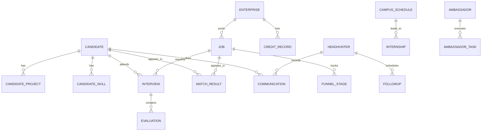

## 1. 架构设计

```mermaid
graph TB
    subgraph "前端层"
        "React 18 + Vite"
        "React Router v6"
        "Zustand 状态管理"
        "Tailwind CSS"
        "Recharts 图表"
    end
    subgraph "后端层"
        "Express 4"
        "匹配引擎"
        "摘要生成"
        "提醒调度"
    end
    subgraph "数据层"
        "SQLite WAL"
        "候选人表"
        "职位表"
        "猎头表"
        "面试表"
        "分析表"
    end
    "React 18 + Vite" --> "Express 4"
    "Express 4" --> "SQLite WAL"
    "匹配引擎" --> "候选人表"
    "匹配引擎" --> "职位表"
    "摘要生成" --> "猎头表"
    "提醒调度" --> "猎头表"
```

## 2. 技术说明

- 前端：React@18 + Tailwind CSS@3 + Vite@6 + React Router@6 + Zustand@4 + Recharts@2 + Lucide React
- 初始化工具：Vite
- 后端：Express@4 + better-sqlite3
- 数据库：SQLite（WAL模式），文件路径 data/app.sqlite
- 无需外部服务，全部本地运行

## 3. 路由定义

| 路由 | 用途 |
|------|------|
| / | 仪表盘首页，全局数据概览 |
| /candidates | 候选人列表 |
| /candidates/:id | 候选人详情（简历+能力图谱+匹配推荐） |
| /candidates/new | 新建候选人 |
| /jobs | 职位列表 |
| /jobs/:id | 职位详情（JD+匹配候选人） |
| /jobs/new | 发布新职位 |
| /matching | 匹配中心（双向匹配面板） |
| /headhunter | 猎头工作台 |
| /headhunter/communications | 沟通记录管理 |
| /headhunter/followups | 跟进提醒列表 |
| /interviews | 面试评估列表 |
| /interviews/:id | 面试评估详情/表单 |
| /analytics | 招聘效能分析 |
| /campus | 校招通道 |
| /campus/schedule | 校招日程 |
| /campus/internships | 实习管理 |
| /campus/ambassadors | 校园大使 |
| /admin | 后台管理 |
| /admin/credit | 企业信用评级 |
| /admin/privacy | 隐私脱敏配置 |
| /admin/ai-dataset | AI面试数据集 |
| /admin/salary | 薪酬基准 |

## 4. API 定义

### 4.1 候选人 API
```
GET    /api/candidates          列表（支持分页、筛选、排序）
GET    /api/candidates/:id      详情
POST   /api/candidates          创建
PUT    /api/candidates/:id      更新
DELETE /api/candidates/:id      删除
GET    /api/candidates/:id/matches  候选人匹配职位推荐
```

### 4.2 职位 API
```
GET    /api/jobs                 列表（支持分页、筛选、排序）
GET    /api/jobs/:id             详情
POST   /api/jobs                 创建
PUT    /api/jobs/:id             更新
DELETE /api/jobs/:id             删除
PATCH  /api/jobs/:id/status      状态流转
GET    /api/jobs/:id/matches     职位匹配候选人推荐
```

### 4.3 匹配 API
```
POST   /api/matching/candidate-to-jobs    候选人→职位匹配
POST   /api/matching/job-to-candidates    职位→候选人匹配
GET    /api/matching/result/:id           匹配结果详情
```

### 4.4 猎头 API
```
GET    /api/headhunter/clients           客户列表
POST   /api/headhunter/communications    添加沟通记录
GET    /api/headhunter/communications    沟通记录列表
POST   /api/headhunter/followups         创建跟进计划
GET    /api/headhunter/followups         跟进计划列表
PATCH  /api/headhunter/followups/:id     更新跟进状态
```

### 4.5 面试 API
```
GET    /api/interviews           面试列表
POST   /api/interviews           安排面试
GET    /api/interviews/:id       面试详情
PUT    /api/interviews/:id       更新面试评估
```

### 4.6 分析 API
```
GET    /api/analytics/funnel     招聘漏斗数据
GET    /api/analytics/conversion 转化率统计
GET    /api/analytics/attribution 归因分析
```

### 4.7 校招 API
```
GET    /api/campus/schedule       校招日程
POST   /api/campus/schedule       新增日程
GET    /api/campus/internships    实习列表
PUT    /api/campus/internships/:id 实习转正评估
GET    /api/campus/ambassadors    校园大使列表
POST   /api/campus/ambassadors    注册大使
POST   /api/campus/ambassador-tasks 发布大使任务
```

### 4.8 后台管理 API
```
GET    /api/admin/enterprises      企业列表
PUT    /api/admin/enterprises/:id/credit  更新信用评级
GET    /api/admin/privacy-rules    隐私脱敏规则
PUT    /api/admin/privacy-rules    更新脱敏规则
GET    /api/admin/ai-datasets      AI数据集列表
POST   /api/admin/ai-datasets      新增数据集
PUT    /api/admin/ai-datasets/:id  更新数据集
GET    /api/admin/salary-benchmarks 薪酬基准列表
POST   /api/admin/salary-benchmarks 新增薪酬基准
PUT    /api/admin/salary-benchmarks/:id 更新薪酬基准
```

## 5. 服务架构图

```mermaid
graph LR
    "Controller" --> "Service"
    "Service" --> "Repository"
    "Repository" --> "SQLite"
```

采用三层架构：
- **Controller层**：路由处理、参数校验、响应格式化
- **Service层**：业务逻辑（匹配算法、摘要生成、提醒判断、归因计算）
- **Repository层**：数据访问（SQL查询、事务管理）

## 6. 数据模型

### 6.1 ER图



### 6.2 DDL

```sql
CREATE TABLE candidates (
    id INTEGER PRIMARY KEY AUTOINCREMENT,
    name TEXT NOT NULL,
    email TEXT,
    phone TEXT,
    current_title TEXT,
    current_company TEXT,
    industry TEXT,
    experience_years INTEGER DEFAULT 0,
    career_level TEXT,
    expected_salary_min INTEGER,
    expected_salary_max INTEGER,
    education TEXT,
    location TEXT,
    job_status TEXT DEFAULT 'open',
    skills_vector TEXT,
    summary TEXT,
    privacy_mode TEXT DEFAULT 'normal',
    created_at TEXT DEFAULT (datetime('now')),
    updated_at TEXT DEFAULT (datetime('now'))
);

CREATE TABLE candidate_projects (
    id INTEGER PRIMARY KEY AUTOINCREMENT,
    candidate_id INTEGER NOT NULL REFERENCES candidates(id),
    project_name TEXT NOT NULL,
    role TEXT,
    tech_stack TEXT,
    start_date TEXT,
    end_date TEXT,
    description TEXT,
    quantified_outcome TEXT,
    revenue_impact INTEGER,
    efficiency_gain REAL,
    created_at TEXT DEFAULT (datetime('now'))
);

CREATE TABLE candidate_skills (
    id INTEGER PRIMARY KEY AUTOINCREMENT,
    candidate_id INTEGER NOT NULL REFERENCES candidates(id),
    skill_name TEXT NOT NULL,
    category TEXT,
    proficiency INTEGER DEFAULT 3,
    years_used INTEGER DEFAULT 0,
    weight REAL DEFAULT 1.0
);

CREATE TABLE enterprises (
    id INTEGER PRIMARY KEY AUTOINCREMENT,
    name TEXT NOT NULL,
    industry TEXT,
    scale TEXT,
    location TEXT,
    contact_email TEXT,
    contact_phone TEXT,
    credit_score INTEGER DEFAULT 60,
    credit_level TEXT DEFAULT 'B',
    contract_fulfillment_rate REAL DEFAULT 0.0,
    created_at TEXT DEFAULT (datetime('now')),
    updated_at TEXT DEFAULT (datetime('now'))
);

CREATE TABLE credit_records (
    id INTEGER PRIMARY KEY AUTOINCREMENT,
    enterprise_id INTEGER NOT NULL REFERENCES enterprises(id),
    action_type TEXT NOT NULL,
    score_change INTEGER NOT NULL,
    reason TEXT,
    recorded_at TEXT DEFAULT (datetime('now'))
);

CREATE TABLE jobs (
    id INTEGER PRIMARY KEY AUTOINCREMENT,
    enterprise_id INTEGER NOT NULL REFERENCES enterprises(id),
    title TEXT NOT NULL,
    department TEXT,
    industry TEXT,
    function_type TEXT,
    required_level TEXT,
    min_experience_years INTEGER DEFAULT 0,
    salary_min INTEGER,
    salary_max INTEGER,
    location TEXT,
    tech_stack TEXT,
    description TEXT,
    requirements TEXT,
    benefits TEXT,
    semantic_vector TEXT,
    status TEXT DEFAULT 'draft',
    published_at TEXT,
    deadline TEXT,
    created_at TEXT DEFAULT (datetime('now')),
    updated_at TEXT DEFAULT (datetime('now'))
);

CREATE TABLE funnel_stages (
    id INTEGER PRIMARY KEY AUTOINCREMENT,
    job_id INTEGER NOT NULL REFERENCES jobs(id),
    stage_name TEXT NOT NULL,
    candidate_count INTEGER DEFAULT 0,
    conversion_rate REAL DEFAULT 0.0,
    avg_days_in_stage REAL DEFAULT 0.0,
    drop_reason TEXT,
    updated_at TEXT DEFAULT (datetime('now'))
);

CREATE TABLE match_results (
    id INTEGER PRIMARY KEY AUTOINCREMENT,
    candidate_id INTEGER NOT NULL REFERENCES candidates(id),
    job_id INTEGER NOT NULL REFERENCES jobs(id),
    overall_score REAL DEFAULT 0,
    tech_stack_score REAL DEFAULT 0,
    experience_score REAL DEFAULT 0,
    level_score REAL DEFAULT 0,
    salary_score REAL DEFAULT 0,
    match_details TEXT,
    direction TEXT DEFAULT 'both',
    created_at TEXT DEFAULT (datetime('now'))
);

CREATE TABLE headhunters (
    id INTEGER PRIMARY KEY AUTOINCREMENT,
    name TEXT NOT NULL,
    email TEXT,
    phone TEXT,
    specialty_industry TEXT,
    specialty_function TEXT,
    experience_years INTEGER DEFAULT 0,
    rating REAL DEFAULT 0.0,
    status TEXT DEFAULT 'active',
    created_at TEXT DEFAULT (datetime('now'))
);

CREATE TABLE communications (
    id INTEGER PRIMARY KEY AUTOINCREMENT,
    headhunter_id INTEGER NOT NULL REFERENCES headhunters(id),
    candidate_id INTEGER NOT NULL REFERENCES candidates(id),
    comm_type TEXT NOT NULL,
    content TEXT NOT NULL,
    summary TEXT,
    sentiment TEXT,
    created_at TEXT DEFAULT (datetime('now'))
);

CREATE TABLE followups (
    id INTEGER PRIMARY KEY AUTOINCREMENT,
    headhunter_id INTEGER NOT NULL REFERENCES headhunters(id),
    candidate_id INTEGER NOT NULL REFERENCES candidates(id),
    job_id INTEGER REFERENCES jobs(id),
    plan_text TEXT NOT NULL,
    scheduled_at TEXT NOT NULL,
    status TEXT DEFAULT 'pending',
    completed_at TEXT,
    created_at TEXT DEFAULT (datetime('now'))
);

CREATE TABLE interviews (
    id INTEGER PRIMARY KEY AUTOINCREMENT,
    candidate_id INTEGER NOT NULL REFERENCES candidates(id),
    job_id INTEGER NOT NULL REFERENCES jobs(id),
    interviewer_name TEXT,
    interview_type TEXT,
    scheduled_at TEXT NOT NULL,
    status TEXT DEFAULT 'scheduled',
    location TEXT,
    notes TEXT,
    created_at TEXT DEFAULT (datetime('now')),
    updated_at TEXT DEFAULT (datetime('now'))
);

CREATE TABLE evaluations (
    id INTEGER PRIMARY KEY AUTOINCREMENT,
    interview_id INTEGER NOT NULL REFERENCES interviews(id),
    technical_skill INTEGER DEFAULT 0,
    communication INTEGER DEFAULT 0,
    project_experience INTEGER DEFAULT 0,
    cultural_fit INTEGER DEFAULT 0,
    overall_score REAL DEFAULT 0,
    recommendation TEXT,
    detailed_feedback TEXT,
    created_at TEXT DEFAULT (datetime('now'))
);

CREATE TABLE campus_schedules (
    id INTEGER PRIMARY KEY AUTOINCREMENT,
    university_name TEXT NOT NULL,
    event_type TEXT NOT NULL,
    event_date TEXT NOT NULL,
    location TEXT,
    contact_person TEXT,
    description TEXT,
    status TEXT DEFAULT 'planned',
    created_at TEXT DEFAULT (datetime('now'))
);

CREATE TABLE internships (
    id INTEGER PRIMARY KEY AUTOINCREMENT,
    candidate_id INTEGER NOT NULL REFERENCES candidates(id),
    job_id INTEGER NOT NULL REFERENCES jobs(id),
    university TEXT,
    major TEXT,
    start_date TEXT,
    end_date TEXT,
    mentor_name TEXT,
    conversion_status TEXT DEFAULT 'pending',
    conversion_probability REAL DEFAULT 0.5,
    performance_rating REAL DEFAULT 0.0,
    created_at TEXT DEFAULT (datetime('now'))
);

CREATE TABLE ambassadors (
    id INTEGER PRIMARY KEY AUTOINCREMENT,
    name TEXT NOT NULL,
    university TEXT NOT NULL,
    email TEXT,
    phone TEXT,
    joined_at TEXT DEFAULT (datetime('now')),
    status TEXT DEFAULT 'active',
    total_tasks INTEGER DEFAULT 0,
    completed_tasks INTEGER DEFAULT 0,
    reward_points INTEGER DEFAULT 0
);

CREATE TABLE ambassador_tasks (
    id INTEGER PRIMARY KEY AUTOINCREMENT,
    ambassador_id INTEGER NOT NULL REFERENCES ambassadors(id),
    task_type TEXT NOT NULL,
    task_title TEXT NOT NULL,
    description TEXT,
    deadline TEXT,
    reward_points INTEGER DEFAULT 0,
    status TEXT DEFAULT 'assigned',
    completed_at TEXT,
    created_at TEXT DEFAULT (datetime('now'))
);

CREATE TABLE ai_datasets (
    id INTEGER PRIMARY KEY AUTOINCREMENT,
    name TEXT NOT NULL,
    description TEXT,
    category TEXT,
    record_count INTEGER DEFAULT 0,
    quality_score REAL DEFAULT 0.0,
    status TEXT DEFAULT 'active',
    data_scope TEXT,
    created_at TEXT DEFAULT (datetime('now')),
    updated_at TEXT DEFAULT (datetime('now'))
);

CREATE TABLE salary_benchmarks (
    id INTEGER PRIMARY KEY AUTOINCREMENT,
    industry TEXT NOT NULL,
    function_type TEXT NOT NULL,
    career_level TEXT NOT NULL,
    location TEXT,
    p25 INTEGER,
    p50 INTEGER,
    p75 INTEGER,
    p90 INTEGER,
    effective_date TEXT,
    source TEXT,
    created_at TEXT DEFAULT (datetime('now')),
    updated_at TEXT DEFAULT (datetime('now'))
);

CREATE TABLE privacy_rules (
    id INTEGER PRIMARY KEY AUTOINCREMENT,
    field_name TEXT NOT NULL,
    rule_type TEXT NOT NULL,
    pattern TEXT,
    replacement TEXT,
    enabled INTEGER DEFAULT 1,
    created_at TEXT DEFAULT (datetime('now'))
);
```
