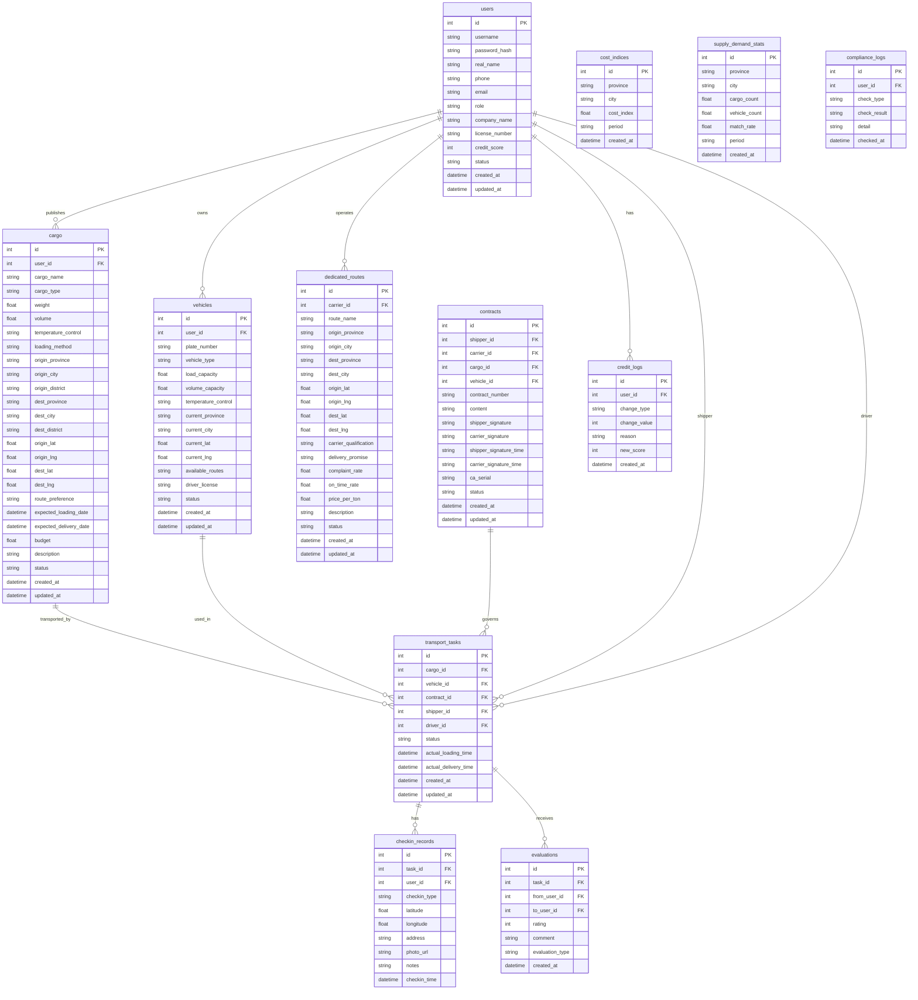

## 1. 架构设计

```mermaid
graph TB
    subgraph "前端层"
        "React + TypeScript + Vite"
        "Tailwind CSS"
        "Zustand 状态管理"
        "React Router"
    end
    subgraph "后端层"
        "Express + TypeScript"
        "JWT 认证中间件"
        "业务逻辑 Service"
    end
    subgraph "数据层"
        "SQLite (better-sqlite3)"
        "data/app.sqlite"
    end
    subgraph "外部服务"
        "CA 签章服务（模拟）"
        "交通局数据接口（模拟）"
    end
    "React + TypeScript + Vite" --> "Express + TypeScript"
    "Express + TypeScript" --> "SQLite (better-sqlite3)"
    "Express + TypeScript" --> "CA 签章服务（模拟）"
    "Express + TypeScript" --> "交通局数据接口（模拟）"
```

## 2. 技术说明

- 前端：React@18 + TypeScript + Tailwind CSS@3 + Vite + Zustand
- 初始化工具：vite-init (react-express-ts 模板)
- 后端：Express@5 + TypeScript + better-sqlite3
- 数据库：SQLite 文件数据库 (data/app.sqlite)
- 端口：FRONTEND_PORT=48936, BACKEND_PORT=58936，仅监听 127.0.0.1

## 3. 路由定义

| 路由 | 用途 |
|------|------|
| / | 工作台首页 |
| /login | 登录页 |
| /register | 注册页 |
| /cargo | 货源管理列表 |
| /cargo/publish | 发布货源 |
| /cargo/:id | 货源详情 |
| /vehicle | 车源管理列表 |
| /vehicle/publish | 发布车源 |
| /vehicle/:id | 车源详情 |
| /route | 专线资源库 |
| /route/:id | 专线详情 |
| /matching | 智能匹配 |
| /tracking | 运输跟踪 |
| /tracking/:id | 运输任务详情/打卡 |
| /contract | 合同管理 |
| /contract/:id | 合同详情/签章 |
| /credit | 信用评价 |
| /dashboard | 数据看板 |
| /admin | 系统管理 |

## 4. API 定义

### 认证相关
- POST /api/auth/register — 用户注册
- POST /api/auth/login — 用户登录
- GET /api/auth/profile — 获取当前用户信息

### 货源相关
- GET /api/cargo — 货源列表（分页/筛选/搜索）
- POST /api/cargo — 发布货源
- GET /api/cargo/:id — 货源详情
- PUT /api/cargo/:id — 更新货源
- DELETE /api/cargo/:id — 删除货源
- PATCH /api/cargo/:id/status — 更新货源状态

### 车源相关
- GET /api/vehicle — 车源列表（分页/筛选/搜索）
- POST /api/vehicle — 发布车源
- GET /api/vehicle/:id — 车源详情
- PUT /api/vehicle/:id — 更新车源
- DELETE /api/vehicle/:id — 删除车源
- PATCH /api/vehicle/:id/status — 更新车源状态

### 专线相关
- GET /api/route — 专线列表
- POST /api/route — 创建专线（承运商）
- GET /api/route/:id — 专线详情
- PUT /api/route/:id — 更新专线
- GET /api/route/:id/complaints — 专线投诉记录

### 智能匹配
- GET /api/matching/cargo/:id — 为指定货源匹配车源
- GET /api/matching/vehicle/:id — 为指定车源匹配货源

### 运输跟踪
- GET /api/tracking — 运输任务列表
- POST /api/tracking — 创建运输任务
- GET /api/tracking/:id — 运输任务详情
- POST /api/tracking/:id/checkin — 节点打卡
- GET /api/tracking/:id/timeline — 运输时间线

### 合同相关
- GET /api/contract — 合同列表
- POST /api/contract — 生成合同
- GET /api/contract/:id — 合同详情
- POST /api/contract/:id/sign — 电子签章
- PATCH /api/contract/:id/status — 更新合同状态

### 信用评价
- GET /api/credit/:userId — 用户信用分
- POST /api/credit/evaluate — 发起评价
- GET /api/credit/:userId/history — 评价历史

### 数据看板
- GET /api/dashboard/cost-index — 区域物流成本指数
- GET /api/dashboard/supply-demand — 运力供需趋势
- GET /api/dashboard/stats — 平台统计数据

### 系统管理
- GET /api/admin/users — 用户列表
- PATCH /api/admin/users/:id — 更新用户状态
- GET /api/admin/compliance — 合规校验状态

### 健康检查
- GET /api/health — 服务健康检查

## 5. 服务端架构图

```mermaid
graph LR
    "Controller" --> "Service"
    "Service" --> "Repository"
    "Repository" --> "SQLite"
```

## 6. 数据模型

### 6.1 数据模型定义



### 6.2 数据定义语言

```sql
CREATE TABLE users (
  id INTEGER PRIMARY KEY AUTOINCREMENT,
  username TEXT NOT NULL UNIQUE,
  password_hash TEXT NOT NULL,
  real_name TEXT NOT NULL DEFAULT '',
  phone TEXT NOT NULL DEFAULT '',
  email TEXT NOT NULL DEFAULT '',
  role TEXT NOT NULL CHECK(role IN ('shipper','driver','carrier','admin')),
  company_name TEXT NOT NULL DEFAULT '',
  license_number TEXT NOT NULL DEFAULT '',
  credit_score INTEGER NOT NULL DEFAULT 100,
  status TEXT NOT NULL DEFAULT 'active' CHECK(status IN ('active','disabled','pending_review')),
  created_at TEXT NOT NULL DEFAULT (datetime('now')),
  updated_at TEXT NOT NULL DEFAULT (datetime('now'))
);

CREATE TABLE cargo (
  id INTEGER PRIMARY KEY AUTOINCREMENT,
  user_id INTEGER NOT NULL REFERENCES users(id),
  cargo_name TEXT NOT NULL,
  cargo_type TEXT NOT NULL DEFAULT 'general',
  weight REAL NOT NULL DEFAULT 0,
  volume REAL NOT NULL DEFAULT 0,
  temperature_control TEXT NOT NULL DEFAULT 'none',
  loading_method TEXT NOT NULL DEFAULT 'manual',
  origin_province TEXT NOT NULL DEFAULT '',
  origin_city TEXT NOT NULL DEFAULT '',
  origin_district TEXT NOT NULL DEFAULT '',
  dest_province TEXT NOT NULL DEFAULT '',
  dest_city TEXT NOT NULL DEFAULT '',
  dest_district TEXT NOT NULL DEFAULT '',
  origin_lat REAL NOT NULL DEFAULT 0,
  origin_lng REAL NOT NULL DEFAULT 0,
  dest_lat REAL NOT NULL DEFAULT 0,
  dest_lng REAL NOT NULL DEFAULT 0,
  route_preference TEXT NOT NULL DEFAULT 'shortest',
  expected_loading_date TEXT,
  expected_delivery_date TEXT,
  budget REAL NOT NULL DEFAULT 0,
  description TEXT NOT NULL DEFAULT '',
  status TEXT NOT NULL DEFAULT 'pending' CHECK(status IN ('pending','matched','transporting','completed','cancelled')),
  created_at TEXT NOT NULL DEFAULT (datetime('now')),
  updated_at TEXT NOT NULL DEFAULT (datetime('now'))
);

CREATE TABLE vehicles (
  id INTEGER PRIMARY KEY AUTOINCREMENT,
  user_id INTEGER NOT NULL REFERENCES users(id),
  plate_number TEXT NOT NULL,
  vehicle_type TEXT NOT NULL DEFAULT 'flatbed',
  load_capacity REAL NOT NULL DEFAULT 0,
  volume_capacity REAL NOT NULL DEFAULT 0,
  temperature_control TEXT NOT NULL DEFAULT 'none',
  current_province TEXT NOT NULL DEFAULT '',
  current_city TEXT NOT NULL DEFAULT '',
  current_lat REAL NOT NULL DEFAULT 0,
  current_lng REAL NOT NULL DEFAULT 0,
  available_routes TEXT NOT NULL DEFAULT '',
  driver_license TEXT NOT NULL DEFAULT '',
  status TEXT NOT NULL DEFAULT 'available' CHECK(status IN ('available','matched','transporting','offline')),
  created_at TEXT NOT NULL DEFAULT (datetime('now')),
  updated_at TEXT NOT NULL DEFAULT (datetime('now'))
);

CREATE TABLE dedicated_routes (
  id INTEGER PRIMARY KEY AUTOINCREMENT,
  carrier_id INTEGER NOT NULL REFERENCES users(id),
  route_name TEXT NOT NULL,
  origin_province TEXT NOT NULL DEFAULT '',
  origin_city TEXT NOT NULL DEFAULT '',
  dest_province TEXT NOT NULL DEFAULT '',
  dest_city TEXT NOT NULL DEFAULT '',
  origin_lat REAL NOT NULL DEFAULT 0,
  origin_lng REAL NOT NULL DEFAULT 0,
  dest_lat REAL NOT NULL DEFAULT 0,
  dest_lng REAL NOT NULL DEFAULT 0,
  carrier_qualification TEXT NOT NULL DEFAULT '',
  delivery_promise TEXT NOT NULL DEFAULT '',
  complaint_rate REAL NOT NULL DEFAULT 0,
  on_time_rate REAL NOT NULL DEFAULT 0,
  price_per_ton REAL NOT NULL DEFAULT 0,
  description TEXT NOT NULL DEFAULT '',
  status TEXT NOT NULL DEFAULT 'active' CHECK(status IN ('active','inactive','pending_review')),
  created_at TEXT NOT NULL DEFAULT (datetime('now')),
  updated_at TEXT NOT NULL DEFAULT (datetime('now'))
);

CREATE TABLE transport_tasks (
  id INTEGER PRIMARY KEY AUTOINCREMENT,
  cargo_id INTEGER NOT NULL REFERENCES cargo(id),
  vehicle_id INTEGER NOT NULL REFERENCES vehicles(id),
  contract_id INTEGER REFERENCES contracts(id),
  shipper_id INTEGER NOT NULL REFERENCES users(id),
  driver_id INTEGER NOT NULL REFERENCES users(id),
  status TEXT NOT NULL DEFAULT 'pending_loading' CHECK(status IN ('pending_loading','loading','in_transit','unloading','completed','cancelled')),
  actual_loading_time TEXT,
  actual_delivery_time TEXT,
  created_at TEXT NOT NULL DEFAULT (datetime('now')),
  updated_at TEXT NOT NULL DEFAULT (datetime('now'))
);

CREATE TABLE checkin_records (
  id INTEGER PRIMARY KEY AUTOINCREMENT,
  task_id INTEGER NOT NULL REFERENCES transport_tasks(id),
  user_id INTEGER NOT NULL REFERENCES users(id),
  checkin_type TEXT NOT NULL CHECK(checkin_type IN ('loading','in_transit','unloading')),
  latitude REAL NOT NULL DEFAULT 0,
  longitude REAL NOT NULL DEFAULT 0,
  address TEXT NOT NULL DEFAULT '',
  photo_url TEXT NOT NULL DEFAULT '',
  notes TEXT NOT NULL DEFAULT '',
  checkin_time TEXT NOT NULL DEFAULT (datetime('now'))
);

CREATE TABLE contracts (
  id INTEGER PRIMARY KEY AUTOINCREMENT,
  shipper_id INTEGER NOT NULL REFERENCES users(id),
  carrier_id INTEGER NOT NULL REFERENCES users(id),
  cargo_id INTEGER NOT NULL REFERENCES cargo(id),
  vehicle_id INTEGER NOT NULL REFERENCES vehicles(id),
  contract_number TEXT NOT NULL UNIQUE,
  content TEXT NOT NULL DEFAULT '',
  shipper_signature TEXT NOT NULL DEFAULT '',
  carrier_signature TEXT NOT NULL DEFAULT '',
  shipper_signature_time TEXT,
  carrier_signature_time TEXT,
  ca_serial TEXT NOT NULL DEFAULT '',
  status TEXT NOT NULL DEFAULT 'draft' CHECK(status IN ('draft','signing','signed','archived','cancelled')),
  created_at TEXT NOT NULL DEFAULT (datetime('now')),
  updated_at TEXT NOT NULL DEFAULT (datetime('now'))
);

CREATE TABLE evaluations (
  id INTEGER PRIMARY KEY AUTOINCREMENT,
  task_id INTEGER NOT NULL REFERENCES transport_tasks(id),
  from_user_id INTEGER NOT NULL REFERENCES users(id),
  to_user_id INTEGER NOT NULL REFERENCES users(id),
  rating INTEGER NOT NULL CHECK(rating BETWEEN 1 AND 5),
  comment TEXT NOT NULL DEFAULT '',
  evaluation_type TEXT NOT NULL CHECK(evaluation_type IN ('shipper_to_driver','driver_to_shipper')),
  created_at TEXT NOT NULL DEFAULT (datetime('now'))
);

CREATE TABLE credit_logs (
  id INTEGER PRIMARY KEY AUTOINCREMENT,
  user_id INTEGER NOT NULL REFERENCES users(id),
  change_type TEXT NOT NULL,
  change_value INTEGER NOT NULL DEFAULT 0,
  reason TEXT NOT NULL DEFAULT '',
  new_score INTEGER NOT NULL,
  created_at TEXT NOT NULL DEFAULT (datetime('now'))
);

CREATE TABLE cost_indices (
  id INTEGER PRIMARY KEY AUTOINCREMENT,
  province TEXT NOT NULL DEFAULT '',
  city TEXT NOT NULL DEFAULT '',
  cost_index REAL NOT NULL DEFAULT 0,
  period TEXT NOT NULL DEFAULT '',
  created_at TEXT NOT NULL DEFAULT (datetime('now'))
);

CREATE TABLE supply_demand_stats (
  id INTEGER PRIMARY KEY AUTOINCREMENT,
  province TEXT NOT NULL DEFAULT '',
  city TEXT NOT NULL DEFAULT '',
  cargo_count REAL NOT NULL DEFAULT 0,
  vehicle_count REAL NOT NULL DEFAULT 0,
  match_rate REAL NOT NULL DEFAULT 0,
  period TEXT NOT NULL DEFAULT '',
  created_at TEXT NOT NULL DEFAULT (datetime('now'))
);

CREATE TABLE compliance_logs (
  id INTEGER PRIMARY KEY AUTOINCREMENT,
  user_id INTEGER NOT NULL REFERENCES users(id),
  check_type TEXT NOT NULL,
  check_result TEXT NOT NULL DEFAULT '',
  detail TEXT NOT NULL DEFAULT '',
  checked_at TEXT NOT NULL DEFAULT (datetime('now'))
);

CREATE INDEX idx_cargo_user ON cargo(user_id);
CREATE INDEX idx_cargo_status ON cargo(status);
CREATE INDEX idx_cargo_type ON cargo(cargo_type);
CREATE INDEX idx_cargo_origin ON cargo(origin_province, origin_city);
CREATE INDEX idx_cargo_dest ON cargo(dest_province, dest_city);
CREATE INDEX idx_vehicles_user ON vehicles(user_id);
CREATE INDEX idx_vehicles_status ON vehicles(status);
CREATE INDEX idx_vehicles_location ON vehicles(current_province, current_city);
CREATE INDEX idx_dedicated_routes_carrier ON dedicated_routes(carrier_id);
CREATE INDEX idx_dedicated_routes_status ON dedicated_routes(status);
CREATE INDEX idx_transport_tasks_shipper ON transport_tasks(shipper_id);
CREATE INDEX idx_transport_tasks_driver ON transport_tasks(driver_id);
CREATE INDEX idx_transport_tasks_status ON transport_tasks(status);
CREATE INDEX idx_checkin_records_task ON checkin_records(task_id);
CREATE INDEX idx_contracts_shipper ON contracts(shipper_id);
CREATE INDEX idx_contracts_carrier ON contracts(carrier_id);
CREATE INDEX idx_contracts_status ON contracts(status);
CREATE INDEX idx_evaluations_task ON evaluations(task_id);
CREATE INDEX idx_evaluations_to_user ON evaluations(to_user_id);
CREATE INDEX idx_credit_logs_user ON credit_logs(user_id);
CREATE INDEX idx_cost_indices_period ON cost_indices(period);
CREATE INDEX idx_supply_demand_period ON supply_demand_stats(period);
CREATE INDEX idx_compliance_logs_user ON compliance_logs(user_id);
```
