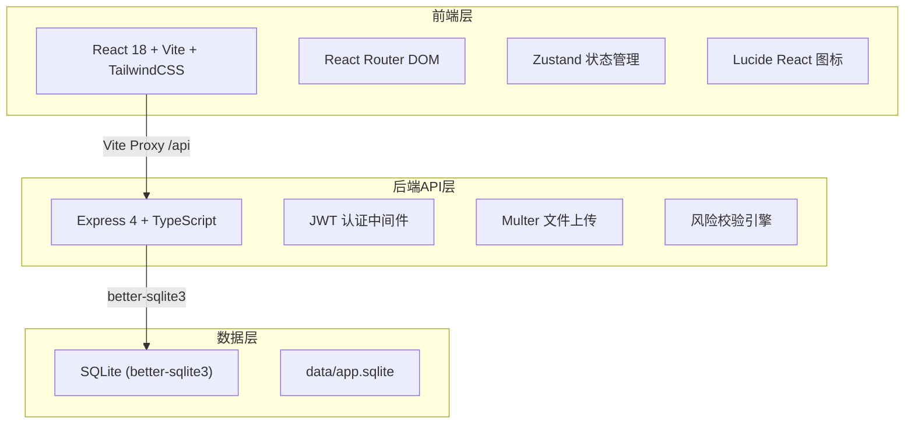
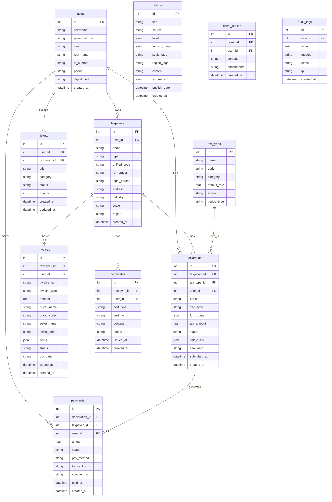

## 1. 架构设计



## 2. 技术说明

- 前端：React@18 + TailwindCSS@3 + Vite@6 + Zustand@5 + React Router DOM@7
- 初始化工具：vite-init (react-express-ts模板)
- 后端：Express@4 + TypeScript (ESM模式)
- 数据库：SQLite (better-sqlite3)，文件路径 data/app.sqlite
- 认证：JWT (jsonwebtoken) + bcryptjs 密码哈希
- 文件上传：multer (本地存储 uploads/)
- 端口：FRONTEND_PORT=49049, BACKEND_PORT=59049

## 3. 路由定义

| 路由 | 用途 |
|------|------|
| /login | 登录认证页 |
| /register | 注册页 |
| / | 首页/工作台 |
| /taxpayers | 纳税人中心 |
| /tax-types | 税种管理 |
| /declarations | 申报管理 |
| /declarations/new | 新建申报 |
| /declarations/:id | 申报详情 |
| /payments | 缴款中心 |
| /invoices | 发票管理 |
| /certificates | 涉税证明 |
| /policies | 政策中心 |
| /tickets | 征纳互动工单 |
| /account | 账户中心 |

## 4. API定义

### 4.1 认证 API

| 方法 | 路径 | 描述 |
|------|------|------|
| POST | /api/auth/register | 用户注册 |
| POST | /api/auth/login | 用户登录 |
| POST | /api/auth/logout | 用户登出 |
| GET | /api/auth/me | 获取当前用户 |

### 4.2 纳税人 API

| 方法 | 路径 | 描述 |
|------|------|------|
| GET | /api/taxpayers | 纳税人列表 |
| POST | /api/taxpayers | 创建纳税人 |
| GET | /api/taxpayers/:id | 纳税人详情 |
| PUT | /api/taxpayers/:id | 更新纳税人 |

### 4.3 税种 API

| 方法 | 路径 | 描述 |
|------|------|------|
| GET | /api/tax-types | 税种列表 |
| GET | /api/tax-types/:id | 税种详情 |

### 4.4 申报 API

| 方法 | 路径 | 描述 |
|------|------|------|
| GET | /api/declarations | 申报列表 |
| POST | /api/declarations | 创建申报 |
| GET | /api/declarations/:id | 申报详情 |
| PUT | /api/declarations/:id | 更新申报 |
| POST | /api/declarations/:id/submit | 提交申报 |
| POST | /api/declarations/:id/correct | 更正申报 |
| POST | /api/declarations/:id/seal | 电子签章 |
| GET | /api/declarations/prefill | 智能预填数据 |
| POST | /api/declarations/validate | 风险校验 |

### 4.5 缴款 API

| 方法 | 路径 | 描述 |
|------|------|------|
| GET | /api/payments | 缴款列表 |
| POST | /api/payments | 创建缴款 |
| GET | /api/payments/:id | 缴款详情 |
| POST | /api/payments/:id/pay | 在线支付 |

### 4.6 发票 API

| 方法 | 路径 | 描述 |
|------|------|------|
| GET | /api/invoices | 发票列表 |
| POST | /api/invoices | 代开发票申请 |
| GET | /api/invoices/:id | 发票详情 |
| POST | /api/invoices/:id/red-flush | 红冲发票 |
| POST | /api/invoices/verify | 发票查验 |

### 4.7 涉税证明 API

| 方法 | 路径 | 描述 |
|------|------|------|
| GET | /api/certificates | 证明列表 |
| POST | /api/certificates | 申请证明 |
| GET | /api/certificates/:id | 证明详情 |

### 4.8 政策 API

| 方法 | 路径 | 描述 |
|------|------|------|
| GET | /api/policies | 政策列表 |
| GET | /api/policies/:id | 政策详情 |
| GET | /api/policies/recommend | 精准推送 |

### 4.9 工单 API

| 方法 | 路径 | 描述 |
|------|------|------|
| GET | /api/tickets | 工单列表 |
| POST | /api/tickets | 创建工单 |
| GET | /api/tickets/:id | 工单详情 |
| POST | /api/tickets/:id/reply | 回复工单 |
| PUT | /api/tickets/:id/status | 更新工单状态 |

### 4.10 账户 API

| 方法 | 路径 | 描述 |
|------|------|------|
| GET | /api/account/profile | 账户信息 |
| PUT | /api/account/profile | 更新信息 |
| PUT | /api/account/password | 修改密码 |
| POST | /api/account/certificate | 绑定数字证书 |
| GET | /api/account/logs | 操作日志 |

## 5. 服务端架构图


## 6. 数据模型

### 6.1 数据模型定义



### 6.2 数据定义语言

```sql
CREATE TABLE users (
  id INTEGER PRIMARY KEY AUTOINCREMENT,
  username TEXT NOT NULL UNIQUE,
  password_hash TEXT NOT NULL,
  role TEXT NOT NULL CHECK(role IN ('taxpayer','admin','agent')),
  real_name TEXT NOT NULL,
  id_number TEXT,
  phone TEXT,
  digital_cert TEXT,
  created_at TEXT DEFAULT (datetime('now'))
);

CREATE TABLE taxpayers (
  id INTEGER PRIMARY KEY AUTOINCREMENT,
  user_id INTEGER NOT NULL REFERENCES users(id),
  name TEXT NOT NULL,
  type TEXT NOT NULL CHECK(type IN ('enterprise','individual','natural_person')),
  unified_code TEXT,
  id_number TEXT,
  legal_person TEXT,
  address TEXT,
  industry TEXT,
  scale TEXT,
  region TEXT,
  created_at TEXT DEFAULT (datetime('now'))
);

CREATE TABLE tax_types (
  id INTEGER PRIMARY KEY AUTOINCREMENT,
  name TEXT NOT NULL,
  code TEXT NOT NULL UNIQUE,
  category TEXT NOT NULL,
  default_rate REAL NOT NULL,
  scope TEXT,
  period_type TEXT NOT NULL CHECK(period_type IN ('monthly','quarterly','yearly'))
);

CREATE TABLE declarations (
  id INTEGER PRIMARY KEY AUTOINCREMENT,
  taxpayer_id INTEGER NOT NULL REFERENCES taxpayers(id),
  tax_type_id INTEGER NOT NULL REFERENCES tax_types(id),
  user_id INTEGER NOT NULL REFERENCES users(id),
  period TEXT NOT NULL,
  decl_type TEXT NOT NULL CHECK(decl_type IN ('regular','zero','correction')),
  form_data TEXT DEFAULT '{}',
  tax_amount REAL DEFAULT 0,
  status TEXT DEFAULT 'draft' CHECK(status IN ('draft','submitted','approved','rejected','sealed')),
  risk_check TEXT DEFAULT '{}',
  seal_data TEXT,
  submitted_at TEXT,
  created_at TEXT DEFAULT (datetime('now'))
);

CREATE TABLE payments (
  id INTEGER PRIMARY KEY AUTOINCREMENT,
  declaration_id INTEGER REFERENCES declarations(id),
  taxpayer_id INTEGER NOT NULL REFERENCES taxpayers(id),
  user_id INTEGER NOT NULL REFERENCES users(id),
  amount REAL NOT NULL,
  status TEXT DEFAULT 'pending' CHECK(status IN ('pending','paid','failed','refunded')),
  pay_method TEXT,
  transaction_id TEXT,
  voucher_no TEXT,
  paid_at TEXT,
  created_at TEXT DEFAULT (datetime('now'))
);

CREATE TABLE invoices (
  id INTEGER PRIMARY KEY AUTOINCREMENT,
  taxpayer_id INTEGER NOT NULL REFERENCES taxpayers(id),
  user_id INTEGER NOT NULL REFERENCES users(id),
  invoice_no TEXT UNIQUE,
  invoice_type TEXT NOT NULL CHECK(invoice_type IN ('normal','special','agency','red_flush')),
  amount REAL NOT NULL,
  buyer_name TEXT,
  buyer_code TEXT,
  seller_name TEXT,
  seller_code TEXT,
  items TEXT DEFAULT '[]',
  status TEXT DEFAULT 'pending' CHECK(status IN ('pending','approved','issued','red_flushed','verified')),
  ocr_data TEXT,
  issued_at TEXT,
  created_at TEXT DEFAULT (datetime('now'))
);

CREATE TABLE certificates (
  id INTEGER PRIMARY KEY AUTOINCREMENT,
  taxpayer_id INTEGER NOT NULL REFERENCES taxpayers(id),
  user_id INTEGER NOT NULL REFERENCES users(id),
  cert_type TEXT NOT NULL CHECK(cert_type IN ('tax_paid','no_debt')),
  cert_no TEXT UNIQUE,
  content TEXT,
  status TEXT DEFAULT 'pending' CHECK(status IN ('pending','issued','rejected')),
  issued_at TEXT,
  created_at TEXT DEFAULT (datetime('now'))
);

CREATE TABLE policies (
  id INTEGER PRIMARY KEY AUTOINCREMENT,
  title TEXT NOT NULL,
  source TEXT,
  level TEXT CHECK(level IN ('national','provincial','municipal')),
  industry_tags TEXT DEFAULT '[]',
  scale_tags TEXT DEFAULT '[]',
  region_tags TEXT DEFAULT '[]',
  content TEXT,
  summary TEXT,
  publish_date TEXT,
  created_at TEXT DEFAULT (datetime('now'))
);

CREATE TABLE tickets (
  id INTEGER PRIMARY KEY AUTOINCREMENT,
  user_id INTEGER NOT NULL REFERENCES users(id),
  taxpayer_id INTEGER REFERENCES taxpayers(id),
  title TEXT NOT NULL,
  category TEXT,
  status TEXT DEFAULT 'open' CHECK(status IN ('open','processing','replied','closed')),
  priority INTEGER DEFAULT 1,
  created_at TEXT DEFAULT (datetime('now')),
  updated_at TEXT DEFAULT (datetime('now'))
);

CREATE TABLE ticket_replies (
  id INTEGER PRIMARY KEY AUTOINCREMENT,
  ticket_id INTEGER NOT NULL REFERENCES tickets(id),
  user_id INTEGER NOT NULL REFERENCES users(id),
  content TEXT NOT NULL,
  attachments TEXT DEFAULT '[]',
  created_at TEXT DEFAULT (datetime('now'))
);

CREATE TABLE audit_logs (
  id INTEGER PRIMARY KEY AUTOINCREMENT,
  user_id INTEGER REFERENCES users(id),
  action TEXT NOT NULL,
  module TEXT NOT NULL,
  detail TEXT,
  ip TEXT,
  created_at TEXT DEFAULT (datetime('now'))
);

CREATE INDEX idx_taxpayers_user ON taxpayers(user_id);
CREATE INDEX idx_declarations_taxpayer ON declarations(taxpayer_id);
CREATE INDEX idx_declarations_status ON declarations(status);
CREATE INDEX idx_payments_declaration ON payments(declaration_id);
CREATE INDEX idx_invoices_taxpayer ON invoices(taxpayer_id);
CREATE INDEX idx_certificates_taxpayer ON certificates(taxpayer_id);
CREATE INDEX idx_tickets_user ON tickets(user_id);
CREATE INDEX idx_audit_logs_user ON audit_logs(user_id);
CREATE INDEX idx_policies_level ON policies(level);
```
