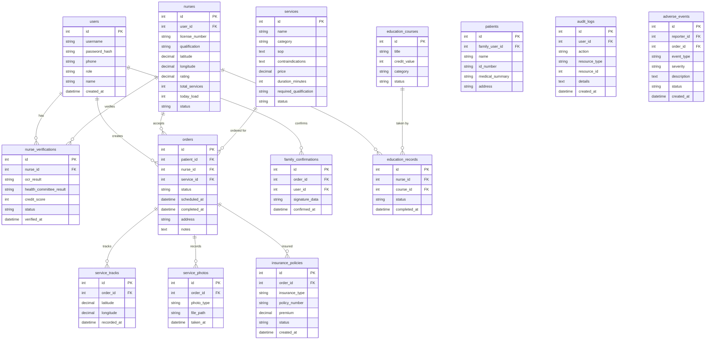

## 1. 架构设计

```mermaid
graph TB
    "浏览器" --> "React前端 Vite:48943"
    "React前端 Vite:48943" --> "Express后端 API:58943"
    "Express后端 API:58943" --> "SQLite data/app.sqlite"
    "Express后端 API:58943" --> "文件存储 uploads/"
```

## 2. 技术说明

- 前端：React@18 + TypeScript + TailwindCSS@3 + Vite + Zustand + React Router
- 初始化工具：vite-init
- 后端：Express@4 + TypeScript (ESM)
- 数据库：SQLite (better-sqlite3)，文件路径 data/app.sqlite
- 图表：Recharts
- 图标：lucide-react

## 3. 路由定义

| 路由 | 用途 |
|------|------|
| /login | 登录/注册页 |
| /nurse/dashboard | 护士仪表盘 |
| /nurse/verification | 执业资格核验 |
| /nurse/orders | 护士订单列表 |
| /nurse/order/:id | 订单详情/服务执行 |
| /family/dashboard | 家属仪表盘 |
| /family/order/:id | 家属查看订单 |
| /family/patient/:id | 患者电子病历摘要 |
| /admin/services | 服务项目管理 |
| /admin/dispatch | 智能派单 |
| /admin/nurses | 护士管理 |
| /admin/insurance | 保险管理 |
| /admin/audit | 审计日志 |
| /admin/adverse-events | 不良事件上报 |
| /admin/education | 继续教育管理 |
| /admin/dashboard | 质量统计看板 |

## 4. API定义

### 4.1 认证相关
- POST /api/auth/register — 注册
- POST /api/auth/login — 登录
- GET /api/auth/me — 获取当前用户

### 4.2 护士资格核验
- POST /api/nurses/verification/ocr — 护士证OCR识别
- POST /api/nurses/verification/compare — 卫健委注册信息比对
- POST /api/nurses/verification/credits — 继续教育学分验证
- GET /api/nurses/verification/status — 核验状态查询
- GET /api/nurses — 护士列表
- GET /api/nurses/:id — 护士详情

### 4.3 服务项目
- GET /api/services — 服务项目列表
- POST /api/services — 创建服务项目
- GET /api/services/:id — 服务项目详情
- PUT /api/services/:id — 更新服务项目
- DELETE /api/services/:id — 删除服务项目

### 4.4 订单与派单
- POST /api/orders — 创建订单
- GET /api/orders — 订单列表
- GET /api/orders/:id — 订单详情
- PUT /api/orders/:id/status — 更新订单状态
- POST /api/orders/:id/accept — 护士接单
- POST /api/dispatch/smart — 智能派单推荐
- POST /api/dispatch/assign — 确认派单

### 4.5 服务留痕
- POST /api/orders/:id/gps — 上传GPS轨迹
- POST /api/orders/:id/photos — 上传服务照片
- POST /api/orders/:id/signature — 电子签名
- POST /api/orders/:id/family-confirm — 家属确认

### 4.6 保险
- POST /api/insurance/auto-insure — 自动投保
- GET /api/insurance/policies — 保单列表
- GET /api/insurance/policies/:id — 保单详情

### 4.7 家属端
- GET /api/family/patients — 患者列表
- GET /api/family/patients/:id — 患者详情+病历摘要
- GET /api/family/orders — 家属订单列表
- GET /api/family/nurse-location/:orderId — 护士实时位置

### 4.8 监管后台
- GET /api/admin/audit-logs — 审计日志
- POST /api/admin/adverse-events — 不良事件上报
- GET /api/admin/adverse-events — 不良事件列表
- GET /api/admin/education/courses — 继续教育课程列表
- POST /api/admin/education/courses — 创建课程
- GET /api/admin/statistics — 区域质量统计
- GET /api/admin/statistics/trends — 趋势数据

### 4.9 系统
- GET /api/health — 健康检查

## 5. 服务端架构图

```mermaid
graph LR
    "Controller" --> "Service"
    "Service" --> "Repository"
    "Repository" --> "SQLite"
```

## 6. 数据模型

### 6.1 数据模型定义



### 6.2 数据定义语言

```sql
CREATE TABLE users (
    id INTEGER PRIMARY KEY AUTOINCREMENT,
    username TEXT NOT NULL UNIQUE,
    password_hash TEXT NOT NULL,
    phone TEXT,
    role TEXT NOT NULL CHECK(role IN ('nurse','family','admin','regulator')),
    name TEXT NOT NULL,
    created_at TEXT DEFAULT (datetime('now'))
);

CREATE TABLE nurses (
    id INTEGER PRIMARY KEY AUTOINCREMENT,
    user_id INTEGER NOT NULL UNIQUE REFERENCES users(id),
    license_number TEXT UNIQUE,
    qualification TEXT,
    latitude REAL DEFAULT 0,
    longitude REAL DEFAULT 0,
    rating REAL DEFAULT 5.0,
    total_services INTEGER DEFAULT 0,
    today_load INTEGER DEFAULT 0,
    status TEXT DEFAULT 'pending' CHECK(status IN ('pending','verified','suspended','offline','online')),
    created_at TEXT DEFAULT (datetime('now'))
);

CREATE TABLE nurse_verifications (
    id INTEGER PRIMARY KEY AUTOINCREMENT,
    nurse_id INTEGER NOT NULL REFERENCES nurses(id),
    ocr_result TEXT,
    health_committee_result TEXT,
    credit_score INTEGER DEFAULT 0,
    status TEXT DEFAULT 'pending' CHECK(status IN ('pending','ocr_done','compared','verified','rejected')),
    verified_at TEXT,
    created_at TEXT DEFAULT (datetime('now'))
);

CREATE TABLE services (
    id INTEGER PRIMARY KEY AUTOINCREMENT,
    name TEXT NOT NULL,
    category TEXT NOT NULL,
    sop TEXT,
    contraindications TEXT,
    price REAL NOT NULL DEFAULT 0,
    duration_minutes INTEGER DEFAULT 60,
    required_qualification TEXT,
    status TEXT DEFAULT 'active' CHECK(status IN ('active','inactive')),
    created_at TEXT DEFAULT (datetime('now'))
);

CREATE TABLE patients (
    id INTEGER PRIMARY KEY AUTOINCREMENT,
    family_user_id INTEGER NOT NULL REFERENCES users(id),
    name TEXT NOT NULL,
    id_number TEXT,
    medical_summary TEXT,
    address TEXT,
    phone TEXT,
    created_at TEXT DEFAULT (datetime('now'))
);

CREATE TABLE orders (
    id INTEGER PRIMARY KEY AUTOINCREMENT,
    patient_id INTEGER REFERENCES patients(id),
    nurse_id INTEGER REFERENCES nurses(id),
    service_id INTEGER NOT NULL REFERENCES services(id),
    family_user_id INTEGER REFERENCES users(id),
    status TEXT DEFAULT 'pending' CHECK(status IN ('pending','dispatched','accepted','in_progress','completed','cancelled')),
    scheduled_at TEXT,
    completed_at TEXT,
    address TEXT,
    notes TEXT,
    created_at TEXT DEFAULT (datetime('now'))
);

CREATE TABLE service_tracks (
    id INTEGER PRIMARY KEY AUTOINCREMENT,
    order_id INTEGER NOT NULL REFERENCES orders(id),
    latitude REAL NOT NULL,
    longitude REAL NOT NULL,
    recorded_at TEXT DEFAULT (datetime('now'))
);

CREATE TABLE service_photos (
    id INTEGER PRIMARY KEY AUTOINCREMENT,
    order_id INTEGER NOT NULL REFERENCES orders(id),
    photo_type TEXT NOT NULL CHECK(photo_type IN ('before','after','document')),
    file_path TEXT NOT NULL,
    taken_at TEXT DEFAULT (datetime('now'))
);

CREATE TABLE family_confirmations (
    id INTEGER PRIMARY KEY AUTOINCREMENT,
    order_id INTEGER NOT NULL REFERENCES orders(id),
    user_id INTEGER NOT NULL REFERENCES users(id),
    signature_data TEXT,
    confirmed_at TEXT DEFAULT (datetime('now'))
);

CREATE TABLE insurance_policies (
    id INTEGER PRIMARY KEY AUTOINCREMENT,
    order_id INTEGER NOT NULL REFERENCES orders(id),
    insurance_type TEXT NOT NULL CHECK(insurance_type IN ('liability','accident')),
    policy_number TEXT UNIQUE,
    premium REAL DEFAULT 0,
    status TEXT DEFAULT 'active' CHECK(status IN ('active','claimed','expired')),
    created_at TEXT DEFAULT (datetime('now'))
);

CREATE TABLE education_courses (
    id INTEGER PRIMARY KEY AUTOINCREMENT,
    title TEXT NOT NULL,
    credit_value INTEGER DEFAULT 1,
    category TEXT,
    status TEXT DEFAULT 'active' CHECK(status IN ('active','inactive')),
    created_at TEXT DEFAULT (datetime('now'))
);

CREATE TABLE education_records (
    id INTEGER PRIMARY KEY AUTOINCREMENT,
    nurse_id INTEGER NOT NULL REFERENCES nurses(id),
    course_id INTEGER NOT NULL REFERENCES education_courses(id),
    status TEXT DEFAULT 'enrolled' CHECK(status IN ('enrolled','completed','failed')),
    completed_at TEXT,
    created_at TEXT DEFAULT (datetime('now'))
);

CREATE TABLE audit_logs (
    id INTEGER PRIMARY KEY AUTOINCREMENT,
    user_id INTEGER,
    action TEXT NOT NULL,
    resource_type TEXT,
    resource_id INTEGER,
    details TEXT,
    ip_address TEXT,
    created_at TEXT DEFAULT (datetime('now'))
);

CREATE TABLE adverse_events (
    id INTEGER PRIMARY KEY AUTOINCREMENT,
    reporter_id INTEGER NOT NULL REFERENCES users(id),
    order_id INTEGER REFERENCES orders(id),
    event_type TEXT NOT NULL,
    severity TEXT NOT NULL CHECK(severity IN ('mild','moderate','severe','critical')),
    description TEXT NOT NULL,
    status TEXT DEFAULT 'reported' CHECK(status IN ('reported','investigating','resolved','closed')),
    created_at TEXT DEFAULT (datetime('now'))
);
```
