## 1. 架构设计

```mermaid
graph TB
    subgraph "前端层"
        "React SPA" --> "React Router"
        "React SPA" --> "Zustand 状态管理"
        "React SPA" --> "Tailwind CSS"
    end

    subgraph "后端层"
        "Express API" --> "路由控制器"
        "路由控制器" --> "业务服务层"
        "业务服务层" --> "数据访问层"
    end

    subgraph "数据层"
        "SQLite 数据库" --> "资讯表"
        "SQLite 数据库" --> "用户表"
        "SQLite 数据库" --> "圈子表"
        "SQLite 数据库" --> "商品表"
        "SQLite 数据库" --> "订单表"
        "SQLite 数据库" --> "婚恋资料表"
    end

    "React SPA" -->|"HTTP/REST"| "Express API"
```

## 2. 技术说明

- **前端**：React@18 + TypeScript + Tailwind CSS@3 + Vite
- **状态管理**：Zustand
- **路由**：React Router DOM v6
- **图标**：lucide-react
- **图表**：Recharts（数据看板）
- **初始化工具**：vite-init（react-express-ts 模板）
- **后端**：Express@4 + TypeScript（ESM 模式）
- **数据库**：SQLite（better-sqlite3），mock 数据辅助开发
- **地图组件**：SVG 内联红河州地图（无需外部地图服务）

## 3. 路由定义

| 路由 | 用途 |
|------|------|
| `/` | 首页 - 资讯聚合与模块导航 |
| `/news` | 资讯中心 - 话题标签流、UGC爆料、政务公示 |
| `/news/:id` | 资讯详情页 |
| `/circles` | 生活圈 - 圈子发现与列表 |
| `/circles/:id` | 圈子详情 - 动态流与成员 |
| `/circles/create` | 创建圈子申请 |
| `/events` | 同城活动列表 |
| `/events/:id` | 活动详情与报名 |
| `/events/create` | 发起活动 |
| `/shop` | 本地商城 - 商品分类浏览 |
| `/shop/merchant/apply` | 商户入驻申请 |
| `/shop/product/:id` | 商品详情与下单 |
| `/shop/orders` | 订单管理 |
| `/shop/orders/:id` | 订单详情与时间轴 |
| `/match` | 婚恋匹配 - 推荐列表 |
| `/match/profile` | 婚恋资料编辑 |
| `/dashboard` | 数据看板 |
| `/profile` | 个人中心 |

## 4. API 定义

### 4.1 资讯模块

```
GET    /api/news                获取资讯列表（支持标签、分页筛选）
GET    /api/news/:id            获取资讯详情
POST   /api/news/submit         提交UGC爆料
GET    /api/news/tags           获取热门话题标签
GET    /api/news/government     获取政务公示列表
```

### 4.2 生活圈模块

```
GET    /api/circles             获取圈子列表（支持分类、地域筛选）
GET    /api/circles/:id         获取圈子详情
POST   /api/circles             创建圈子申请
POST   /api/circles/:id/join   加入圈子
GET    /api/circles/:id/posts   获取圈子动态
POST   /api/circles/:id/posts   发布动态
```

### 4.3 活动模块

```
GET    /api/events              获取同城活动列表
GET    /api/events/:id          获取活动详情
POST   /api/events              发起活动
POST   /api/events/:id/register 报名活动
```

### 4.4 商城模块

```
GET    /api/products            获取商品列表（支持类目筛选）
GET    /api/products/:id        获取商品详情
POST   /api/merchants/apply     商户入驻申请
POST   /api/orders              创建订单
GET    /api/orders              获取订单列表
GET    /api/orders/:id          获取订单详情
PATCH  /api/orders/:id/status   更新订单状态
```

### 4.5 婚恋匹配模块

```
POST   /api/match/verify        提交实名认证
PUT    /api/match/profile       更新婚恋资料
GET    /api/match/recommend     获取推荐列表
POST   /api/match/intent        表达意向
GET    /api/match/mutual        获取双向匹配结果
```

### 4.6 数据看板

```
GET    /api/dashboard/activity  获取模块活跃度数据
GET    /api/dashboard/heatmap   获取地域热力数据
```

### 4.7 用户模块

```
POST   /api/auth/register       用户注册
POST   /api/auth/login          用户登录
GET    /api/users/me            获取当前用户信息
PUT    /api/users/me            更新用户资料
```

## 5. 服务端架构图

```mermaid
graph LR
    "Controller 控制器" --> "Service 服务层"
    "Service 服务层" --> "Repository 数据层"
    "Repository 数据层" --> "SQLite 数据库"
```

## 6. 数据模型

### 6.1 数据模型定义

```mermaid
erDiagram
    "users" {
        int id PK
        string phone
        string nickname
        string avatar
        string region
        string role
        datetime created_at
    }

    "news" {
        int id PK
        string title
        string content
        string tags
        string source
        string status
        int author_id FK
        datetime created_at
    }

    "circles" {
        int id PK
        string name
        string description
        string category
        string cover_image
        int owner_id FK
        string status
        datetime created_at
    }

    "circle_members" {
        int id PK
        int circle_id FK
        int user_id FK
        string role
        datetime joined_at
    }

    "posts" {
        int id PK
        int circle_id FK
        int author_id FK
        string content
        string media_urls
        string type
        datetime created_at
    }

    "events" {
        int id PK
        int organizer_id FK
        string title
        string description
        string location
        datetime event_time
        int max_participants
        string status
        datetime created_at
    }

    "event_registrations" {
        int id PK
        int event_id FK
        int user_id FK
        datetime registered_at
    }

    "merchants" {
        int id PK
        int user_id FK
        string name
        string license_url
        string category
        string status
        datetime created_at
    }

    "products" {
        int id PK
        int merchant_id FK
        string name
        string description
        string category
        float price
        string images
        datetime created_at
    }

    "orders" {
        int id PK
        int user_id FK
        int product_id FK
        string status
        float amount
        string appointment_time
        datetime created_at
    }

    "order_timeline" {
        int id PK
        int order_id FK
        string status
        string description
        datetime created_at
    }

    "match_profiles" {
        int id PK
        int user_id FK
        string real_name
        string education
        string profession
        string preferences
        boolean verified
        datetime created_at
    }

    "match_intents" {
        int id PK
        int from_user_id FK
        int to_user_id FK
        boolean mutual
        datetime created_at
    }
```



### 6.2 数据定义语言

```sql
CREATE TABLE users (
    id INTEGER PRIMARY KEY AUTOINCREMENT,
    phone TEXT NOT NULL UNIQUE,
    nickname TEXT NOT NULL,
    avatar TEXT,
    region TEXT,
    role TEXT NOT NULL DEFAULT 'user',
    created_at DATETIME DEFAULT CURRENT_TIMESTAMP
);

CREATE TABLE news (
    id INTEGER PRIMARY KEY AUTOINCREMENT,
    title TEXT NOT NULL,
    content TEXT NOT NULL,
    tags TEXT,
    source TEXT NOT NULL DEFAULT 'user',
    status TEXT NOT NULL DEFAULT 'pending',
    author_id INTEGER REFERENCES users(id),
    created_at DATETIME DEFAULT CURRENT_TIMESTAMP
);

CREATE TABLE circles (
    id INTEGER PRIMARY KEY AUTOINCREMENT,
    name TEXT NOT NULL,
    description TEXT,
    category TEXT,
    cover_image TEXT,
    owner_id INTEGER REFERENCES users(id),
    status TEXT NOT NULL DEFAULT 'pending',
    created_at DATETIME DEFAULT CURRENT_TIMESTAMP
);

CREATE TABLE circle_members (
    id INTEGER PRIMARY KEY AUTOINCREMENT,
    circle_id INTEGER REFERENCES circles(id),
    user_id INTEGER REFERENCES users(id),
    role TEXT NOT NULL DEFAULT 'member',
    joined_at DATETIME DEFAULT CURRENT_TIMESTAMP,
    UNIQUE(circle_id, user_id)
);

CREATE TABLE posts (
    id INTEGER PRIMARY KEY AUTOINCREMENT,
    circle_id INTEGER REFERENCES circles(id),
    author_id INTEGER REFERENCES users(id),
    content TEXT NOT NULL,
    media_urls TEXT,
    type TEXT NOT NULL DEFAULT 'text',
    created_at DATETIME DEFAULT CURRENT_TIMESTAMP
);

CREATE TABLE events (
    id INTEGER PRIMARY KEY AUTOINCREMENT,
    organizer_id INTEGER REFERENCES users(id),
    title TEXT NOT NULL,
    description TEXT,
    location TEXT,
    event_time DATETIME,
    max_participants INTEGER,
    status TEXT NOT NULL DEFAULT 'active',
    created_at DATETIME DEFAULT CURRENT_TIMESTAMP
);

CREATE TABLE event_registrations (
    id INTEGER PRIMARY KEY AUTOINCREMENT,
    event_id INTEGER REFERENCES events(id),
    user_id INTEGER REFERENCES users(id),
    registered_at DATETIME DEFAULT CURRENT_TIMESTAMP,
    UNIQUE(event_id, user_id)
);

CREATE TABLE merchants (
    id INTEGER PRIMARY KEY AUTOINCREMENT,
    user_id INTEGER REFERENCES users(id),
    name TEXT NOT NULL,
    license_url TEXT,
    category TEXT,
    status TEXT NOT NULL DEFAULT 'pending',
    created_at DATETIME DEFAULT CURRENT_TIMESTAMP
);

CREATE TABLE products (
    id INTEGER PRIMARY KEY AUTOINCREMENT,
    merchant_id INTEGER REFERENCES merchants(id),
    name TEXT NOT NULL,
    description TEXT,
    category TEXT NOT NULL,
    price REAL NOT NULL,
    images TEXT,
    created_at DATETIME DEFAULT CURRENT_TIMESTAMP
);

CREATE TABLE orders (
    id INTEGER PRIMARY KEY AUTOINCREMENT,
    user_id INTEGER REFERENCES users(id),
    product_id INTEGER REFERENCES products(id),
    status TEXT NOT NULL DEFAULT 'created',
    amount REAL NOT NULL,
    appointment_time TEXT,
    created_at DATETIME DEFAULT CURRENT_TIMESTAMP
);

CREATE TABLE order_timeline (
    id INTEGER PRIMARY KEY AUTOINCREMENT,
    order_id INTEGER REFERENCES orders(id),
    status TEXT NOT NULL,
    description TEXT,
    created_at DATETIME DEFAULT CURRENT_TIMESTAMP
);

CREATE TABLE match_profiles (
    id INTEGER PRIMARY KEY AUTOINCREMENT,
    user_id INTEGER REFERENCES users(id) UNIQUE,
    real_name TEXT NOT NULL,
    education TEXT,
    profession TEXT,
    preferences TEXT,
    verified INTEGER NOT NULL DEFAULT 0,
    created_at DATETIME DEFAULT CURRENT_TIMESTAMP
);

CREATE TABLE match_intents (
    id INTEGER PRIMARY KEY AUTOINCREMENT,
    from_user_id INTEGER REFERENCES users(id),
    to_user_id INTEGER REFERENCES users(id),
    mutual INTEGER NOT NULL DEFAULT 0,
    created_at DATETIME DEFAULT CURRENT_TIMESTAMP,
    UNIQUE(from_user_id, to_user_id)
);
```
