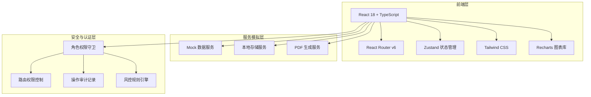

## 1. 架构设计



## 2. 技术说明

- **前端框架**：React 18 + TypeScript + Vite
- **初始化工具**：vite-init（react-ts 模板）
- **路由**：react-router-dom v6
- **状态管理**：zustand
- **样式方案**：Tailwind CSS 3
- **图表库**：recharts
- **图标库**：lucide-react
- **后端**：无（纯前端，使用 Mock 数据模拟）
- **数据库**：无（使用 localStorage 模拟持久化）

## 3. 路由定义

| 路由 | 用途 | 权限 |
|------|------|------|
| `/` | 重定向至登录页 | 公开 |
| `/login` | 登录与双因子认证 | 公开 |
| `/dashboard` | 统一门户首页 | 已认证 |
| `/social-insurance` | 社保查询 | 已认证 |
| `/transfer` | 关系转移 | 已认证 |
| `/unemployment` | 失业登记/申领 | 已认证 |
| `/pension` | 养老金测算 | 已认证 |
| `/certification` | 待遇资格认证 | 已认证 |
| `/mediation` | 劳动争议调解 | 已认证 |
| `/qualification` | 职业资格核验 | 已认证 |
| `/e-voucher` | 电子凭证（就医购药） | 已认证 |
| `/transit` | 公共交通扫码 | 已认证 |
| `/culture` | 文化场馆核验 | 已认证 |
| `/security` | 安全认证中心 | 已认证 |
| `/data-board` | 数据看板 | 经办人员 |
| `/audit-log` | 审计日志 | 经办人员 |
| `/offline` | 离线服务/PDF生成 | 已认证 |

## 4. API 定义（Mock）

### 4.1 用户与认证

```typescript
interface User {
  id: string
  name: string
  idCard: string
  role: 'insured' | 'employed' | 'retired' | 'agent'
  region: string
  authLevel: 1 | 2
  avatar: string
}

interface AuthResult {
  success: boolean
  token: string
  user: User
  riskLevel: 'low' | 'medium' | 'high'
}
```

### 4.2 社保查询

```typescript
interface SocialInsuranceRecord {
  type: 'pension' | 'medical' | 'unemployment' | 'workInjury' | 'maternity'
  status: 'active' | 'suspended' | 'closed'
  months: number
  baseAmount: number
  personalAmount: number
  companyAmount: number
  monthlyDetails: MonthlyDetail[]
}

interface MonthlyDetail {
  month: string
  personalPay: number
  companyPay: number
  base: number
}
```

### 4.3 关系转移

```typescript
interface TransferApplication {
  id: string
  fromProvince: string
  toProvince: string
  transferType: 'pension' | 'medical'
  status: 'pending' | 'reviewing' | 'approved' | 'transferring' | 'completed' | 'rejected'
  steps: TransferStep[]
  createdAt: string
}

interface TransferStep {
  name: string
  status: 'done' | 'current' | 'pending'
  date?: string
  note?: string
}
```

### 4.4 失业登记/申领

```typescript
interface UnemploymentRegistration {
  id: string
  status: 'draft' | 'submitted' | 'approved' | 'rejected'
  reason: string
  lastEmployer: string
  severanceDate: string
  claimAmount?: number
  claimMonths?: number
}
```

### 4.5 养老金测算

```typescript
interface PensionEstimate {
  monthlyPension: number
  replacementRate: number
  totalContribution: number
  projectedPension: YearlyProjection[]
}

interface YearlyProjection {
  year: number
  monthlyAmount: number
  cumulative: number
}
```

### 4.6 数据看板

```typescript
interface DashboardData {
  totalCalls: number
  callsTrend: DailyCount[]
  completionRate: number
  completionTrend: DailyCount[]
  overdueWarnings: OverdueItem[]
  provinceHotspots: ProvinceData[]
  topServices: ServiceRanking[]
}

interface DailyCount {
  date: string
  count: number
}

interface OverdueItem {
  id: string
  service: string
  applicant: string
  days: number
  level: 'warning' | 'critical'
}

interface ProvinceData {
  province: string
  count: number
  growth: number
}

interface ServiceRanking {
  name: string
  calls: number
  completionRate: number
}
```

### 4.7 审计日志

```typescript
interface AuditLog {
  id: string
  operatorId: string
  operatorName: string
  action: string
  category: 'query' | 'transfer' | 'claim' | 'certify' | 'review' | 'system'
  target: string
  timestamp: string
  ip: string
  result: 'success' | 'failure'
}
```

## 5. 状态管理设计（Zustand）

```typescript
interface AppStore {
  user: User | null
  isAuthenticated: boolean
  currentRole: UserRole
  sidebarCollapsed: boolean
  notifications: Notification[]

  login: (user: User) => void
  logout: () => void
  switchRole: (role: UserRole) => void
  toggleSidebar: () => void
  addNotification: (notification: Notification) => void
}
```

## 6. 目录结构

```
src/
├── components/
│   ├── layout/           # 布局组件（Sidebar, Header, MainLayout）
│   ├── common/           # 通用组件（Card, Badge, StepProgress, QRCode）
│   ├── charts/           # 图表组件（LineChart, BarChart, HeatMap, RingChart）
│   └── auth/             # 认证组件（FaceAuth, CardAuth, RiskAlert）
├── pages/
│   ├── Login/            # 登录与认证
│   ├── Dashboard/        # 统一门户首页
│   ├── SocialInsurance/  # 社保查询
│   ├── Transfer/         # 关系转移
│   ├── Unemployment/     # 失业登记/申领
│   ├── Pension/          # 养老金测算
│   ├── Certification/    # 待遇资格认证
│   ├── Mediation/        # 劳动争议调解
│   ├── Qualification/    # 职业资格核验
│   ├── EVoucher/         # 电子凭证
│   ├── Transit/          # 公共交通
│   ├── Culture/          # 文化场馆
│   ├── Security/         # 安全认证中心
│   ├── DataBoard/        # 数据看板
│   ├── AuditLog/         # 审计日志
│   └── Offline/          # 离线服务
├── hooks/                # 自定义Hooks
├── store/                # Zustand Store
├── mock/                 # Mock数据
├── utils/                # 工具函数（PDF生成、日期格式化等）
├── types/                # TypeScript类型定义
├── App.tsx               # 路由配置
└── main.tsx              # 入口文件
```
