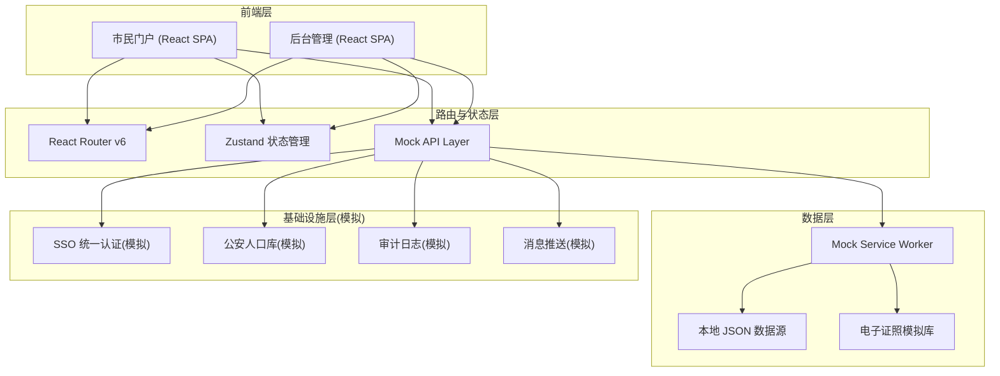
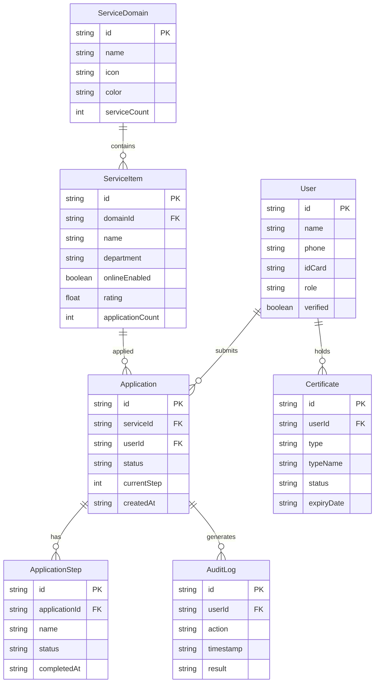

## 1. 架构设计



## 2. 技术说明

- **前端框架**: React@18 + TypeScript
- **样式方案**: Tailwind CSS@3 + CSS Modules（复杂组件样式隔离）
- **构建工具**: Vite@5
- **状态管理**: Zustand（轻量级，适合多模块状态共享）
- **路由方案**: React Router v6（嵌套路由、权限路由守卫）
- **图表可视化**: Recharts（数据看板）、自定义Canvas热力图
- **动画库**: Framer Motion（页面切换、微交互）
- **图标库**: Lucide React（线性图标风格）
- **后端**: 无（纯前端，使用 Mock 数据模拟所有接口）
- **数据库**: 无（使用本地 JSON + localStorage 持久化）

## 3. 路由定义

| 路由 | 用途 | 权限 |
|------|------|------|
| `/` | 市民门户首页 | 公开 |
| `/services` | 服务大厅-六大域分类浏览 | 公开 |
| `/services/:domainId` | 服务大厅-某服务域详情 | 公开 |
| `/services/:domainId/:serviceId` | 服务详情页 | 登录 |
| `/service/apply/:serviceId` | 政务申办流程页面 | 登录+实名 |
| `/certificates` | 电子证照列表 | 登录+实名 |
| `/certificates/:id/qrcode` | 扫码亮证页面 | 登录+实名 |
| `/profile` | 个人中心 | 登录 |
| `/profile/applications` | 我的办事 | 登录 |
| `/profile/certificates` | 我的证照 | 登录 |
| `/profile/messages` | 消息通知 | 登录 |
| `/profile/security` | 账号安全 | 登录 |
| `/login` | 统一登录/认证页面 | 公开 |
| `/admin` | 后台管理首页 | 管理员 |
| `/admin/services` | 服务管理 | 管理员 |
| `/admin/approvals` | 审批中心 | 管理员 |
| `/admin/monitor` | 监控统计 | 管理员 |
| `/admin/audit` | 访问审计 | 管理员 |
| `/admin/heatmap` | 行为热力图 | 管理员 |

## 4. API 定义（Mock 接口）

### 4.1 用户认证

```typescript
interface LoginRequest {
  phone: string;
  code: string;
  idCard?: string;
}

interface LoginResponse {
  token: string;
  user: {
    id: string;
    name: string;
    phone: string;
    idCard: string;
    role: 'citizen' | 'enterprise' | 'dept_admin' | 'data_admin';
    verified: boolean;
    avatar: string;
  };
}

interface VerifyIdentityRequest {
  realName: string;
  idCard: string;
  faceToken?: string;
}

interface VerifyIdentityResponse {
  verified: boolean;
  confidence: number;
  message: string;
}
```

### 4.2 服务域与服务项

```typescript
interface ServiceDomain {
  id: string;
  name: string;
  icon: string;
  color: string;
  description: string;
  serviceCount: number;
  subServices: ServiceItem[];
}

interface ServiceItem {
  id: string;
  domainId: string;
  name: string;
  department: string;
  description: string;
  requiredDocuments: string[];
  processTime: string;
  fee: string;
  onlineEnabled: boolean;
  rating: number;
  applicationCount: number;
  tags: string[];
}
```

### 4.3 政务申办

```typescript
interface Application {
  id: string;
  serviceId: string;
  userId: string;
  status: 'draft' | 'submitted' | 'under_review' | 'approved' | 'rejected' | 'completed';
  currentStep: number;
  steps: ApplicationStep[];
  createdAt: string;
  updatedAt: string;
  result?: {
    type: 'certificate' | 'notification' | 'permit';
    content: string;
    issueDate: string;
  };
}

interface ApplicationStep {
  name: string;
  status: 'pending' | 'active' | 'completed' | 'rejected';
  completedAt?: string;
  assignee?: string;
  notes?: string;
}
```

### 4.4 电子证照

```typescript
interface Certificate {
  id: string;
  type: string;
  typeName: string;
  holderName: string;
  holderIdCard: string;
  issueDate: string;
  expiryDate: string;
  status: 'valid' | 'expiring' | 'expired';
  issuingAuthority: string;
  qrCodeData?: string;
  category: string;
}
```

### 4.5 监控统计

```typescript
interface DashboardStats {
  totalApplications: number;
  activeUsers: number;
  serviceAvailability: number;
  averageProcessTime: number;
  dailyTrend: { date: string; count: number }[];
  domainDistribution: { name: string; value: number }[];
  hourlyHeatmap: number[][];
}

interface AuditLog {
  id: string;
  userId: string;
  action: string;
  resource: string;
  timestamp: string;
  ip: string;
  result: 'success' | 'failure';
  details: string;
}
```

## 5. 数据模型

### 5.1 数据模型定义



### 5.2 Mock 数据初始化

使用本地 JSON 文件存储模拟数据：

- `mock/domains.json` - 六大服务域及480+服务项
- `mock/certificates.json` - 407类电子证照模板与用户证照
- `mock/users.json` - 模拟用户数据
- `mock/applications.json` - 模拟申办工单
- `mock/dashboard.json` - 监控统计数据
- `mock/audit-logs.json` - 审计日志数据

## 6. 项目结构

```
src/
├── components/          # 通用组件
│   ├── Layout/         # 布局组件（Header, Sidebar, Footer）
│   ├── ServiceCard/    # 服务卡片组件
│   ├── CertificateCard/ # 证照卡片
│   ├── ProgressTracker/ # 进度追踪时间轴
│   ├── HeatMap/        # 热力图组件
│   ├── QRCode/         # 二维码组件
│   └── Chart/          # 图表封装
├── pages/              # 页面组件
│   ├── Home/           # 市民门户首页
│   ├── Services/       # 服务大厅
│   ├── ServiceDetail/  # 服务详情
│   ├── Apply/          # 政务申办流程
│   ├── Certificates/   # 电子证照
│   ├── Profile/        # 个人中心
│   ├── Login/          # 登录认证
│   └── Admin/          # 后台管理
│       ├── Dashboard/  # 数据看板
│       ├── Services/   # 服务管理
│       ├── Approvals/  # 审批中心
│       ├── Monitor/    # 监控统计
│       ├── Audit/      # 访问审计
│       └── Heatmap/    # 行为热力图
├── stores/             # Zustand状态仓库
│   ├── authStore.ts    # 认证状态
│   ├── serviceStore.ts # 服务数据
│   ├── applicationStore.ts # 申办状态
│   └── adminStore.ts   # 管理后台状态
├── mock/               # 模拟数据
│   ├── domains.json
│   ├── certificates.json
│   ├── users.json
│   ├── applications.json
│   ├── dashboard.json
│   └── audit-logs.json
├── types/              # TypeScript类型定义
├── utils/              # 工具函数
├── hooks/              # 自定义Hooks
├── App.tsx             # 根组件
└── main.tsx            # 入口文件
```
