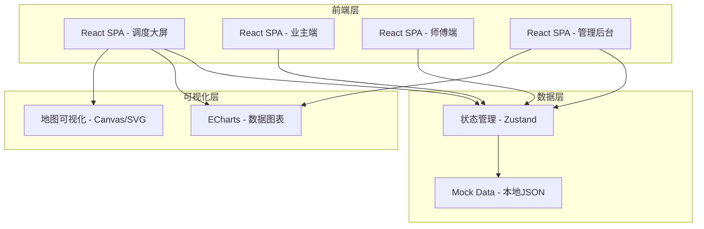
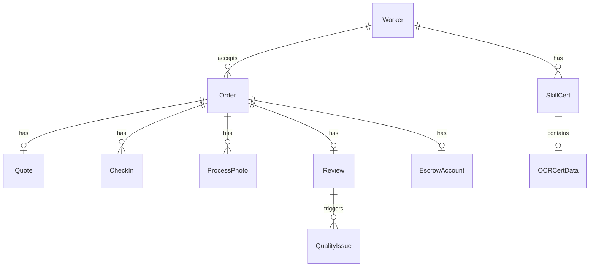

## 1. 架构设计



## 2. 技术说明

- 前端：React@18 + TailwindCSS@3 + Vite
- 初始化工具：Vite
- 后端：无（纯前端项目，使用Mock数据模拟）
- 数据库：无（使用本地JSON + Zustand状态管理模拟数据持久化）
- 图表库：ECharts@5
- 地图：Canvas/SVG 自绘（不依赖外部地图服务）
- 动画：Framer Motion
- 图标：Lucide React

## 3. 路由定义

| 路由 | 用途 |
|------|------|
| / | 调度大屏首页 - 实时地图+指标看板+订单列表 |
| /repair | 业主报修页 - 故障选择+师傅匹配+标准报价 |
| /worker | 师傅工作台 - 技能图谱+证件上传+接单+打卡 |
| /tracking/:id | 服务追踪页 - 打卡记录+工序相册 |
| /escrow | 资金担保页 - 冻结账户+账单明细 |
| /quality | 质量回溯页 - 差评监控+复盘工单+评分趋势 |

## 4. API定义（无后端，Mock数据接口）

### 4.1 数据类型定义

```typescript
interface Worker {
  id: string
  name: string
  avatar: string
  phone: string
  skills: SkillCert[]
  rating: number
  orderCount: number
  location: { lat: number; lng: number }
  status: 'online' | 'busy' | 'offline'
}

interface SkillCert {
  category: string
  certName: string
  certNo: string
  issueDate: string
  expiryDate: string
  status: 'verified' | 'pending' | 'expired'
  ocrResult?: OCRCertData
}

interface OCRCertData {
  name: string
  certType: string
  certNo: string
  issueOrg: string
  issueDate: string
  expiryDate: string
  confidence: number
}

interface Order {
  id: string
  homeownerId: string
  workerId: string | null
  faultType: string
  faultCategory: string[]
  description: string
  photos: string[]
  status: 'pending' | 'matched' | 'quoted' | 'paid' | 'in_service' | 'completed' | 'reviewed'
  quote?: Quote
  checkIns: CheckIn[]
  processPhotos: ProcessPhoto[]
  review?: Review
  createdAt: string
}

interface Quote {
  parts: { name: string; price: number; quantity: number }[]
  laborHours: number
  laborRate: number
  cityBaseRate: number
  totalParts: number
  totalLabor: number
  totalAmount: number
}

interface CheckIn {
  id: string
  time: string
  type: 'gps' | 'face' | 'complete'
  location: { lat: number; lng: number; accuracy: number }
  photo?: string
  verified: boolean
}

interface ProcessPhoto {
  id: string
  step: string
  isRequired: boolean
  isHiddenWork: boolean
  photoUrl: string
  timestamp: string
  description: string
}

interface Review {
  rating: number
  comment: string
  keywords: string[]
  createdAt: string
}

interface EscrowAccount {
  orderId: string
  amount: number
  status: 'frozen' | 'released' | 'refunded'
  frozenAt: string
  releaseAt: string | null
}

interface QualityIssue {
  id: string
  orderId: string
  workerId: string
  keywords: string[]
  severity: 'low' | 'medium' | 'high'
  status: 'open' | 'investigating' | 'resolved'
  createdAt: string
}
```

## 5. 服务端架构图（无后端，略）

## 6. 数据模型

### 6.1 数据模型定义



### 6.2 数据定义语言

本项目使用本地JSON Mock数据，无需DDL。数据文件存放于 `src/data/` 目录下：

- `workers.json` - 师傅数据
- `orders.json` - 订单数据
- `parts.json` - 标准配件库
- `laborRates.json` - 城市工时费基准
- `faultTypes.json` - 故障类型树
- `qualityIssues.json` - 质量问题数据
