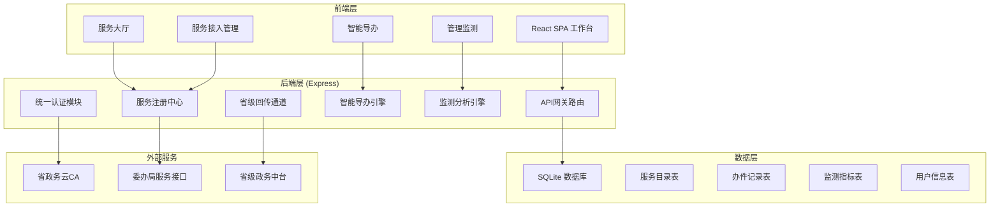
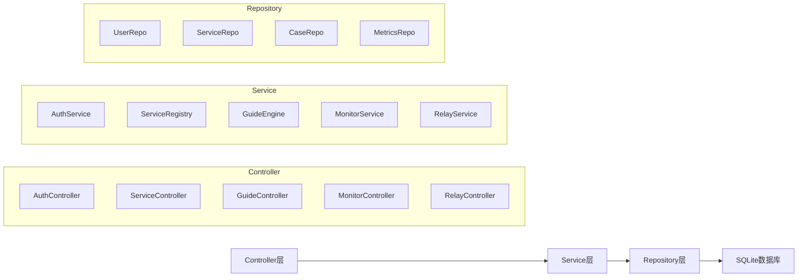
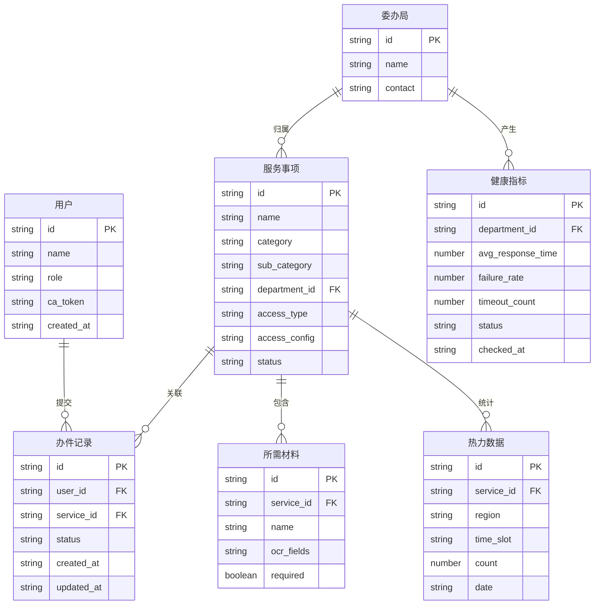

## 1. 架构设计



## 2. 技术说明

- **前端**：React@18 + TypeScript + TailwindCSS@3 + Vite
- **初始化工具**：vite-init
- **后端**：Express@4 + TypeScript（ESM格式）
- **数据库**：SQLite（better-sqlite3），内置Mock数据
- **状态管理**：Zustand
- **路由**：react-router-dom
- **图标**：lucide-react
- **图表**：recharts（健康度图表、热力图、趋势图）

## 3. 路由定义

| 路由 | 用途 |
|------|------|
| `/` | 工作台首页，数据概览与快捷入口 |
| `/services` | 服务大厅，政务+便民服务分类浏览 |
| `/services/:id` | 服务详情，办理指南与在线申办 |
| `/guide` | 智能导办，问题描述与路径推荐 |
| `/guide/ocr` | OCR材料识别预填 |
| `/guide/track` | 办事进度追踪 |
| `/admin/monitor` | 管理监测-健康度看板 |
| `/admin/heatmap` | 管理监测-办事热力图 |
| `/admin/material` | 管理监测-材料减免分析 |
| `/admin/integration` | 服务接入管理 |
| `/admin/relay` | 省级回传通道管理 |

## 4. API定义

### 4.1 认证相关

```typescript
interface LoginRequest {
  username: string;
  password: string;
  caToken?: string;
}

interface LoginResponse {
  token: string;
  user: {
    id: string;
    name: string;
    role: "citizen" | "staff" | "admin";
  };
}
```

### 4.2 服务目录

```typescript
interface ServiceItem {
  id: string;
  name: string;
  category: "government" | "convenience";
  subCategory: string;
  description: string;
  icon: string;
  applicantCount: number;
  accessType: "http" | "webhook" | "api-gateway";
  accessConfig: AccessConfig;
  status: "online" | "offline" | "pending";
  department: string;
  requiredMaterials: Material[];
  processSteps: ProcessStep[];
}

interface AccessConfig {
  endpoint?: string;
  method?: string;
  webhookUrl?: string;
  gatewayRoute?: string;
  headers?: Record<string, string>;
}

interface Material {
  id: string;
  name: string;
  description: string;
  ocrFields: string[];
  required: boolean;
}

interface ProcessStep {
  step: number;
  title: string;
  description: string;
  department: string;
  estimatedDays: number;
}
```

### 4.3 智能导办

```typescript
interface GuideRequest {
  question: string;
}

interface GuideResponse {
  recommendedServices: ServiceItem[];
  processPath: ProcessStep[];
  materialList: Material[];
  tips: string[];
}

interface OcrRequest {
  imageBase64: string;
  materialId: string;
}

interface OcrResponse {
  recognizedFields: Record<string, string>;
  confidence: number;
}
```

### 4.4 监测分析

```typescript
interface HealthMetrics {
  departmentId: string;
  departmentName: string;
  avgResponseTime: number;
  failureRate: number;
  timeoutCount: number;
  status: "healthy" | "warning" | "critical";
  lastCheckTime: string;
}

interface HeatmapData {
  region: string;
  timeSlot: string;
  serviceCategory: string;
  count: number;
}

interface MaterialReduction {
  fieldName: string;
  appearancesInServices: string[];
  currentDuplication: number;
  mergeSuggestion: string;
  estimatedReductionRate: number;
}
```

### 4.5 省级回传

```typescript
interface RelayStatus {
  lastSyncTime: string;
  syncDirection: "upstream" | "downstream" | "bidirectional";
  status: "connected" | "disconnected" | "error";
  pendingRecords: number;
}
```

## 5. 服务器架构图



## 6. 数据模型

### 6.1 数据模型定义



### 6.2 数据定义语言

```sql
CREATE TABLE departments (
  id TEXT PRIMARY KEY,
  name TEXT NOT NULL,
  contact TEXT NOT NULL
);

CREATE TABLE users (
  id TEXT PRIMARY KEY,
  name TEXT NOT NULL,
  role TEXT NOT NULL CHECK(role IN ('citizen', 'staff', 'admin')),
  ca_token TEXT,
  created_at TEXT NOT NULL DEFAULT (datetime('now'))
);

CREATE TABLE services (
  id TEXT PRIMARY KEY,
  name TEXT NOT NULL,
  category TEXT NOT NULL CHECK(category IN ('government', 'convenience')),
  sub_category TEXT NOT NULL,
  department_id TEXT NOT NULL REFERENCES departments(id),
  description TEXT NOT NULL,
  icon TEXT NOT NULL,
  access_type TEXT NOT NULL CHECK(access_type IN ('http', 'webhook', 'api-gateway')),
  access_config TEXT NOT NULL,
  status TEXT NOT NULL DEFAULT 'pending' CHECK(status IN ('online', 'offline', 'pending')),
  applicant_count INTEGER NOT NULL DEFAULT 0,
  process_steps TEXT NOT NULL
);

CREATE TABLE materials (
  id TEXT PRIMARY KEY,
  service_id TEXT NOT NULL REFERENCES services(id),
  name TEXT NOT NULL,
  description TEXT,
  ocr_fields TEXT NOT NULL DEFAULT '[]',
  required INTEGER NOT NULL DEFAULT 1
);

CREATE TABLE cases (
  id TEXT PRIMARY KEY,
  user_id TEXT NOT NULL REFERENCES users(id),
  service_id TEXT NOT NULL REFERENCES services(id),
  status TEXT NOT NULL DEFAULT 'submitted' CHECK(status IN ('submitted', 'processing', 'approved', 'rejected', 'completed')),
  form_data TEXT NOT NULL DEFAULT '{}',
  created_at TEXT NOT NULL DEFAULT (datetime('now')),
  updated_at TEXT NOT NULL DEFAULT (datetime('now'))
);

CREATE TABLE health_metrics (
  id TEXT PRIMARY KEY,
  department_id TEXT NOT NULL REFERENCES departments(id),
  avg_response_time REAL NOT NULL,
  failure_rate REAL NOT NULL,
  timeout_count INTEGER NOT NULL,
  status TEXT NOT NULL CHECK(status IN ('healthy', 'warning', 'critical')),
  checked_at TEXT NOT NULL DEFAULT (datetime('now'))
);

CREATE TABLE heatmap_data (
  id TEXT PRIMARY KEY,
  service_id TEXT NOT NULL REFERENCES services(id),
  region TEXT NOT NULL,
  time_slot TEXT NOT NULL,
  count INTEGER NOT NULL DEFAULT 0,
  date TEXT NOT NULL
);

CREATE INDEX idx_services_category ON services(category);
CREATE INDEX idx_services_department ON services(department_id);
CREATE INDEX idx_cases_user ON cases(user_id);
CREATE INDEX idx_cases_service ON cases(service_id);
CREATE INDEX idx_cases_status ON cases(status);
CREATE INDEX idx_health_dept ON health_metrics(department_id);
CREATE INDEX idx_heatmap_region ON heatmap_data(region);
CREATE INDEX idx_heatmap_date ON heatmap_data(date);
```
