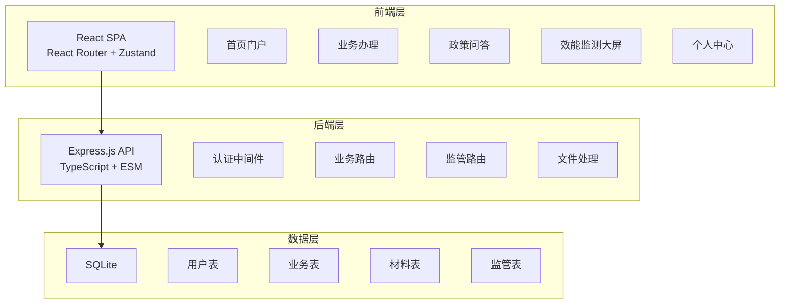
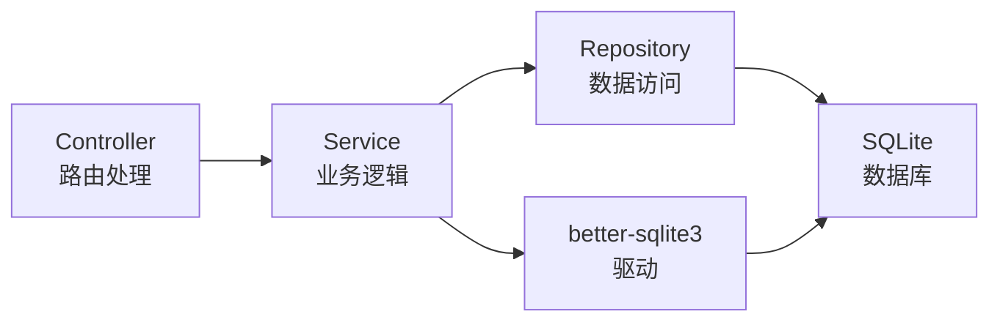
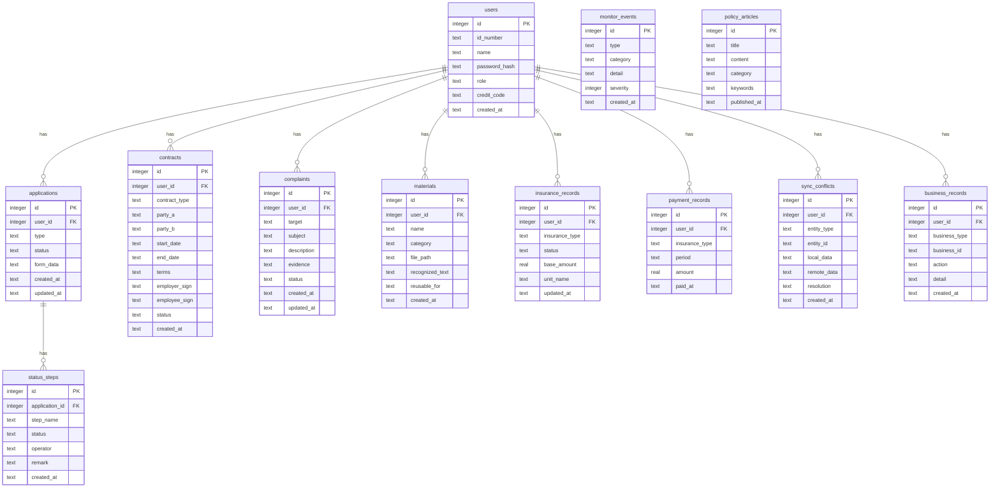

## 1. 架构设计



## 2. 技术说明

- 前端：React@18 + TypeScript + Tailwind CSS@3 + Vite
- 初始化工具：vite-init（react-ts 模板）
- 后端：Express@4 + TypeScript + ESM
- 数据库：SQLite（better-sqlite3）
- 状态管理：Zustand
- 图标：lucide-react
- 图表：recharts（效能监测大屏）
- 路由：react-router-dom@6

## 3. 路由定义

| 路由 | 用途 |
|------|------|
| / | 首页门户，个人/企业模式切换 |
| /social-security | 社保服务首页 |
| /social-security/query | 参保状态查询 |
| /social-security/payment | 缴费记录查询 |
| /employment | 就业服务首页 |
| /employment/unemployment | 失业金申领 |
| /talent | 人才服务首页 |
| /talent/title | 职称申报 |
| /labor | 劳动关系首页 |
| /labor/contract | 劳动合同电子签署 |
| /labor/complaint | 劳动监察投诉 |
| /policy | 政策问答 |
| /policy/material | 材料识别与复用 |
| /monitor | 效能监测大屏 |
| /monitor/timeout | 超时预警 |
| /monitor/rejection | 退件归因 |
| /monitor/hotspot | 热点问题聚类 |
| /profile | 个人中心 |
| /profile/records | 业务办理记录 |
| /profile/sync | 数据同步 |

## 4. API 定义

### 4.1 认证相关

```typescript
POST /api/auth/login
  Request:  { idNumber: string; password: string; role: "personal" | "enterprise" | "admin" }
  Response: { ok: boolean; token: string; user: User }

POST /api/auth/register
  Request:  { idNumber: string; name: string; password: string; role: "personal" | "enterprise"; creditCode?: string }
  Response: { ok: boolean; user: User }

GET /api/auth/me
  Headers:  Authorization: Bearer <token>
  Response: { ok: boolean; user: User }
```

### 4.2 社保服务

```typescript
GET /api/social-security/status
  Response: { ok: boolean; records: InsuranceRecord[] }

GET /api/social-security/payments
  Query:    { year?: string }
  Response: { ok: boolean; payments: PaymentRecord[] }
```

### 4.3 就业服务

```typescript
POST /api/employment/unemployment
  Request:  { reason: string; bankAccount: string; bankName: string; attachments: string[] }
  Response: { ok: boolean; application: Application }

GET /api/employment/unemployment/:id
  Response: { ok: boolean; application: Application }

GET /api/employment/unemployment/:id/status
  Response: { ok: boolean; status: ApplicationStatus; steps: StatusStep[] }
```

### 4.4 人才服务

```typescript
POST /api/talent/title
  Request:  { series: string; level: string; achievements: string; materials: string[] }
  Response: { ok: boolean; application: Application }

GET /api/talent/title/:id
  Response: { ok: boolean; application: Application }
```

### 4.5 劳动关系

```typescript
POST /api/labor/contract
  Request:  { type: string; partyA: string; partyB: string; startDate: string; endDate: string; terms: string }
  Response: { ok: boolean; contract: Contract }

POST /api/labor/contract/:id/sign
  Request:  { signatureData: string; role: "employer" | "employee" }
  Response: { ok: boolean; contract: Contract }

POST /api/labor/complaint
  Request:  { target: string; subject: string; description: string; evidence: string[] }
  Response: { ok: boolean; complaint: Complaint }

GET /api/labor/complaint/:id
  Response: { ok: boolean; complaint: Complaint }
```

### 4.6 政策问答

```typescript
GET /api/policy/search
  Query:    { q: string }
  Response: { ok: boolean; results: PolicyArticle[] }

POST /api/policy/material/recognize
  Request:  { fileData: string; fileName: string }
  Response: { ok: boolean; recognized: RecognizedMaterial }

GET /api/policy/material/reuse
  Query:    { userId: string }
  Response: { ok: boolean; materials: MaterialWithReuse[] }
```

### 4.7 监管

```typescript
GET /api/monitor/statistics
  Response: { ok: boolean; stats: MonitorStats }

GET /api/monitor/timeout
  Query:    { type?: string; area?: string }
  Response: { ok: boolean; items: TimeoutWarning[] }

GET /api/monitor/rejection
  Response: { ok: boolean; analysis: RejectionAnalysis }

GET /api/monitor/hotspot
  Response: { ok: boolean; clusters: HotspotCluster[] }
```

### 4.8 用户中心

```typescript
GET /api/user/records
  Query:    { status?: string; page?: number }
  Response: { ok: boolean; records: BusinessRecord[]; total: number }

GET /api/user/sync-status
  Response: { ok: boolean; syncInfo: SyncInfo }

POST /api/user/sync/resolve
  Request:  { conflictId: string; resolution: "local" | "remote" }
  Response: { ok: boolean }
```

## 5. 服务端架构图



## 6. 数据模型

### 6.1 数据模型定义



### 6.2 数据定义语言

```sql
CREATE TABLE IF NOT EXISTS users (
    id INTEGER PRIMARY KEY AUTOINCREMENT,
    id_number TEXT NOT NULL UNIQUE,
    name TEXT NOT NULL,
    password_hash TEXT NOT NULL,
    role TEXT NOT NULL CHECK(role IN ('personal', 'enterprise', 'admin')),
    credit_code TEXT,
    created_at TEXT NOT NULL DEFAULT (datetime('now'))
);

CREATE TABLE IF NOT EXISTS applications (
    id INTEGER PRIMARY KEY AUTOINCREMENT,
    user_id INTEGER NOT NULL REFERENCES users(id),
    type TEXT NOT NULL,
    status TEXT NOT NULL DEFAULT 'submitted' CHECK(status IN ('submitted','reviewing','approved','rejected','completed')),
    form_data TEXT NOT NULL DEFAULT '{}',
    created_at TEXT NOT NULL DEFAULT (datetime('now')),
    updated_at TEXT NOT NULL DEFAULT (datetime('now'))
);

CREATE TABLE IF NOT EXISTS contracts (
    id INTEGER PRIMARY KEY AUTOINCREMENT,
    user_id INTEGER NOT NULL REFERENCES users(id),
    contract_type TEXT NOT NULL,
    party_a TEXT NOT NULL,
    party_b TEXT NOT NULL,
    start_date TEXT NOT NULL,
    end_date TEXT NOT NULL,
    terms TEXT NOT NULL,
    employer_sign TEXT,
    employee_sign TEXT,
    status TEXT NOT NULL DEFAULT 'draft' CHECK(status IN ('draft','signed','archived')),
    created_at TEXT NOT NULL DEFAULT (datetime('now'))
);

CREATE TABLE IF NOT EXISTS complaints (
    id INTEGER PRIMARY KEY AUTOINCREMENT,
    user_id INTEGER NOT NULL REFERENCES users(id),
    target TEXT NOT NULL,
    subject TEXT NOT NULL,
    description TEXT NOT NULL,
    evidence TEXT NOT NULL DEFAULT '[]',
    status TEXT NOT NULL DEFAULT 'submitted' CHECK(status IN ('submitted','accepted','investigating','resolved','closed')),
    created_at TEXT NOT NULL DEFAULT (datetime('now')),
    updated_at TEXT NOT NULL DEFAULT (datetime('now'))
);

CREATE TABLE IF NOT EXISTS materials (
    id INTEGER PRIMARY KEY AUTOINCREMENT,
    user_id INTEGER NOT NULL REFERENCES users(id),
    name TEXT NOT NULL,
    category TEXT NOT NULL,
    file_path TEXT NOT NULL,
    recognized_text TEXT,
    reusable_for TEXT NOT NULL DEFAULT '[]',
    created_at TEXT NOT NULL DEFAULT (datetime('now'))
);

CREATE TABLE IF NOT EXISTS insurance_records (
    id INTEGER PRIMARY KEY AUTOINCREMENT,
    user_id INTEGER NOT NULL REFERENCES users(id),
    insurance_type TEXT NOT NULL,
    status TEXT NOT NULL CHECK(status IN ('active','suspended','ceased')),
    base_amount REAL NOT NULL DEFAULT 0,
    unit_name TEXT,
    updated_at TEXT NOT NULL DEFAULT (datetime('now'))
);

CREATE TABLE IF NOT EXISTS payment_records (
    id INTEGER PRIMARY KEY AUTOINCREMENT,
    user_id INTEGER NOT NULL REFERENCES users(id),
    insurance_type TEXT NOT NULL,
    period TEXT NOT NULL,
    amount REAL NOT NULL DEFAULT 0,
    paid_at TEXT NOT NULL
);

CREATE TABLE IF NOT EXISTS status_steps (
    id INTEGER PRIMARY KEY AUTOINCREMENT,
    application_id INTEGER NOT NULL REFERENCES applications(id),
    step_name TEXT NOT NULL,
    status TEXT NOT NULL DEFAULT 'pending' CHECK(status IN ('pending','active','done','rejected')),
    operator TEXT,
    remark TEXT,
    created_at TEXT NOT NULL DEFAULT (datetime('now'))
);

CREATE TABLE IF NOT EXISTS monitor_events (
    id INTEGER PRIMARY KEY AUTOINCREMENT,
    type TEXT NOT NULL,
    category TEXT NOT NULL,
    detail TEXT NOT NULL,
    severity INTEGER NOT NULL DEFAULT 0,
    created_at TEXT NOT NULL DEFAULT (datetime('now'))
);

CREATE TABLE IF NOT EXISTS policy_articles (
    id INTEGER PRIMARY KEY AUTOINCREMENT,
    title TEXT NOT NULL,
    content TEXT NOT NULL,
    category TEXT NOT NULL,
    keywords TEXT NOT NULL DEFAULT '[]',
    published_at TEXT NOT NULL DEFAULT (datetime('now'))
);

CREATE TABLE IF NOT EXISTS sync_conflicts (
    id INTEGER PRIMARY KEY AUTOINCREMENT,
    user_id INTEGER NOT NULL REFERENCES users(id),
    entity_type TEXT NOT NULL,
    entity_id TEXT NOT NULL,
    local_data TEXT NOT NULL,
    remote_data TEXT NOT NULL,
    resolution TEXT,
    created_at TEXT NOT NULL DEFAULT (datetime('now'))
);

CREATE TABLE IF NOT EXISTS business_records (
    id INTEGER PRIMARY KEY AUTOINCREMENT,
    user_id INTEGER NOT NULL REFERENCES users(id),
    business_type TEXT NOT NULL,
    business_id INTEGER NOT NULL,
    action TEXT NOT NULL,
    detail TEXT NOT NULL DEFAULT '',
    created_at TEXT NOT NULL DEFAULT (datetime('now'))
);

-- 索引
CREATE INDEX IF NOT EXISTS idx_applications_user ON applications(user_id);
CREATE INDEX IF NOT EXISTS idx_applications_type_status ON applications(type, status);
CREATE INDEX IF NOT EXISTS idx_contracts_user ON contracts(user_id);
CREATE INDEX IF NOT EXISTS idx_complaints_user ON complaints(user_id);
CREATE INDEX IF NOT EXISTS idx_materials_user ON materials(user_id);
CREATE INDEX IF NOT EXISTS idx_insurance_user ON insurance_records(user_id);
CREATE INDEX IF NOT EXISTS idx_payments_user_period ON payment_records(user_id, period);
CREATE INDEX IF NOT EXISTS idx_status_steps_app ON status_steps(application_id);
CREATE INDEX IF NOT EXISTS idx_monitor_type ON monitor_events(type);
CREATE INDEX IF NOT EXISTS idx_policy_category ON policy_articles(category);
CREATE INDEX IF NOT EXISTS idx_sync_conflicts_user ON sync_conflicts(user_id);
CREATE INDEX IF NOT EXISTS idx_business_records_user ON business_records(user_id);

-- 初始数据
INSERT INTO users (id_number, name, password_hash, role, credit_code) VALUES
    ('110101199001011234', '张三', 'hashed_123456', 'personal', NULL),
    ('91110000MA01ABCDEF', '北京示例科技有限公司', 'hashed_enterprise', 'enterprise', '91110000MA01ABCDEF'),
    ('admin001', '监管员', 'hashed_admin', 'admin', NULL);

INSERT INTO insurance_records (user_id, insurance_type, status, base_amount, unit_name) VALUES
    (1, '养老保险', 'active', 6326.00, '北京示例科技有限公司'),
    (1, '医疗保险', 'active', 6326.00, '北京示例科技有限公司'),
    (1, '失业保险', 'active', 6326.00, '北京示例科技有限公司'),
    (1, '工伤保险', 'active', 6326.00, '北京示例科技有限公司'),
    (1, '生育保险', 'active', 6326.00, '北京示例科技有限公司');

INSERT INTO payment_records (user_id, insurance_type, period, amount, paid_at) VALUES
    (1, '养老保险', '2025-05', 506.08, '2025-05-15'),
    (1, '医疗保险', '2025-05', 126.52, '2025-05-15'),
    (1, '失业保险', '2025-05', 37.96, '2025-05-15'),
    (1, '工伤保险', '2025-05', 25.30, '2025-05-15'),
    (1, '生育保险', '2025-05', 25.30, '2025-05-15');

INSERT INTO policy_articles (title, content, category, keywords) VALUES
    ('失业保险金申领办法', '符合条件的人员可在线申领失业保险金，需提供解除劳动关系证明、银行账户信息等材料。', '社保', '["失业","申领","保险金"]'),
    ('职称评审管理办法', '申报职称需按系列和级别提交业绩成果及佐证材料，通过后颁发相应职称证书。', '人才', '["职称","申报","评审"]'),
    ('劳动合同电子签署规范', '用人单位与劳动者可通过平台完成劳动合同电子签署，签署后合同具有法律效力。', '劳动关系', '["劳动合同","电子签署","签约"]');

INSERT INTO monitor_events (type, category, detail, severity) VALUES
    ('timeout', '失业金申领', '张三的失业金申领已超时3天', 2),
    ('timeout', '职称申报', '李四的职称申报已超时1天', 1),
    ('rejection', '参保查询', '因信息不完整退件5件', 2),
    ('hotspot', '社保', '近期社保转移咨询量增长30%', 1);
```
