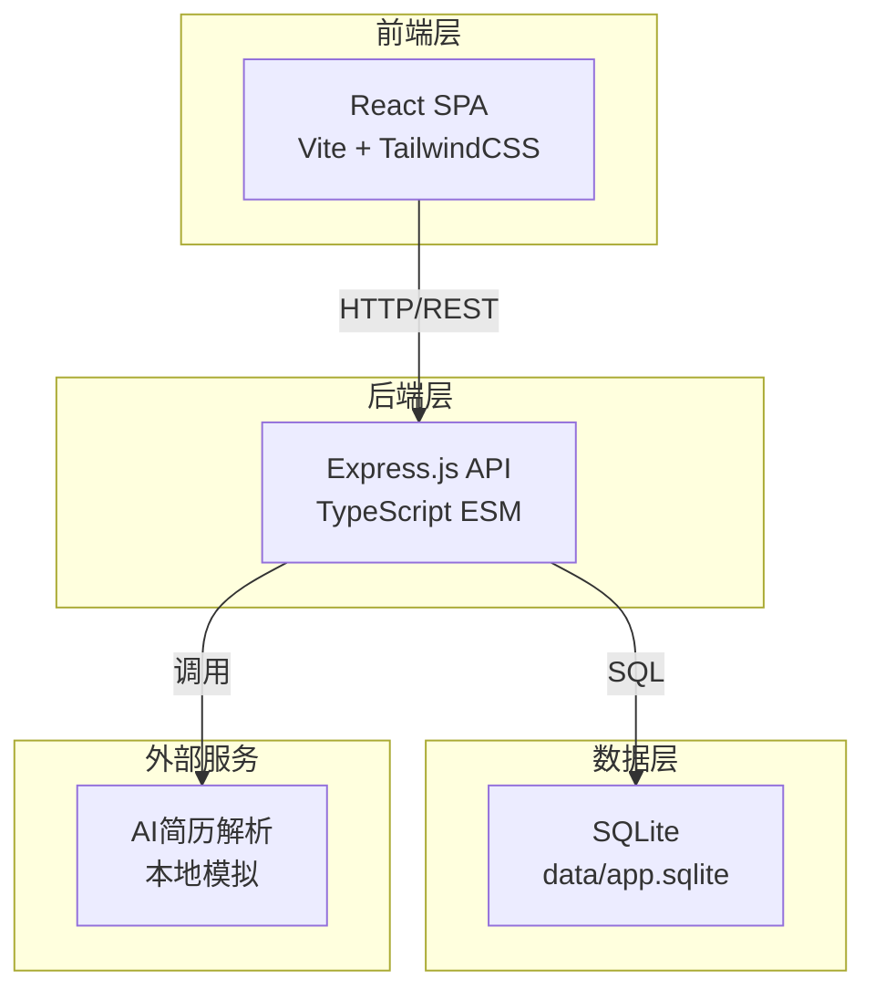
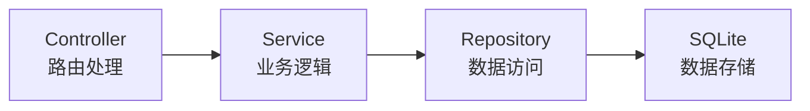
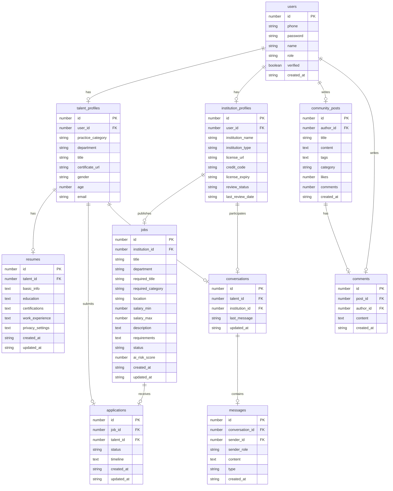

## 1. 架构设计



## 2. 技术说明

- **前端**：React@18 + TailwindCSS@3 + Vite + Zustand + React Router DOM
- **初始化工具**：vite-init
- **后端**：Express@4 + TypeScript（ESM格式）
- **数据库**：SQLite（better-sqlite3），文件路径 data/app.sqlite
- **端口配置**：FRONTEND_PORT=49180，BACKEND_PORT=59180

## 3. 路由定义

| 路由 | 用途 |
|------|------|
| `/` | 首页，搜索、热门科室、最新职位、数据概览 |
| `/register` | 注册认证页，双向注册与资质审核 |
| `/login` | 登录页 |
| `/jobs` | 职位中心，职位列表与筛选 |
| `/jobs/:id` | 职位详情页 |
| `/jobs/post` | 职位发布页（机构端） |
| `/resume` | 简历中心，结构化编辑与解析 |
| `/resume/preview` | 电子简历预览 |
| `/matches` | 双向匹配推荐页 |
| `/applications` | 投递追踪页 |
| `/messages` | 在线沟通页 |
| `/messages/:id` | 聊天详情页 |
| `/community` | 医疗人社区 |
| `/community/:id` | 社区文章详情 |
| `/admin` | 后台管理首页 |
| `/admin/institutions` | 机构资质年审管理 |
| `/admin/jobs-review` | 岗位审核（AI+人工） |
| `/admin/data-masking` | 简历脱敏归档 |
| `/admin/dashboard` | 统计看板 |

## 4. API定义

### 4.1 认证相关

```typescript
interface RegisterRequest {
  role: "talent" | "institution";
  phone: string;
  password: string;
  name: string;
  // 人才额外字段
  practiceCategory?: string;
  department?: string;
  title?: string;
  certificateUrl?: string;
  // 机构额外字段
  institutionName?: string;
  institutionType?: string;
  licenseUrl?: string;
  creditCode?: string;
}

interface LoginRequest {
  phone: string;
  password: string;
  role: "talent" | "institution" | "admin";
}

interface AuthResponse {
  token: string;
  user: {
    id: number;
    role: string;
    name: string;
    verified: boolean;
  };
}
```

### 4.2 职位相关

```typescript
interface Job {
  id: number;
  institutionId: number;
  institutionName: string;
  title: string;
  department: string;
  requiredTitle: string;
  requiredCategory: string;
  location: string;
  salaryMin: number;
  salaryMax: number;
  description: string;
  requirements: string;
  status: "pending" | "active" | "rejected" | "closed";
  aiRiskScore: number;
  createdAt: string;
}

interface JobListQuery {
  department?: string;
  location?: string;
  title?: string;
  category?: string;
  salaryMin?: number;
  salaryMax?: number;
  page?: number;
  pageSize?: number;
}
```

### 4.3 简历相关

```typescript
interface Resume {
  id: number;
  talentId: number;
  basicInfo: {
    name: string;
    phone: string;
    email: string;
    gender: string;
    age: number;
  };
  education: Array<{
    school: string;
    major: string;
    degree: string;
    startDate: string;
    endDate: string;
  }>;
  certifications: Array<{
    name: string;
    category: string;
    issueDate: string;
    certNumber: string;
  }>;
  workExperience: Array<{
    institution: string;
    department: string;
    title: string;
    startDate: string;
    endDate: string;
    description: string;
  }>;
  privacySettings: Record<string, "public" | "applied" | "hidden">;
}
```

### 4.4 投递追踪相关

```typescript
interface Application {
  id: number;
  jobId: number;
  talentId: number;
  status: "applied" | "read" | "invited" | "interview" | "offered" | "rejected";
  timeline: Array<{
    status: string;
    timestamp: string;
    note: string;
  }>;
  createdAt: string;
  updatedAt: string;
}
```

### 4.5 消息相关

```typescript
interface Message {
  id: number;
  conversationId: number;
  senderId: number;
  senderRole: string;
  content: string;
  type: "text" | "resume_card" | "job_card";
  createdAt: string;
}

interface Conversation {
  id: number;
  participants: Array<{
    id: number;
    name: string;
    role: string;
    avatar: string;
  }>;
  lastMessage: string;
  unreadCount: number;
  updatedAt: string;
}
```

### 4.6 社区相关

```typescript
interface CommunityPost {
  id: number;
  authorId: number;
  authorName: string;
  title: string;
  content: string;
  tags: string[];
  category: "news" | "policy" | "education";
  likes: number;
  comments: number;
  createdAt: string;
}
```

### 4.7 后台管理相关

```typescript
interface InstitutionReview {
  id: number;
  institutionId: number;
  institutionName: string;
  licenseExpiry: string;
  reviewStatus: "pending" | "approved" | "rejected";
  lastReviewDate: string;
}

interface DashboardStats {
  totalJobs: number;
  totalInstitutions: number;
  totalTalents: number;
  totalApplications: number;
  regionHeatmap: Array<{ region: string; count: number }>;
  departmentHeatmap: Array<{ department: string; count: number }>;
  positionHeatmap: Array<{ position: string; count: number }>;
  trendData: Array<{ date: string; jobs: number; applications: number }>;
}
```

## 5. 服务端架构图



## 6. 数据模型

### 6.1 数据模型定义



### 6.2 数据定义语言

```sql
CREATE TABLE users (
  id INTEGER PRIMARY KEY AUTOINCREMENT,
  phone TEXT NOT NULL UNIQUE,
  password TEXT NOT NULL,
  name TEXT NOT NULL,
  role TEXT NOT NULL CHECK(role IN ('talent', 'institution', 'admin')),
  verified INTEGER NOT NULL DEFAULT 0,
  created_at TEXT NOT NULL DEFAULT (datetime('now'))
);

CREATE TABLE talent_profiles (
  id INTEGER PRIMARY KEY AUTOINCREMENT,
  user_id INTEGER NOT NULL UNIQUE REFERENCES users(id),
  practice_category TEXT,
  department TEXT,
  title TEXT,
  certificate_url TEXT,
  gender TEXT,
  age INTEGER,
  email TEXT,
  location TEXT
);

CREATE TABLE institution_profiles (
  id INTEGER PRIMARY KEY AUTOINCREMENT,
  user_id INTEGER NOT NULL UNIQUE REFERENCES users(id),
  institution_name TEXT NOT NULL,
  institution_type TEXT,
  license_url TEXT,
  credit_code TEXT,
  license_expiry TEXT,
  review_status TEXT NOT NULL DEFAULT 'pending',
  last_review_date TEXT,
  location TEXT,
  description TEXT
);

CREATE TABLE resumes (
  id INTEGER PRIMARY KEY AUTOINCREMENT,
  talent_id INTEGER NOT NULL REFERENCES talent_profiles(id),
  basic_info TEXT NOT NULL DEFAULT '{}',
  education TEXT NOT NULL DEFAULT '[]',
  certifications TEXT NOT NULL DEFAULT '[]',
  work_experience TEXT NOT NULL DEFAULT '[]',
  privacy_settings TEXT NOT NULL DEFAULT '{}',
  created_at TEXT NOT NULL DEFAULT (datetime('now')),
  updated_at TEXT NOT NULL DEFAULT (datetime('now'))
);

CREATE TABLE jobs (
  id INTEGER PRIMARY KEY AUTOINCREMENT,
  institution_id INTEGER NOT NULL REFERENCES institution_profiles(id),
  title TEXT NOT NULL,
  department TEXT NOT NULL,
  required_title TEXT,
  required_category TEXT,
  location TEXT,
  salary_min INTEGER,
  salary_max INTEGER,
  description TEXT,
  requirements TEXT,
  status TEXT NOT NULL DEFAULT 'pending' CHECK(status IN ('pending', 'active', 'rejected', 'closed')),
  ai_risk_score INTEGER NOT NULL DEFAULT 0,
  created_at TEXT NOT NULL DEFAULT (datetime('now')),
  updated_at TEXT NOT NULL DEFAULT (datetime('now'))
);

CREATE TABLE applications (
  id INTEGER PRIMARY KEY AUTOINCREMENT,
  job_id INTEGER NOT NULL REFERENCES jobs(id),
  talent_id INTEGER NOT NULL REFERENCES talent_profiles(id),
  status TEXT NOT NULL DEFAULT 'applied' CHECK(status IN ('applied', 'read', 'invited', 'interview', 'offered', 'rejected')),
  timeline TEXT NOT NULL DEFAULT '[]',
  created_at TEXT NOT NULL DEFAULT (datetime('now')),
  updated_at TEXT NOT NULL DEFAULT (datetime('now')),
  UNIQUE(job_id, talent_id)
);

CREATE TABLE conversations (
  id INTEGER PRIMARY KEY AUTOINCREMENT,
  talent_id INTEGER NOT NULL REFERENCES talent_profiles(id),
  institution_id INTEGER NOT NULL REFERENCES institution_profiles(id),
  last_message TEXT,
  updated_at TEXT NOT NULL DEFAULT (datetime('now')),
  UNIQUE(talent_id, institution_id)
);

CREATE TABLE messages (
  id INTEGER PRIMARY KEY AUTOINCREMENT,
  conversation_id INTEGER NOT NULL REFERENCES conversations(id),
  sender_id INTEGER NOT NULL REFERENCES users(id),
  sender_role TEXT NOT NULL,
  content TEXT NOT NULL,
  type TEXT NOT NULL DEFAULT 'text' CHECK(type IN ('text', 'resume_card', 'job_card')),
  created_at TEXT NOT NULL DEFAULT (datetime('now'))
);

CREATE TABLE community_posts (
  id INTEGER PRIMARY KEY AUTOINCREMENT,
  author_id INTEGER NOT NULL REFERENCES users(id),
  title TEXT NOT NULL,
  content TEXT NOT NULL,
  tags TEXT NOT NULL DEFAULT '[]',
  category TEXT NOT NULL CHECK(category IN ('news', 'policy', 'education')),
  likes INTEGER NOT NULL DEFAULT 0,
  comments INTEGER NOT NULL DEFAULT 0,
  created_at TEXT NOT NULL DEFAULT (datetime('now'))
);

CREATE TABLE comments (
  id INTEGER PRIMARY KEY AUTOINCREMENT,
  post_id INTEGER NOT NULL REFERENCES community_posts(id),
  author_id INTEGER NOT NULL REFERENCES users(id),
  content TEXT NOT NULL,
  created_at TEXT NOT NULL DEFAULT (datetime('now'))
);

CREATE INDEX idx_jobs_status ON jobs(status);
CREATE INDEX idx_jobs_department ON jobs(department);
CREATE INDEX idx_jobs_location ON jobs(location);
CREATE INDEX idx_applications_talent ON applications(talent_id);
CREATE INDEX idx_applications_job ON applications(job_id);
CREATE INDEX idx_applications_status ON applications(status);
CREATE INDEX idx_messages_conversation ON messages(conversation_id);
CREATE INDEX idx_community_posts_category ON community_posts(category);
CREATE INDEX idx_institution_review ON institution_profiles(review_status);
```
