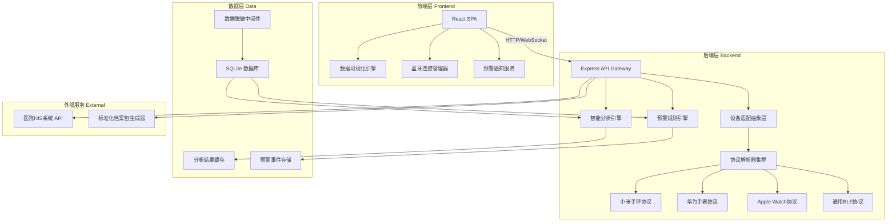
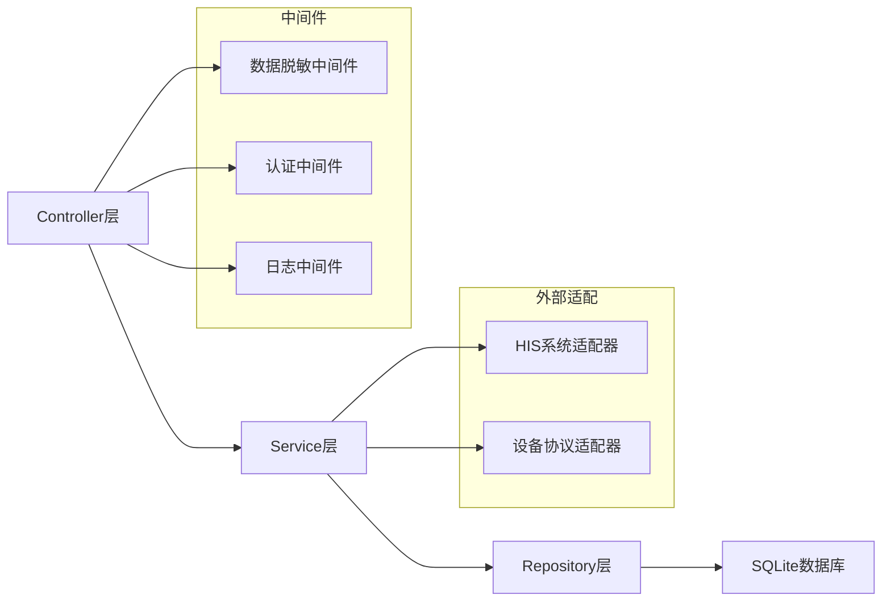

## 1. 架构设计



## 2. 技术说明

- **前端**：React@18 + TypeScript + TailwindCSS@3 + Vite
- **数据可视化**：Recharts（图表） + react-leaflet（地图轨迹） + 自定义SVG组件
- **蓝牙连接**：Web Bluetooth API（浏览器原生BLE支持）
- **初始化工具**：Vite
- **后端**：Express@4 + TypeScript
- **数据库**：SQLite（嵌入式，适合单机部署，通过better-sqlite3驱动）
- **数据脱敏**：自研脱敏中间件，符合等保2.0三级要求（字段级加密、K-匿名、差分隐私）
- **实时通信**：WebSocket（预警推送、实时数据流）
- **档案标准**：符合《移动健康终端设备数据交互规范》

## 3. 路由定义

| 路由 | 用途 |
|------|------|
| `/` | 数据总览仪表盘，展示实时指标、健康评分、预警摘要 |
| `/devices` | 设备管理中心，蓝牙扫描、绑定、管理 |
| `/fitness` | 运动健康模块，轨迹地图、运动数据、计划推荐 |
| `/sleep` | 睡眠分析模块，分期图、趋势图、噪音关联 |
| `/vitals` | 生理监测模块，HRV、压力、心率、血氧 |
| `/alerts` | 预警中心，实时预警、规则配置、历史记录 |
| `/records` | 健康档案模块，档案导出、HIS对接、授权管理 |

## 4. API 定义

### 4.1 设备管理 API

```typescript
interface Device {
  id: string;
  brand: string;
  model: string;
  name: string;
  firmwareVersion: string;
  batteryLevel: number;
  connectionStatus: "connected" | "disconnected" | "pairing";
  lastSyncTime: string;
}

// GET /api/devices - 获取已绑定设备列表
// POST /api/devices/scan - 发起蓝牙扫描
// POST /api/devices/bind - 绑定设备
// DELETE /api/devices/:id - 解绑设备
// GET /api/devices/:id/status - 获取设备实时状态

interface ScanResult {
  deviceId: string;
  name: string;
  brand: string;
  signalStrength: number;
  supportedProtocols: string[];
}
```

### 4.2 健康数据 API

```typescript
interface VitalSigns {
  heartRate: number;
  hrv: number;
  bloodOxygen: number;
  stressIndex: number;
  timestamp: string;
}

interface SleepRecord {
  date: string;
  totalTime: number;
  deepSleep: number;
  lightSleep: number;
  remSleep: number;
  awakeTime: number;
  noiseLevel: number[];
  qualityScore: number;
}

interface ExerciseRecord {
  id: string;
  type: string;
  startTime: string;
  duration: number;
  distance: number;
  calories: number;
  avgHeartRate: number;
  maxHeartRate: number;
  trajectory: { lat: number; lng: number; hr: number; ts: string }[];
}

// GET /api/vitals/realtime - 获取实时生理指标（WebSocket推送）
// GET /api/vitals/hrv?range=7d - 获取HRV趋势
// GET /api/sleep?range=30d - 获取睡眠记录
// GET /api/exercise?range=7d - 获取运动记录
// GET /api/exercise/:id/trajectory - 获取运动轨迹
```

### 4.3 运动计划 API

```typescript
interface ExercisePlan {
  id: string;
  weekStart: string;
  dailyPlans: {
    day: string;
    exercises: {
      name: string;
      duration: number;
      intensity: "low" | "medium" | "high";
      completed: boolean;
    }[];
    completed: boolean;
  }[];
  completionRate: number;
  recommendation: string;
}

// GET /api/plans/current - 获取当前运动计划
// POST /api/plans/generate - 基于历史数据生成新计划
// PUT /api/plans/:id/exercise/:dayIdx/complete - 标记运动完成
```

### 4.4 预警 API

```typescript
interface Alert {
  id: string;
  type: "heart_rate_spike" | "low_blood_oxygen" | "high_stress" | "abnormal_hrv" | "custom";
  severity: "critical" | "warning" | "info";
  title: string;
  description: string;
  value: number;
  threshold: number;
  startedAt: string;
  duration: number;
  status: "active" | "acknowledged" | "dismissed";
}

interface AlertRule {
  id: string;
  metric: string;
  condition: "gt" | "lt" | "gte" | "lte" | "spike_percent";
  threshold: number;
  duration: number;
  severity: "critical" | "warning" | "info";
  enabled: boolean;
}

// GET /api/alerts?status=active - 获取预警列表
// GET /api/alerts/rules - 获取预警规则
// POST /api/alerts/rules - 创建预警规则
// PUT /api/alerts/:id/acknowledge - 确认预警
// PUT /api/alerts/:id/dismiss - 忽略预警
```

### 4.5 健康档案 API

```typescript
interface HealthArchive {
  id: string;
  userId: string;
  dateRange: { start: string; end: string };
  dataTypes: string[];
  format: "json" | "pdf";
  standard: "移动健康终端设备数据交互规范";
  generatedAt: string;
  downloadUrl: string;
}

// POST /api/archives/generate - 生成标准化健康档案
// GET /api/archives/:id/download - 下载档案
// POST /api/his/appointments - HIS预约挂号
// GET /api/his/departments - 获取HIS科室列表
// GET /api/his/doctors?dept=xxx - 获取HIS医生列表
// GET /api/authorization - 获取数据授权列表
// POST /api/authorization - 创建数据授权
// DELETE /api/authorization/:id - 撤销授权
```

## 5. 服务端架构图



## 6. 数据模型

### 6.1 数据模型定义

```mermaid
erDiagram
    User ||--o{ Device : "绑定"
    User ||--o{ VitalRecord : "拥有"
    User ||--o{ SleepRecord : "拥有"
    User ||--o{ ExerciseRecord : "拥有"
    User ||--o{ ExercisePlan : "拥有"
    User ||--o{ Alert : "接收"
    User ||--o{ AlertRule : "配置"
    User ||--o{ HealthArchive : "生成"
    User ||--o{ DataAuthorization : "授权"

    Device {
        string id PK
        string user_id FK
        string brand
        string model
        string name
        string firmware_version
        number battery_level
        string connection_status
        string last_sync_time
    }

    User {
        string id PK
        string phone
        string email
        string name
        string hashed_password
        string role
        string created_at
    }

    VitalRecord {
        string id PK
        string user_id FK
        number heart_rate
        number hrv
        number blood_oxygen
        number stress_index
        number resting_heart_rate
        string timestamp
    }

    SleepRecord {
        string id PK
        string user_id FK
        string date
        number total_time
        number deep_sleep
        number light_sleep
        number rem_sleep
        number awake_time
        number noise_level_avg
        number quality_score
        string raw_data_encrypted
    }

    ExerciseRecord {
        string id PK
        string user_id FK
        string type
        string start_time
        number duration
        number distance
        number calories
        number avg_heart_rate
        number max_heart_rate
        string trajectory_encrypted
    }

    ExercisePlan {
        string id PK
        string user_id FK
        string week_start
        string daily_plans_json
        number completion_rate
        string recommendation
    }

    Alert {
        string id PK
        string user_id FK
        string type
        string severity
        string title
        string description
        number value
        number threshold
        string started_at
        number duration_minutes
        string status
    }

    AlertRule {
        string id PK
        string user_id FK
        string metric
        string condition
        number threshold
        number duration_minutes
        string severity
        boolean enabled
    }

    HealthArchive {
        string id PK
        string user_id FK
        string date_start
        string date_end
        string data_types_json
        string format
        string standard
        string generated_at
        string file_path
    }

    DataAuthorization {
        string id PK
        string user_id FK
        string target_org
        string scope_json
        string expires_at
        string created_at
        boolean revoked
    }
```



### 6.2 数据定义语言

```sql
CREATE TABLE users (
  id TEXT PRIMARY KEY,
  phone TEXT UNIQUE,
  email TEXT UNIQUE,
  name TEXT NOT NULL,
  hashed_password TEXT NOT NULL,
  role TEXT DEFAULT 'user' CHECK(role IN ('user','admin','sysadmin')),
  created_at TEXT DEFAULT (datetime('now'))
);

CREATE TABLE devices (
  id TEXT PRIMARY KEY,
  user_id TEXT NOT NULL REFERENCES users(id),
  brand TEXT NOT NULL,
  model TEXT NOT NULL,
  name TEXT NOT NULL,
  firmware_version TEXT,
  battery_level INTEGER DEFAULT 0,
  connection_status TEXT DEFAULT 'disconnected' CHECK(connection_status IN ('connected','disconnected','pairing')),
  last_sync_time TEXT,
  UNIQUE(user_id, brand, model)
);

CREATE TABLE vital_records (
  id TEXT PRIMARY KEY,
  user_id TEXT NOT NULL REFERENCES users(id),
  heart_rate INTEGER,
  hrv REAL,
  blood_oxygen REAL,
  stress_index REAL,
  resting_heart_rate INTEGER,
  timestamp TEXT NOT NULL,
  created_at TEXT DEFAULT (datetime('now'))
);

CREATE INDEX idx_vitals_user_time ON vital_records(user_id, timestamp);

CREATE TABLE sleep_records (
  id TEXT PRIMARY KEY,
  user_id TEXT NOT NULL REFERENCES users(id),
  date TEXT NOT NULL,
  total_time INTEGER,
  deep_sleep INTEGER,
  light_sleep INTEGER,
  rem_sleep INTEGER,
  awake_time INTEGER,
  noise_level_avg REAL,
  quality_score REAL,
  raw_data_encrypted TEXT,
  created_at TEXT DEFAULT (datetime('now')),
  UNIQUE(user_id, date)
);

CREATE TABLE exercise_records (
  id TEXT PRIMARY KEY,
  user_id TEXT NOT NULL REFERENCES users(id),
  type TEXT NOT NULL,
  start_time TEXT NOT NULL,
  duration INTEGER,
  distance REAL,
  calories INTEGER,
  avg_heart_rate INTEGER,
  max_heart_rate INTEGER,
  trajectory_encrypted TEXT,
  created_at TEXT DEFAULT (datetime('now'))
);

CREATE INDEX idx_exercise_user_time ON exercise_records(user_id, start_time);

CREATE TABLE exercise_plans (
  id TEXT PRIMARY KEY,
  user_id TEXT NOT NULL REFERENCES users(id),
  week_start TEXT NOT NULL,
  daily_plans_json TEXT NOT NULL,
  completion_rate REAL DEFAULT 0,
  recommendation TEXT,
  UNIQUE(user_id, week_start)
);

CREATE TABLE alerts (
  id TEXT PRIMARY KEY,
  user_id TEXT NOT NULL REFERENCES users(id),
  type TEXT NOT NULL,
  severity TEXT NOT NULL CHECK(severity IN ('critical','warning','info')),
  title TEXT NOT NULL,
  description TEXT,
  value REAL,
  threshold REAL,
  started_at TEXT NOT NULL,
  duration_minutes INTEGER DEFAULT 0,
  status TEXT DEFAULT 'active' CHECK(status IN ('active','acknowledged','dismissed')),
  created_at TEXT DEFAULT (datetime('now'))
);

CREATE INDEX idx_alerts_user_status ON alerts(user_id, status);

CREATE TABLE alert_rules (
  id TEXT PRIMARY KEY,
  user_id TEXT NOT NULL REFERENCES users(id),
  metric TEXT NOT NULL,
  condition TEXT NOT NULL CHECK(condition IN ('gt','lt','gte','lte','spike_percent')),
  threshold REAL NOT NULL,
  duration_minutes INTEGER DEFAULT 0,
  severity TEXT DEFAULT 'warning' CHECK(severity IN ('critical','warning','info')),
  enabled INTEGER DEFAULT 1
);

CREATE TABLE health_archives (
  id TEXT PRIMARY KEY,
  user_id TEXT NOT NULL REFERENCES users(id),
  date_start TEXT NOT NULL,
  date_end TEXT NOT NULL,
  data_types_json TEXT NOT NULL,
  format TEXT DEFAULT 'json' CHECK(format IN ('json','pdf')),
  standard TEXT DEFAULT '移动健康终端设备数据交互规范',
  generated_at TEXT DEFAULT (datetime('now')),
  file_path TEXT
);

CREATE TABLE data_authorizations (
  id TEXT PRIMARY KEY,
  user_id TEXT NOT NULL REFERENCES users(id),
  target_org TEXT NOT NULL,
  scope_json TEXT NOT NULL,
  expires_at TEXT NOT NULL,
  created_at TEXT DEFAULT (datetime('now')),
  revoked INTEGER DEFAULT 0
);
```
