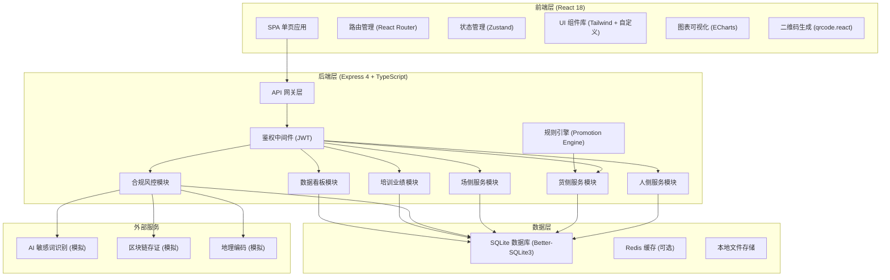
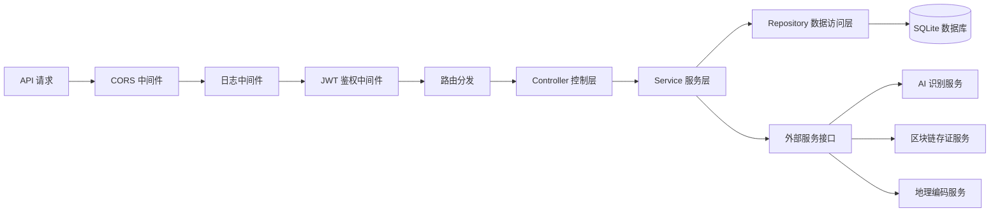
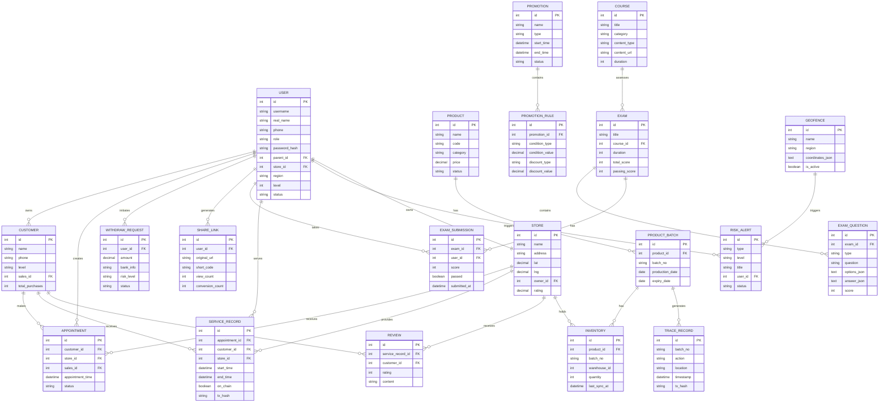

## 1. 架构设计



## 2. 技术选型

**前端技术栈**：
- 框架：React 18 + TypeScript
- 构建工具：Vite 5
- 路由：React Router DOM 6
- 状态管理：Zustand 4
- 样式：TailwindCSS 3 + PostCSS
- 图表：ECharts 5
- 图标：Lucide React
- 二维码：qrcode.react
- HTTP 客户端：Axios

**后端技术栈**：
- 运行时：Node.js 18+
- 框架：Express 4
- 类型系统：TypeScript 5
- 数据库：SQLite3 (better-sqlite3)
- ORM：Prisma 5
- 认证：JWT (jsonwebtoken)
- 密码加密：bcryptjs
- 数据校验：Zod
- CORS：cors 中间件

**开发工具**：
- 包管理器：npm
- 代码规范：ESLint + Prettier
- 类型检查：tsc --noEmit

## 3. 路由定义

### 前端路由

| 路由路径 | 页面组件 | 权限角色 |
|---------|---------|---------|
| `/login` | Login | 公开 |
| `/` | Dashboard | 所有登录用户 |
| `/profile` | Profile | 所有登录用户 |
| `/people/qrcode` | QrCode | 直销员、店主 |
| `/people/customers` | CustomerList | 直销员、店主 |
| `/people/customers/:id` | CustomerDetail | 直销员、店主 |
| `/people/share` | ShareCenter | 直销员、店主 |
| `/goods/products` | ProductList | 所有登录用户 |
| `/goods/products/:id` | ProductDetail | 所有登录用户 |
| `/goods/trace/:batch` | ProductTrace | 所有登录用户 |
| `/goods/inventory` | Inventory | 店主、运营 |
| `/goods/promotion` | PromotionList | 运营 |
| `/goods/promotion/create` | PromotionCreate | 运营 |
| `/field/stores` | StoreList | 所有登录用户 |
| `/field/appointments` | AppointmentList | 直销员、店主 |
| `/field/appointments/create` | AppointmentCreate | 直销员 |
| `/field/services` | ServiceRecord | 店主 |
| `/field/reviews` | ReviewList | 店主、运营 |
| `/compliance/monitor` | ComplianceMonitor | 运营 |
| `/compliance/speech` | SpeechReview | 运营 |
| `/compliance/withdraw` | WithdrawReview | 运营 |
| `/compliance/geofence` | GeoFence | 运营 |
| `/training/courses` | CourseList | 所有登录用户 |
| `/training/courses/:id` | CourseDetail | 所有登录用户 |
| `/training/exam` | ExamList | 直销员、店主 |
| `/training/exam/:id` | ExamTake | 直销员、店主 |
| `/training/ranking` | Ranking | 所有登录用户 |
| `/analytics/team` | TeamFission | 运营、管理层 |
| `/analytics/sales` | SalesAnalysis | 运营、管理层 |
| `/analytics/market` | MarketSaturation | 运营、管理层 |
| `/settings` | Settings | 所有登录用户 |

### 后端 API 路由

| 方法 | 路径 | 模块 | 描述 |
|-----|------|------|------|
| POST | `/api/auth/login` | auth | 用户登录 |
| POST | `/api/auth/refresh` | auth | 刷新 Token |
| GET | `/api/users/profile` | user | 获取个人信息 |
| PUT | `/api/users/profile` | user | 更新个人信息 |
| GET | `/api/qrcode/personal` | people | 生成个人专属二维码 |
| GET | `/api/customers` | people | 获取客户列表 |
| GET | `/api/customers/:id` | people | 获取客户详情 |
| GET | `/api/customers/graph` | people | 获取客户关系图谱数据 |
| GET | `/api/share/materials` | people | 获取分享素材库 |
| POST | `/api/share/generate` | people | 生成分享链接 |
| GET | `/api/share/statistics` | people | 获取分享传播统计 |
| GET | `/api/products` | goods | 获取产品列表 |
| GET | `/api/products/:id` | goods | 获取产品详情 |
| GET | `/api/products/trace/:batchNo` | goods | 产品批次溯源 |
| GET | `/api/inventory` | goods | 获取库存数据 |
| POST | `/api/inventory/sync` | goods | 库存同步 |
| GET | `/api/promotions` | goods | 获取促销活动列表 |
| POST | `/api/promotions` | goods | 创建促销活动 |
| GET | `/api/stores` | field | 获取生活馆列表 |
| GET | `/api/appointments` | field | 获取预约列表 |
| POST | `/api/appointments` | field | 创建预约 |
| PUT | `/api/appointments/:id` | field | 更新预约状态 |
| GET | `/api/services` | field | 获取服务记录 |
| POST | `/api/services` | field | 录入服务记录（上链） |
| GET | `/api/reviews` | field | 获取客户评价 |
| GET | `/api/compliance/alerts` | compliance | 获取风控告警 |
| GET | `/api/compliance/speech/logs` | compliance | 获取话术识别记录 |
| POST | `/api/compliance/speech/audit` | compliance | 话术审核 |
| GET | `/api/compliance/withdraw/pending` | compliance | 获取待审核提现 |
| POST | `/api/compliance/withdraw/audit` | compliance | 提现审核 |
| GET | `/api/compliance/geofence` | compliance | 获取地理围栏配置 |
| POST | `/api/compliance/geofence/check` | compliance | 地理围栏检查 |
| GET | `/api/training/courses` | training | 获取课件列表 |
| GET | `/api/training/courses/:id` | training | 获取课件详情 |
| GET | `/api/training/exams` | training | 获取考试列表 |
| POST | `/api/training/exams/:id/submit` | training | 提交考试答案 |
| GET | `/api/training/ranking` | training | 获取业绩排行榜 |
| GET | `/api/analytics/team/fission` | analytics | 获取团队裂变数据 |
| GET | `/api/analytics/sales/trend` | analytics | 获取销售趋势数据 |
| GET | `/api/analytics/market/saturation` | analytics | 获取市场饱和度数据 |
| GET | `/api/dashboard/overview` | dashboard | 获取首页概览数据 |

## 4. API 类型定义

```typescript
// 通用响应结构
interface ApiResponse<T> {
  code: number;
  message: string;
  data: T;
  timestamp: number;
}

// 分页响应
interface PaginatedResponse<T> {
  list: T[];
  total: number;
  page: number;
  pageSize: number;
}

// 用户类型
type UserRole = 'sales' | 'store_owner' | 'operator' | 'admin';

interface User {
  id: number;
  username: string;
  realName: string;
  phone: string;
  email?: string;
  role: UserRole;
  avatar?: string;
  parentId?: number;
  storeId?: number;
  region?: string;
  level?: number;
  status: 'active' | 'inactive' | 'frozen';
  createdAt: string;
}

// 客户类型
interface Customer {
  id: number;
  name: string;
  phone: string;
  level: 'potential' | 'regular' | 'vip';
  source: string;
  salesId: number;
  tags: string[];
  totalPurchases: number;
  lastPurchaseAt?: string;
  createdAt: string;
}

interface CustomerRelationNode {
  id: number;
  name: string;
  type: 'sales' | 'customer' | 'referrer';
  level: number;
  value: number;
}

interface CustomerRelationLink {
  source: number;
  target: number;
  relation: 'introduce' | 'purchase' | 'refer';
}

interface CustomerGraph {
  nodes: CustomerRelationNode[];
  links: CustomerRelationLink[];
}

// 产品类型
interface Product {
  id: number;
  name: string;
  code: string;
  category: string;
  price: number;
  originalPrice: number;
  description: string;
  imageUrl?: string;
  specs: Record<string, string>;
  status: 'active' | 'inactive';
}

interface ProductBatch {
  id: number;
  productId: number;
  batchNo: string;
  productionDate: string;
  expiryDate: string;
  quantity: number;
  traceRecords: TraceRecord[];
}

interface TraceRecord {
  id: number;
  batchNo: string;
  action: string;
  operator: string;
  location: string;
  timestamp: string;
  txHash?: string;
}

// 库存类型
interface Inventory {
  id: number;
  productId: number;
  batchNo: string;
  warehouseId: number;
  warehouseName: string;
  quantity: number;
  availableQuantity: number;
  lastSyncAt: string;
}

// 促销类型
interface Promotion {
  id: number;
  name: string;
  type: 'discount' | 'coupon' | 'bundle' | 'points';
  rules: PromotionRule[];
  startTime: string;
  endTime: string;
  status: 'draft' | 'active' | 'ended';
}

interface PromotionRule {
  conditionType: 'amount' | 'quantity' | 'product';
  conditionValue: number;
  discountType: 'percent' | 'fixed' | 'points';
  discountValue: number;
}

// 生活馆类型
interface Store {
  id: number;
  name: string;
  address: string;
  lat: number;
  lng: number;
  ownerId: number;
  phone: string;
  businessHours: string;
  services: string[];
  rating: number;
  status: 'active' | 'inactive';
}

interface Appointment {
  id: number;
  customerId: number;
  customerName: string;
  storeId: number;
  storeName: string;
  salesId: number;
  serviceType: string;
  appointmentTime: string;
  status: 'pending' | 'confirmed' | 'completed' | 'cancelled';
  remark?: string;
}

interface ServiceRecord {
  id: number;
  appointmentId: number;
  customerId: number;
  storeId: number;
  serviceItems: string[];
  startTime: string;
  endTime: string;
  operator: string;
  notes?: string;
  onChain: boolean;
  txHash?: string;
  createdAt: string;
}

interface Review {
  id: number;
  serviceRecordId: number;
  customerId: number;
  customerName: string;
  storeId: number;
  rating: number;
  content: string;
  reply?: string;
  createdAt: string;
}

// 合规风控类型
interface RiskAlert {
  id: number;
  type: 'speech' | 'withdraw' | 'geofence' | 'abnormal';
  level: 'low' | 'medium' | 'high';
  title: string;
  description: string;
  userId: number;
  userName: string;
  status: 'pending' | 'processing' | 'resolved' | 'ignored';
  createdAt: string;
}

interface SpeechLog {
  id: number;
  conversationId: string;
  senderId: number;
  receiverId: number;
  content: string;
  sensitiveWords: string[];
  riskScore: number;
  createdAt: string;
}

interface WithdrawRequest {
  id: number;
  userId: number;
  userName: string;
  amount: number;
  bankInfo: string;
  riskLevel: 'normal' | 'warning' | 'high_risk';
  riskReasons: string[];
  status: 'pending' | 'approved' | 'rejected';
  createdAt: string;
}

interface GeoFence {
  id: number;
  name: string;
  region: string;
  coordinates: Array<{ lat: number; lng: number }>;
  allowedRoles: UserRole[];
  isActive: boolean;
}

// 培训类型
interface Course {
  id: number;
  title: string;
  category: string;
  description: string;
  contentType: 'video' | 'document' | 'audio';
  contentUrl: string;
  duration: number;
  publishedBy: string;
  publishTime: string;
  viewCount: number;
}

interface Exam {
  id: number;
  title: string;
  courseId?: number;
  duration: number;
  totalScore: number;
  passingScore: number;
  questionCount: number;
  questions: ExamQuestion[];
}

interface ExamQuestion {
  id: number;
  type: 'single' | 'multiple' | 'judge';
  question: string;
  options: string[];
  answer: number | number[] | boolean;
  score: number;
}

interface RankingItem {
  rank: number;
  userId: number;
  userName: string;
  avatar?: string;
  region: string;
  salesAmount: number;
  teamSize: number;
  growthRate: number;
}

// 数据分析类型
interface TeamFissionNode {
  id: number;
  name: string;
  role: string;
  level: number;
  salesAmount: number;
  teamSize: number;
  children: TeamFissionNode[];
}

interface SalesTrendData {
  date: string;
  salesAmount: number;
  orderCount: number;
  customerCount: number;
}

interface MarketSaturationData {
  region: string;
  population: number;
  dealerCount: number;
  saturationRate: number;
  potentialScore: number;
}

interface DashboardOverview {
  todaySales: number;
  monthSales: number;
  totalCustomers: number;
  activeSales: number;
  pendingApprovals: number;
  riskAlerts: number;
  salesTrend: SalesTrendData[];
  topProducts: Array<{ name: string; amount: number }>;
}
```

## 5. 服务端架构



## 6. 数据模型

### 6.1 ER 图



### 6.2 DDL 语句

```sql
-- 用户表
CREATE TABLE users (
    id INTEGER PRIMARY KEY AUTOINCREMENT,
    username VARCHAR(50) UNIQUE NOT NULL,
    real_name VARCHAR(50) NOT NULL,
    phone VARCHAR(20) UNIQUE NOT NULL,
    email VARCHAR(100),
    role VARCHAR(20) NOT NULL,
    password_hash VARCHAR(255) NOT NULL,
    avatar VARCHAR(255),
    parent_id INTEGER,
    store_id INTEGER,
    region VARCHAR(100),
    level INTEGER DEFAULT 1,
    status VARCHAR(20) DEFAULT 'active',
    created_at DATETIME DEFAULT CURRENT_TIMESTAMP,
    updated_at DATETIME DEFAULT CURRENT_TIMESTAMP,
    FOREIGN KEY (parent_id) REFERENCES users(id),
    FOREIGN KEY (store_id) REFERENCES stores(id)
);

-- 客户表
CREATE TABLE customers (
    id INTEGER PRIMARY KEY AUTOINCREMENT,
    name VARCHAR(50) NOT NULL,
    phone VARCHAR(20) NOT NULL,
    level VARCHAR(20) DEFAULT 'potential',
    source VARCHAR(50),
    sales_id INTEGER NOT NULL,
    tags TEXT,
    total_purchases DECIMAL(12,2) DEFAULT 0,
    last_purchase_at DATETIME,
    created_at DATETIME DEFAULT CURRENT_TIMESTAMP,
    FOREIGN KEY (sales_id) REFERENCES users(id)
);

-- 产品表
CREATE TABLE products (
    id INTEGER PRIMARY KEY AUTOINCREMENT,
    name VARCHAR(100) NOT NULL,
    code VARCHAR(50) UNIQUE NOT NULL,
    category VARCHAR(50),
    price DECIMAL(12,2) NOT NULL,
    original_price DECIMAL(12,2),
    description TEXT,
    image_url VARCHAR(255),
    specs TEXT,
    status VARCHAR(20) DEFAULT 'active',
    created_at DATETIME DEFAULT CURRENT_TIMESTAMP
);

-- 产品批次表
CREATE TABLE product_batches (
    id INTEGER PRIMARY KEY AUTOINCREMENT,
    product_id INTEGER NOT NULL,
    batch_no VARCHAR(50) UNIQUE NOT NULL,
    production_date DATE NOT NULL,
    expiry_date DATE NOT NULL,
    quantity INTEGER NOT NULL,
    created_at DATETIME DEFAULT CURRENT_TIMESTAMP,
    FOREIGN KEY (product_id) REFERENCES products(id)
);

-- 溯源记录表
CREATE TABLE trace_records (
    id INTEGER PRIMARY KEY AUTOINCREMENT,
    batch_no VARCHAR(50) NOT NULL,
    action VARCHAR(50) NOT NULL,
    operator VARCHAR(50) NOT NULL,
    location VARCHAR(200),
    timestamp DATETIME DEFAULT CURRENT_TIMESTAMP,
    tx_hash VARCHAR(100),
    FOREIGN KEY (batch_no) REFERENCES product_batches(batch_no)
);

-- 库存表
CREATE TABLE inventory (
    id INTEGER PRIMARY KEY AUTOINCREMENT,
    product_id INTEGER NOT NULL,
    batch_no VARCHAR(50) NOT NULL,
    warehouse_id INTEGER NOT NULL,
    warehouse_name VARCHAR(100),
    quantity INTEGER NOT NULL,
    available_quantity INTEGER NOT NULL,
    last_sync_at DATETIME DEFAULT CURRENT_TIMESTAMP,
    FOREIGN KEY (product_id) REFERENCES products(id),
    FOREIGN KEY (batch_no) REFERENCES product_batches(batch_no)
);

-- 生活馆表
CREATE TABLE stores (
    id INTEGER PRIMARY KEY AUTOINCREMENT,
    name VARCHAR(100) NOT NULL,
    address VARCHAR(255) NOT NULL,
    lat DECIMAL(10,6),
    lng DECIMAL(10,6),
    owner_id INTEGER,
    phone VARCHAR(20),
    business_hours VARCHAR(100),
    services TEXT,
    rating DECIMAL(3,2) DEFAULT 5.0,
    status VARCHAR(20) DEFAULT 'active',
    created_at DATETIME DEFAULT CURRENT_TIMESTAMP,
    FOREIGN KEY (owner_id) REFERENCES users(id)
);

-- 预约表
CREATE TABLE appointments (
    id INTEGER PRIMARY KEY AUTOINCREMENT,
    customer_id INTEGER NOT NULL,
    customer_name VARCHAR(50),
    store_id INTEGER NOT NULL,
    store_name VARCHAR(100),
    sales_id INTEGER NOT NULL,
    service_type VARCHAR(50),
    appointment_time DATETIME NOT NULL,
    status VARCHAR(20) DEFAULT 'pending',
    remark TEXT,
    created_at DATETIME DEFAULT CURRENT_TIMESTAMP,
    FOREIGN KEY (customer_id) REFERENCES customers(id),
    FOREIGN KEY (store_id) REFERENCES stores(id),
    FOREIGN KEY (sales_id) REFERENCES users(id)
);

-- 服务记录表
CREATE TABLE service_records (
    id INTEGER PRIMARY KEY AUTOINCREMENT,
    appointment_id INTEGER,
    customer_id INTEGER NOT NULL,
    store_id INTEGER NOT NULL,
    service_items TEXT,
    start_time DATETIME NOT NULL,
    end_time DATETIME NOT NULL,
    operator VARCHAR(50),
    notes TEXT,
    on_chain BOOLEAN DEFAULT 0,
    tx_hash VARCHAR(100),
    created_at DATETIME DEFAULT CURRENT_TIMESTAMP,
    FOREIGN KEY (appointment_id) REFERENCES appointments(id),
    FOREIGN KEY (customer_id) REFERENCES customers(id),
    FOREIGN KEY (store_id) REFERENCES stores(id)
);

-- 评价表
CREATE TABLE reviews (
    id INTEGER PRIMARY KEY AUTOINCREMENT,
    service_record_id INTEGER NOT NULL,
    customer_id INTEGER NOT NULL,
    customer_name VARCHAR(50),
    store_id INTEGER NOT NULL,
    rating INTEGER NOT NULL,
    content TEXT NOT NULL,
    reply TEXT,
    created_at DATETIME DEFAULT CURRENT_TIMESTAMP,
    FOREIGN KEY (service_record_id) REFERENCES service_records(id),
    FOREIGN KEY (customer_id) REFERENCES customers(id),
    FOREIGN KEY (store_id) REFERENCES stores(id)
);

-- 促销活动表
CREATE TABLE promotions (
    id INTEGER PRIMARY KEY AUTOINCREMENT,
    name VARCHAR(100) NOT NULL,
    type VARCHAR(20) NOT NULL,
    start_time DATETIME NOT NULL,
    end_time DATETIME NOT NULL,
    status VARCHAR(20) DEFAULT 'draft',
    created_by INTEGER,
    created_at DATETIME DEFAULT CURRENT_TIMESTAMP
);

-- 促销规则表
CREATE TABLE promotion_rules (
    id INTEGER PRIMARY KEY AUTOINCREMENT,
    promotion_id INTEGER NOT NULL,
    condition_type VARCHAR(20) NOT NULL,
    condition_value DECIMAL(12,2) NOT NULL,
    discount_type VARCHAR(20) NOT NULL,
    discount_value DECIMAL(12,2) NOT NULL,
    FOREIGN KEY (promotion_id) REFERENCES promotions(id)
);

-- 课件表
CREATE TABLE courses (
    id INTEGER PRIMARY KEY AUTOINCREMENT,
    title VARCHAR(200) NOT NULL,
    category VARCHAR(50),
    description TEXT,
    content_type VARCHAR(20) NOT NULL,
    content_url VARCHAR(255) NOT NULL,
    duration INTEGER,
    published_by VARCHAR(50),
    publish_time DATETIME DEFAULT CURRENT_TIMESTAMP,
    view_count INTEGER DEFAULT 0
);

-- 考试表
CREATE TABLE exams (
    id INTEGER PRIMARY KEY AUTOINCREMENT,
    title VARCHAR(200) NOT NULL,
    course_id INTEGER,
    duration INTEGER NOT NULL,
    total_score INTEGER NOT NULL,
    passing_score INTEGER NOT NULL,
    question_count INTEGER NOT NULL,
    created_at DATETIME DEFAULT CURRENT_TIMESTAMP,
    FOREIGN KEY (course_id) REFERENCES courses(id)
);

-- 考试题目表
CREATE TABLE exam_questions (
    id INTEGER PRIMARY KEY AUTOINCREMENT,
    exam_id INTEGER NOT NULL,
    type VARCHAR(20) NOT NULL,
    question TEXT NOT NULL,
    options_json TEXT,
    answer_json TEXT NOT NULL,
    score INTEGER NOT NULL,
    FOREIGN KEY (exam_id) REFERENCES exams(id)
);

-- 考试提交表
CREATE TABLE exam_submissions (
    id INTEGER PRIMARY KEY AUTOINCREMENT,
    exam_id INTEGER NOT NULL,
    user_id INTEGER NOT NULL,
    answers_json TEXT,
    score INTEGER,
    passed BOOLEAN,
    submitted_at DATETIME DEFAULT CURRENT_TIMESTAMP,
    FOREIGN KEY (exam_id) REFERENCES exams(id),
    FOREIGN KEY (user_id) REFERENCES users(id)
);

-- 风控告警表
CREATE TABLE risk_alerts (
    id INTEGER PRIMARY KEY AUTOINCREMENT,
    type VARCHAR(20) NOT NULL,
    level VARCHAR(20) NOT NULL,
    title VARCHAR(200) NOT NULL,
    description TEXT,
    user_id INTEGER,
    user_name VARCHAR(50),
    status VARCHAR(20) DEFAULT 'pending',
    handled_by INTEGER,
    handled_at DATETIME,
    handling_notes TEXT,
    created_at DATETIME DEFAULT CURRENT_TIMESTAMP,
    FOREIGN KEY (user_id) REFERENCES users(id)
);

-- 提现申请表
CREATE TABLE withdraw_requests (
    id INTEGER PRIMARY KEY AUTOINCREMENT,
    user_id INTEGER NOT NULL,
    user_name VARCHAR(50),
    amount DECIMAL(12,2) NOT NULL,
    bank_info TEXT NOT NULL,
    risk_level VARCHAR(20) DEFAULT 'normal',
    risk_reasons TEXT,
    status VARCHAR(20) DEFAULT 'pending',
    audited_by INTEGER,
    audited_at DATETIME,
    audit_notes TEXT,
    created_at DATETIME DEFAULT CURRENT_TIMESTAMP,
    FOREIGN KEY (user_id) REFERENCES users(id)
);

-- 地理围栏表
CREATE TABLE geofences (
    id INTEGER PRIMARY KEY AUTOINCREMENT,
    name VARCHAR(100) NOT NULL,
    region VARCHAR(100),
    coordinates_json TEXT NOT NULL,
    allowed_roles_json TEXT,
    is_active BOOLEAN DEFAULT 1
);

-- 分享链接表
CREATE TABLE share_links (
    id INTEGER PRIMARY KEY AUTOINCREMENT,
    user_id INTEGER NOT NULL,
    original_url VARCHAR(255) NOT NULL,
    short_code VARCHAR(20) UNIQUE NOT NULL,
    material_type VARCHAR(50),
    view_count INTEGER DEFAULT 0,
    conversion_count INTEGER DEFAULT 0,
    created_at DATETIME DEFAULT CURRENT_TIMESTAMP,
    FOREIGN KEY (user_id) REFERENCES users(id)
);

-- 话术记录表
CREATE TABLE speech_logs (
    id INTEGER PRIMARY KEY AUTOINCREMENT,
    conversation_id VARCHAR(50),
    sender_id INTEGER NOT NULL,
    receiver_id INTEGER,
    content TEXT NOT NULL,
    sensitive_words TEXT,
    risk_score INTEGER DEFAULT 0,
    audit_status VARCHAR(20) DEFAULT 'pending',
    audit_notes TEXT,
    created_at DATETIME DEFAULT CURRENT_TIMESTAMP
);

-- 创建索引
CREATE INDEX idx_users_role ON users(role);
CREATE INDEX idx_users_parent_id ON users(parent_id);
CREATE INDEX idx_customers_sales_id ON customers(sales_id);
CREATE INDEX idx_product_batches_batch_no ON product_batches(batch_no);
CREATE INDEX idx_trace_records_batch_no ON trace_records(batch_no);
CREATE INDEX idx_inventory_warehouse ON inventory(warehouse_id, product_id);
CREATE INDEX idx_appointments_store_time ON appointments(store_id, appointment_time);
CREATE INDEX idx_service_records_store ON service_records(store_id);
CREATE INDEX idx_risk_alerts_status ON risk_alerts(status);
CREATE INDEX idx_risk_alerts_level ON risk_alerts(level);
CREATE INDEX idx_share_links_user ON share_links(user_id);
```
