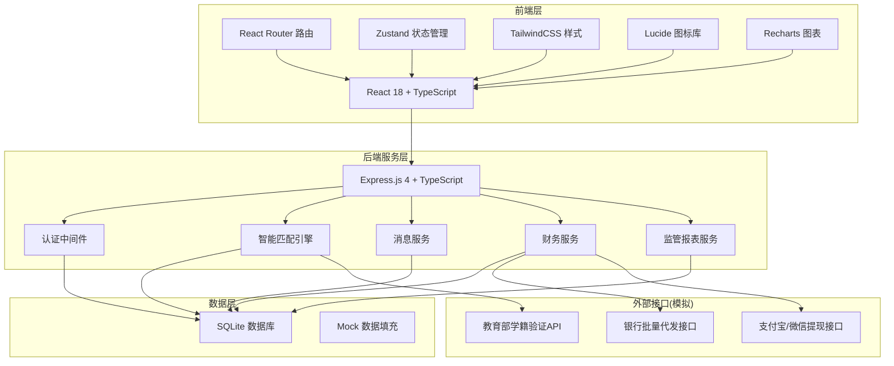
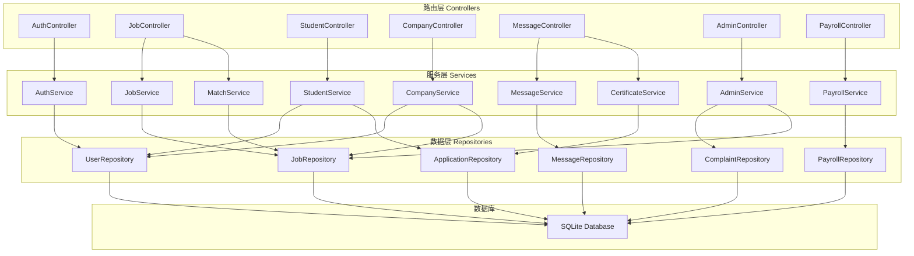
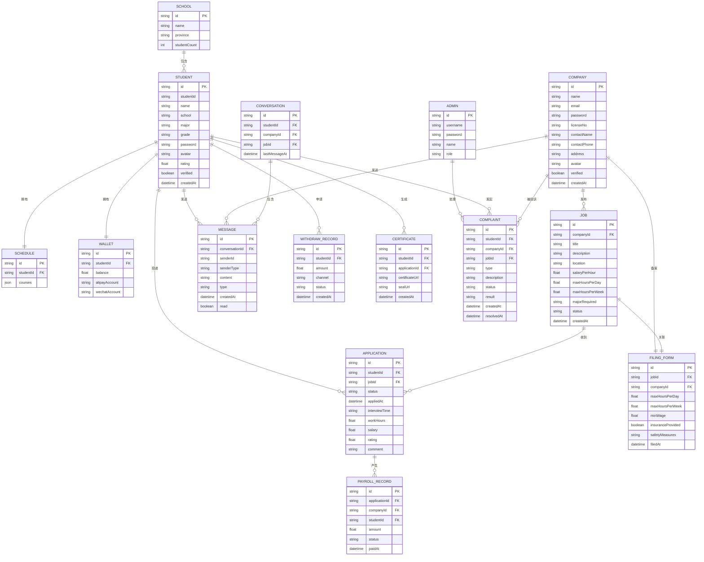

## 1. 架构设计



## 2. 技术描述

- **前端**: React@18 + TypeScript + Vite@6
- **路由**: react-router-dom@6
- **状态管理**: zustand@4
- **样式**: tailwindcss@3
- **图表**: recharts@2
- **图标**: lucide-react
- **后端**: Express.js@4 + TypeScript
- **数据库**: SQLite（开发期，带 mock 数据）
- **初始化工具**: vite-init
- **代码规范**: ESLint + TypeScript 严格模式

### 技术选型说明

1. **React + TypeScript**：组件化开发，类型安全，便于维护扩展
2. **Express + TypeScript**：轻量后端，前后端共享类型定义
3. **SQLite**：零配置文件数据库，适合快速原型和演示
4. **Zustand**：轻量级状态管理，API 简洁，避免 Redux 过度工程化
5. **Recharts**：基于 React 的图表库，与技术栈统一，监管看板数据可视化

## 3. 路由定义

| 路由路径 | 页面/组件 | 权限要求 | 说明 |
|----------|-----------|----------|------|
| `/login` | 登录页 | 公开 | 三角色登录/注册入口 |
| `/` | 岗位大厅 | 学生/企业 | 首页，岗位列表与搜索 |
| `/jobs/:id` | 岗位详情 | 学生/企业 | 单个岗位详情展示 |
| `/match` | 智能匹配 | 学生 | 个性化匹配结果页 |
| `/student/profile` | 学生个人中心 | 学生 | 学籍认证、简历信息 |
| `/student/schedule` | 课程表管理 | 学生 | 周课表录入与编辑 |
| `/student/applications` | 我的投递 | 学生 | 投递记录与状态 |
| `/student/wallet` | 钱包与提现 | 学生 | 余额、提现、流水 |
| `/student/certificate` | 实习证明 | 学生 | 证明生成与下载 |
| `/company/profile` | 企业认证 | 企业 | 企业资质信息 |
| `/company/jobs` | 岗位管理 | 企业 | 已发布岗位列表 |
| `/company/jobs/new` | 发布岗位 | 企业 | 含用工备案表 |
| `/company/candidates` | 候选人管理 | 企业 | 投递者列表 |
| `/company/payroll` | 工资代发 | 企业 | 批量代发工资 |
| `/messages` | 消息中心 | 学生/企业 | 聊天列表 |
| `/messages/:id` | 聊天详情 | 学生/企业 | 单聊对话 |
| `/admin/dashboard` | 监管看板 | 管理员 | 数据总览大屏 |
| `/admin/schools` | 院校监控 | 管理员 | 各院校数据 |
| `/admin/complaints` | 投诉处理 | 管理员 | 投诉列表与处理 |

## 4. API 定义

### 4.1 认证接口

```typescript
// 学生登录
POST /api/auth/student/login
Request: { studentId: string; password: string; }
Response: { token: string; user: Student; }

// 企业登录
POST /api/auth/company/login
Request: { email: string; password: string; }
Response: { token: string; user: Company; }

// 管理员登录
POST /api/auth/admin/login
Request: { username: string; password: string; }
Response: { token: string; user: Admin; }

// 学籍验证
POST /api/auth/student/verify
Request: { studentId: string; name: string; school: string; }
Response: { verified: boolean; major?: string; grade?: string; }
```

### 4.2 岗位接口

```typescript
// 获取岗位列表
GET /api/jobs?page=&size=&keyword=&salaryMin=&major=&location=
Response: { list: Job[]; total: number; }

// 获取岗位详情
GET /api/jobs/:id
Response: Job & { company: Company; filingForm: FilingForm; }

// 发布岗位
POST /api/jobs
Request: JobCreate & { filingForm: FilingFormCreate; }
Response: Job

// 智能匹配
GET /api/jobs/match?studentId=
Response: { matches: MatchResult[]; }

interface MatchResult {
  job: Job;
  score: number;
  breakdown: {
    majorMatch: number;
    scheduleMatch: number;
    ratingScore: number;
  };
}
```

### 4.3 学生接口

```typescript
// 获取学生信息
GET /api/students/:id
Response: Student

// 更新简历
PUT /api/students/:id/profile
Request: StudentProfileUpdate
Response: Student

// 课程表
GET /api/students/:id/schedule
Response: Schedule
PUT /api/students/:id/schedule
Request: ScheduleUpdate
Response: Schedule

// 投递记录
GET /api/students/:id/applications
Response: Application[]

// 钱包
GET /api/students/:id/wallet
Response: Wallet

// 提现
POST /api/students/:id/withdraw
Request: { amount: number; channel: 'alipay' | 'wechat'; }
Response: WithdrawRecord
```

### 4.4 企业接口

```typescript
// 企业认证
POST /api/companies/verify
Request: CompanyVerify
Response: Company

// 岗位管理
GET /api/companies/:id/jobs
Response: Job[]

// 候选人
GET /api/companies/:id/candidates?jobId=
Response: Application[]

// 处理申请
PUT /api/applications/:id/status
Request: { status: 'accepted' | 'rejected' | 'interview'; }
Response: Application

// 工资代发
POST /api/payroll/batch
Request: { jobId: string; payrolls: PayrollItem[]; }
Response: { batchId: string; totalAmount: number; count: number; }
```

### 4.5 消息接口

```typescript
// 会话列表
GET /api/messages/conversations
Response: Conversation[]

// 消息记录
GET /api/messages/conversations/:id
Response: Message[]

// 发送消息
POST /api/messages
Request: { conversationId: string; content: string; type: 'text' | 'file'; }
Response: Message

// 生成实习证明
POST /api/certificate/generate
Request: { applicationId: string; }
Response: { certificateUrl: string; }
```

### 4.6 监管接口

```typescript
// 总览数据
GET /api/admin/overview
Response: AdminOverview

interface AdminOverview {
  totalStudents: number;
  totalCompanies: number;
  totalJobs: number;
  totalComplaints: number;
  complaintRate: number;
  salaryComplianceRate: number;
  dailyTrend: TrendItem[];
}

// 院校数据
GET /api/admin/schools
Response: SchoolStats[]

// 投诉列表
GET /api/admin/complaints
Response: Complaint[]
```

## 5. 服务端架构图



## 6. 数据模型

### 6.1 ER 图



### 6.2 核心实体类型定义

```typescript
// 学生
interface Student {
  id: string;
  studentId: string;
  name: string;
  school: string;
  major: string;
  grade: string;
  avatar?: string;
  rating: number;
  verified: boolean;
  resume?: {
    skills: string[];
    experience: string;
    introduction: string;
  };
  createdAt: Date;
}

// 企业
interface Company {
  id: string;
  name: string;
  email: string;
  licenseNo: string;
  contactName: string;
  contactPhone: string;
  address: string;
  avatar?: string;
  verified: boolean;
  createdAt: Date;
}

// 岗位
interface Job {
  id: string;
  companyId: string;
  title: string;
  description: string;
  location: string;
  salaryPerHour: number;
  maxHoursPerDay: number;
  maxHoursPerWeek: number;
  majorRequired: string[];
  workDays: string[];
  workStartTime: string;
  workEndTime: string;
  status: 'draft' | 'published' | 'closed';
  filingForm?: FilingForm;
  company?: Company;
  createdAt: Date;
}

// 用工备案表
interface FilingForm {
  id: string;
  jobId: string;
  companyId: string;
  maxHoursPerDay: number;
  maxHoursPerWeek: number;
  minWage: number;
  insuranceProvided: boolean;
  insuranceType?: string;
  safetyMeasures: string;
  emergencyContact: string;
  emergencyPhone: string;
  filedAt: Date;
}

// 投递申请
interface Application {
  id: string;
  studentId: string;
  jobId: string;
  status: 'pending' | 'interview' | 'accepted' | 'rejected' | 'working' | 'completed';
  appliedAt: Date;
  interviewTime?: Date;
  workHours?: number;
  salary?: number;
  rating?: number;
  comment?: string;
  student?: Student;
  job?: Job;
}

// 智能匹配结果
interface MatchResult {
  job: Job;
  score: number;
  breakdown: {
    majorMatch: number;
    scheduleMatch: number;
    ratingScore: number;
  };
  reasons: string[];
}
```
