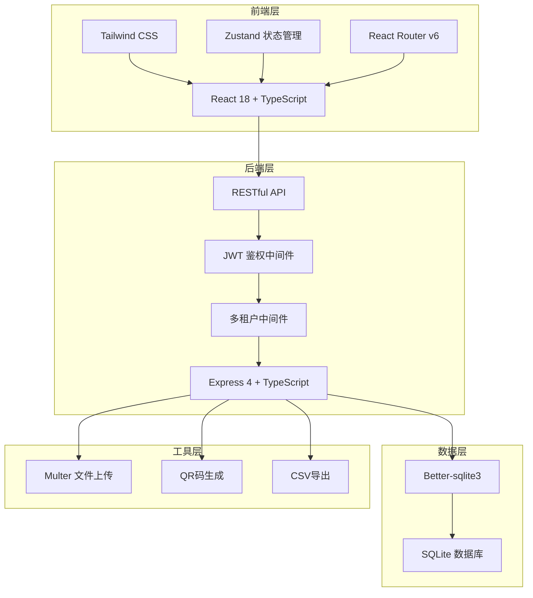
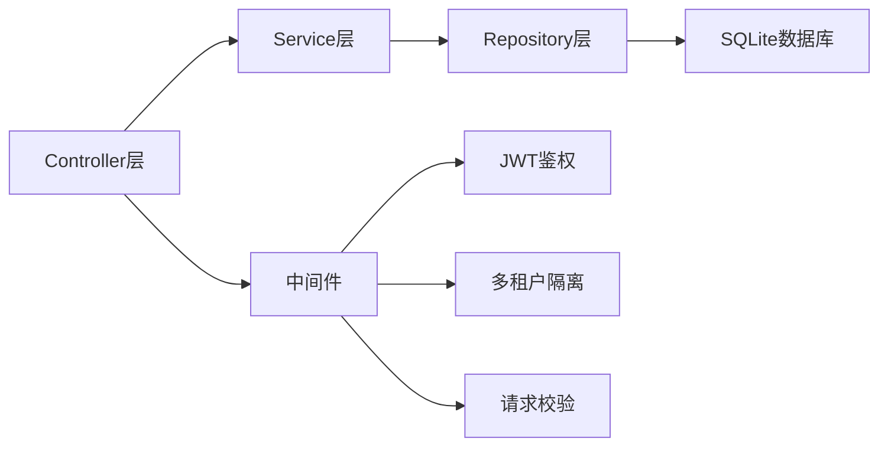
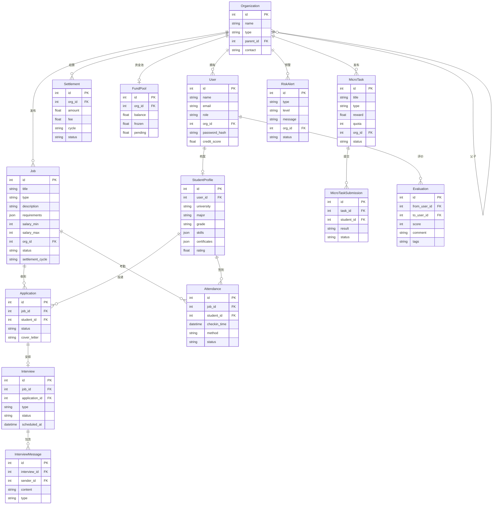

## 1. 架构设计



## 2. 技术说明

- **前端**：React@18 + TailwindCSS@3 + Vite
- **初始化工具**：vite-init
- **后端**：Express@4 + TypeScript（ESM格式）
- **数据库**：SQLite（better-sqlite3），开发阶段使用Mock数据辅助
- **状态管理**：Zustand
- **路由**：React Router v6
- **图标**：lucide-react
- **字体**：DM Sans + Noto Sans SC + JetBrains Mono

## 3. 路由定义

| 路由 | 用途 |
|------|------|
| `/` | 工作台首页（数据概览仪表盘） |
| `/jobs` | 岗位管理（岗位列表） |
| `/jobs/create` | 岗位发布 |
| `/jobs/:id/match` | 岗位匹配推荐 |
| `/talents` | 人才库（简历列表） |
| `/talents/:id` | 简历详情（智能解析与关键词高亮） |
| `/interviews` | 面试协作（会话列表） |
| `/interviews/:id` | 群聊面试室 |
| `/attendance` | 考勤管理 |
| `/attendance/checkin` | 扫码签到页面 |
| `/settlement` | 结算中心（资金池） |
| `/settlement/bills` | 结算账单 |
| `/micro-tasks` | 喵任务（众包管理） |
| `/credit` | 信用体系（互评与信用档案） |
| `/risk` | 风控预警中心 |
| `/admin` | 系统管理 |
| `/admin/tenants` | 租户管理 |
| `/admin/permissions` | 权限配置 |
| `/admin/compliance` | 合规留存 |

## 4. API定义

### 4.1 认证相关
```typescript
POST   /api/auth/login          // 登录
POST   /api/auth/register       // 注册
GET    /api/auth/profile         // 获取当前用户信息
```

### 4.2 岗位管理
```typescript
GET    /api/jobs                 // 岗位列表（支持分页、筛选）
POST   /api/jobs                 // 创建岗位
GET    /api/jobs/:id             // 岗位详情
PUT    /api/jobs/:id             // 更新岗位
DELETE /api/jobs/:id             // 删除岗位
GET    /api/jobs/:id/matches     // 获取岗位匹配学生列表
```

### 4.3 人才库
```typescript
GET    /api/talents              // 学生列表（支持筛选）
GET    /api/talents/:id          // 学生详情（含简历解析）
PUT    /api/talents/:id/tags     // 更新学生标签
GET    /api/talents/:id/matches  // 获取匹配岗位推荐
```

### 4.4 面试协作
```typescript
GET    /api/interviews           // 面试会话列表
POST   /api/interviews           // 创建面试会话
GET    /api/interviews/:id       // 面试会话详情
POST   /api/interviews/:id/messages  // 发送消息
POST   /api/interviews/:id/files     // 上传文件
GET    /api/interviews/:id/summary   // 获取面试纪要
```

### 4.5 考勤管理
```typescript
GET    /api/attendance           // 考勤记录列表
POST   /api/attendance/checkin   // 扫码签到
GET    /api/attendance/qrcode    // 生成签到二维码
PUT    /api/attendance/:id/verify // 考勤核验
```

### 4.6 结算中心
```typescript
GET    /api/settlement/pool      // 资金池信息
POST   /api/settlement/pool/recharge  // 充值资金池
GET    /api/settlement/bills     // 结算账单列表
POST   /api/settlement/settle    // 执行结算
GET    /api/settlement/config    // 获取结算配置
PUT    /api/settlement/config    // 更新结算配置
```

### 4.7 喵任务
```typescript
GET    /api/micro-tasks          // 任务列表
POST   /api/micro-tasks          // 发布任务
GET    /api/micro-tasks/:id      // 任务详情
GET    /api/micro-tasks/:id/stats // 任务效果追踪
POST   /api/micro-tasks/:id/submit // 提交任务成果
```

### 4.8 信用体系
```typescript
GET    /api/credit/:userId       // 用户信用档案
POST   /api/credit/:userId/evaluate  // 提交评价
GET    /api/credit/:userId/tags  // 获取可信度标签
```

### 4.9 风控预警
```typescript
GET    /api/risk/alerts          // 预警列表
PUT    /api/risk/alerts/:id      // 处理预警
GET    /api/risk/config          // 预警规则配置
```

### 4.10 系统管理
```typescript
GET    /api/admin/tenants        // 租户列表
POST   /api/admin/tenants        // 创建租户
PUT    /api/admin/tenants/:id    // 更新租户
GET    /api/admin/permissions    // 权限配置
PUT    /api/admin/permissions    // 更新权限
GET    /api/admin/compliance     // 合规数据归档列表
```

## 5. 服务端架构图



## 6. 数据模型

### 6.1 数据模型定义



### 6.2 数据定义语言

```sql
CREATE TABLE organizations (
    id INTEGER PRIMARY KEY AUTOINCREMENT,
    name TEXT NOT NULL,
    type TEXT NOT NULL CHECK(type IN ('group', 'branch')),
    parent_id INTEGER REFERENCES organizations(id),
    contact TEXT,
    created_at DATETIME DEFAULT CURRENT_TIMESTAMP
);

CREATE TABLE users (
    id INTEGER PRIMARY KEY AUTOINCREMENT,
    name TEXT NOT NULL,
    email TEXT UNIQUE NOT NULL,
    role TEXT NOT NULL CHECK(role IN ('hr', 'admin', 'branch_admin', 'student', 'mentor')),
    org_id INTEGER REFERENCES organizations(id),
    password_hash TEXT NOT NULL,
    credit_score REAL DEFAULT 80.0,
    avatar TEXT,
    created_at DATETIME DEFAULT CURRENT_TIMESTAMP
);

CREATE TABLE student_profiles (
    id INTEGER PRIMARY KEY AUTOINCREMENT,
    user_id INTEGER UNIQUE REFERENCES users(id),
    university TEXT,
    major TEXT,
    grade TEXT,
    skills TEXT DEFAULT '[]',
    certificates TEXT DEFAULT '[]',
    rating REAL DEFAULT 0.0,
    resume_text TEXT,
    created_at DATETIME DEFAULT CURRENT_TIMESTAMP
);

CREATE TABLE jobs (
    id INTEGER PRIMARY KEY AUTOINCREMENT,
    title TEXT NOT NULL,
    type TEXT NOT NULL CHECK(type IN ('summer_winter', 'internship', 'online_task')),
    description TEXT,
    requirements TEXT DEFAULT '{}',
    salary_min INTEGER,
    salary_max INTEGER,
    org_id INTEGER REFERENCES organizations(id),
    status TEXT DEFAULT 'draft' CHECK(status IN ('draft', 'published', 'closed')),
    settlement_cycle TEXT CHECK(settlement_cycle IN ('daily', 'weekly', 'monthly')),
    headcount INTEGER,
    created_at DATETIME DEFAULT CURRENT_TIMESTAMP
);

CREATE TABLE applications (
    id INTEGER PRIMARY KEY AUTOINCREMENT,
    job_id INTEGER REFERENCES jobs(id),
    student_id INTEGER REFERENCES student_profiles(id),
    status TEXT DEFAULT 'pending' CHECK(status IN ('pending', 'shortlisted', 'interviewed', 'offered', 'rejected')),
    cover_letter TEXT,
    created_at DATETIME DEFAULT CURRENT_TIMESTAMP
);

CREATE TABLE interviews (
    id INTEGER PRIMARY KEY AUTOINCREMENT,
    job_id INTEGER REFERENCES jobs(id),
    application_id INTEGER REFERENCES applications(id),
    type TEXT DEFAULT 'group_chat',
    status TEXT DEFAULT 'scheduled' CHECK(status IN ('scheduled', 'in_progress', 'completed')),
    summary TEXT,
    scheduled_at DATETIME,
    created_at DATETIME DEFAULT CURRENT_TIMESTAMP
);

CREATE TABLE interview_messages (
    id INTEGER PRIMARY KEY AUTOINCREMENT,
    interview_id INTEGER REFERENCES interviews(id),
    sender_id INTEGER REFERENCES users(id),
    content TEXT,
    type TEXT DEFAULT 'text' CHECK(type IN ('text', 'file', 'system')),
    file_url TEXT,
    created_at DATETIME DEFAULT CURRENT_TIMESTAMP
);

CREATE TABLE attendance (
    id INTEGER PRIMARY KEY AUTOINCREMENT,
    job_id INTEGER REFERENCES jobs(id),
    student_id INTEGER REFERENCES student_profiles(id),
    checkin_time DATETIME,
    checkout_time DATETIME,
    method TEXT DEFAULT 'qrcode',
    status TEXT DEFAULT 'normal' CHECK(status IN ('normal', 'late', 'absent', 'early_leave')),
    location TEXT,
    created_at DATETIME DEFAULT CURRENT_TIMESTAMP
);

CREATE TABLE fund_pools (
    id INTEGER PRIMARY KEY AUTOINCREMENT,
    org_id INTEGER UNIQUE REFERENCES organizations(id),
    balance REAL DEFAULT 0.0,
    frozen REAL DEFAULT 0.0,
    pending REAL DEFAULT 0.0,
    updated_at DATETIME DEFAULT CURRENT_TIMESTAMP
);

CREATE TABLE settlements (
    id INTEGER PRIMARY KEY AUTOINCREMENT,
    org_id INTEGER REFERENCES organizations(id),
    amount REAL NOT NULL,
    fee REAL DEFAULT 0.0,
    cycle TEXT CHECK(cycle IN ('daily', 'weekly', 'monthly')),
    status TEXT DEFAULT 'pending' CHECK(status IN ('pending', 'processing', 'completed')),
    details TEXT DEFAULT '[]',
    created_at DATETIME DEFAULT CURRENT_TIMESTAMP
);

CREATE TABLE micro_tasks (
    id INTEGER PRIMARY KEY AUTOINCREMENT,
    title TEXT NOT NULL,
    type TEXT NOT NULL CHECK(type IN ('survey', 'trial_play', 'share')),
    description TEXT,
    reward REAL NOT NULL,
    quota INTEGER NOT NULL,
    completed INTEGER DEFAULT 0,
    org_id INTEGER REFERENCES organizations(id),
    status TEXT DEFAULT 'published' CHECK(status IN ('published', 'paused', 'closed')),
    created_at DATETIME DEFAULT CURRENT_TIMESTAMP
);

CREATE TABLE micro_task_submissions (
    id INTEGER PRIMARY KEY AUTOINCREMENT,
    task_id INTEGER REFERENCES micro_tasks(id),
    student_id INTEGER REFERENCES student_profiles(id),
    result TEXT,
    status TEXT DEFAULT 'pending' CHECK(status IN ('pending', 'approved', 'rejected')),
    created_at DATETIME DEFAULT CURRENT_TIMESTAMP
);

CREATE TABLE evaluations (
    id INTEGER PRIMARY KEY AUTOINCREMENT,
    from_user_id INTEGER REFERENCES users(id),
    to_user_id INTEGER REFERENCES users(id),
    score INTEGER NOT NULL CHECK(score BETWEEN 1 AND 5),
    comment TEXT,
    tags TEXT DEFAULT '[]',
    related_job_id INTEGER REFERENCES jobs(id),
    created_at DATETIME DEFAULT CURRENT_TIMESTAMP
);

CREATE TABLE risk_alerts (
    id INTEGER PRIMARY KEY AUTOINCREMENT,
    type TEXT NOT NULL CHECK(type IN ('overtime', 'unsigned_contract', 'abnormal_behavior')),
    level TEXT NOT NULL CHECK(level IN ('high', 'medium', 'low')),
    message TEXT NOT NULL,
    org_id INTEGER REFERENCES organizations(id),
    related_user_id INTEGER REFERENCES users(id),
    status TEXT DEFAULT 'pending' CHECK(status IN ('pending', 'resolved', 'ignored')),
    created_at DATETIME DEFAULT CURRENT_TIMESTAMP
);

CREATE INDEX idx_users_org ON users(org_id);
CREATE INDEX idx_jobs_org ON jobs(org_id);
CREATE INDEX idx_jobs_type ON jobs(type);
CREATE INDEX idx_jobs_status ON jobs(status);
CREATE INDEX idx_applications_job ON applications(job_id);
CREATE INDEX idx_applications_student ON applications(student_id);
CREATE INDEX idx_attendance_job_date ON attendance(job_id, checkin_time);
CREATE INDEX idx_interview_messages_interview ON interview_messages(interview_id);
CREATE INDEX idx_evaluations_to_user ON evaluations(to_user_id);
CREATE INDEX idx_risk_alerts_org_status ON risk_alerts(org_id, status);
```
