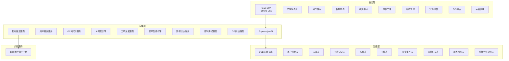
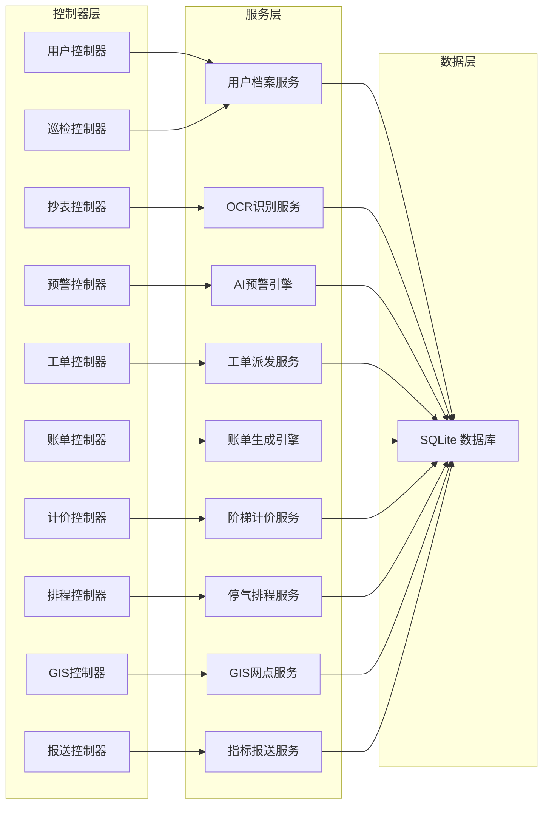
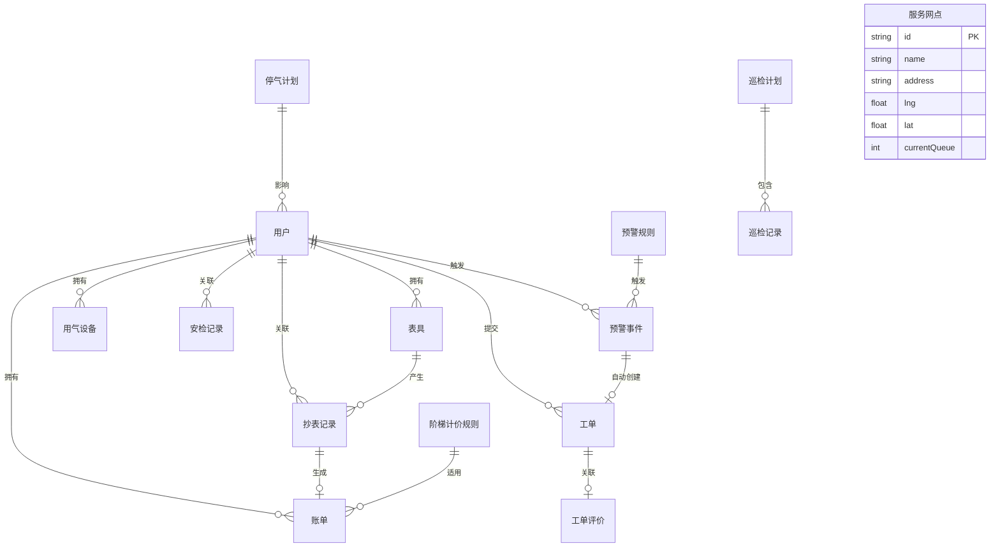

## 1. 架构设计



## 2. 技术说明

- **前端**：React@18 + TailwindCSS@3 + Vite + Zustand（状态管理）+ Recharts（图表）+ React Router DOM
- **初始化工具**：vite-init
- **后端**：Express@4 + TypeScript（ESM）
- **数据库**：SQLite（better-sqlite3），开发阶段使用 Mock 数据
- **地图**：前端使用模拟 GIS 组件（Canvas 绘制简化地图），不依赖外部地图API密钥
- **OCR**：前端模拟 OCR 识别流程，后端提供识别接口框架
- **AI预警**：后端规则引擎，基于配置阈值检测异常模式

## 3. 路由定义

| 路由 | 用途 |
|------|------|
| `/` | 总控仪表盘，全局运营概览 |
| `/profile/:id` | 用户燃气档案详情 |
| `/meter-reading` | 智能抄表页面 |
| `/payment` | 缴费中心 |
| `/payment/:billId` | 账单详情与支付 |
| `/repair` | 报修工单列表 |
| `/repair/new` | 新建报修工单 |
| `/repair/:id` | 工单详情与跟踪 |
| `/inspection` | 巡检管理 |
| `/warning` | 安全预警中心 |
| `/gis` | GIS服务网点地图 |
| `/admin/pricing` | 阶梯计价规则配置 |
| `/admin/outage` | 停气计划排程 |
| `/admin/billing` | 账单生成引擎 |
| `/admin/reporting` | 城市运行指标报送 |

## 4. API 定义

### 4.1 用户档案

```typescript
interface User {
  id: string
  accountNo: string
  name: string
  address: string
  userType: "residential" | "commercial" | "industrial"
  openDate: string
  status: "active" | "suspended" | "closed"
  phone: string
}

interface Meter {
  id: string
  userId: string
  meterNo: string
  model: string
  installDate: string
  calibrationExpiry: string
  currentReading: number
  status: "normal" | "faulty" | "replaced"
}

interface GasDevice {
  id: string
  userId: string
  deviceType: "stove" | "water_heater" | "boiler" | "other"
  brand: string
  model: string
  installDate: string
  status: "normal" | "expired" | "faulty"
}

interface SafetyInspection {
  id: string
  userId: string
  inspectDate: string
  result: "pass" | "warning" | "fail"
  issues: string[]
  rectificationStatus: "none" | "pending" | "completed"
}
```

### 4.2 抄表与缴费

```typescript
interface MeterReading {
  id: string
  userId: string
  meterId: string
  reading: number
  previousReading: number
  consumption: number
  readingDate: string
  method: "ocr" | "manual"
  ocrConfidence?: number
  imageUrl?: string
}

interface Bill {
  id: string
  userId: string
  periodStart: string
  periodEnd: string
  consumption: number
  tiers: TierDetail[]
  totalAmount: number
  status: "unpaid" | "paid" | "overdue"
  paidDate?: string
}

interface TierDetail {
  tier: number
  rangeStart: number
  rangeEnd: number
  unitPrice: number
  consumption: number
  amount: number
}
```

### 4.3 工单与预警

```typescript
interface WorkOrder {
  id: string
  userId: string
  type: "repair" | "inspection_issue" | "ai_warning"
  title: string
  description: string
  priority: "low" | "medium" | "high" | "urgent"
  status: "pending" | "dispatched" | "in_progress" | "completed" | "closed"
  assignee?: string
  createdAt: string
  dispatchedAt?: string
  completedAt?: string
  images?: string[]
  evaluation?: WorkOrderEvaluation
  warningId?: string
}

interface WorkOrderEvaluation {
  rating: number
  comment: string
  evaluatedAt: string
}

interface WarningEvent {
  id: string
  userId: string
  type: "zero_usage" | "spike" | "leak_suspect"
  severity: "info" | "warning" | "critical"
  message: string
  triggerRule: string
  detectedAt: string
  status: "active" | "acknowledged" | "resolved"
  outboundCallMade: boolean
  workOrderId?: string
}

interface WarningRule {
  id: string
  name: string
  type: "zero_usage" | "spike" | "leak_suspect"
  threshold: number
  unit: string
  severity: "info" | "warning" | "critical"
  autoCreateWorkOrder: boolean
  autoOutboundCall: boolean
  enabled: boolean
}
```

### 4.4 阶梯计价与停气

```typescript
interface TieredPricingRule {
  id: string
  name: string
  userType: "residential" | "commercial" | "industrial"
  tiers: PricingTier[]
  effectiveFrom: string
  effectiveTo?: string
  status: "active" | "draft" | "archived"
}

interface PricingTier {
  tier: number
  rangeStart: number
  rangeEnd: number | null
  unitPrice: number
}

interface OutagePlan {
  id: string
  title: string
  area: string
  startTime: string
  endTime: string
  affectedUsers: number
  affectedAccountNos: string[]
  status: "draft" | "published" | "completed" | "cancelled"
  createdAt: string
}

interface ServiceStation {
  id: string
  name: string
  address: string
  lng: number
  lat: number
  businessHours: string
  services: string[]
  currentQueue: number
  phone: string
}
```

### 4.5 巡检

```typescript
interface InspectionPlan {
  id: string
  title: string
  area: string
  startDate: string
  endDate: string
  assignees: string[]
  status: "planned" | "in_progress" | "completed"
}

interface InspectionRecord {
  id: string
  planId: string
  userId: string
  inspector: string
  inspectDate: string
  result: "pass" | "warning" | "fail"
  notes: string
  images?: string[]
  convertedToWorkOrder?: string
}
```

### 4.6 API 端点

| 方法 | 路径 | 描述 |
|------|------|------|
| GET | `/api/users` | 获取用户列表 |
| GET | `/api/users/:id` | 获取用户详情（含表具、设备、安检记录） |
| GET | `/api/meters` | 获取表具列表 |
| POST | `/api/meter-readings` | 提交抄表记录 |
| POST | `/api/meter-readings/ocr` | OCR识别表具照片 |
| GET | `/api/bills` | 获取账单列表 |
| GET | `/api/bills/:id` | 获取账单详情 |
| POST | `/api/bills/generate` | 批量生成账单 |
| POST | `/api/bills/:id/pay` | 模拟支付 |
| GET | `/api/work-orders` | 获取工单列表 |
| POST | `/api/work-orders` | 创建工单 |
| PATCH | `/api/work-orders/:id` | 更新工单状态 |
| POST | `/api/work-orders/:id/evaluate` | 提交工单评价 |
| GET | `/api/warnings` | 获取预警事件列表 |
| GET | `/api/warning-rules` | 获取预警规则 |
| POST | `/api/warning-rules` | 创建/更新预警规则 |
| POST | `/api/warnings/:id/acknowledge` | 确认预警 |
| GET | `/api/inspections` | 获取巡检记录 |
| POST | `/api/inspections` | 创建巡检计划 |
| GET | `/api/service-stations` | 获取服务网点列表 |
| GET | `/api/tiered-pricing` | 获取阶梯计价规则 |
| POST | `/api/tiered-pricing` | 创建/更新阶梯计价规则 |
| POST | `/api/tiered-pricing/simulate` | 模拟阶梯计价 |
| GET | `/api/outage-plans` | 获取停气计划 |
| POST | `/api/outage-plans` | 创建停气计划 |
| POST | `/api/outage-plans/:id/simulate` | 模拟停气影响范围 |
| GET | `/api/dashboard/stats` | 仪表盘统计数据 |
| POST | `/api/reporting/submit` | 报送城市运行指标 |

## 5. 服务端架构图



## 6. 数据模型

### 6.1 数据模型定义



### 6.2 数据定义语言

```sql
CREATE TABLE users (
  id TEXT PRIMARY KEY,
  account_no TEXT UNIQUE NOT NULL,
  name TEXT NOT NULL,
  address TEXT NOT NULL,
  user_type TEXT NOT NULL CHECK(user_type IN ('residential', 'commercial', 'industrial')),
  phone TEXT NOT NULL,
  open_date TEXT NOT NULL,
  status TEXT NOT NULL DEFAULT 'active' CHECK(status IN ('active', 'suspended', 'closed'))
);

CREATE TABLE meters (
  id TEXT PRIMARY KEY,
  user_id TEXT NOT NULL REFERENCES users(id),
  meter_no TEXT UNIQUE NOT NULL,
  model TEXT NOT NULL,
  install_date TEXT NOT NULL,
  calibration_expiry TEXT NOT NULL,
  current_reading REAL NOT NULL DEFAULT 0,
  status TEXT NOT NULL DEFAULT 'normal' CHECK(status IN ('normal', 'faulty', 'replaced'))
);

CREATE TABLE gas_devices (
  id TEXT PRIMARY KEY,
  user_id TEXT NOT NULL REFERENCES users(id),
  device_type TEXT NOT NULL CHECK(device_type IN ('stove', 'water_heater', 'boiler', 'other')),
  brand TEXT NOT NULL,
  model TEXT NOT NULL,
  install_date TEXT NOT NULL,
  status TEXT NOT NULL DEFAULT 'normal' CHECK(status IN ('normal', 'expired', 'faulty'))
);

CREATE TABLE safety_inspections (
  id TEXT PRIMARY KEY,
  user_id TEXT NOT NULL REFERENCES users(id),
  inspect_date TEXT NOT NULL,
  result TEXT NOT NULL CHECK(result IN ('pass', 'warning', 'fail')),
  issues TEXT NOT NULL DEFAULT '[]',
  rectification_status TEXT NOT NULL DEFAULT 'none' CHECK(rectification_status IN ('none', 'pending', 'completed'))
);

CREATE TABLE meter_readings (
  id TEXT PRIMARY KEY,
  user_id TEXT NOT NULL REFERENCES users(id),
  meter_id TEXT NOT NULL REFERENCES meters(id),
  reading REAL NOT NULL,
  previous_reading REAL NOT NULL,
  consumption REAL NOT NULL,
  reading_date TEXT NOT NULL,
  method TEXT NOT NULL CHECK(method IN ('ocr', 'manual')),
  ocr_confidence REAL,
  image_url TEXT
);

CREATE TABLE tiered_pricing_rules (
  id TEXT PRIMARY KEY,
  name TEXT NOT NULL,
  user_type TEXT NOT NULL,
  tiers TEXT NOT NULL DEFAULT '[]',
  effective_from TEXT NOT NULL,
  effective_to TEXT,
  status TEXT NOT NULL DEFAULT 'draft' CHECK(status IN ('active', 'draft', 'archived'))
);

CREATE TABLE bills (
  id TEXT PRIMARY KEY,
  user_id TEXT NOT NULL REFERENCES users(id),
  period_start TEXT NOT NULL,
  period_end TEXT NOT NULL,
  consumption REAL NOT NULL,
  tiers TEXT NOT NULL DEFAULT '[]',
  total_amount REAL NOT NULL,
  status TEXT NOT NULL DEFAULT 'unpaid' CHECK(status IN ('unpaid', 'paid', 'overdue')),
  paid_date TEXT
);

CREATE TABLE work_orders (
  id TEXT PRIMARY KEY,
  user_id TEXT NOT NULL REFERENCES users(id),
  type TEXT NOT NULL CHECK(type IN ('repair', 'inspection_issue', 'ai_warning')),
  title TEXT NOT NULL,
  description TEXT NOT NULL,
  priority TEXT NOT NULL DEFAULT 'medium' CHECK(priority IN ('low', 'medium', 'high', 'urgent')),
  status TEXT NOT NULL DEFAULT 'pending' CHECK(status IN ('pending', 'dispatched', 'in_progress', 'completed', 'closed')),
  assignee TEXT,
  created_at TEXT NOT NULL,
  dispatched_at TEXT,
  completed_at TEXT,
  images TEXT DEFAULT '[]',
  evaluation TEXT,
  warning_id TEXT
);

CREATE TABLE warning_rules (
  id TEXT PRIMARY KEY,
  name TEXT NOT NULL,
  type TEXT NOT NULL CHECK(type IN ('zero_usage', 'spike', 'leak_suspect')),
  threshold REAL NOT NULL,
  unit TEXT NOT NULL,
  severity TEXT NOT NULL CHECK(severity IN ('info', 'warning', 'critical')),
  auto_create_work_order INTEGER NOT NULL DEFAULT 0,
  auto_outbound_call INTEGER NOT NULL DEFAULT 0,
  enabled INTEGER NOT NULL DEFAULT 1
);

CREATE TABLE warning_events (
  id TEXT PRIMARY KEY,
  user_id TEXT NOT NULL REFERENCES users(id),
  type TEXT NOT NULL CHECK(type IN ('zero_usage', 'spike', 'leak_suspect')),
  severity TEXT NOT NULL CHECK(severity IN ('info', 'warning', 'critical')),
  message TEXT NOT NULL,
  trigger_rule TEXT NOT NULL,
  detected_at TEXT NOT NULL,
  status TEXT NOT NULL DEFAULT 'active' CHECK(status IN ('active', 'acknowledged', 'resolved')),
  outbound_call_made INTEGER NOT NULL DEFAULT 0,
  work_order_id TEXT
);

CREATE TABLE inspection_plans (
  id TEXT PRIMARY KEY,
  title TEXT NOT NULL,
  area TEXT NOT NULL,
  start_date TEXT NOT NULL,
  end_date TEXT NOT NULL,
  assignees TEXT NOT NULL DEFAULT '[]',
  status TEXT NOT NULL DEFAULT 'planned' CHECK(status IN ('planned', 'in_progress', 'completed'))
);

CREATE TABLE inspection_records (
  id TEXT PRIMARY KEY,
  plan_id TEXT NOT NULL REFERENCES inspection_plans(id),
  user_id TEXT NOT NULL REFERENCES users(id),
  inspector TEXT NOT NULL,
  inspect_date TEXT NOT NULL,
  result TEXT NOT NULL CHECK(result IN ('pass', 'warning', 'fail')),
  notes TEXT NOT NULL,
  images TEXT DEFAULT '[]',
  converted_to_work_order TEXT
);

CREATE TABLE outage_plans (
  id TEXT PRIMARY KEY,
  title TEXT NOT NULL,
  area TEXT NOT NULL,
  start_time TEXT NOT NULL,
  end_time TEXT NOT NULL,
  affected_users INTEGER NOT NULL DEFAULT 0,
  affected_account_nos TEXT NOT NULL DEFAULT '[]',
  status TEXT NOT NULL DEFAULT 'draft' CHECK(status IN ('draft', 'published', 'completed', 'cancelled')),
  created_at TEXT NOT NULL
);

CREATE TABLE service_stations (
  id TEXT PRIMARY KEY,
  name TEXT NOT NULL,
  address TEXT NOT NULL,
  lng REAL NOT NULL,
  lat REAL NOT NULL,
  business_hours TEXT NOT NULL,
  services TEXT NOT NULL DEFAULT '[]',
  current_queue INTEGER NOT NULL DEFAULT 0,
  phone TEXT NOT NULL
);
```
