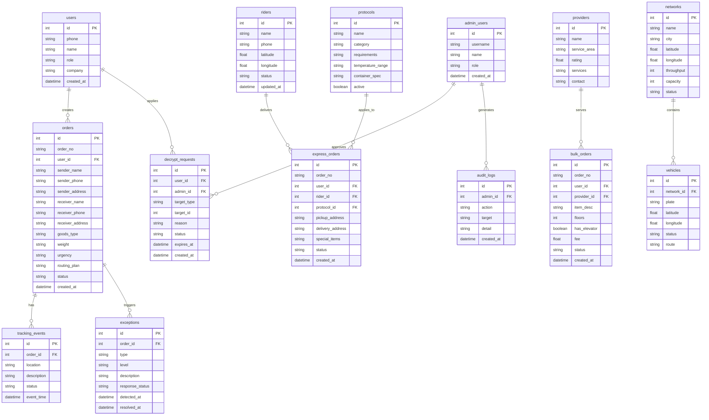

## 1. 架构设计

```mermaid
graph TB
    subgraph "前端层"
        "React 18 + TypeScript" --> "Vite + Tailwind CSS"
        "Vite + Tailwind CSS" --> "Zustand 状态管理"
        "Zustand 状态管理" --> "页面组件"
    end
    subgraph "后端层"
        "Express.js + TypeScript" --> "路由控制器"
        "路由控制器" --> "业务服务层"
        "业务服务层" --> "数据访问层"
    end
    subgraph "数据层"
        "SQLite 数据库" --> "运单表"
        "SQLite 数据库" --> "网点表"
        "SQLite 数据库" --> "骑手表"
        "SQLite 数据库" --> "用户表"
        "SQLite 数据库" --> "审计日志表"
    end
    "页面组件" -->|"HTTP API"| "路由控制器"
    "数据访问层" -->|"SQL"| "SQLite 数据库"
```

## 2. 技术说明

- 前端：React@18 + TypeScript + Vite + Tailwind CSS@3 + Zustand
- 初始化工具：vite-init（react-express-ts 模板）
- 后端：Express@4 + TypeScript（ESM 格式）
- 数据库：SQLite（better-sqlite3），文件路径 data/app.sqlite
- 端口：FRONTEND_PORT=46932, BACKEND_PORT=56932
- 数据脱敏：后端中间件统一处理，前端仅接收脱敏数据
- 图表/地图：使用 recharts 图表库 + 纯CSS/SVG实现地图可视化

## 3. 路由定义

| 路由 | 用途 |
|------|------|
| / | 首页仪表盘 |
| /ship | 寄件模块 - 下单页 |
| /ship/batch | 寄件模块 - 批量导入 |
| /ship/scan | 寄件模块 - 扫码下单 |
| /ship/voice | 寄件模块 - 语音转单 |
| /ship/routing | 寄件模块 - 智能路由 |
| /track | 查件 - 运单列表 |
| /track/:id | 查件 - 运单详情/轨迹追踪 |
| /track/exception | 查件 - 异常中心 |
| /express | 同城急送 - 下单 |
| /express/track/:id | 同城急送 - 骑手追踪 |
| /express/protocol | 同城急送 - 特殊物品协议 |
| /bulk | 大件物流 - 下单 |
| /bulk/providers | 大件物流 - 服务商目录 |
| /bulk/calculator | 大件物流 - 费用测算 |
| /twin/network | 数字孪生 - 网点吞吐 |
| /twin/vehicles | 数字孪生 - 车辆热力 |
| /twin/weather | 数字孪生 - 天气预测 |
| /security | 安全合规 - 脱敏管理 |
| /security/decrypt | 安全合规 - 解密审批 |
| /security/compliance | 安全合规 - ISO27001 |

## 4. API 定义

### 4.1 基础接口

```
GET  /api/health                    健康检查
```

### 4.2 寄件模块

```
POST   /api/orders                  创建运单
GET    /api/orders                  运单列表（分页/筛选）
GET    /api/orders/:id              运单详情
POST   /api/orders/batch            批量导入运单
POST   /api/orders/scan             扫码下单
POST   /api/orders/voice            语音转单
POST   /api/orders/:id/routing      智能路由推荐
PUT    /api/orders/:id              更新运单
DELETE /api/orders/:id              删除运单
```

### 4.3 查件模块

```
GET    /api/tracking/:id            轨迹追踪
GET    /api/tracking/:id/timeline   时间线节点
GET    /api/exceptions              异常件列表
PUT    /api/exceptions/:id/respond  异常响应处理
POST   /api/exceptions/:id/escalate 异常升级
```

### 4.4 同城急送

```
POST   /api/express                 创建急送单
GET    /api/express/:id             急送单详情
GET    /api/express/:id/rider       骑手LBS位置
GET    /api/protocols               特殊物品协议列表
POST   /api/protocols               创建运输协议
PUT    /api/protocols/:id           更新运输协议
```

### 4.5 大件物流

```
POST   /api/bulk                    创建大件运单
GET    /api/bulk/providers          服务商目录
GET    /api/bulk/calculator         费用测算
POST   /api/bulk/providers/:id/book 预约拆装服务
```

### 4.6 数字孪生

```
GET    /api/twin/networks           网点吞吐数据
GET    /api/twin/vehicles           车辆在途数据
GET    /api/twin/weather            天气延误预测
```

### 4.7 安全合规

```
GET    /api/security/desensitize    脱敏规则列表
PUT    /api/security/desensitize/:id 更新脱敏规则
POST   /api/security/decrypt-apply  解密申请
GET    /api/security/decrypt-requests 解密审批列表
PUT    /api/security/decrypt-requests/:id 审批解密
GET    /api/security/compliance     ISO27001合规状态
GET    /api/security/audit-log      审计日志
```

### 4.8 用户与认证

```
POST   /api/auth/login              登录
POST   /api/auth/logout             登出
GET    /api/users/profile           当前用户信息
GET    /api/users                   用户列表
```

## 5. 服务端架构图

```mermaid
graph LR
    subgraph "Controller 层"
        "OrderController"
        "TrackingController"
        "ExpressController"
        "BulkController"
        "TwinController"
        "SecurityController"
    end
    subgraph "Service 层"
        "OrderService"
        "TrackingService"
        "ExpressService"
        "BulkService"
        "TwinService"
        "SecurityService"
    end
    subgraph "Repository 层"
        "OrderRepo"
        "TrackingRepo"
        "RiderRepo"
        "ProviderRepo"
        "NetworkRepo"
        "AuditRepo"
    end
    "OrderController" --> "OrderService"
    "TrackingController" --> "TrackingService"
    "ExpressController" --> "ExpressService"
    "BulkController" --> "BulkService"
    "TwinController" --> "TwinService"
    "SecurityController" --> "SecurityService"
    "OrderService" --> "OrderRepo"
    "TrackingService" --> "TrackingRepo"
    "ExpressService" --> "RiderRepo"
    "BulkService" --> "ProviderRepo"
    "TwinService" --> "NetworkRepo"
    "SecurityService" --> "AuditRepo"
```

## 6. 数据模型

### 6.1 数据模型定义



### 6.2 数据定义语言

```sql
CREATE TABLE users (
    id INTEGER PRIMARY KEY AUTOINCREMENT,
    phone TEXT NOT NULL UNIQUE,
    name TEXT NOT NULL,
    role TEXT NOT NULL DEFAULT 'personal',
    company TEXT,
    password_hash TEXT NOT NULL,
    created_at TEXT NOT NULL DEFAULT (datetime('now'))
);

CREATE TABLE orders (
    id INTEGER PRIMARY KEY AUTOINCREMENT,
    order_no TEXT NOT NULL UNIQUE,
    user_id INTEGER NOT NULL REFERENCES users(id),
    sender_name TEXT NOT NULL,
    sender_phone TEXT NOT NULL,
    sender_address TEXT NOT NULL,
    receiver_name TEXT NOT NULL,
    receiver_phone TEXT NOT NULL,
    receiver_address TEXT NOT NULL,
    goods_type TEXT NOT NULL,
    weight REAL NOT NULL,
    urgency TEXT NOT NULL DEFAULT 'standard',
    routing_plan TEXT,
    carrier TEXT,
    estimated_delivery TEXT,
    status TEXT NOT NULL DEFAULT 'pending',
    created_at TEXT NOT NULL DEFAULT (datetime('now')),
    updated_at TEXT NOT NULL DEFAULT (datetime('now'))
);

CREATE TABLE tracking_events (
    id INTEGER PRIMARY KEY AUTOINCREMENT,
    order_id INTEGER NOT NULL REFERENCES orders(id),
    location TEXT NOT NULL,
    description TEXT NOT NULL,
    status TEXT NOT NULL,
    event_time TEXT NOT NULL DEFAULT (datetime('now'))
);

CREATE TABLE exceptions (
    id INTEGER PRIMARY KEY AUTOINCREMENT,
    order_id INTEGER NOT NULL REFERENCES orders(id),
    type TEXT NOT NULL,
    level INTEGER NOT NULL DEFAULT 1,
    description TEXT NOT NULL,
    response_status TEXT NOT NULL DEFAULT 'alert',
    responder_id INTEGER,
    resolved_at TEXT,
    detected_at TEXT NOT NULL DEFAULT (datetime('now'))
);

CREATE TABLE express_orders (
    id INTEGER PRIMARY KEY AUTOINCREMENT,
    order_no TEXT NOT NULL UNIQUE,
    user_id INTEGER NOT NULL REFERENCES users(id),
    rider_id INTEGER REFERENCES riders(id),
    protocol_id INTEGER REFERENCES protocols(id),
    pickup_address TEXT NOT NULL,
    delivery_address TEXT NOT NULL,
    special_items TEXT,
    status TEXT NOT NULL DEFAULT 'pending',
    estimated_minutes INTEGER,
    created_at TEXT NOT NULL DEFAULT (datetime('now'))
);

CREATE TABLE riders (
    id INTEGER PRIMARY KEY AUTOINCREMENT,
    name TEXT NOT NULL,
    phone TEXT NOT NULL,
    latitude REAL NOT NULL DEFAULT 0,
    longitude REAL NOT NULL DEFAULT 0,
    status TEXT NOT NULL DEFAULT 'available',
    updated_at TEXT NOT NULL DEFAULT (datetime('now'))
);

CREATE TABLE providers (
    id INTEGER PRIMARY KEY AUTOINCREMENT,
    name TEXT NOT NULL,
    service_area TEXT NOT NULL,
    rating REAL NOT NULL DEFAULT 0,
    services TEXT NOT NULL,
    contact TEXT NOT NULL,
    booked_count INTEGER NOT NULL DEFAULT 0
);

CREATE TABLE bulk_orders (
    id INTEGER PRIMARY KEY AUTOINCREMENT,
    order_no TEXT NOT NULL UNIQUE,
    user_id INTEGER NOT NULL REFERENCES users(id),
    provider_id INTEGER REFERENCES providers(id),
    item_desc TEXT NOT NULL,
    floors INTEGER NOT NULL DEFAULT 1,
    has_elevator INTEGER NOT NULL DEFAULT 0,
    floor_height REAL,
    disassembly_required INTEGER NOT NULL DEFAULT 0,
    fee REAL NOT NULL DEFAULT 0,
    status TEXT NOT NULL DEFAULT 'pending',
    created_at TEXT NOT NULL DEFAULT (datetime('now'))
);

CREATE TABLE networks (
    id INTEGER PRIMARY KEY AUTOINCREMENT,
    name TEXT NOT NULL,
    city TEXT NOT NULL,
    latitude REAL NOT NULL,
    longitude REAL NOT NULL,
    throughput INTEGER NOT NULL DEFAULT 0,
    capacity INTEGER NOT NULL DEFAULT 0,
    status TEXT NOT NULL DEFAULT 'normal'
);

CREATE TABLE vehicles (
    id INTEGER PRIMARY KEY AUTOINCREMENT,
    network_id INTEGER NOT NULL REFERENCES networks(id),
    plate TEXT NOT NULL,
    latitude REAL NOT NULL,
    longitude REAL NOT NULL,
    status TEXT NOT NULL DEFAULT 'in_transit',
    route TEXT
);

CREATE TABLE protocols (
    id INTEGER PRIMARY KEY AUTOINCREMENT,
    name TEXT NOT NULL,
    category TEXT NOT NULL,
    requirements TEXT NOT NULL,
    temperature_range TEXT,
    container_spec TEXT,
    active INTEGER NOT NULL DEFAULT 1
);

CREATE TABLE decrypt_requests (
    id INTEGER PRIMARY KEY AUTOINCREMENT,
    user_id INTEGER NOT NULL REFERENCES admin_users(id),
    admin_id INTEGER REFERENCES admin_users(id),
    target_type TEXT NOT NULL,
    target_id INTEGER NOT NULL,
    reason TEXT NOT NULL,
    status TEXT NOT NULL DEFAULT 'pending',
    expires_at TEXT,
    created_at TEXT NOT NULL DEFAULT (datetime('now'))
);

CREATE TABLE audit_logs (
    id INTEGER PRIMARY KEY AUTOINCREMENT,
    admin_id INTEGER NOT NULL REFERENCES admin_users(id),
    action TEXT NOT NULL,
    target TEXT NOT NULL,
    detail TEXT,
    created_at TEXT NOT NULL DEFAULT (datetime('now'))
);

CREATE TABLE admin_users (
    id INTEGER PRIMARY KEY AUTOINCREMENT,
    username TEXT NOT NULL UNIQUE,
    name TEXT NOT NULL,
    role TEXT NOT NULL DEFAULT 'admin',
    password_hash TEXT NOT NULL,
    created_at TEXT NOT NULL DEFAULT (datetime('now'))
);

CREATE INDEX idx_orders_user ON orders(user_id);
CREATE INDEX idx_orders_status ON orders(status);
CREATE INDEX idx_tracking_order ON tracking_events(order_id);
CREATE INDEX idx_exceptions_order ON exceptions(order_id);
CREATE INDEX idx_express_rider ON express_orders(rider_id);
CREATE INDEX idx_vehicles_network ON vehicles(network_id);
CREATE INDEX idx_audit_admin ON audit_logs(admin_id);
CREATE INDEX idx_decrypt_status ON decrypt_requests(status);
```
