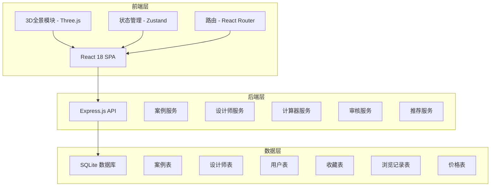
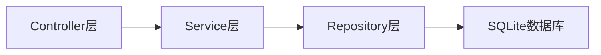
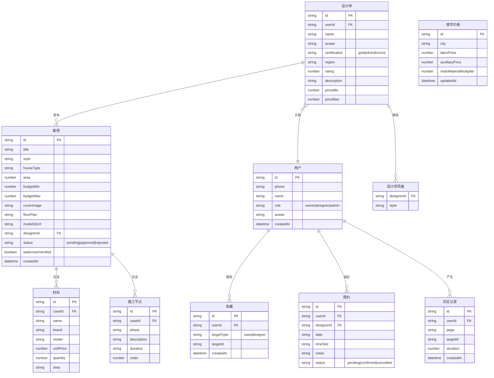

## 1. 架构设计



## 2. 技术说明

- **前端**: React@18 + TypeScript + TailwindCSS@3 + Vite
- **3D渲染**: Three.js + @react-three/fiber + @react-three/drei
- **图表**: Recharts
- **状态管理**: Zustand
- **路由**: React Router DOM v6
- **初始化工具**: vite-init
- **后端**: Express@4 + TypeScript（ESM模式）
- **数据库**: SQLite（better-sqlite3）
- **图标**: lucide-react

## 3. 路由定义

| 路由 | 用途 |
|------|------|
| `/` | 首页，品牌展示、热门案例、设计师推荐 |
| `/cases` | 案例库，多维筛选与浏览 |
| `/cases/:id` | 案例详情，平面图/3D全景/材料/施工节点 |
| `/designers` | 找设计师，智能匹配与筛选 |
| `/designers/:id` | 设计师主页，作品集与认证信息 |
| `/calculator` | 装修成本计算器 |
| `/favorites` | 收藏夹 |
| `/admin` | 后台管理，审核与数据看板 |

## 4. API定义

### 4.1 案例相关

```typescript
interface Case {
  id: string
  title: string
  style: string
  houseType: string
  area: number
  budget: { min: number; max: number }
  coverImage: string
  images: string[]
  floorPlan: string
  model3dUrl: string
  materials: Material[]
  constructionNodes: ConstructionNode[]
  designerId: string
  status: "pending" | "approved" | "rejected"
  createdAt: string
  watermarkVerified: boolean
}

interface Material {
  id: string
  name: string
  brand: string
  model: string
  unitPrice: number
  quantity: number
  area: string
}

interface ConstructionNode {
  id: string
  phase: string
  description: string
  duration: string
  order: number
}

// GET /api/cases?page=1&limit=12&style=modern&houseType=3bed&areaMin=80&areaMax=120&budgetMin=10&budgetMax=30
// Response: { cases: Case[], total: number, page: number }

// GET /api/cases/:id
// Response: Case

// POST /api/cases (设计师发布)
// Body: Omit<Case, 'id' | 'status' | 'createdAt' | 'watermarkVerified'>

// PUT /api/cases/:id/status (管理员审核)
// Body: { status: "approved" | "rejected", reason?: string }
```

### 4.2 设计师相关

```typescript
interface Designer {
  id: string
  name: string
  avatar: string
  certification: "gold" | "silver" | "bronze"
  region: string
  styles: string[]
  priceRange: { min: number; max: number }
  portfolioCount: number
  rating: number
  description: string
  works: string[]
}

// GET /api/designers?region=beijing&style=modern&priceMin=100&priceMax=500
// Response: { designers: Designer[], total: number }

// GET /api/designers/:id
// Response: Designer & { cases: Case[] }

// POST /api/designers/:id/appointment
// Body: { date: string, timeSlot: string, notes: string }

// POST /api/designers/:id/quote
// Body: { area: number, houseType: string, style: string, level: string }
// Response: { total: number, breakdown: QuoteItem[] }
```

### 4.3 成本计算器

```typescript
interface CostCalculator {
  city: string
  area: number
  houseType: string
  style: string
  level: "economy" | "standard" | "premium" | "luxury"
}

interface CostResult {
  total: number
  labor: number
  auxiliary: number
  mainMaterial: number
  furniture: number
  appliance: number
}

// POST /api/calculator
// Body: CostCalculator
// Response: CostResult

// GET /api/calculator/cities
// Response: { cities: { name: string, region: string }[] }

// GET /api/calculator/prices?city=beijing
// Response: { labor: number, auxiliary: number, mainMaterialMultiplier: number }
```

### 4.4 收藏与用户行为

```typescript
interface Favorite {
  id: string
  userId: string
  targetType: "case" | "designer"
  targetId: string
  createdAt: string
}

interface BrowsingRecord {
  id: string
  userId: string
  page: string
  targetId: string
  duration: number
  createdAt: string
}

// GET /api/favorites?type=case|designer
// Response: Favorite[]

// POST /api/favorites
// Body: { targetType: string, targetId: string }

// DELETE /api/favorites/:id

// POST /api/track
// Body: { page: string, targetId: string, duration: number }
```

### 4.5 后台管理

```typescript
// GET /api/admin/cases/pending?page=1&limit=20
// Response: { cases: Case[], total: number }

// GET /api/admin/stats
// Response: { totalCases: number, totalDesigners: number, totalUsers: number, weeklyTrends: TrendData[] }

// GET /api/admin/trends/weekly
// Response: { period: string, trends: { style: string, count: number, change: number }[] }
```

## 5. 服务端架构图



## 6. 数据模型

### 6.1 数据模型定义



### 6.2 数据定义语言

```sql
CREATE TABLE users (
  id TEXT PRIMARY KEY,
  phone TEXT NOT NULL UNIQUE,
  name TEXT NOT NULL,
  role TEXT NOT NULL CHECK(role IN ('owner', 'designer', 'admin')),
  avatar TEXT,
  created_at TEXT NOT NULL DEFAULT (datetime('now'))
);

CREATE TABLE designers (
  id TEXT PRIMARY KEY,
  user_id TEXT NOT NULL REFERENCES users(id),
  name TEXT NOT NULL,
  avatar TEXT,
  certification TEXT NOT NULL CHECK(certification IN ('gold', 'silver', 'bronze')),
  region TEXT NOT NULL,
  rating REAL NOT NULL DEFAULT 0,
  description TEXT,
  price_min REAL,
  price_max REAL
);

CREATE TABLE designer_styles (
  designer_id TEXT NOT NULL REFERENCES designers(id),
  style TEXT NOT NULL,
  PRIMARY KEY (designer_id, style)
);

CREATE TABLE cases (
  id TEXT PRIMARY KEY,
  title TEXT NOT NULL,
  style TEXT NOT NULL,
  house_type TEXT NOT NULL,
  area REAL NOT NULL,
  budget_min REAL,
  budget_max REAL,
  cover_image TEXT NOT NULL,
  images TEXT DEFAULT '[]',
  floor_plan TEXT,
  model3d_url TEXT,
  designer_id TEXT NOT NULL REFERENCES designers(id),
  status TEXT NOT NULL DEFAULT 'pending' CHECK(status IN ('pending', 'approved', 'rejected')),
  watermark_verified INTEGER NOT NULL DEFAULT 0,
  created_at TEXT NOT NULL DEFAULT (datetime('now'))
);

CREATE TABLE materials (
  id TEXT PRIMARY KEY,
  case_id TEXT NOT NULL REFERENCES cases(id) ON DELETE CASCADE,
  name TEXT NOT NULL,
  brand TEXT,
  model TEXT,
  unit_price REAL NOT NULL,
  quantity REAL NOT NULL,
  area TEXT
);

CREATE TABLE construction_nodes (
  id TEXT PRIMARY KEY,
  case_id TEXT NOT NULL REFERENCES cases(id) ON DELETE CASCADE,
  phase TEXT NOT NULL,
  description TEXT,
  duration TEXT,
  sort_order INTEGER NOT NULL
);

CREATE TABLE favorites (
  id TEXT PRIMARY KEY,
  user_id TEXT NOT NULL REFERENCES users(id),
  target_type TEXT NOT NULL CHECK(target_type IN ('case', 'designer')),
  target_id TEXT NOT NULL,
  created_at TEXT NOT NULL DEFAULT (datetime('now')),
  UNIQUE(user_id, target_type, target_id)
);

CREATE TABLE appointments (
  id TEXT PRIMARY KEY,
  user_id TEXT NOT NULL REFERENCES users(id),
  designer_id TEXT NOT NULL REFERENCES designers(id),
  date TEXT NOT NULL,
  time_slot TEXT NOT NULL,
  notes TEXT,
  status TEXT NOT NULL DEFAULT 'pending' CHECK(status IN ('pending', 'confirmed', 'cancelled')),
  created_at TEXT NOT NULL DEFAULT (datetime('now'))
);

CREATE TABLE browsing_records (
  id TEXT PRIMARY KEY,
  user_id TEXT REFERENCES users(id),
  page TEXT NOT NULL,
  target_id TEXT,
  duration INTEGER DEFAULT 0,
  created_at TEXT NOT NULL DEFAULT (datetime('now'))
);

CREATE TABLE city_prices (
  id TEXT PRIMARY KEY,
  city TEXT NOT NULL UNIQUE,
  labor_price REAL NOT NULL,
  auxiliary_price REAL NOT NULL,
  main_material_multiplier REAL NOT NULL DEFAULT 1.0,
  updated_at TEXT NOT NULL DEFAULT (datetime('now'))
);

CREATE INDEX idx_cases_style ON cases(style);
CREATE INDEX idx_cases_house_type ON cases(house_type);
CREATE INDEX idx_cases_status ON cases(status);
CREATE INDEX idx_cases_designer ON cases(designer_id);
CREATE INDEX idx_designers_region ON designers(region);
CREATE INDEX idx_designers_cert ON designers(certification);
CREATE INDEX idx_favorites_user ON favorites(user_id);
CREATE INDEX idx_browsing_user ON browsing_records(user_id);
CREATE INDEX idx_browsing_created ON browsing_records(created_at);
```
