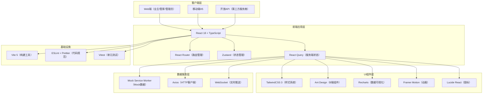
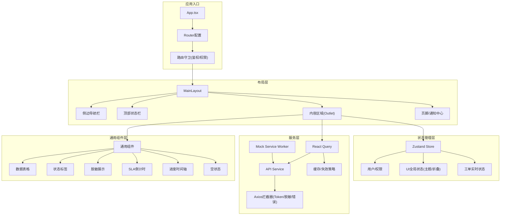
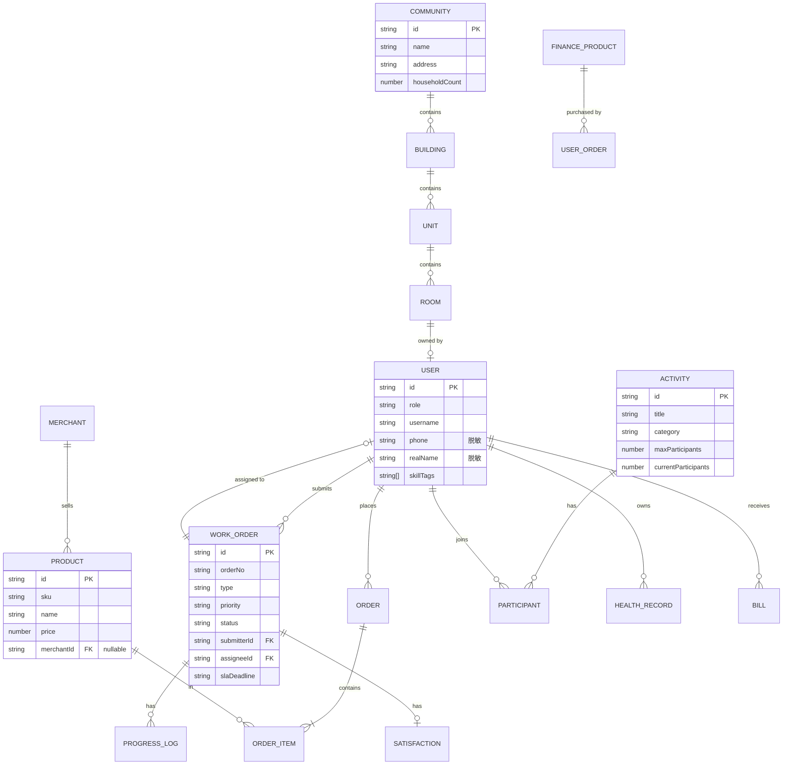

# 社区治理与生活服务融合SaaS化物业工作台 技术架构文档

## 1. 架构设计



## 2. 技术说明

- **前端框架**: React 18 + TypeScript 5（严格模式）
- **初始化工具**: Vite 5（@vitejs/plugin-react）
- **样式方案**: TailwindCSS 3 + CSS Variables 主题系统
- **UI组件库**: Ant Design 5 深度定制主题
- **状态管理**: Zustand（客户端全局状态）+ React Query（服务端状态缓存）
- **路由**: React Router v6（含路由守卫+权限控制）
- **数据可视化**: Recharts 2（图表）+ ECharts（热力图/地图）
- **动画**: Framer Motion
- **图标**: Lucide React
- **HTTP请求**: Axios + 拦截器（鉴权/错误处理/脱敏）
- **Mock数据**: MSW（Mock Service Worker）本地模拟API
- **代码规范**: ESLint + Prettier + Husky + lint-staged
- **测试框架**: Vitest + React Testing Library
- **后端**: 本期使用MSW Mock，预留Express+PostgreSQL扩展架构

## 3. 路由定义

| 路由路径 | 页面/组件 | 权限角色 | 说明 |
|----------|-----------|----------|------|
| `/login` | LoginPage | public | 多角色登录入口 |
| `/dashboard` | DashboardPage | all | 工作台首页（按角色差异化展示） |
| `/community` | CommunityListPage | admin/staff | 小区列表 |
| `/community/:id` | CommunityDetailPage | admin/staff | 小区详情（含楼宇结构树） |
| `/community/:id/building/:bid` | BuildingPage | admin/staff | 楼宇/单元/户室管理 |
| `/workorder` | WorkOrderListPage | all | 工单列表（看板/列表视图切换） |
| `/workorder/:id` | WorkOrderDetailPage | all | 工单详情（进度时间轴+满意度） |
| `/workorder/create` | WorkOrderCreatePage | owner/staff | 新建工单 |
| `/mall` | MallHomePage | owner | 社区电商首页 |
| `/mall/product/:id` | ProductDetailPage | owner | 商品详情 |
| `/mall/orders` | OrderListPage | owner/merchant | 订单管理 |
| `/mall/merchant` | MerchantDashboardPage | merchant/admin | 商户后台 |
| `/activities` | ActivityListPage | all | 邻里活动列表 |
| `/activities/:id` | ActivityDetailPage | all | 活动详情（报名/签到） |
| `/finance` | FinanceProductPage | owner | 普惠金融产品 |
| `/health` | HealthRecordPage | owner | 健康档案中心 |
| `/payment` | PaymentCenterPage | owner | 缴费中心 |
| `/settings` | SettingsPage | admin | 系统设置（权限/脱敏规则） |
| `/committee` | CommitteeReviewPage | committee/admin | 业委会审批中心 |
| `/open-api` | OpenApiPage | admin/developer | 开放平台管理 |
| `/profile` | ProfilePage | all | 个人中心 |

## 4. API定义（Mock层）

```typescript
// 通用响应结构
interface ApiResponse<T> {
  code: number;
  message: string;
  data: T;
  timestamp: number;
}

// 分页结构
interface PageResult<T> {
  list: T[];
  total: number;
  page: number;
  pageSize: number;
}

// 用户实体
interface User {
  id: string;
  role: 'owner' | 'staff' | 'admin' | 'merchant' | 'committee' | 'developer';
  username: string;
  phone: string;         // 脱敏：138****8888
  realName?: string;     // 脱敏：张*
  idCard?: string;       // 脱敏：110***********1234
  avatar?: string;
  communityId?: string;
  buildingId?: string;
  roomId?: string;
  skillTags?: string[];  // 管家技能标签
  permissions?: string[];
}

// 小区实体
interface Community {
  id: string;
  name: string;
  address: string;
  buildingCount: number;
  householdCount: number;
  area: number;
  greeningRate: number;
  propertyFeeStandard: number;
  propertyFeeRate: number;  // 收缴率
  buildings: Building[];
}

interface Building {
  id: string;
  name: string;
  floors: number;
  units: Unit[];
}

interface Unit {
  id: string;
  name: string;
  rooms: Room[];
}

interface Room {
  id: string;
  roomNumber: string;
  area: number;
  ownerId?: string;
  ownerName?: string;      // 脱敏展示
  bindStatus: 'bound' | 'unbound' | 'pending';
  propertyFeeStatus: 'paid' | 'unpaid' | 'overdue';
}

// 工单实体
interface WorkOrder {
  id: string;
  orderNo: string;
  type: 'repair' | 'complaint' | 'suggestion' | 'appointment';
  priority: 'low' | 'normal' | 'high' | 'urgent';
  title: string;
  description: string;
  images?: string[];
  location: string;
  roomId?: string;
  submitterId: string;
  submitterName: string;   // 脱敏
  assigneeId?: string;
  assigneeName?: string;
  status: 'pending' | 'assigned' | 'processing' | 'completed' | 'closed' | 'escalated';
  slaDeadline: string;
  slaRemaining: number;    // 剩余分钟数
  createdAt: string;
  assignedAt?: string;
  completedAt?: string;
  progressLogs: ProgressLog[];
  satisfaction?: Satisfaction;
}

interface ProgressLog {
  id: string;
  workOrderId: string;
  operatorId: string;
  operatorName: string;
  status: WorkOrder['status'];
  content: string;
  images?: string[];
  createdAt: string;
}

interface Satisfaction {
  rating: 1 | 2 | 3 | 4 | 5;
  comment?: string;
  tags?: string[];
  createdAt: string;
}

// 电商实体
interface Product {
  id: string;
  sku: string;
  name: string;
  category: string;
  price: number;
  originalPrice?: number;
  stock: number;
  sold: number;
  images: string[];
  description: string;
  merchantId?: string;     // 为空表示自营
  merchantName?: string;
  isSelf: boolean;
  tags?: string[];
  rating: number;
}

interface Order {
  id: string;
  orderNo: string;
  userId: string;
  items: OrderItem[];
  totalAmount: number;
  status: 'pending' | 'paid' | 'shipped' | 'delivered' | 'completed' | 'refunded' | 'cancelled';
  paymentMethod: 'wechat' | 'alipay' | 'balance';
  paidAt?: string;
  createdAt: string;
  writeOffCode?: string;   // 核销码
  isWriteOff: boolean;
}

interface OrderItem {
  productId: string;
  productName: string;
  productImage: string;
  price: number;
  quantity: number;
  skuSpec?: string;
}

// 活动实体
interface Activity {
  id: string;
  title: string;
  coverImage: string;
  description: string;
  category: 'culture' | 'sports' | 'education' | 'charity' | 'festival';
  location: string;
  startTime: string;
  endTime: string;
  registrationDeadline: string;
  maxParticipants: number;
  currentParticipants: number;
  registrationFee: number;
  status: 'draft' | 'published' | 'registering' | 'ongoing' | 'ended' | 'cancelled';
  organizer: string;
  signInQrCode?: string;
  participants: ActivityParticipant[];
}

interface ActivityParticipant {
  userId: string;
  userName: string;        // 脱敏
  avatar?: string;
  registeredAt: string;
  isSignedIn: boolean;
  signedInAt?: string;
}

// 金融产品实体
interface FinanceProduct {
  id: string;
  name: string;
  type: 'insurance' | 'pension' | 'deduction' | 'wealth';
  provider: string;
  description: string;
  features: string[];
  price?: number;
  riskLevel: 'R1' | 'R2' | 'R3' | 'R4' | 'R5';
  terms: string[];
  isRecommended: boolean;
}

// 健康档案实体
interface HealthRecord {
  id: string;
  userId: string;
  familyMemberId?: string;
  recordType: 'physical' | 'blood_pressure' | 'blood_sugar' | 'outpatient' | 'vaccination';
  recordDate: string;
  hospital?: string;
  doctor?: string;
  data: HealthData;
  indicators: HealthIndicator[];
}

interface HealthIndicator {
  name: string;
  value: number;
  unit: string;
  referenceRange: string;
  status: 'normal' | 'low' | 'high';
}

// 缴费账单实体
interface Bill {
  id: string;
  billNo: string;
  userId: string;
  roomId: string;
  type: 'property' | 'water' | 'electricity' | 'gas' | 'parking';
  title: string;
  amount: number;
  paidAmount: number;
  billingPeriod: string;
  dueDate: string;
  status: 'unpaid' | 'partial' | 'paid' | 'overdue';
  createdAt: string;
  paidAt?: string;
}

// 仪表盘统计
interface DashboardStats {
  propertyFeeRate: number;           // 物业费收缴率
  propertyFeeRateYoY: number;        // 同比
  workOrderCompletionRate: number;   // 工单完成率
  workOrderAvgResponse: number;      // 平均响应时长（分钟）
  monthlyGMV: number;                // 本月电商GMV
  monthlyGMVGrowth: number;          // GMV环比增长
  activityParticipation: number;     // 活动参与人次
  activeUsers: number;               // 本月活跃用户
  workOrdersByStatus: Record<string, number>;
  workOrdersByType: Record<string, number>;
  hotProducts: { name: string; sold: number; gmv: number }[];
  activityHeatmap: { buildingId: string; count: number }[];
  slaCompliance: number;             // SLA达成率
}
```

## 5. 前端核心模块架构



## 6. 数据模型（Mock层核心实体关系）



## 7. 目录结构

```
may-89265/
├── public/
│   └── mockServiceWorker.js
├── src/
│   ├── assets/              # 静态资源
│   │   ├── images/
│   │   └── fonts/
│   ├── components/          # 通用组件
│   │   ├── layout/          # 布局组件
│   │   ├── common/          # 基础组件(Button/Card/Table等)
│   │   └── business/        # 业务组件
│   ├── pages/               # 页面组件
│   │   ├── Login/
│   │   ├── Dashboard/
│   │   ├── Community/
│   │   ├── WorkOrder/
│   │   ├── Mall/
│   │   ├── Activity/
│   │   ├── Finance/
│   │   ├── Health/
│   │   ├── Payment/
│   │   ├── Settings/
│   │   ├── Committee/
│   │   ├── OpenApi/
│   │   └── Profile/
│   ├── router/              # 路由配置
│   │   ├── index.tsx
│   │   └── routes.ts
│   ├── store/               # Zustand状态管理
│   │   ├── userStore.ts
│   │   ├── uiStore.ts
│   │   └── workOrderStore.ts
│   ├── services/            # API服务
│   │   ├── request.ts       # Axios实例+拦截器
│   │   ├── auth.service.ts
│   │   ├── community.service.ts
│   │   ├── workorder.service.ts
│   │   ├── mall.service.ts
│   │   ├── activity.service.ts
│   │   ├── finance.service.ts
│   │   ├── health.service.ts
│   │   ├── payment.service.ts
│   │   └── system.service.ts
│   ├── mocks/               # MSW Mock数据
│   │   ├── browser.ts
│   │   ├── handlers/
│   │   └── data/            # Mock数据生成器
│   ├── hooks/               # 自定义Hooks
│   │   ├── useAuth.ts
│   │   ├── usePermission.ts
│   │   ├── useSlaCountdown.ts
│   │   └── useDesensitize.ts
│   ├── utils/               # 工具函数
│   │   ├── desensitize.ts   # 数据脱敏
│   │   ├── format.ts        # 格式化(日期/金额/手机号)
│   │   ├── permission.ts    # 权限判断
│   │   └── storage.ts       # 本地存储
│   ├── types/               # TypeScript类型定义
│   │   ├── api.d.ts
│   │   ├── entity.d.ts
│   │   └── index.d.ts
│   ├── styles/              # 全局样式
│   │   ├── index.css
│   │   ├── variables.css    # CSS变量(主题色)
│   │   └── animations.css
│   ├── constants/           # 常量配置
│   │   ├── enums.ts
│   │   ├── config.ts
│   │   └── menu.tsx
│   ├── App.tsx
│   └── main.tsx
├── .trae/
│   └── documents/           # 产品文档
├── index.html
├── package.json
├── vite.config.ts
├── tsconfig.json
├── tailwind.config.js
├── postcss.config.js
├── .eslintrc.cjs
└── .prettierrc
```
