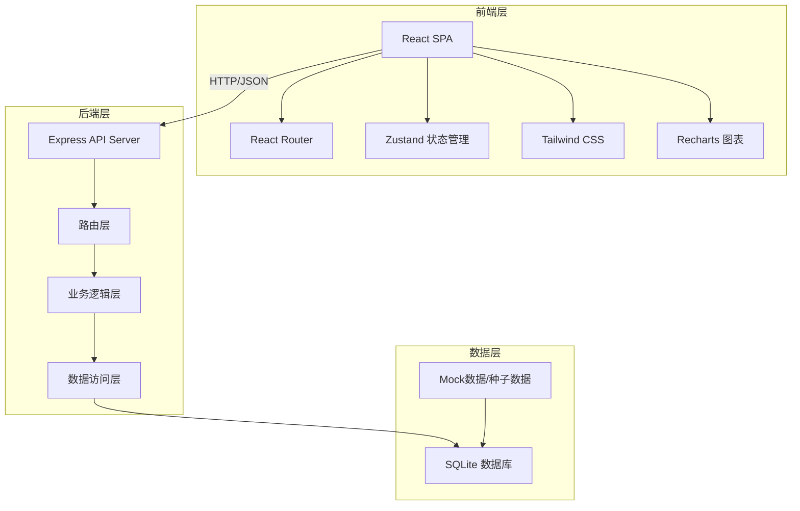
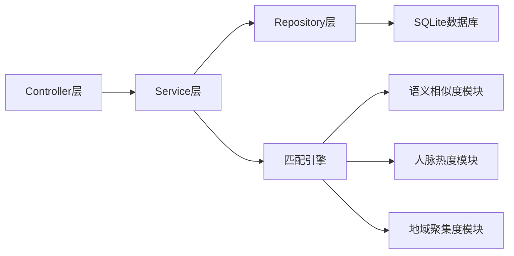
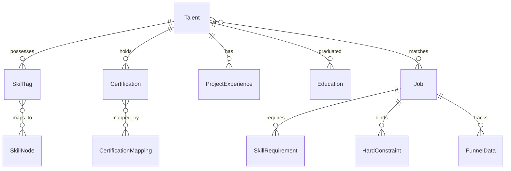

## 1. 架构设计



## 2. 技术说明

- **前端**: React@18 + TypeScript + Tailwind CSS@3 + Vite
- **状态管理**: Zustand
- **图表可视化**: Recharts（漏斗图、雷达图、折线图）+ D3.js（知识图谱力导向图）
- **地图可视化**: 简化SVG中国地图 + CSS热力效果
- **初始化工具**: vite-init
- **后端**: Express@4 + TypeScript (ESM)
- **数据库**: SQLite (better-sqlite3)，含种子数据
- **图标**: lucide-react

## 3. 路由定义

| 路由 | 用途 |
|------|------|
| / | 首页 - 行业概览与快速入口 |
| /talent | 人才中心 - 简历解析与技能标注 |
| /talent/:id | 人才详情 - 个人技能档案与缺口分析 |
| /jobs | 职位中心 - 职位列表与建模工具 |
| /jobs/create | 职位建模 - 创建/编辑职位模型 |
| /jobs/:id | 职位详情 - 候选人匹配列表 |
| /match | 智能匹配 - 匹配结果总览 |
| /match/:jobId/:talentId | 匹配详情 - 三维匹配度分析 |
| /analytics | 数据分析 - HR招聘效能看板 |
| /graph | 知识图谱 - 行业技能图谱浏览 |

## 4. API定义

### 4.1 人才相关

```typescript
interface Talent {
  id: string
  name: string
  email: string
  phone: string
  currentCompany: string
  experience: number
  field: "汽车制造" | "零部件" | "新能源" | "智能驾驶"
  skills: SkillTag[]
  certifications: Certification[]
  projectExperience: ProjectExperience[]
  education: Education[]
  location: string
  alumniNetwork: string[]
  previousCompanies: string[]
}

interface SkillTag {
  name: string
  category: "硬技能" | "软技能" | "认证"
  level: "初级" | "中级" | "高级" | "专家"
  verified: boolean
}

interface Certification {
  name: string
  issuer: string
  validUntil: string
  mappedLevel: string
}

interface ProjectExperience {
  title: string
  company: string
  vehicleModel: string
  duration: string
  description: string
  skills: string[]
}

// POST /api/talents/upload - 简历上传与解析
// GET /api/talents - 人才列表(分页/筛选)
// GET /api/talents/:id - 人才详情
// GET /api/talents/:id/gap-analysis?jobId=xxx - 能力缺口分析
```

### 4.2 职位相关

```typescript
interface Job {
  id: string
  title: string
  company: string
  field: "汽车制造" | "零部件" | "新能源" | "智能驾驶"
  location: string
  salaryRange: [number, number]
  description: string
  requiredSkills: SkillRequirement[]
  hardConstraints: HardConstraint[]
  status: "草稿" | "招聘中" | "已关闭"
  createdAt: string
  funnelData: FunnelData
}

interface SkillRequirement {
  name: string
  category: "硬技能" | "软技能" | "认证"
  required: boolean
  preferredLevel: string
}

interface HardConstraint {
  type: "车型项目经验" | "试验场测试经历" | "IATF16949内审员" | "功能安全认证" | "ASPICE认证"
  value: string
  required: boolean
}

interface FunnelData {
  totalResumes: number
  screened: number
  interviewed: number
  offered: number
}

// POST /api/jobs - 创建职位
// GET /api/jobs - 职位列表(分页/筛选)
// GET /api/jobs/:id - 职位详情
// PUT /api/jobs/:id - 更新职位
// GET /api/jobs/:id/candidates - 候选人匹配列表
```

### 4.3 匹配相关

```typescript
interface MatchResult {
  talentId: string
  jobId: string
  overallScore: number
  semanticSimilarity: number
  networkWarmth: number
  regionCluster: number
  details: {
    skillMatch: SkillMatchDetail[]
    networkOverlap: NetworkDetail
    regionAdvantage: RegionDetail
  }
}

interface SkillMatchDetail {
  skill: string
  jobRequired: string
  talentLevel: string
  matchScore: number
}

interface NetworkDetail {
  sharedAlumni: number
  sharedCompanies: number
  warmthScore: number
}

interface RegionDetail {
  talentLocation: string
  jobLocation: string
  clusterScore: number
  clusterName: string
}

// GET /api/match?jobId=xxx - 职位匹配结果列表
// GET /api/match/:jobId/:talentId - 匹配详情
```

### 4.4 数据分析相关

```typescript
interface AnalyticsOverview {
  totalJobs: number
  totalTalents: number
  avgFillCycle: number
  totalMatches: number
}

interface FunnelAnalytics {
  stage: string
  count: number
  conversionRate: number
}

interface HeadhunterROI {
  headhunterId: string
  name: string
  recommendations: number
  interviews: number
  hires: number
  cost: number
  roi: number
}

// GET /api/analytics/overview - 概览数据
// GET /api/analytics/funnel - 转化漏斗
// GET /api/analytics/fill-cycle - 填补周期
// GET /api/analytics/headhunter-roi - 猎头ROI
```

### 4.5 知识图谱相关

```typescript
interface SkillNode {
  id: string
  name: string
  category: string
  level: number
  relatedSkills: string[]
  relatedCertifications: string[]
  hotJobs: number
}

interface CertificationMapping {
  certification: string
  jobLevels: string[]
  requiredFor: string[]
}

// GET /api/graph/skills - 技能图谱节点与关系
// GET /api/graph/certifications - 认证映射
// GET /api/graph/skills/:id/related - 技能关联详情
```

## 5. 服务端架构图



## 6. 数据模型

### 6.1 数据模型定义



### 6.2 数据定义语言

```sql
CREATE TABLE talents (
  id TEXT PRIMARY KEY,
  name TEXT NOT NULL,
  email TEXT UNIQUE NOT NULL,
  phone TEXT,
  current_company TEXT,
  experience INTEGER DEFAULT 0,
  field TEXT CHECK(field IN ('汽车制造','零部件','新能源','智能驾驶')),
  location TEXT,
  alumni_network TEXT,
  previous_companies TEXT,
  created_at TEXT DEFAULT (datetime('now'))
);

CREATE TABLE skills (
  id TEXT PRIMARY KEY,
  talent_id TEXT NOT NULL,
  name TEXT NOT NULL,
  category TEXT CHECK(category IN ('硬技能','软技能','认证')),
  level TEXT CHECK(level IN ('初级','中级','高级','专家')),
  verified INTEGER DEFAULT 0,
  FOREIGN KEY (talent_id) REFERENCES talents(id) ON DELETE CASCADE
);

CREATE TABLE certifications (
  id TEXT PRIMARY KEY,
  talent_id TEXT NOT NULL,
  name TEXT NOT NULL,
  issuer TEXT,
  valid_until TEXT,
  mapped_level TEXT,
  FOREIGN KEY (talent_id) REFERENCES talents(id) ON DELETE CASCADE
);

CREATE TABLE project_experiences (
  id TEXT PRIMARY KEY,
  talent_id TEXT NOT NULL,
  title TEXT NOT NULL,
  company TEXT,
  vehicle_model TEXT,
  duration TEXT,
  description TEXT,
  skills TEXT,
  FOREIGN KEY (talent_id) REFERENCES talents(id) ON DELETE CASCADE
);

CREATE TABLE jobs (
  id TEXT PRIMARY KEY,
  title TEXT NOT NULL,
  company TEXT NOT NULL,
  field TEXT CHECK(field IN ('汽车制造','零部件','新能源','智能驾驶')),
  location TEXT,
  salary_min INTEGER,
  salary_max INTEGER,
  description TEXT,
  status TEXT CHECK(status IN ('草稿','招聘中','已关闭')) DEFAULT '草稿',
  created_at TEXT DEFAULT (datetime('now'))
);

CREATE TABLE skill_requirements (
  id TEXT PRIMARY KEY,
  job_id TEXT NOT NULL,
  name TEXT NOT NULL,
  category TEXT CHECK(category IN ('硬技能','软技能','认证')),
  required INTEGER DEFAULT 1,
  preferred_level TEXT,
  FOREIGN KEY (job_id) REFERENCES jobs(id) ON DELETE CASCADE
);

CREATE TABLE hard_constraints (
  id TEXT PRIMARY KEY,
  job_id TEXT NOT NULL,
  type TEXT NOT NULL,
  value TEXT NOT NULL,
  required INTEGER DEFAULT 1,
  FOREIGN KEY (job_id) REFERENCES jobs(id) ON DELETE CASCADE
);

CREATE TABLE funnel_data (
  id TEXT PRIMARY KEY,
  job_id TEXT NOT NULL,
  total_resumes INTEGER DEFAULT 0,
  screened INTEGER DEFAULT 0,
  interviewed INTEGER DEFAULT 0,
  offered INTEGER DEFAULT 0,
  FOREIGN KEY (job_id) REFERENCES jobs(id) ON DELETE CASCADE
);

CREATE TABLE match_results (
  id TEXT PRIMARY KEY,
  talent_id TEXT NOT NULL,
  job_id TEXT NOT NULL,
  overall_score REAL,
  semantic_score REAL,
  network_score REAL,
  region_score REAL,
  created_at TEXT DEFAULT (datetime('now')),
  FOREIGN KEY (talent_id) REFERENCES talents(id),
  FOREIGN KEY (job_id) REFERENCES jobs(id)
);

CREATE TABLE skill_nodes (
  id TEXT PRIMARY KEY,
  name TEXT NOT NULL,
  category TEXT NOT NULL,
  level INTEGER DEFAULT 0,
  related_skills TEXT,
  related_certs TEXT,
  hot_jobs INTEGER DEFAULT 0
);

CREATE TABLE cert_mappings (
  id TEXT PRIMARY KEY,
  certification TEXT NOT NULL,
  job_levels TEXT,
  required_for TEXT
);

CREATE INDEX idx_talents_field ON talents(field);
CREATE INDEX idx_talents_location ON talents(location);
CREATE INDEX idx_skills_talent ON skills(talent_id);
CREATE INDEX idx_jobs_field ON jobs(field);
CREATE INDEX idx_jobs_status ON jobs(status);
CREATE INDEX idx_match_job ON match_results(job_id);
CREATE INDEX idx_match_talent ON match_results(talent_id);
CREATE INDEX idx_skill_nodes_category ON skill_nodes(category);
```
