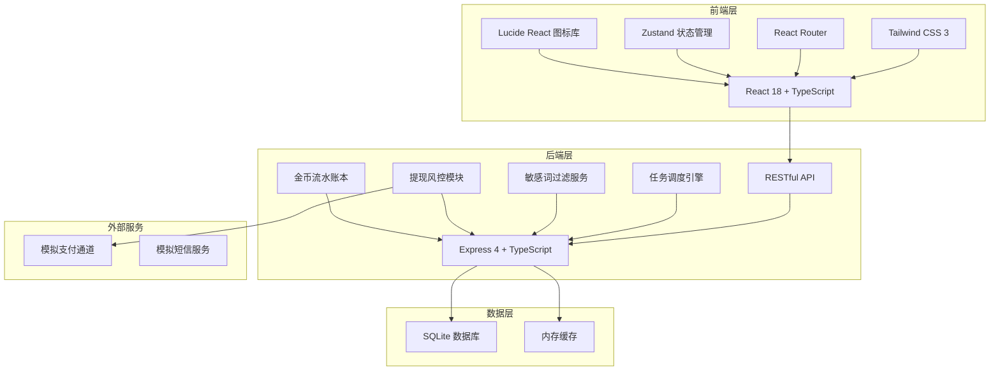
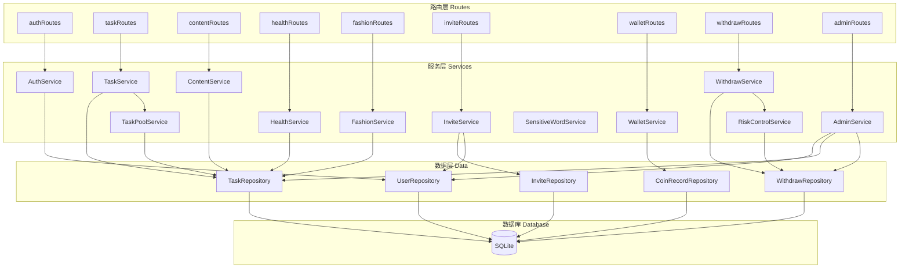
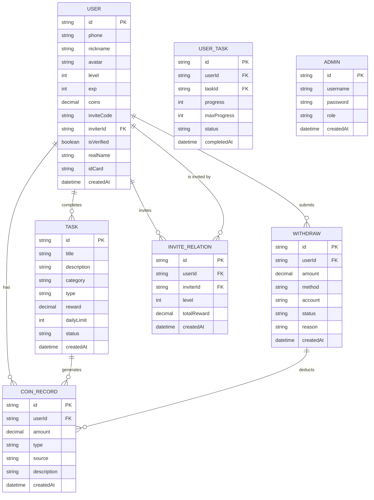

## 1. 架构设计



## 2. 技术说明

- **前端**: React 18 + TypeScript + Tailwind CSS 3 + Vite
- **后端**: Express 4 + TypeScript
- **状态管理**: Zustand
- **路由**: React Router DOM
- **数据库**: SQLite (开发环境使用内存数据库，便于快速启动
- **图标**: Lucide React
- **初始化工具**: vite-init

## 3. 路由定义

### 3.1 用户端路由

| 路由 | 页面 | 说明 |
|------|------|------|
| / | 首页 | 任务大厅、金币展示 |
| /tasks | 任务中心 | 任务分类列表 |
| /tasks/joke | 笑话浏览 | 笑话内容消费任务 |
| /tasks/idiom | 成语答题 | 成语答题任务 |
| /tasks/water | 饮水打卡 | 健康打卡-饮水 |
| /tasks/steps | 步数打卡 | 健康打卡-步数 |
| /tasks/fashion | 穿搭测评 | 穿搭测评入口 |
| /tasks/fashion/hairstyle | 发型测评 | 发型搭配测评 |
| /tasks/fashion/clothing | 服饰测评 | 服饰搭配测评 |
| /invite | 邀请好友 | 邀请海报、好友列表 |
| /wallet | 金币流水 | 收支明细、统计 |
| /withdraw | 提现中心 | 提现申请、实名管理 |
| /profile | 个人中心 | 用户信息、设置 |
| /login | 用户登录 | 手机号登录 |
| /register | 用户注册 | 手机号注册、邀请码绑定 |

### 3.2 后台路由

| 路由 | 页面 | 说明 |
|------|------|------|
| /admin | 后台首页 | 数据概览 |
| /admin/login | 后台登录 | 管理员登录 |
| /admin/tasks/audit | 任务审核 | 待审核任务列表、敏感词过滤 |
| /admin/tasks/pool | 任务池调度 | 动态任务池配置 |
| /admin/users | 用户管理 | 用户列表、用户详情 |
| /admin/withdraw | 提现管理 | 提现审核、风控 |
| /admin/dashboard | 数据看板 | 数据图表、漏斗分析 |

## 4. API 定义

### 4.1 通用类型定义

```typescript
interface User {
  id: string;
  phone: string;
  nickname: string;
  avatar: string;
  level: number;
  exp: number;
  coins: number;
  inviteCode: string;
  inviterId: string | null;
  isVerified: boolean;
  createdAt: string;
}

interface Task {
  id: string;
  title: string;
  description: string;
  category: 'content' | 'health' | 'fashion' | 'invite';
  type: string;
  reward: number;
  status: 'pending' | 'active' | 'completed';
  dailyLimit: number;
  progress: number;
  maxProgress: number;
  createdAt: string;
}

interface CoinRecord {
  id: string;
  userId: string;
  amount: number;
  type: 'income' | 'expense';
  source: string;
  description: string;
  createdAt: string;
}

interface WithdrawRecord {
  id: string;
  userId: string;
  amount: number;
  method: 'alipay' | 'wechat' | 'bank';
  status: 'pending' | 'approved' | 'rejected';
  reason?: string;
  createdAt: string;
}

interface InviteRelation {
  id: string;
  userId: string;
  inviterId: string;
  level: 1 | 2;
  totalReward: number;
  createdAt: string;
}
```

### 4.2 用户模块 API

| 方法 | 路径 | 说明 |
|------|------|------|
| POST | /api/auth/login | 用户登录 |
| POST | /api/auth/register | 用户注册 |
| GET | /api/user/profile | 获取用户信息 |
| PUT | /api/user/profile | 更新用户信息 |
| POST | /api/user/verify | 实名认证 |

### 4.3 任务模块 API

| 方法 | 路径 | 说明 |
|------|------|------|
| GET | /api/tasks | 获取任务列表 |
| GET | /api/tasks/:id | 获取任务详情 |
| POST | /api/tasks/:id/complete | 完成任务 |
| GET | /api/tasks/daily/recommend | 获取每日推荐任务 |

### 4.4 内容消费 API

| 方法 | 路径 | 说明 |
|------|------|------|
| GET | /api/content/jokes | 获取笑话列表 |
| POST | /api/content/jokes/:id/read | 标记笑话已读 |
| GET | /api/content/idioms/questions | 获取成语题目 |
| POST | /api/content/idioms/submit | 提交答案 |

### 4.5 健康打卡 API

| 方法 | 路径 | 说明 |
|------|------|------|
| GET | /api/health/water/today | 获取今日饮水数据 |
| POST | /api/health/water/checkin | 饮水打卡 |
| GET | /api/health/steps/today | 获取今日步数数据 |
| POST | /api/health/steps/sync | 同步步数 |

### 4.6 穿搭测评 API

| 方法 | 路径 | 说明 |
|------|------|------|
| GET | /api/fashion/quizzes | 获取测评列表 |
| GET | /api/fashion/quizzes/:id | 获取测评题目 |
| POST | /api/fashion/quizzes/:id/submit | 提交测评结果 |

### 4.7 邀请模块 API

| 方法 | 路径 | 说明 |
|------|------|------|
| GET | /api/invite/stats | 获取邀请统计 |
| GET | /api/invite/friends | 获取邀请好友列表 |
| GET | /api/invite/records | 获取分佣记录 |

### 4.8 金币与提现 API

| 方法 | 路径 | 说明 |
|------|------|------|
| GET | /api/wallet/records | 获取金币流水 |
| GET | /api/wallet/statistics | 获取金币统计 |
| GET | /api/withdraw/methods | 获取提现方式 |
| POST | /api/withdraw/apply | 申请提现 |
| GET | /api/withdraw/records | 获取提现记录 |

### 4.9 后台管理 API

| 方法 | 路径 | 说明 |
|------|------|------|
| POST | /api/admin/login | 管理员登录 |
| GET | /api/admin/dashboard | 数据概览 |
| GET | /api/admin/tasks/pending | 待审核任务 |
| POST | /api/admin/tasks/:id/approve | 审核通过 |
| POST | /api/admin/tasks/:id/reject | 审核拒绝 |
| GET | /api/admin/tasks/pool | 任务池配置 |
| PUT | /api/admin/tasks/pool | 更新任务池配置 |
| GET | /api/admin/users | 用户列表 |
| GET | /api/admin/withdraw | 提现申请列表 |
| POST | /api/admin/withdraw/:id/approve | 提现审核通过 |
| POST | /api/admin/withdraw/:id/reject | 提现审核拒绝 |
| GET | /api/admin/statistics/overview | 数据看板数据 |

## 5. 服务端架构图



## 6. 数据模型

### 6.1 数据模型ER图



### 6.2 数据表定义

```sql
-- 用户表
CREATE TABLE users (
  id TEXT PRIMARY KEY,
  phone TEXT UNIQUE NOT NULL,
  nickname TEXT NOT NULL,
  avatar TEXT,
  level INTEGER DEFAULT 1,
  exp INTEGER DEFAULT 0,
  coins DECIMAL(10,2) DEFAULT 0,
  invite_code TEXT UNIQUE,
  inviter_id TEXT,
  is_verified BOOLEAN DEFAULT 0,
  real_name TEXT,
  id_card TEXT,
  alipay_account TEXT,
  wechat_account TEXT,
  bank_name TEXT,
  bank_card TEXT,
  created_at DATETIME DEFAULT CURRENT_TIMESTAMP
);

-- 任务表
CREATE TABLE tasks (
  id TEXT PRIMARY KEY PRIMARY KEY,
  title TEXT NOT NULL,
  description TEXT,
  category TEXT NOT NULL,
  type TEXT NOT NULL,
  reward DECIMAL(10,2) NOT NULL,
  daily_limit INTEGER DEFAULT 1,
  max_progress INTEGER DEFAULT 1,
  status TEXT DEFAULT 'active',
  sort_order INTEGER DEFAULT 0,
  created_at DATETIME DEFAULT CURRENT_TIMESTAMP
);

-- 用户任务进度表
CREATE TABLE user_tasks (
  id TEXT PRIMARY KEY,
  user_id TEXT NOT NULL,
  task_id TEXT NOT NULL,
  progress INTEGER DEFAULT 0,
  max_progress INTEGER DEFAULT 1,
  status TEXT DEFAULT 'pending',
  completed_at DATETIME,
  date TEXT NOT NULL,
  UNIQUE(user_id, task_id, date)
);

-- 金币流水表
CREATE TABLE coin_records (
  id TEXT PRIMARY KEY,
  user_id TEXT NOT NULL,
  amount DECIMAL(10,2) NOT NULL,
  type TEXT NOT NULL,
  source TEXT NOT NULL,
  description TEXT,
  created_at DATETIME DEFAULT CURRENT_TIMESTAMP
);

-- 提现记录表
CREATE TABLE withdraw_records (
  id TEXT PRIMARY KEY,
  user_id TEXT NOT NULL,
  amount DECIMAL(10,2) NOT NULL,
  method TEXT NOT NULL,
  account TEXT NOT NULL,
  status TEXT DEFAULT 'pending',
  reason TEXT,
  created_at DATETIME DEFAULT CURRENT_TIMESTAMP
);

-- 邀请关系表
CREATE TABLE invite_relations (
  id TEXT PRIMARY KEY,
  user_id TEXT NOT NULL UNIQUE,
  inviter_id TEXT NOT NULL,
  level INTEGER NOT NULL,
  total_reward DECIMAL(10,2) DEFAULT 0,
  created_at DATETIME DEFAULT CURRENT_TIMESTAMP
);

-- 管理员表
CREATE TABLE admins (
  id TEXT PRIMARY KEY,
  username TEXT UNIQUE NOT NULL,
  password TEXT NOT NULL,
  role TEXT DEFAULT 'admin',
  created_at DATETIME DEFAULT CURRENT_TIMESTAMP
);

-- 笑话内容表
CREATE TABLE jokes (
  id TEXT PRIMARY KEY,
  content TEXT NOT NULL,
  status TEXT DEFAULT 'active',
  created_at DATETIME DEFAULT CURRENT_TIMESTAMP
);

-- 成语题目表
CREATE TABLE idiom_questions (
  id TEXT PRIMARY KEY,
  idiom TEXT NOT NULL,
  question TEXT NOT NULL,
  options TEXT NOT NULL,
  answer TEXT NOT NULL,
  difficulty INTEGER DEFAULT 1,
  created_at DATETIME DEFAULT CURRENT_TIMESTAMP
);

-- 穿搭测评题目表
CREATE TABLE fashion_quizzes (
  id TEXT PRIMARY KEY,
  title TEXT NOT NULL,
  type TEXT NOT NULL,
  description TEXT,
  reward DECIMAL(10,2) NOT NULL,
  status TEXT DEFAULT 'active',
  created_at DATETIME DEFAULT CURRENT_TIMESTAMP
);

-- 测评题目表
CREATE TABLE quiz_questions (
  id TEXT PRIMARY KEY,
  quiz_id TEXT NOT NULL,
  question TEXT NOT NULL,
  options TEXT NOT NULL,
  image_url TEXT,
  sort_order INTEGER DEFAULT 0,
  created_at DATETIME DEFAULT CURRENT_TIMESTAMP
);
```

### 6.3 初始数据

```sql
-- 初始管理员
INSERT INTO admins (id, username, password, role)
VALUES ('admin-001', 'admin', 'admin123', 'super_admin');

-- 初始任务
INSERT INTO tasks (id, title, description, category, type, reward, daily_limit, max_progress, status, sort_order) VALUES
('task-joke', '每日笑一笑', '浏览笑话内容，开心每一天', 'content', 'joke', 10, 5, 1, 'active', 1),
('task-idiom', '成语答题', '学习成语知识，挑战答题赢金币', 'content', 'idiom', 20, 3, 1, 'active', 2),
('task-water', '饮水打卡', '每日饮水打卡，健康生活', 'health', 'water', 5, 1, 1, 'active', 3),
('task-steps', '步数挑战', '每日步数达标，运动赚金币', 'health', 'steps', 15, 1, 1000, 'active', 4),
('task-fashion-hairstyle', '发型测评', '测试你的专属发型风格', 'fashion', 'hairstyle', 30, 1, 1, 'active', 5),
('task-fashion-clothing', '服饰搭配测评', '发现你的穿搭风格', 'fashion', 'clothing', 30, 1, 1, 'active', 6),
('task-invite', '邀请好友', '邀请好友注册，获得邀请奖励', 'invite', 'invite', 50, 999, 1, 'active', 7);

-- 初始笑话
INSERT INTO jokes (id, content, status) VALUES
('joke-1', '程序员的读书人和年轻人去相亲，女方问：你是做什么的？程序员说：我是做IT的。女方：哦，那是做什么的？程序员：就是挨踢的。', 'active'),
('joke-2', '程序员最讨厌的数字是什么？1024，因为它总让人想起加班。', 'active'),
('joke-3', '为什么程序员喜欢黑暗模式？因为光明会吸引bug。', 'active'),
('joke-4', '一个SQL语句走进酒吧，看见两张表，问：我可以加入你们吗？', 'active'),
('joke-5', '程序员的老婆让他去买面包，说：如果有西瓜就买一个西瓜。程序员回来只买了一个面包，因为他说：因为只有一个面包店。', 'active'),
('joke-6', '老板对程序员说：这个需求很简单，怎么实现我不管。程序员说：好的，那我就不管了。', 'active'),
('joke-7', '程序员最怕的事情是什么？产品经理改需求。', 'active'),
('joke-8', '如何让程序员不写注释？写注释的人是傻子，读注释的人也是傻子。', 'active'),
('joke-9', '程序员的世界里有10种人：懂二进制的和不懂二进制的。', 'active'),
('joke-10', 'bug和程序员有什么区别？bug会自己消失，程序员不会。', 'active');

-- 初始成语题目
INSERT INTO idiom_questions (id, idiom, question, options, answer, difficulty) VALUES
('idiom-1', '画蛇添足', '比喻做了多余的事，反而把事情弄坏。这个成语是？', '["画蛇添足","画龙点睛","蛇鼠一窝","杯弓蛇影"', '画蛇添足', 1),
('idiom-2', '守株待兔', '比喻死守狭隘经验，不知变通。这个成语是？', '["守株待兔","刻舟求剑","掩耳盗铃","亡羊补牢"', '守株待兔', 1),
('idiom-3', '对牛弹琴', '比喻对不懂道理的人讲道理，对外行人说内行话。这个成语是？', '["对牛弹琴","鸡同鸭讲","牛头不对马嘴","风马牛不相及"', '对牛弹琴', 1),
('idiom-4', '亡羊补牢', '比喻出了问题以后想办法补救，可以防止继续受损失。这个成语是？', '["亡羊补牢","画蛇添足","守株待兔","掩耳盗铃"', '亡羊补牢', 1),
('idiom-5', '掩耳盗铃', '比喻自己欺骗自己，明明掩盖不住的事情偏要想法子掩盖。这个成语是？', '["掩耳盗铃","自欺欺人","画蛇添足","守株待兔"', '掩耳盗铃', 1),
('idiom-6', '刻舟求剑', '比喻拘泥成例，不知道跟着情势的变化而改变看法或办法。这个成语是？', '["刻舟求剑","守株待兔","画蛇添足","亡羊补牢"', '刻舟求剑', 2),
('idiom-7', '杯弓蛇影', '比喻因疑神疑鬼而引起恐惧。这个成语是？', '["杯弓蛇影","画蛇添足","蛇鼠一窝","虎头蛇尾"', '杯弓蛇影', 2),
('idiom-8', '画龙点睛', '比喻在关键处用几句话点明实质，使内容生动有力。这个成语是？', '["画龙点睛","画蛇添足","龙飞凤舞","龙争虎斗"', '画龙点睛', 2),
('idiom-9', '自相矛盾', '比喻自己说话做事前后抵触。这个成语是？', '["自相矛盾","掩耳盗铃","守株待兔","亡羊补牢"', '自相矛盾', 2),
('idiom-10', '井底之蛙', '比喻见识狭窄的人。这个成语是？', '["井底之蛙","坐井观天","鼠目寸光","目光短浅"', '井底之蛙', 2),
('idiom-11', '狐假虎威', '比喻依仗别人的势力欺压人。这个成语是？', '["狐假虎威","为虎作伥","虎头蛇尾","龙潭虎穴"', '狐假虎威', 2),
('idiom-12', '叶公好龙', '比喻口头上说爱好某事物，实际上并不真爱好。这个成语是？', '["叶公好龙","画龙点睛","龙飞凤舞","龙争虎斗"', '叶公好龙', 3);
```
