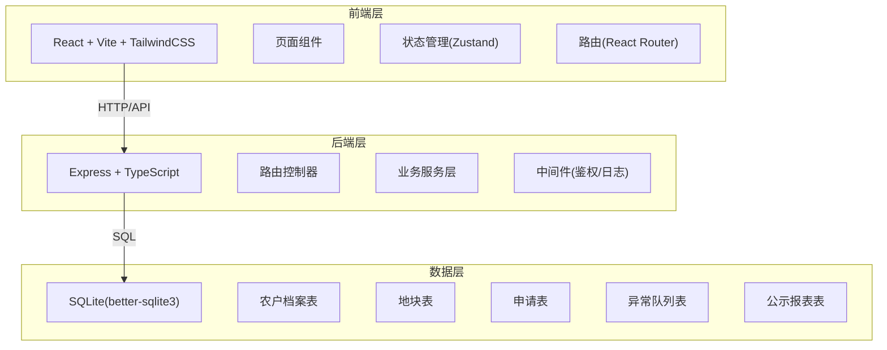
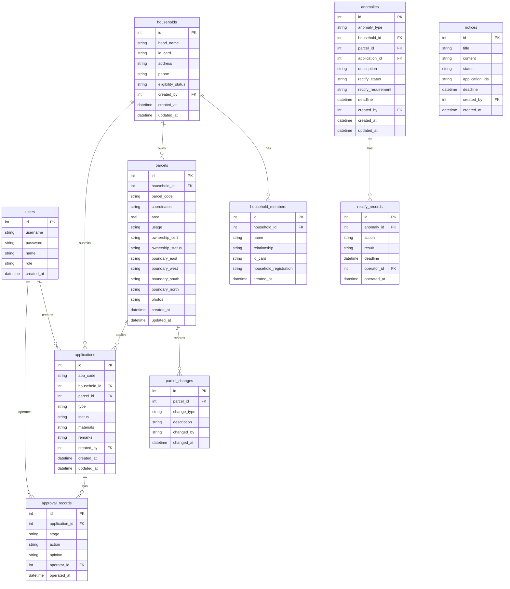

## 1. 架构设计



## 2. 技术说明

- 前端：React@18 + TailwindCSS@3 + Vite + TypeScript
- 初始化工具：vite-init (react-express-ts模板)
- 后端：Express@4 + TypeScript (ESM格式)
- 数据库：SQLite (better-sqlite3)，文件路径 data/app.sqlite
- 状态管理：Zustand
- 路由：React Router DOM v6

## 3. 路由定义

| 路由 | 用途 |
|------|------|
| /login | 登录页 |
| / | 首页仪表盘 |
| /households | 农户档案列表 |
| /households/:id | 农户档案详情 |
| /households/new | 新增农户档案 |
| /households/:id/edit | 编辑农户档案 |
| /parcels | 地块列表 |
| /parcels/:id | 地块详情 |
| /parcels/new | 新增地块 |
| /parcels/:id/edit | 编辑地块 |
| /applications | 申请列表 |
| /applications/new | 提交申请 |
| /applications/:id | 申请详情 |
| /approval | 审批工作台 |
| /anomalies | 异常队列 |
| /anomalies/:id | 异常详情 |
| /notices | 公示列表 |
| /reports | 报表中心 |

## 4. API定义

### 4.1 认证接口

| 方法 | 路径 | 说明 | 请求体 | 响应 |
|------|------|------|--------|------|
| POST | /api/auth/login | 登录 | {username, password} | {token, user} |
| POST | /api/auth/register | 注册 | {username, password, role, name} | {token, user} |
| GET | /api/auth/me | 当前用户 | - | {user} |

### 4.2 农户档案接口

| 方法 | 路径 | 说明 | 请求体 | 响应 |
|------|------|------|--------|------|
| GET | /api/households | 农户列表(分页/筛选) | query: {page, pageSize, keyword, eligibilityStatus} | {list, total} |
| GET | /api/households/:id | 农户详情 | - | {household, members, parcels, applications} |
| POST | /api/households | 新增农户 | {name, idCard, address, phone, members[]} | {household} |
| PUT | /api/households/:id | 更新农户 | {name, address, phone, eligibilityStatus, members[]} | {household} |
| DELETE | /api/households/:id | 删除农户 | - | {success} |

### 4.3 地块接口

| 方法 | 路径 | 说明 | 请求体 | 响应 |
|------|------|------|--------|------|
| GET | /api/parcels | 地块列表 | query: {page, pageSize, keyword, usage, ownershipStatus} | {list, total} |
| GET | /api/parcels/:id | 地块详情 | - | {parcel, changes} |
| POST | /api/parcels | 新增地块 | {householdId, coordinates, area, usage, boundary, photos[]} | {parcel} |
| PUT | /api/parcels/:id | 更新地块 | {area, usage, ownershipStatus, boundary, photos[]} | {parcel} |
| DELETE | /api/parcels/:id | 删除地块 | - | {success} |

### 4.4 申请接口

| 方法 | 路径 | 说明 | 请求体 | 响应 |
|------|------|------|--------|------|
| GET | /api/applications | 申请列表 | query: {page, pageSize, type, status} | {list, total} |
| GET | /api/applications/:id | 申请详情 | - | {application, timeline} |
| POST | /api/applications | 提交申请 | {householdId, parcelId, type, materials[], remarks} | {application} |
| PUT | /api/applications/:id/approve | 审批通过 | {opinion, nextStage} | {application} |
| PUT | /api/applications/:id/reject | 审批退回 | {opinion} | {application} |
| PUT | /api/applications/:id/supplement | 补充材料 | {materials[]} | {application} |

### 4.5 异常队列接口

| 方法 | 路径 | 说明 | 请求体 | 响应 |
|------|------|------|--------|------|
| GET | /api/anomalies | 异常列表 | query: {page, pageSize, type, rectifyStatus} | {list, total} |
| GET | /api/anomalies/:id | 异常详情 | - | {anomaly, records} |
| POST | /api/anomalies | 创建异常 | {type, householdId, parcelId, applicationId, description} | {anomaly} |
| PUT | /api/anomalies/:id/rectify | 整改记录 | {action, result, deadline} | {anomaly} |

### 4.6 公示与报表接口

| 方法 | 路径 | 说明 | 请求体 | 响应 |
|------|------|------|--------|------|
| GET | /api/notices | 公示列表 | query: {page, pageSize, status} | {list, total} |
| POST | /api/notices | 发布公示 | {title, content, applicationIds[], deadline} | {notice} |
| GET | /api/reports/summary | 综合统计 | query: {startDate, endDate} | {stats} |
| GET | /api/reports/inventory | 宅基地存量 | query: {village} | {inventory} |
| GET | /api/reports/approval-duration | 审批时长 | query: {startDate, endDate} | {durations} |
| GET | /api/reports/compensation | 退出补偿 | query: {startDate, endDate} | {compensations} |
| GET | /api/health | 健康检查 | - | {status: "ok"} |

## 5. 服务端架构图

```mermaid
graph LR
    "路由控制器" --> "业务服务层"
    "业务服务层" --> "数据访问层"
    "数据访问层" --> "SQLite数据库"
    "鉴权中间件" --> "路由控制器"
    "日志中间件" --> "路由控制器"
```

## 6. 数据模型

### 6.1 数据模型定义



### 6.2 数据定义语言

```sql
CREATE TABLE IF NOT EXISTS users (
    id INTEGER PRIMARY KEY AUTOINCREMENT,
    username TEXT NOT NULL UNIQUE,
    password TEXT NOT NULL,
    name TEXT NOT NULL,
    role TEXT NOT NULL CHECK(role IN ('farmer','village','township','supervisor')),
    created_at TEXT NOT NULL DEFAULT (datetime('now'))
);

CREATE TABLE IF NOT EXISTS households (
    id INTEGER PRIMARY KEY AUTOINCREMENT,
    head_name TEXT NOT NULL,
    id_card TEXT NOT NULL UNIQUE,
    address TEXT NOT NULL,
    phone TEXT NOT NULL,
    eligibility_status TEXT NOT NULL DEFAULT 'qualified' CHECK(eligibility_status IN ('qualified','disqualified','pending','restricted')),
    created_by INTEGER NOT NULL REFERENCES users(id),
    created_at TEXT NOT NULL DEFAULT (datetime('now')),
    updated_at TEXT NOT NULL DEFAULT (datetime('now'))
);

CREATE TABLE IF NOT EXISTS household_members (
    id INTEGER PRIMARY KEY AUTOINCREMENT,
    household_id INTEGER NOT NULL REFERENCES households(id) ON DELETE CASCADE,
    name TEXT NOT NULL,
    relationship TEXT NOT NULL,
    id_card TEXT NOT NULL,
    household_registration TEXT NOT NULL,
    created_at TEXT NOT NULL DEFAULT (datetime('now'))
);

CREATE TABLE IF NOT EXISTS parcels (
    id INTEGER PRIMARY KEY AUTOINCREMENT,
    household_id INTEGER NOT NULL REFERENCES households(id),
    parcel_code TEXT NOT NULL UNIQUE,
    coordinates TEXT,
    area REAL NOT NULL,
    usage TEXT NOT NULL CHECK(usage IN ('residence','production','business','other')),
    ownership_cert TEXT,
    ownership_status TEXT NOT NULL DEFAULT 'unconfirmed' CHECK(ownership_status IN ('confirmed','unconfirmed','transferring','exited')),
    boundary_east TEXT,
    boundary_west TEXT,
    boundary_south TEXT,
    boundary_north TEXT,
    photos TEXT DEFAULT '[]',
    created_at TEXT NOT NULL DEFAULT (datetime('now')),
    updated_at TEXT NOT NULL DEFAULT (datetime('now'))
);

CREATE TABLE IF NOT EXISTS parcel_changes (
    id INTEGER PRIMARY KEY AUTOINCREMENT,
    parcel_id INTEGER NOT NULL REFERENCES parcels(id) ON DELETE CASCADE,
    change_type TEXT NOT NULL,
    description TEXT NOT NULL,
    changed_by TEXT NOT NULL,
    changed_at TEXT NOT NULL DEFAULT (datetime('now'))
);

CREATE TABLE IF NOT EXISTS applications (
    id INTEGER PRIMARY KEY AUTOINCREMENT,
    app_code TEXT NOT NULL UNIQUE,
    household_id INTEGER NOT NULL REFERENCES households(id),
    parcel_id INTEGER REFERENCES parcels(id),
    type TEXT NOT NULL CHECK(type IN ('new_build','rebuild','expand','exit','transfer')),
    status TEXT NOT NULL DEFAULT 'draft' CHECK(status IN ('draft','submitted','village_review','township_review','supervisor_filing','approved','rejected','returned')),
    materials TEXT DEFAULT '[]',
    remarks TEXT,
    created_by INTEGER NOT NULL REFERENCES users(id),
    created_at TEXT NOT NULL DEFAULT (datetime('now')),
    updated_at TEXT NOT NULL DEFAULT (datetime('now'))
);

CREATE TABLE IF NOT EXISTS approval_records (
    id INTEGER PRIMARY KEY AUTOINCREMENT,
    application_id INTEGER NOT NULL REFERENCES applications(id) ON DELETE CASCADE,
    stage TEXT NOT NULL CHECK(stage IN ('village_review','township_review','supervisor_filing')),
    action TEXT NOT NULL CHECK(action IN ('approve','reject','return')),
    opinion TEXT,
    operator_id INTEGER NOT NULL REFERENCES users(id),
    operated_at TEXT NOT NULL DEFAULT (datetime('now'))
);

CREATE TABLE IF NOT EXISTS anomalies (
    id INTEGER PRIMARY KEY AUTOINCREMENT,
    anomaly_type TEXT NOT NULL CHECK(anomaly_type IN ('over_area','multi_homestead','missing_material','disputed_parcel','illegal_construction')),
    household_id INTEGER REFERENCES households(id),
    parcel_id INTEGER REFERENCES parcels(id),
    application_id INTEGER REFERENCES applications(id),
    description TEXT NOT NULL,
    rectify_status TEXT NOT NULL DEFAULT 'pending' CHECK(rectify_status IN ('pending','in_progress','completed','overdue')),
    rectify_requirement TEXT,
    deadline TEXT,
    created_by INTEGER NOT NULL REFERENCES users(id),
    created_at TEXT NOT NULL DEFAULT (datetime('now')),
    updated_at TEXT NOT NULL DEFAULT (datetime('now'))
);

CREATE TABLE IF NOT EXISTS rectify_records (
    id INTEGER PRIMARY KEY AUTOINCREMENT,
    anomaly_id INTEGER NOT NULL REFERENCES anomalies(id) ON DELETE CASCADE,
    action TEXT NOT NULL,
    result TEXT,
    deadline TEXT,
    operator_id INTEGER NOT NULL REFERENCES users(id),
    operated_at TEXT NOT NULL DEFAULT (datetime('now'))
);

CREATE TABLE IF NOT EXISTS notices (
    id INTEGER PRIMARY KEY AUTOINCREMENT,
    title TEXT NOT NULL,
    content TEXT NOT NULL,
    status TEXT NOT NULL DEFAULT 'active' CHECK(status IN ('active','expired','cancelled')),
    application_ids TEXT DEFAULT '[]',
    deadline TEXT,
    created_by INTEGER NOT NULL REFERENCES users(id),
    created_at TEXT NOT NULL DEFAULT (datetime('now'))
);

CREATE INDEX IF NOT EXISTS idx_households_eligibility ON households(eligibility_status);
CREATE INDEX IF NOT EXISTS idx_parcels_household ON parcels(household_id);
CREATE INDEX IF NOT EXISTS idx_parcels_usage ON parcels(usage);
CREATE INDEX IF NOT EXISTS idx_applications_status ON applications(status);
CREATE INDEX IF NOT EXISTS idx_applications_type ON applications(type);
CREATE INDEX IF NOT EXISTS idx_anomalies_type ON anomalies(anomaly_type);
CREATE INDEX IF NOT EXISTS idx_anomalies_rectify ON anomalies(rectify_status);
CREATE INDEX IF NOT EXISTS idx_approval_records_app ON approval_records(application_id);
```
