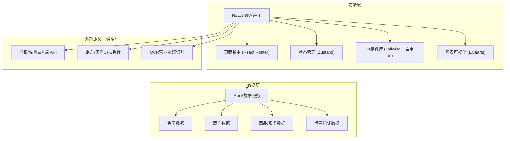
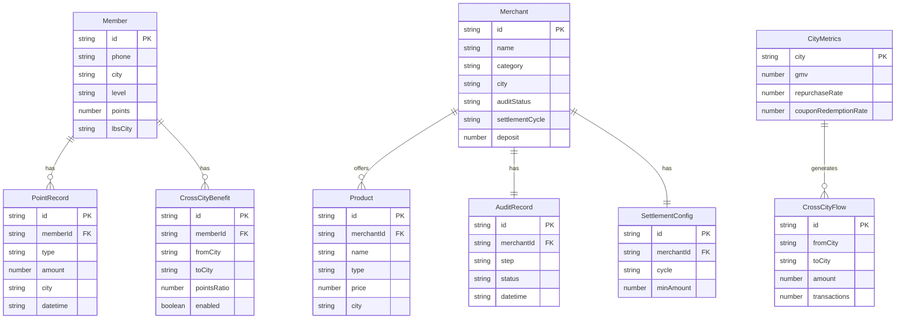

## 1. 架构设计



## 2. 技术说明

- **前端框架**：React@18 + TypeScript
- **样式方案**：TailwindCSS@3 + CSS Variables（主题色系统）
- **构建工具**：Vite
- **路由方案**：React Router@6
- **状态管理**：Zustand（轻量级，适合中型应用）
- **图表可视化**：ECharts@5（支持地图、桑基图、折线图等复杂图表）
- **动画库**：Framer Motion（页面切换、卡片入场、数据动效）
- **后端服务**：无独立后端，使用Mock数据模拟
- **数据库**：无持久化数据库，Mock JSON数据

## 3. 路由定义

| 路由路径 | 用途 |
|----------|------|
| `/` | 平台首页，城市切换、联盟数据、业务入口 |
| `/dashboard` | 数据运营看板，GMV/复购率/核销率三维看板 |
| `/member` | 会员权益中心，画像/积分/跨城权益/推荐 |
| `/merchant` | 商户治理中心，入驻审核/规则引擎/结算配置 |
| `/scenarios` | 消费场景广场，电影/电商/本地生活/核销 |

## 4. API定义（Mock数据接口）

### 4.1 会员相关

```typescript
interface Member {
  id: string;
  phone: string;
  city: string;
  level: "bronze" | "silver" | "gold" | "diamond";
  points: number;
  lbsCity: string;
  tags: string[];
  crossCityBenefits: CrossCityBenefit[];
}

interface CrossCityBenefit {
  fromCity: string;
  toCity: string;
  pointsRatio: number;
  enabled: boolean;
}
```

### 4.2 商户相关

```typescript
interface Merchant {
  id: string;
  name: string;
  category: string;
  city: string;
  auditStatus: "pending_ocr" | "pending_review" | "pending_deposit" | "active" | "rejected";
  settlementCycle: "T+1" | "T+3" | "T+7";
  deposit: number;
  qualification: {
    businessLicense: string;
    legalPerson: string;
    registeredCapital: string;
  };
}
```

### 4.3 商品/服务相关

```typescript
interface Product {
  id: string;
  name: string;
  type: "movie" | "ecommerce" | "local_life";
  city: string;
  price: number;
  originalPrice: number;
  image: string;
  cpsRate?: number;
  externalUrl?: string;
  cinema?: {
    name: string;
    hall: string;
    showtime: string;
  };
}
```

### 4.4 运营数据相关

```typescript
interface CityMetrics {
  city: string;
  gmv: number;
  gmvTrend: number[];
  repurchaseRate: number;
  repurchaseTrend: number[];
  couponRedemptionRate: number;
  couponTrend: number[];
}

interface CrossCityFlow {
  fromCity: string;
  toCity: string;
  amount: number;
  transactions: number;
}
```

## 5. 服务端架构（不适用）

本平台前端原型不包含独立后端服务，所有数据通过Mock方式提供。

## 6. 数据模型

### 6.1 数据模型定义



### 6.2 数据定义语言（DDL）

本平台使用Mock数据，无需DDL。数据以TypeScript常量形式定义在`src/mocks/`目录下。
