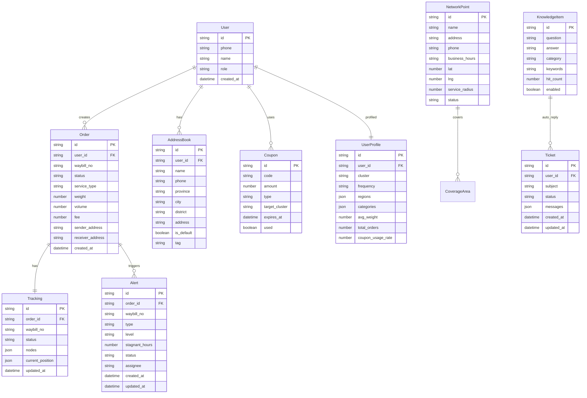

## 1. 架构设计

```mermaid
graph TB
    "C端用户浏览器" --> "React前端"
    "运营人员浏览器" --> "React前端"
    "React前端" --> "Express API网关"
    "Express API网关" --> "运单服务"
    "Express API网关" --> "订单服务"
    "Express API网关" --> "网点服务"
    "Express API网关" --> "运费服务"
    "Express API网关" --> "预警服务"
    "Express API网关" --> "知识库服务"
    "Express API网关" --> "画像服务"
    "运单服务" --> "SQLite数据库"
    "订单服务" --> "SQLite数据库"
    "网点服务" --> "SQLite数据库"
    "运费服务" --> "SQLite数据库"
    "预警服务" --> "SQLite数据库"
    "知识库服务" --> "SQLite数据库"
    "画像服务" --> "SQLite数据库"
    "运单服务" --> "圆通API(模拟)"
```

## 2. 技术说明
- 前端: React@18 + Tailwind CSS@3 + Vite + Zustand + React Router
- 初始化工具: vite-init
- 后端: Express@4 + TypeScript (ESM)
- 数据库: SQLite (better-sqlite3)，Mock数据填充
- 地图: 前端使用模拟地图组件（CSS/Canvas实现）
- 外部API: 圆通API使用模拟数据对接

## 3. 路由定义
| 路由 | 用途 |
|------|------|
| / | 首页：品牌展示、快捷入口、运单动态 |
| /track | 运单追踪页：多入口查询、物流时间轴 |
| /order | 自助下单页：地址簿+电子面单 |
| /coverage | 派件范围识别页：GPS定位+网点匹配 |
| /estimate | 运费试算页：三级计价模型 |
| /profile | 个人中心页：地址簿、历史订单、优惠券 |
| /admin/alerts | 后台异常预警页：滞留件处理 |
| /admin/networks | 后台网点围栏页：地图围栏管理 |
| /admin/knowledge | 后台知识库页：问题管理与工单 |
| /admin/profiling | 后台行为画像页：聚类看板与推送 |

## 4. API定义

### 运单相关
```typescript
interface TrackingRequest {
  type: "phone" | "waybill" | "scan";
  value: string;
}

interface TrackingNode {
  time: string;
  location: string;
  status: string;
  description: string;
}

interface TrackingResponse {
  waybillNo: string;
  status: "in_transit" | "delivered" | "exception" | "picked_up";
  sender: { name: string; city: string };
  receiver: { name: string; city: string };
  nodes: TrackingNode[];
  currentPosition: { lat: number; lng: number };
  estimatedDelivery: string;
  exception?: { type: string; message: string };
}

// GET /api/tracking?type=phone&value=13800138000
// GET /api/tracking?type=waybill&value=YT1234567890
```

### 订单相关
```typescript
interface CreateOrderRequest {
  sender: {
    name: string;
    phone: string;
    province: string;
    city: string;
    district: string;
    address: string;
  };
  receiver: {
    name: string;
    phone: string;
    province: string;
    city: string;
    district: string;
    address: string;
  };
  package: {
    category: string;
    weight: number;
    volume: number;
    remark: string;
  };
  serviceType: "economy" | "standard" | "express";
}

interface CreateOrderResponse {
  orderId: string;
  waybillNo: string;
  electronicWaybill: string;
  estimatedFee: number;
  estimatedDelivery: string;
}

// POST /api/orders
// GET /api/orders?page=1&size=10
// GET /api/orders/:id
```

### 网点相关
```typescript
interface NetworkPoint {
  id: string;
  name: string;
  address: string;
  phone: string;
  businessHours: string;
  location: { lat: number; lng: number };
  serviceRadius: number;
  coveragePolygon: { lat: number; lng: number }[];
  status: "active" | "inactive";
}

interface CoverageRequest {
  lat: number;
  lng: number;
  address?: string;
}

interface CoverageResponse {
  matched: boolean;
  networks: NetworkPoint[];
  distances: number[];
}

// GET /api/networks/coverage?lat=31.23&lng=121.47
// GET /api/networks
// POST /api/networks
// PUT /api/networks/:id
// DELETE /api/networks/:id
```

### 运费试算
```typescript
interface EstimateRequest {
  origin: { province: string; city: string; district: string };
  destination: { province: string; city: string; district: string };
  weight: number;
  volume: number;
}

interface EstimateTier {
  type: "economy" | "standard" | "express";
  name: string;
  price: number;
  estimatedDays: string;
  description: string;
}

interface EstimateResponse {
  tiers: EstimateTier[];
  distance: number;
}

// POST /api/estimate
```

### 异常预警
```typescript
interface Alert {
  id: string;
  waybillNo: string;
  type: "stagnant" | "damaged" | "lost" | "returned";
  level: "high" | "medium" | "low";
  stagnantHours: number;
  description: string;
  status: "pending" | "processing" | "resolved";
  assignee?: string;
  createdAt: string;
  updatedAt: string;
  remarks: { author: string; content: string; time: string }[];
}

// GET /api/alerts?status=pending&level=high
// PUT /api/alerts/:id/assign
// PUT /api/alerts/:id/resolve
// POST /api/alerts/:id/remarks
```

### 知识库
```typescript
interface KnowledgeItem {
  id: string;
  question: string;
  answer: string;
  category: string;
  keywords: string[];
  hitCount: number;
  enabled: boolean;
}

interface Ticket {
  id: string;
  userId: string;
  subject: string;
  status: "open" | "in_progress" | "resolved" | "closed";
  messages: { role: "user" | "agent" | "bot"; content: string; time: string }[];
  createdAt: string;
  updatedAt: string;
}

// GET /api/knowledge?q=运费
// POST /api/knowledge
// PUT /api/knowledge/:id
// DELETE /api/knowledge/:id
// GET /api/tickets?status=open
// PUT /api/tickets/:id
// POST /api/tickets/:id/messages
```

### 行为画像
```typescript
interface UserProfile {
  userId: string;
  cluster: string;
  frequency: "high" | "medium" | "low";
  regions: string[];
  categories: string[];
  avgWeight: number;
  totalOrders: number;
  couponUsageRate: number;
}

interface ClusterInfo {
  name: string;
  description: string;
  userCount: number;
  avgFrequency: number;
  topRegions: string[];
  topCategories: string[];
}

interface PushCouponRequest {
  clusterName: string;
  couponId: string;
  message: string;
}

// GET /api/profiling/users?cluster=高频用户
// GET /api/profiling/clusters
// GET /api/profiling/dashboard
// POST /api/profiling/push-coupon
```

### 地址簿
```typescript
interface AddressBookItem {
  id: string;
  name: string;
  phone: string;
  province: string;
  city: string;
  district: string;
  address: string;
  isDefault: boolean;
  tag: "home" | "office" | "other";
}

// GET /api/address-book
// POST /api/address-book
// PUT /api/address-book/:id
// DELETE /api/address-book/:id
```

## 5. 服务架构图

```mermaid
graph LR
    "Controller层" --> "Service层"
    "Service层" --> "Repository层"
    "Repository层" --> "SQLite数据库"
```

## 6. 数据模型

### 6.1 数据模型定义



### 6.2 数据定义语言

```sql
CREATE TABLE users (
    id TEXT PRIMARY KEY,
    phone TEXT NOT NULL UNIQUE,
    name TEXT NOT NULL,
    role TEXT NOT NULL DEFAULT 'user',
    created_at TEXT NOT NULL DEFAULT (datetime('now'))
);

CREATE TABLE orders (
    id TEXT PRIMARY KEY,
    user_id TEXT NOT NULL REFERENCES users(id),
    waybill_no TEXT UNIQUE,
    status TEXT NOT NULL DEFAULT 'pending',
    service_type TEXT NOT NULL DEFAULT 'standard',
    weight REAL NOT NULL DEFAULT 0,
    volume REAL NOT NULL DEFAULT 0,
    fee REAL NOT NULL DEFAULT 0,
    sender_name TEXT,
    sender_phone TEXT,
    sender_address TEXT,
    receiver_name TEXT,
    receiver_phone TEXT,
    receiver_address TEXT,
    package_category TEXT,
    remark TEXT,
    created_at TEXT NOT NULL DEFAULT (datetime('now')),
    updated_at TEXT NOT NULL DEFAULT (datetime('now'))
);

CREATE TABLE tracking (
    id TEXT PRIMARY KEY,
    order_id TEXT NOT NULL REFERENCES orders(id),
    waybill_no TEXT NOT NULL,
    status TEXT NOT NULL DEFAULT 'pending',
    nodes TEXT NOT NULL DEFAULT '[]',
    current_position TEXT,
    estimated_delivery TEXT,
    exception_type TEXT,
    exception_message TEXT,
    updated_at TEXT NOT NULL DEFAULT (datetime('now'))
);

CREATE TABLE address_book (
    id TEXT PRIMARY KEY,
    user_id TEXT NOT NULL REFERENCES users(id),
    name TEXT NOT NULL,
    phone TEXT NOT NULL,
    province TEXT NOT NULL,
    city TEXT NOT NULL,
    district TEXT NOT NULL,
    address TEXT NOT NULL,
    is_default INTEGER NOT NULL DEFAULT 0,
    tag TEXT NOT NULL DEFAULT 'other',
    created_at TEXT NOT NULL DEFAULT (datetime('now'))
);

CREATE TABLE alerts (
    id TEXT PRIMARY KEY,
    order_id TEXT REFERENCES orders(id),
    waybill_no TEXT NOT NULL,
    type TEXT NOT NULL,
    level TEXT NOT NULL DEFAULT 'medium',
    stagnant_hours INTEGER DEFAULT 0,
    status TEXT NOT NULL DEFAULT 'pending',
    assignee TEXT,
    remarks TEXT NOT NULL DEFAULT '[]',
    created_at TEXT NOT NULL DEFAULT (datetime('now')),
    updated_at TEXT NOT NULL DEFAULT (datetime('now'))
);

CREATE TABLE network_points (
    id TEXT PRIMARY KEY,
    name TEXT NOT NULL,
    address TEXT NOT NULL,
    phone TEXT NOT NULL,
    business_hours TEXT NOT NULL,
    lat REAL NOT NULL,
    lng REAL NOT NULL,
    service_radius REAL NOT NULL DEFAULT 3.0,
    coverage_polygon TEXT NOT NULL DEFAULT '[]',
    status TEXT NOT NULL DEFAULT 'active'
);

CREATE TABLE knowledge_items (
    id TEXT PRIMARY KEY,
    question TEXT NOT NULL,
    answer TEXT NOT NULL,
    category TEXT NOT NULL,
    keywords TEXT NOT NULL DEFAULT '[]',
    hit_count INTEGER NOT NULL DEFAULT 0,
    enabled INTEGER NOT NULL DEFAULT 1,
    created_at TEXT NOT NULL DEFAULT (datetime('now'))
);

CREATE TABLE tickets (
    id TEXT PRIMARY KEY,
    user_id TEXT REFERENCES users(id),
    subject TEXT NOT NULL,
    status TEXT NOT NULL DEFAULT 'open',
    messages TEXT NOT NULL DEFAULT '[]',
    created_at TEXT NOT NULL DEFAULT (datetime('now')),
    updated_at TEXT NOT NULL DEFAULT (datetime('now'))
);

CREATE TABLE user_profiles (
    id TEXT PRIMARY KEY,
    user_id TEXT NOT NULL REFERENCES users(id),
    cluster TEXT NOT NULL DEFAULT 'general',
    frequency TEXT NOT NULL DEFAULT 'low',
    regions TEXT NOT NULL DEFAULT '[]',
    categories TEXT NOT NULL DEFAULT '[]',
    avg_weight REAL NOT NULL DEFAULT 0,
    total_orders INTEGER NOT NULL DEFAULT 0,
    coupon_usage_rate REAL NOT NULL DEFAULT 0,
    updated_at TEXT NOT NULL DEFAULT (datetime('now'))
);

CREATE TABLE coupons (
    id TEXT PRIMARY KEY,
    code TEXT NOT NULL UNIQUE,
    amount REAL NOT NULL,
    type TEXT NOT NULL DEFAULT 'fixed',
    target_cluster TEXT,
    expires_at TEXT NOT NULL,
    used INTEGER NOT NULL DEFAULT 0,
    user_id TEXT REFERENCES users(id),
    created_at TEXT NOT NULL DEFAULT (datetime('now'))
);

CREATE INDEX idx_orders_user_id ON orders(user_id);
CREATE INDEX idx_orders_waybill_no ON orders(waybill_no);
CREATE INDEX idx_tracking_waybill_no ON tracking(waybill_no);
CREATE INDEX idx_address_book_user_id ON address_book(user_id);
CREATE INDEX idx_alerts_status ON alerts(status);
CREATE INDEX idx_alerts_level ON alerts(level);
CREATE INDEX idx_knowledge_category ON knowledge_items(category);
CREATE INDEX idx_tickets_status ON tickets(status);
CREATE INDEX idx_user_profiles_cluster ON user_profiles(cluster);
CREATE INDEX idx_coupons_user_id ON coupons(user_id);
```
