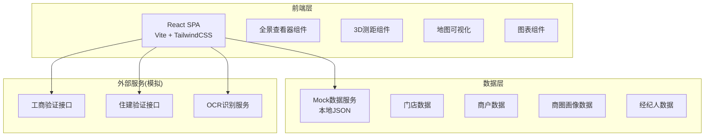
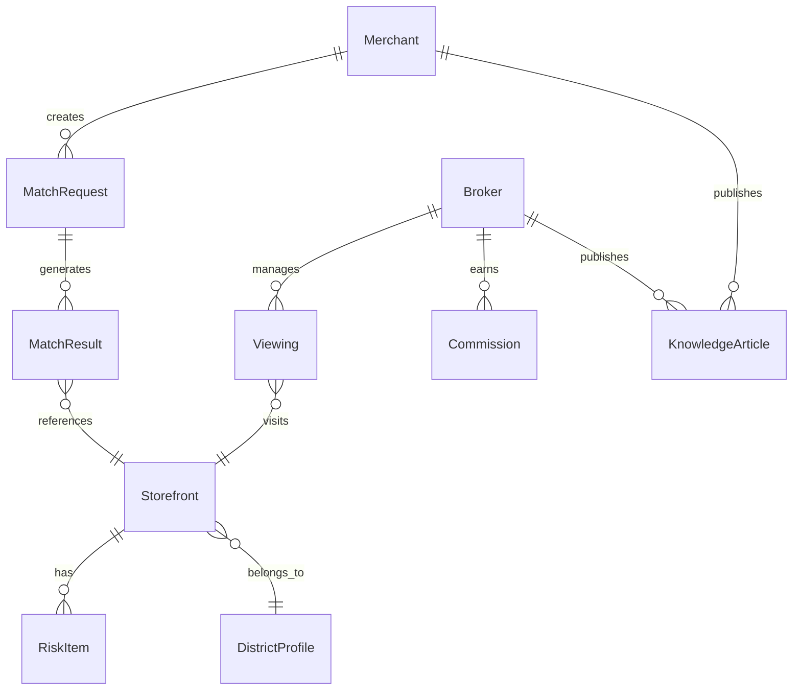

## 1. 架构设计



## 2. 技术说明

- **前端框架**：React@18 + TypeScript
- **样式方案**：TailwindCSS@3 + CSS Modules（复杂组件）
- **构建工具**：Vite
- **路由**：React Router v6
- **状态管理**：Zustand
- **图表库**：Recharts
- **3D渲染**：Three.js + @react-three/fiber + @react-three/drei
- **全景查看**：Pannellum（React封装）
- **地图**：Mapbox GL JS（模拟数据展示）
- **动画**：Framer Motion
- **富文本**：React Quill
- **后端**：无（纯前端 + Mock数据）
- **数据库**：无（使用本地JSON Mock数据）

## 3. 路由定义

| 路由 | 用途 |
|------|------|
| `/` | 首页 - Hero区、热门商圈、精选门店、知识库精选 |
| `/storehall` | 门店大厅 - 筛选+地图/列表双视图 |
| `/store/:id` | 门店详情 - 全景浏览、3D测距、信息面板、商圈画像、风险报告 |
| `/match` | 智能匹配 - 需求画像采集+匹配结果 |
| `/pricing` | 智能定价 - 门店信息输入+定价建议 |
| `/knowledge` | 知识库 - 文章列表+分类 |
| `/knowledge/:id` | 文章详情 - 富文本内容+互动 |
| `/knowledge/publish` | 发布文章 |
| `/broker` | 经纪人中心 - 认证+带看+返佣 |
| `/risk` | 风险提示引擎 - 产权预警+合同检查 |

## 4. API定义（Mock）

```typescript
interface Storefront {
  id: string
  title: string
  propertyType: "自有" | "租赁" | "合作"
  area: number
  rent: number
  transferFee: number
  district: string
  address: string
  industry: string[]
  panoramas: string[]
  model3dUrl: string
  verified: boolean
  verificationDetails: {
    commerce: "passed" | "failed" | "pending"
    housing: "passed" | "failed" | "pending"
  }
  riskLevel: "low" | "medium" | "high"
  riskItems: RiskItem[]
  createdAt: string
  updatedAt: string
}

interface Merchant {
  id: string
  name: string
  phone: string
  licenseOcrResult: {
    companyName: string
    unifiedCode: string
    legalPerson: string
    businessScope: string
    confidence: number
  }
  industry: string
  budgetRange: [number, number]
  businessYears: number
  preferredDistricts: string[]
}

interface DistrictProfile {
  id: string
  name: string
  footTraffic: { date: string; value: number }[]
  competitionDensity: { category: string; count: number }[]
  consumptionLevel: { tier: string; percentage: number }[]
  avgRent: number
  onlineStores: number
}

interface Broker {
  id: string
  name: string
  certified: boolean
  viewings: Viewing[]
  commissions: Commission[]
}

interface Viewing {
  id: string
  storeId: string
  clientName: string
  scheduledAt: string
  status: "scheduled" | "completed" | "cancelled"
  notes: string
}

interface Commission {
  id: string
  dealId: string
  amount: number
  status: "pending" | "settled" | "withdrawn"
  settledAt?: string
}

interface RiskItem {
  type: "property" | "contract" | "business"
  level: "low" | "medium" | "high"
  title: string
  description: string
  suggestion: string
}

interface KnowledgeArticle {
  id: string
  title: string
  category: "transfer_tips" | "location_skills" | "avoid_pitfalls"
  author: string
  authorRole: "merchant" | "broker"
  content: string
  likes: number
  bookmarks: number
  comments: number
  createdAt: string
}

interface MatchRequest {
  industry: string
  budgetRange: [number, number]
  businessYears: number
  preferredDistricts: string[]
  areaRange?: [number, number]
}

interface MatchResult {
  storeId: string
  score: number
  dimensions: {
    industry: number
    budget: number
    experience: number
    location: number
  }
}
```

## 5. 服务器架构

本项目为纯前端应用，无后端服务器。所有数据通过Mock JSON文件提供，外部接口（工商验证、住建验证、OCR识别）通过模拟延迟返回预设结果。

## 6. 数据模型

### 6.1 数据模型定义



### 6.2 数据定义语言

```sql
CREATE TABLE storefronts (
  id VARCHAR(36) PRIMARY KEY,
  title VARCHAR(200) NOT NULL,
  property_type ENUM('自有','租赁','合作') NOT NULL,
  area DECIMAL(10,2) NOT NULL,
  rent DECIMAL(12,2) NOT NULL,
  transfer_fee DECIMAL(12,2),
  district_id VARCHAR(36) NOT NULL,
  address VARCHAR(500) NOT NULL,
  industry JSON,
  panoramas JSON,
  model3d_url VARCHAR(500),
  verified BOOLEAN DEFAULT FALSE,
  commerce_status ENUM('passed','failed','pending') DEFAULT 'pending',
  housing_status ENUM('passed','failed','pending') DEFAULT 'pending',
  risk_level ENUM('low','medium','high') DEFAULT 'low',
  created_at TIMESTAMP DEFAULT CURRENT_TIMESTAMP,
  updated_at TIMESTAMP DEFAULT CURRENT_TIMESTAMP ON UPDATE CURRENT_TIMESTAMP,
  INDEX idx_district (district_id),
  INDEX idx_industry ((CAST(industry AS CHAR(200)))),
  INDEX idx_rent (rent),
  INDEX idx_risk (risk_level)
);

CREATE TABLE merchants (
  id VARCHAR(36) PRIMARY KEY,
  name VARCHAR(100) NOT NULL,
  phone VARCHAR(20) NOT NULL UNIQUE,
  license_company VARCHAR(200),
  license_code VARCHAR(50),
  license_person VARCHAR(50),
  license_scope TEXT,
  license_confidence DECIMAL(5,4),
  industry VARCHAR(100),
  budget_min DECIMAL(12,2),
  budget_max DECIMAL(12,2),
  business_years INT,
  preferred_districts JSON,
  created_at TIMESTAMP DEFAULT CURRENT_TIMESTAMP
);

CREATE TABLE district_profiles (
  id VARCHAR(36) PRIMARY KEY,
  name VARCHAR(100) NOT NULL,
  avg_rent DECIMAL(12,2),
  online_stores INT DEFAULT 0,
  foot_traffic JSON,
  competition_density JSON,
  consumption_level JSON
);

CREATE TABLE brokers (
  id VARCHAR(36) PRIMARY KEY,
  name VARCHAR(100) NOT NULL,
  phone VARCHAR(20) NOT NULL UNIQUE,
  certified BOOLEAN DEFAULT FALSE,
  created_at TIMESTAMP DEFAULT CURRENT_TIMESTAMP
);

CREATE TABLE viewings (
  id VARCHAR(36) PRIMARY KEY,
  broker_id VARCHAR(36) NOT NULL,
  store_id VARCHAR(36) NOT NULL,
  client_name VARCHAR(100),
  scheduled_at TIMESTAMP NOT NULL,
  status ENUM('scheduled','completed','cancelled') DEFAULT 'scheduled',
  notes TEXT,
  FOREIGN KEY (broker_id) REFERENCES brokers(id),
  FOREIGN KEY (store_id) REFERENCES storefronts(id),
  INDEX idx_broker (broker_id),
  INDEX idx_status (status)
);

CREATE TABLE commissions (
  id VARCHAR(36) PRIMARY KEY,
  broker_id VARCHAR(36) NOT NULL,
  deal_id VARCHAR(36),
  amount DECIMAL(12,2) NOT NULL,
  status ENUM('pending','settled','withdrawn') DEFAULT 'pending',
  settled_at TIMESTAMP NULL,
  FOREIGN KEY (broker_id) REFERENCES brokers(id)
);

CREATE TABLE risk_items (
  id VARCHAR(36) PRIMARY KEY,
  store_id VARCHAR(36) NOT NULL,
  type ENUM('property','contract','business') NOT NULL,
  level ENUM('low','medium','high') NOT NULL,
  title VARCHAR(200) NOT NULL,
  description TEXT,
  suggestion TEXT,
  FOREIGN KEY (store_id) REFERENCES storefronts(id),
  INDEX idx_store (store_id)
);

CREATE TABLE knowledge_articles (
  id VARCHAR(36) PRIMARY KEY,
  title VARCHAR(200) NOT NULL,
  category ENUM('transfer_tips','location_skills','avoid_pitfalls') NOT NULL,
  author_id VARCHAR(36) NOT NULL,
  author_role ENUM('merchant','broker') NOT NULL,
  content TEXT NOT NULL,
  likes INT DEFAULT 0,
  bookmarks INT DEFAULT 0,
  comments INT DEFAULT 0,
  created_at TIMESTAMP DEFAULT CURRENT_TIMESTAMP,
  INDEX idx_category (category)
);
```
