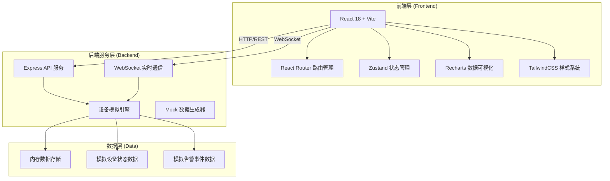
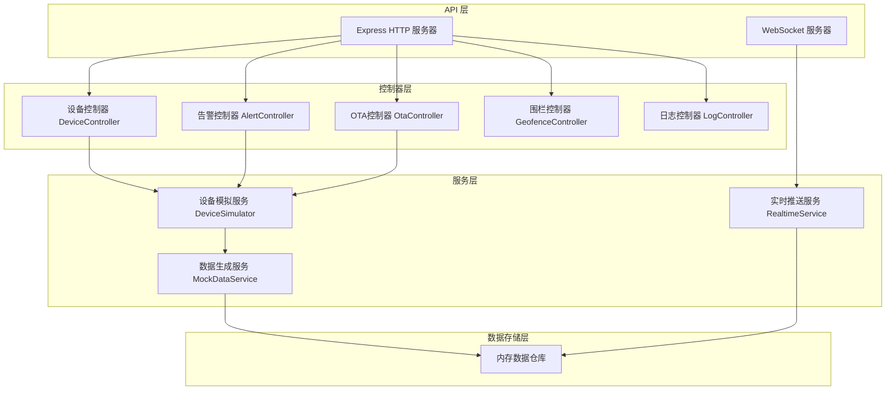
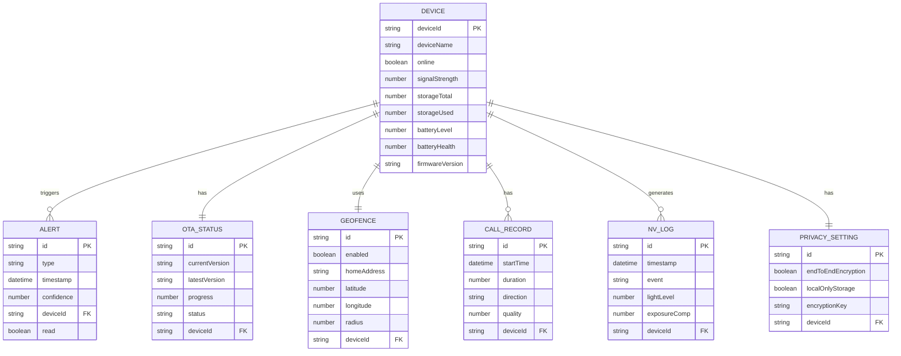

## 1. 架构设计



## 2. 技术描述

- **前端框架**：React 18 + TypeScript
- **构建工具**：Vite 5
- **路由管理**：React Router v6
- **状态管理**：Zustand
- **样式方案**：TailwindCSS 3
- **图表库**：Recharts
- **图标库**：Lucide React
- **后端服务**：Express 4
- **实时通信**：WebSocket (ws)
- **数据方案**：Mock 数据 + 内存存储（开发阶段）
- **初始化方式**：Vite 脚手架初始化

## 3. 路由定义

| 路由路径 | 页面名称 | 模块说明 |
|----------|----------|----------|
| /dashboard | 设备健康看板 | 首页概览，设备健康度指标展示 |
| /monitor | 实时视频监控 | 视频流播放、双链路状态、快捷操作 |
| /events | AI侦测事件 | 告警事件列表、识别统计、告警配置 |
| /ota | 固件OTA管理 | 版本管理、升级进度、升级历史 |
| /geofence | 地理围栏设置 | 围栏配置、触发规则设置 |
| /privacy | 隐私与存储 | 加密设置、存储管理、视频片段 |
| /logs | 语音对讲与日志 | 通话记录、夜视日志、设备日志 |

## 4. API 定义

### 4.1 REST API

```typescript
// 设备健康数据
interface DeviceHealth {
  deviceId: string;
  deviceName: string;
  online: boolean;
  signalStrength: number; // -50 ~ -100 dBm
  storageTotal: number;   // GB
  storageUsed: number;    // GB
  batteryLevel: number;   // 0-100%
  batteryHealth: number;  // 0-100%
  firmwareVersion: string;
  lastSeen: string;
}

// 信号强度历史
interface SignalHistory {
  timestamp: string;
  value: number;
}

// 电池衰减数据
interface BatteryTrend {
  date: string;
  capacity: number; // 相对初始容量百分比
}

// 告警事件
interface AlertEvent {
  id: string;
  type: 'visitor' | 'family' | 'pet' | 'motion';
  timestamp: string;
  thumbnail: string;
  confidence: number;
  deviceId: string;
  read: boolean;
}

// OTA 升级状态
interface OtaStatus {
  currentVersion: string;
  latestVersion: string;
  upgradeProgress: number; // 0-100
  upgradeStatus: 'idle' | 'downloading' | 'verifying' | 'installing' | 'rebooting' | 'success' | 'failed';
  breakpoint: number | null;
  deltaSize: string;
  fullSize: string;
  releaseNotes: string;
}

// 地理围栏配置
interface GeofenceConfig {
  enabled: boolean;
  homeAddress: string;
  latitude: number;
  longitude: number;
  radius: number; // 米，默认3000
  enterAction: 'silent' | 'notify' | 'disarm';
  exitAction: 'notify' | 'arm' | 'ignore';
}

// 视频链路状态
interface VideoLinkStatus {
  p2p: {
    connected: boolean;
    latency: number; // ms
    bitrate: number; // kbps
  };
  relay: {
    connected: boolean;
    latency: number;
    bitrate: number;
  };
  activeLink: 'p2p' | 'relay';
  resolution: '1080p' | '720p' | '480p';
  fps: number;
  codec: 'H.265' | 'H.264';
}

// 夜视日志
interface NightVisionLog {
  id: string;
  timestamp: string;
  event: 'ir_on' | 'ir_off' | 'exposure_adjust';
  lightLevel: number; // lux
  exposureCompensation: number; // EV
  reason: string;
}

// 通话记录
interface CallRecord {
  id: string;
  startTime: string;
  duration: number; // 秒
  direction: 'incoming' | 'outgoing';
  quality: number; // 1-5
  noiseReduction: boolean;
  echoCancellation: boolean;
}
```

### 4.2 API 端点

| 方法 | 路径 | 说明 |
|------|------|------|
| GET | /api/devices | 获取设备列表及健康状态 |
| GET | /api/devices/:id | 获取设备详情 |
| GET | /api/devices/:id/signal/history | 获取信号强度历史数据 |
| GET | /api/devices/:id/battery/trend | 获取电池衰减趋势 |
| GET | /api/alerts | 获取告警事件列表 |
| GET | /api/alerts/stats | 获取告警分类统计 |
| PUT | /api/alerts/:id/read | 标记告警已读 |
| GET | /api/ota/status | 获取OTA升级状态 |
| POST | /api/ota/start | 开始固件升级 |
| POST | /api/ota/pause | 暂停升级（断点续传） |
| GET | /api/ota/history | 获取升级历史 |
| GET | /api/geofence | 获取地理围栏配置 |
| PUT | /api/geofence | 更新地理围栏配置 |
| GET | /api/video/link-status | 获取视频链路状态 |
| GET | /api/logs/night-vision | 获取夜视日志 |
| GET | /api/logs/calls | 获取通话记录 |
| GET | /api/privacy/storage | 获取存储使用情况 |
| PUT | /api/privacy/encryption | 更新加密设置 |

### 4.3 WebSocket 事件

| 事件名 | 方向 | 说明 |
|--------|------|------|
| device_status | S→C | 设备在线状态变更 |
| alert_new | S→C | 新告警事件推送 |
| ota_progress | S→C | OTA升级进度实时推送 |
| video_link_change | S→C | 视频链路切换通知 |
| signal_update | S→C | 信号强度实时更新 |

## 5. 服务端架构图



## 6. 数据模型

### 6.1 实体关系图



### 6.2 初始数据

系统启动时自动生成以下模拟数据：
- 1 个主猫眼设备（设备ID: doorbell-001）
- 最近 7 天的信号强度历史数据（每小时一个采样点）
- 最近 30 天的电池衰减趋势数据
- 最近 24 小时的告警事件（15-25 条随机生成）
- 3 个 OTA 升级历史记录
- 最近 10 条夜视切换日志
- 最近 5 条通话记录
- 默认地理围栏配置（3km 半径）
