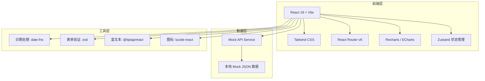
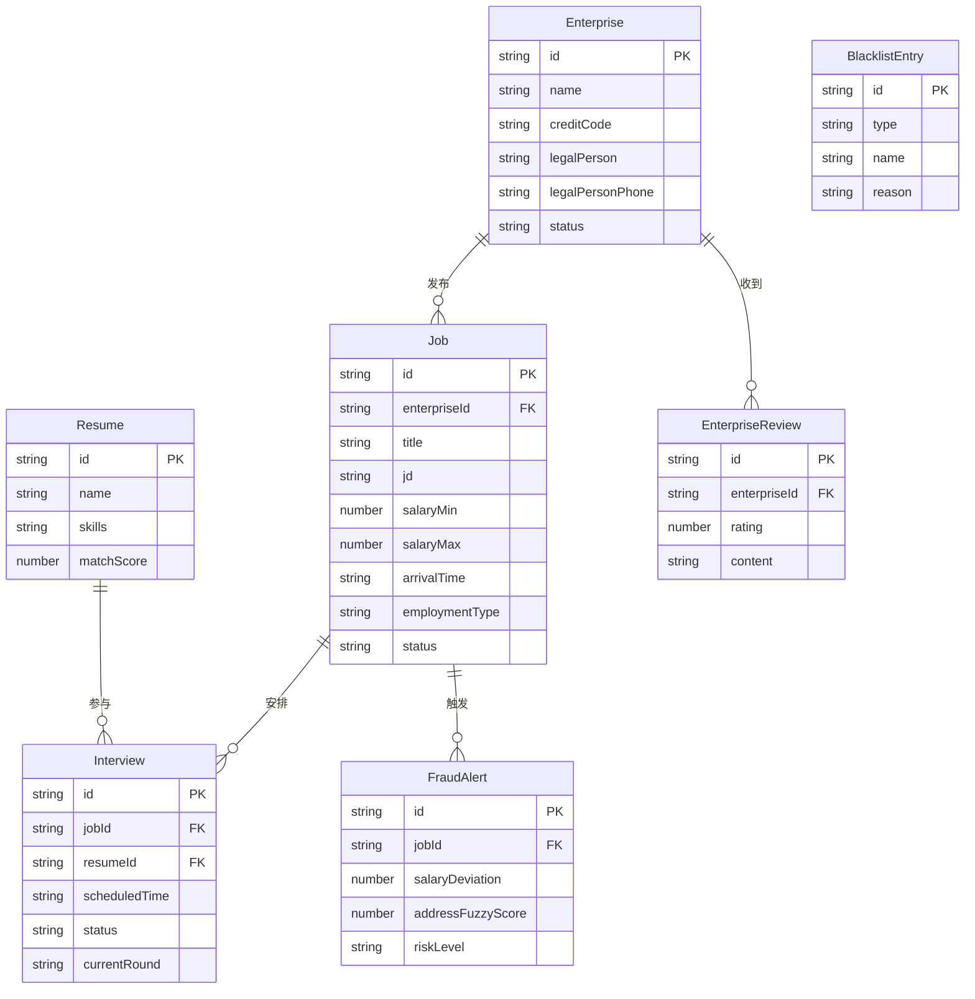

## 1. 架构设计



## 2. 技术说明

- **前端框架**：React@18 + Vite + TypeScript
- **初始化工具**：Vite（react-ts 模板）
- **样式方案**：Tailwind CSS@3 + CSS Variables 主题
- **路由**：React Router v6
- **状态管理**：Zustand
- **图表库**：Recharts（折线图、环形图）+ 自定义SVG热力地图
- **后端**：无后端，使用 Mock 数据模拟 API 响应
- **数据库**：无，使用本地 JSON Mock 数据

## 3. 路由定义

| 路由 | 用途 |
|------|------|
| `/login` | 登录注册页（角色选择+手机号验证码） |
| `/enterprise/certification` | 企业认证页（OCR+法人验证） |
| `/enterprise/jobs` | 职位管理页（列表+发布+编辑） |
| `/enterprise/jobs/create` | 职位发布表单页 |
| `/enterprise/jobs/:id` | 职位详情页 |
| `/enterprise/resumes` | 简历匹配页（NLP匹配度+筛选） |
| `/enterprise/interviews` | 面试邀约页（日历+短信+记录） |
| `/applicant/home` | 应聘者首页（推荐职位） |
| `/applicant/enterprise/:id` | 应聘者查看企业详情页 |
| `/applicant/applications` | 应聘者投递记录页 |
| `/admin/blacklist` | 后台黑名单管理页 |
| `/admin/fraud-detection` | 后台虚假职位识别页 |
| `/admin/interview-tracking` | 后台面试反馈闭环跟踪页 |
| `/admin/dashboard` | 数据看板页（招聘周期+关闭原因+热力图） |

## 4. API 定义

### 4.1 企业认证相关

```typescript
interface EnterpriseCertification {
  id: string;
  companyName: string;
  creditCode: string;
  legalPerson: string;
  legalPersonPhone: string;
  licenseImageUrl: string;
  status: "pending" | "approved" | "rejected";
  rejectReason?: string;
  createdAt: string;
}

interface OCRRresult {
  companyName: string;
  creditCode: string;
  legalPerson: string;
  address: string;
  confidence: number;
}
```

### 4.2 职位相关

```typescript
interface Job {
  id: string;
  enterpriseId: string;
  title: string;
  jd: string;
  salaryMin: number;
  salaryMax: number;
  arrivalTime: string;
  employmentType: "fulltime" | "parttime" | "project";
  location: string;
  status: "active" | "closed" | "draft";
  closeReason?: string;
  applicationsCount: number;
  createdAt: string;
}
```

### 4.3 简历匹配相关

```typescript
interface Resume {
  id: string;
  name: string;
  skills: string[];
  experience: string;
  education: string;
  matchScore: number;
  matchedKeywords: string[];
  skillRadar: { axis: string; value: number }[];
}
```

### 4.4 面试相关

```typescript
interface Interview {
  id: string;
  jobId: string;
  resumeId: string;
  enterpriseId: string;
  scheduledTime: string;
  format: "onsite" | "video" | "phone";
  status: "pending" | "confirmed" | "rejected" | "expired" | "completed";
  smsReminderSent: boolean;
  currentRound: "first" | "second" | "final";
  rounds: InterviewRound[];
}

interface InterviewRound {
  round: "first" | "second" | "final";
  score: number;
  feedback: string;
  attribution: string[];
  completedAt?: string;
}
```

### 4.5 企业评价相关

```typescript
interface EnterpriseReview {
  id: string;
  enterpriseId: string;
  rating: number;
  content: string;
  anonymousName: string;
  createdAt: string;
}

interface EnterpriseProfile {
  id: string;
  name: string;
  certified: boolean;
  responseRate: number;
  avgResponseTime: string;
  reviews: EnterpriseReview[];
}
```

### 4.6 风控相关

```typescript
interface BlacklistEntry {
  id: string;
  type: "enterprise" | "individual";
  name: string;
  reason: "black_agency" | "fraud" | "other";
  description: string;
  createdAt: string;
}

interface FraudAlert {
  id: string;
  jobId: string;
  jobTitle: string;
  salaryDeviation: number;
  addressFuzzyScore: number;
  riskLevel: "high" | "medium" | "low";
  status: "pending" | "reviewed" | "dismissed";
  createdAt: string;
}
```

### 4.7 数据看板相关

```typescript
interface DashboardData {
  avgRecruitmentCycle: { month: string; days: number }[];
  jobCloseReasons: { reason: string; count: number }[];
  regionHeatmap: { region: string; demand: number; supply: number }[];
}
```

## 5. 服务端架构

不适用，本项目为纯前端 + Mock 数据方案。

## 6. 数据模型

### 6.1 数据模型定义



### 6.2 数据定义语言

使用本地 Mock JSON 数据，无需 DDL。
