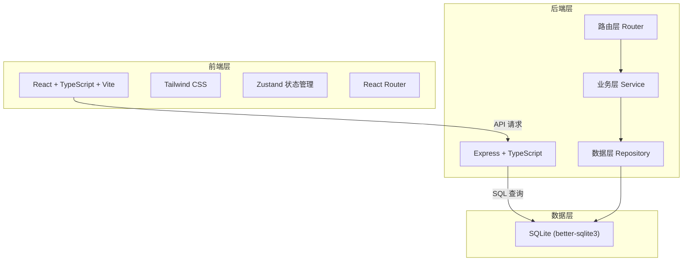
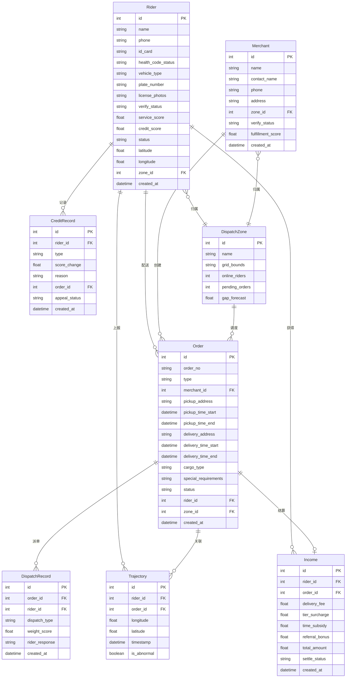

## 1. 架构设计



## 2. 技术说明

- 前端: React@18 + TypeScript + Tailwind CSS@3 + Vite + Zustand
- 初始化工具: vite-init
- 后端: Express@4 + TypeScript (ESM格式)
- 数据库: SQLite (better-sqlite3)，文件路径 data/app.sqlite
- 无额外外部服务依赖

## 3. 路由定义

| 路由 | 用途 |
|------|------|
| / | 工作台首页 - 运力供需概览 |
| /riders | 骑手管理 - 骑手列表 |
| /riders/:id | 骑手详情 - 认证/信用/收入 |
| /orders | 订单管理 - 订单列表 |
| /orders/create | 创建订单 |
| /orders/:id | 订单详情 |
| /merchants | 商户管理 - 商户列表 |
| /merchants/:id | 商户详情 |
| /dispatch | 区域调度 - 热力图与派单 |
| /tracking | 轨迹与告警 |
| /settlement | 收入结算 |
| /dashboard | 运营看板 |
| /risk-control | 风控策略 |

## 4. API 定义

### 4.1 骑手 API

| 方法 | 路径 | 描述 |
|------|------|------|
| GET | /api/riders | 骑手列表（分页/筛选） |
| GET | /api/riders/:id | 骑手详情 |
| POST | /api/riders | 创建骑手 |
| PUT | /api/riders/:id | 更新骑手信息 |
| PUT | /api/riders/:id/verify | 审核骑手认证 |
| GET | /api/riders/:id/credit | 骑手信用档案 |
| POST | /api/riders/:id/credit/appeal | 信用申诉 |
| GET | /api/riders/:id/income | 骑手收入明细 |
| PUT | /api/riders/:id/location | 更新骑手位置 |
| GET | /api/riders/:id/trajectory | 骑手轨迹 |

### 4.2 订单 API

| 方法 | 路径 | 描述 |
|------|------|------|
| GET | /api/orders | 订单列表（分页/筛选） |
| GET | /api/orders/:id | 订单详情 |
| POST | /api/orders | 创建订单 |
| PUT | /api/orders/:id | 更新订单 |
| POST | /api/orders/:id/dispatch | 智能派单 |
| POST | /api/orders/:id/grab | 抢单 |
| POST | /api/orders/:id/transfer | 转单 |
| PUT | /api/orders/:id/status | 更新订单状态 |

### 4.3 商户 API

| 方法 | 路径 | 描述 |
|------|------|------|
| GET | /api/merchants | 商户列表 |
| GET | /api/merchants/:id | 商户详情 |
| POST | /api/merchants | 创建商户 |
| PUT | /api/merchants/:id | 更新商户 |
| PUT | /api/merchants/:id/verify | 审核商户入驻 |
| GET | /api/merchants/:id/score | 商户履约评分 |

### 4.4 区域调度 API

| 方法 | 路径 | 描述 |
|------|------|------|
| GET | /api/zones | 区域列表 |
| GET | /api/zones/:id | 区域详情 |
| GET | /api/zones/heatmap | 热力图数据 |
| GET | /api/zones/forecast | 运力缺口预测 |
| POST | /api/dispatch/auto | 自动派单 |
| POST | /api/dispatch/batch | 批量派单 |

### 4.5 告警 API

| 方法 | 路径 | 描述 |
|------|------|------|
| GET | /api/alerts | 告警列表 |
| PUT | /api/alerts/:id | 处理告警 |

### 4.6 结算 API

| 方法 | 路径 | 描述 |
|------|------|------|
| GET | /api/settlement/income | 收入统计 |
| GET | /api/settlement/rules | 计价规则 |
| POST | /api/settlement/rules | 创建计价规则 |
| PUT | /api/settlement/rules/:id | 更新计价规则 |

### 4.7 运营 API

| 方法 | 路径 | 描述 |
|------|------|------|
| GET | /api/dashboard/overview | 供需概览 |
| GET | /api/dashboard/fulfillment | 履约率诊断 |
| GET | /api/dashboard/roi | 活动ROI |
| GET | /api/dashboard/trends | 趋势数据 |

### 4.8 风控 API

| 方法 | 路径 | 描述 |
|------|------|------|
| GET | /api/risk/rules | 风控规则列表 |
| POST | /api/risk/rules | 创建风控规则 |
| PUT | /api/risk/rules/:id | 更新风控规则 |
| DELETE | /api/risk/rules/:id | 删除风控规则 |

## 5. 服务端架构图


## 6. 数据模型

### 6.1 ER 图



### 6.2 DDL

```sql
CREATE TABLE IF NOT EXISTS dispatch_zones (
    id INTEGER PRIMARY KEY AUTOINCREMENT,
    name TEXT NOT NULL,
    grid_bounds TEXT NOT NULL,
    online_riders INTEGER DEFAULT 0,
    pending_orders INTEGER DEFAULT 0,
    gap_forecast REAL DEFAULT 0,
    created_at TEXT DEFAULT (datetime('now')),
    updated_at TEXT DEFAULT (datetime('now'))
);

CREATE TABLE IF NOT EXISTS riders (
    id INTEGER PRIMARY KEY AUTOINCREMENT,
    name TEXT NOT NULL,
    phone TEXT NOT NULL UNIQUE,
    id_card TEXT NOT NULL,
    health_code_status TEXT DEFAULT 'green',
    vehicle_type TEXT DEFAULT 'electric_bike',
    plate_number TEXT,
    license_photos TEXT,
    verify_status TEXT DEFAULT 'pending',
    service_score REAL DEFAULT 100,
    credit_score REAL DEFAULT 100,
    status TEXT DEFAULT 'offline',
    latitude REAL DEFAULT 0,
    longitude REAL DEFAULT 0,
    zone_id INTEGER REFERENCES dispatch_zones(id),
    created_at TEXT DEFAULT (datetime('now')),
    updated_at TEXT DEFAULT (datetime('now'))
);

CREATE TABLE IF NOT EXISTS merchants (
    id INTEGER PRIMARY KEY AUTOINCREMENT,
    name TEXT NOT NULL,
    contact_name TEXT NOT NULL,
    phone TEXT NOT NULL,
    address TEXT NOT NULL,
    zone_id INTEGER REFERENCES dispatch_zones(id),
    verify_status TEXT DEFAULT 'pending',
    fulfillment_score REAL DEFAULT 5.0,
    created_at TEXT DEFAULT (datetime('now')),
    updated_at TEXT DEFAULT (datetime('now'))
);

CREATE TABLE IF NOT EXISTS orders (
    id INTEGER PRIMARY KEY AUTOINCREMENT,
    order_no TEXT NOT NULL UNIQUE,
    type TEXT DEFAULT 'instant',
    merchant_id INTEGER REFERENCES merchants(id),
    pickup_address TEXT NOT NULL,
    pickup_time_start TEXT,
    pickup_time_end TEXT,
    delivery_address TEXT NOT NULL,
    delivery_time_start TEXT,
    delivery_time_end TEXT,
    cargo_type TEXT DEFAULT 'normal',
    special_requirements TEXT,
    status TEXT DEFAULT 'pending',
    rider_id INTEGER REFERENCES riders(id),
    zone_id INTEGER REFERENCES dispatch_zones(id),
    created_at TEXT DEFAULT (datetime('now')),
    updated_at TEXT DEFAULT (datetime('now'))
);

CREATE TABLE IF NOT EXISTS trajectories (
    id INTEGER PRIMARY KEY AUTOINCREMENT,
    rider_id INTEGER REFERENCES riders(id),
    order_id INTEGER REFERENCES orders(id),
    longitude REAL NOT NULL,
    latitude REAL NOT NULL,
    timestamp TEXT DEFAULT (datetime('now')),
    is_abnormal INTEGER DEFAULT 0
);

CREATE TABLE IF NOT EXISTS incomes (
    id INTEGER PRIMARY KEY AUTOINCREMENT,
    rider_id INTEGER REFERENCES riders(id),
    order_id INTEGER REFERENCES orders(id),
    delivery_fee REAL DEFAULT 0,
    tier_surcharge REAL DEFAULT 0,
    time_subsidy REAL DEFAULT 0,
    referral_bonus REAL DEFAULT 0,
    total_amount REAL DEFAULT 0,
    settle_status TEXT DEFAULT 'pending',
    created_at TEXT DEFAULT (datetime('now'))
);

CREATE TABLE IF NOT EXISTS credit_records (
    id INTEGER PRIMARY KEY AUTOINCREMENT,
    rider_id INTEGER REFERENCES riders(id),
    type TEXT NOT NULL,
    score_change REAL NOT NULL,
    reason TEXT,
    order_id INTEGER REFERENCES orders(id),
    appeal_status TEXT DEFAULT 'none',
    created_at TEXT DEFAULT (datetime('now'))
);

CREATE TABLE IF NOT EXISTS dispatch_records (
    id INTEGER PRIMARY KEY AUTOINCREMENT,
    order_id INTEGER REFERENCES orders(id),
    rider_id INTEGER REFERENCES riders(id),
    dispatch_type TEXT DEFAULT 'auto',
    weight_score REAL DEFAULT 0,
    rider_response TEXT DEFAULT 'pending',
    created_at TEXT DEFAULT (datetime('now'))
);

CREATE TABLE IF NOT EXISTS alerts (
    id INTEGER PRIMARY KEY AUTOINCREMENT,
    type TEXT NOT NULL,
    rider_id INTEGER REFERENCES riders(id),
    order_id INTEGER REFERENCES orders(id),
    description TEXT,
    status TEXT DEFAULT 'pending',
    created_at TEXT DEFAULT (datetime('now')),
    handled_at TEXT
);

CREATE TABLE IF NOT EXISTS pricing_rules (
    id INTEGER PRIMARY KEY AUTOINCREMENT,
    name TEXT NOT NULL,
    type TEXT NOT NULL,
    base_distance REAL DEFAULT 3,
    base_fee REAL DEFAULT 5,
    extra_per_km REAL DEFAULT 1.5,
    time_start TEXT,
    time_end TEXT,
    subsidy_rate REAL DEFAULT 0,
    tier_thresholds TEXT,
    is_active INTEGER DEFAULT 1,
    created_at TEXT DEFAULT (datetime('now')),
    updated_at TEXT DEFAULT (datetime('now'))
);

CREATE TABLE IF NOT EXISTS risk_rules (
    id INTEGER PRIMARY KEY AUTOINCREMENT,
    name TEXT NOT NULL,
    type TEXT NOT NULL,
    condition_config TEXT NOT NULL,
    action_config TEXT NOT NULL,
    is_active INTEGER DEFAULT 1,
    priority INTEGER DEFAULT 0,
    created_at TEXT DEFAULT (datetime('now')),
    updated_at TEXT DEFAULT (datetime('now'))
);
```
