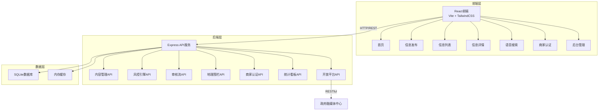
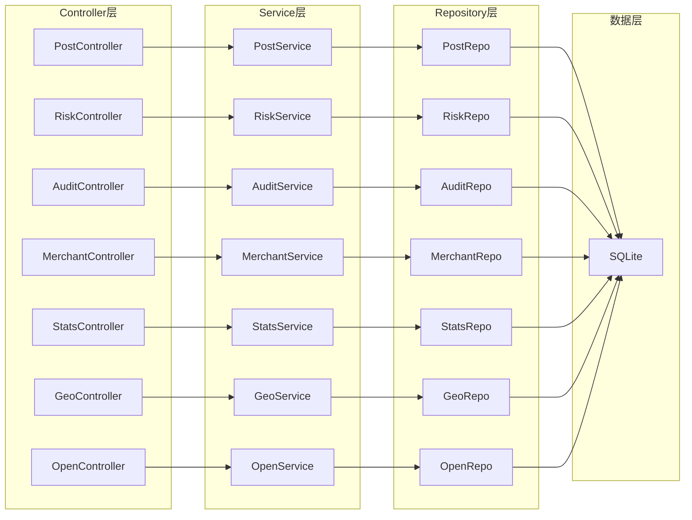
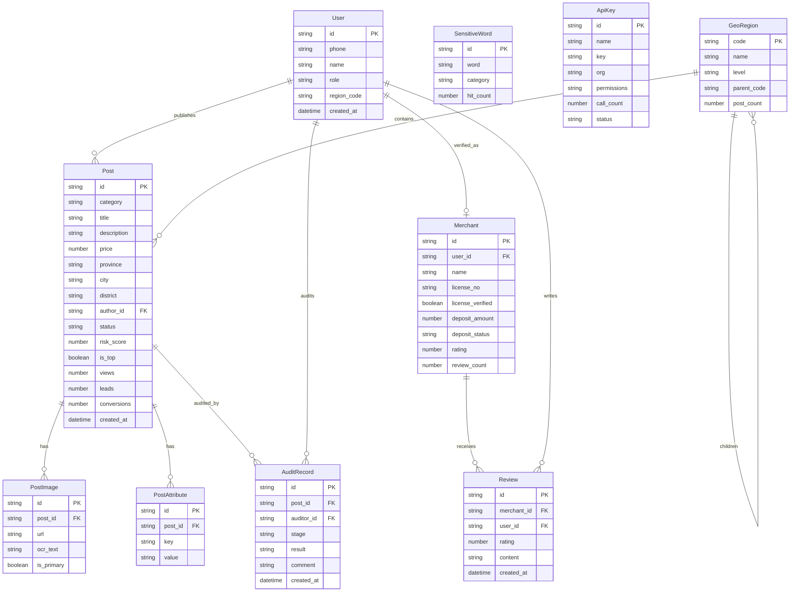

## 1. 架构设计



## 2. 技术说明

- **前端**：React@18 + TailwindCSS@3 + Vite + Zustand（状态管理）+ React Router（路由）
- **初始化工具**：vite-init
- **后端**：Express@4 + TypeScript（ESM格式）
- **数据库**：SQLite（开发阶段），Mock数据辅助演示
- **图表库**：Recharts（流量看板/审核统计）
- **地图**：Mock地图组件（无外部地图服务依赖）
- **OCR/语音**：前端模拟实现，展示交互流程

## 3. 路由定义

| 路由 | 用途 |
|------|------|
| `/` | 首页-地理围栏定位、类目导航、热门推荐 |
| `/publish` | 信息发布-类目选择、OCR识别、表单填写 |
| `/publish/:category` | 按类目发布-动态表单 |
| `/list` | 信息列表-多维筛选、多视图切换 |
| `/list/:id` | 信息详情-内容展示、联系信息、评价 |
| `/voice-search` | 语音搜索-语音输入、意图分类、结果匹配 |
| `/merchant` | 商家认证中心-执照核验、保证金、评价 |
| `/merchant/:id` | 商家主页 |
| `/admin` | 后台管理-导航入口 |
| `/admin/risk` | 内容风控引擎 |
| `/admin/traffic` | 流量分发看板 |
| `/admin/audit` | 分级审核流 |
| `/admin/geo` | 地理围栏管理 |
| `/admin/api` | API开放管理 |

## 4. API定义

### 4.1 内容管理API

```typescript
interface Post {
  id: string;
  category: CategoryType;
  title: string;
  description: string;
  price?: number;
  images: string[];
  location: Location;
  authorId: string;
  authorType: 'user' | 'merchant';
  merchantVerified?: boolean;
  status: 'pending' | 'reviewing' | 'approved' | 'rejected' | 'flagged';
  riskScore: number;
  createdAt: string;
  stats: PostStats;
}

type CategoryType = 'job' | 'rent' | 'share' | 'secondhand_house' | 'secondhand' | 'vehicle' | 'service' | 'education' | 'pet' | 'dating' | 'franchise' | 'other';

interface Location {
  province: string;
  city: string;
  district: string;
}

interface PostStats {
  views: number;
  leads: number;
  conversions: number;
}

// GET /api/posts?category=&province=&city=&district=&page=&limit=
// GET /api/posts/:id
// POST /api/posts
// PUT /api/posts/:id
// DELETE /api/posts/:id
```

### 4.2 风控引擎API

```typescript
interface RiskResult {
  postId: string;
  sensitiveWords: string[];
  imageRisk: 'safe' | 'suspect' | 'dangerous';
  phoneValid: boolean;
  overallScore: number; // 0-100
}

// POST /api/risk/check
// GET /api/risk/words?page=&limit=
// POST /api/risk/words
// DELETE /api/risk/words/:id
// GET /api/risk/stats
```

### 4.3 审核流API

```typescript
interface AuditRecord {
  id: string;
  postId: string;
  stage: 'initial' | 'review' | 'top_recommend';
  auditorId: string;
  result: 'approved' | 'rejected' | 'flagged';
  comment?: string;
  createdAt: string;
}

// GET /api/audit/queue?stage=initial&province=&city=
// POST /api/audit/:id/action
// GET /api/audit/stats
```

### 4.4 商家认证API

```typescript
interface Merchant {
  id: string;
  name: string;
  licenseNo: string;
  licenseVerified: boolean;
  depositAmount: number;
  depositStatus: 'paid' | 'pending' | 'refunded';
  rating: number;
  reviewCount: number;
  createdAt: string;
}

// POST /api/merchants/verify
// GET /api/merchants/:id
// GET /api/merchants/:id/reviews
// POST /api/merchants/:id/deposit
```

### 4.5 统计看板API

```typescript
interface TrafficStats {
  viewsTrend: TimeSeriesPoint[];
  leadRate: TimeSeriesPoint[];
  conversionFunnel: FunnelData;
  categoryDistribution: CategoryStat[];
}

interface FunnelData {
  views: number;
  clicks: number;
  leads: number;
  conversions: number;
}

// GET /api/stats/traffic?start=&end=
// GET /api/stats/funnel?start=&end=
// GET /api/stats/audit
```

### 4.6 地理围栏API

```typescript
interface GeoRegion {
  code: string;
  name: string;
  level: 'province' | 'city' | 'district';
  parentCode: string | null;
  postCount: number;
}

// GET /api/geo/regions?parentCode=
// GET /api/geo/heatmap
// GET /api/geo/stats?code=
```

### 4.7 开放平台API

```typescript
interface ApiKey {
  id: string;
  name: string;
  key: string;
  org: string;
  permissions: string[];
  callCount: number;
  status: 'active' | 'suspended';
}

// GET /api/open/keys
// POST /api/open/keys
// DELETE /api/open/keys/:id
// GET /api/open/stats
```

## 5. 服务架构图



## 6. 数据模型

### 6.1 数据模型定义



### 6.2 数据定义语言

```sql
CREATE TABLE users (
  id TEXT PRIMARY KEY,
  phone TEXT NOT NULL UNIQUE,
  name TEXT NOT NULL,
  role TEXT NOT NULL DEFAULT 'user',
  region_code TEXT,
  created_at TEXT NOT NULL DEFAULT (datetime('now'))
);

CREATE TABLE posts (
  id TEXT PRIMARY KEY,
  category TEXT NOT NULL,
  title TEXT NOT NULL,
  description TEXT NOT NULL,
  price REAL,
  province TEXT NOT NULL,
  city TEXT NOT NULL,
  district TEXT NOT NULL,
  author_id TEXT NOT NULL REFERENCES users(id),
  status TEXT NOT NULL DEFAULT 'pending',
  risk_score INTEGER NOT NULL DEFAULT 0,
  is_top INTEGER NOT NULL DEFAULT 0,
  views INTEGER NOT NULL DEFAULT 0,
  leads INTEGER NOT NULL DEFAULT 0,
  conversions INTEGER NOT NULL DEFAULT 0,
  created_at TEXT NOT NULL DEFAULT (datetime('now'))
);

CREATE INDEX idx_posts_category ON posts(category);
CREATE INDEX idx_posts_location ON posts(province, city, district);
CREATE INDEX idx_posts_status ON posts(status);
CREATE INDEX idx_posts_risk ON posts(risk_score);

CREATE TABLE post_images (
  id TEXT PRIMARY KEY,
  post_id TEXT NOT NULL REFERENCES posts(id) ON DELETE CASCADE,
  url TEXT NOT NULL,
  ocr_text TEXT,
  is_primary INTEGER NOT NULL DEFAULT 0
);

CREATE TABLE post_attributes (
  id TEXT PRIMARY KEY,
  post_id TEXT NOT NULL REFERENCES posts(id) ON DELETE CASCADE,
  key TEXT NOT NULL,
  value TEXT NOT NULL
);

CREATE TABLE merchants (
  id TEXT PRIMARY KEY,
  user_id TEXT NOT NULL UNIQUE REFERENCES users(id),
  name TEXT NOT NULL,
  license_no TEXT NOT NULL,
  license_verified INTEGER NOT NULL DEFAULT 0,
  deposit_amount REAL NOT NULL DEFAULT 0,
  deposit_status TEXT NOT NULL DEFAULT 'pending',
  rating REAL NOT NULL DEFAULT 0,
  review_count INTEGER NOT NULL DEFAULT 0
);

CREATE TABLE reviews (
  id TEXT PRIMARY KEY,
  merchant_id TEXT NOT NULL REFERENCES merchants(id),
  user_id TEXT NOT NULL REFERENCES users(id),
  rating INTEGER NOT NULL,
  content TEXT,
  created_at TEXT NOT NULL DEFAULT (datetime('now'))
);

CREATE TABLE sensitive_words (
  id TEXT PRIMARY KEY,
  word TEXT NOT NULL UNIQUE,
  category TEXT NOT NULL,
  hit_count INTEGER NOT NULL DEFAULT 0
);

CREATE TABLE audit_records (
  id TEXT PRIMARY KEY,
  post_id TEXT NOT NULL REFERENCES posts(id),
  auditor_id TEXT NOT NULL REFERENCES users(id),
  stage TEXT NOT NULL,
  result TEXT NOT NULL,
  comment TEXT,
  created_at TEXT NOT NULL DEFAULT (datetime('now'))
);

CREATE INDEX idx_audit_stage ON audit_records(stage);
CREATE INDEX idx_audit_auditor ON audit_records(auditor_id);

CREATE TABLE api_keys (
  id TEXT PRIMARY KEY,
  name TEXT NOT NULL,
  key TEXT NOT NULL UNIQUE,
  org TEXT NOT NULL,
  permissions TEXT NOT NULL,
  call_count INTEGER NOT NULL DEFAULT 0,
  status TEXT NOT NULL DEFAULT 'active'
);

CREATE TABLE geo_regions (
  code TEXT PRIMARY KEY,
  name TEXT NOT NULL,
  level TEXT NOT NULL,
  parent_code TEXT REFERENCES geo_regions(code),
  post_count INTEGER NOT NULL DEFAULT 0
);

CREATE INDEX idx_geo_parent ON geo_regions(parent_code);
CREATE INDEX idx_geo_level ON geo_regions(level);
```
