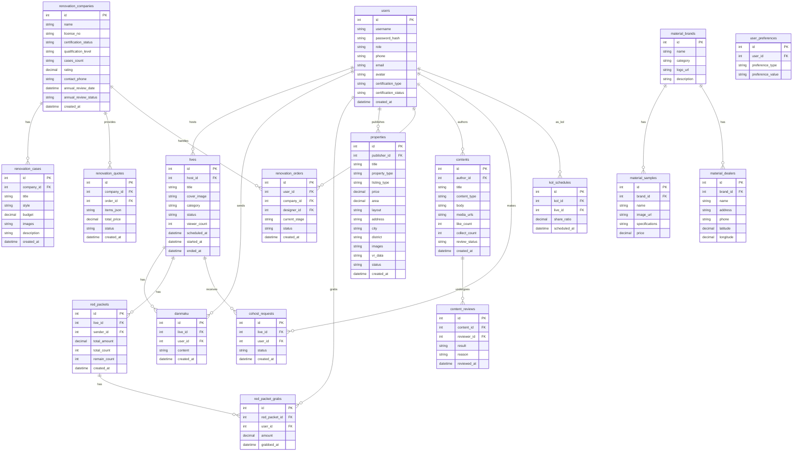

## 1. 架构设计

```mermaid
graph TB
    "浏览器前端" --> "Vite Dev Server :49058"
    "Vite Dev Server :49058" --> "Express API :59058"
    "Express API :59058" --> "SQLite 数据库"
    "Express API :59058" --> "文件存储(上传)"
    "Express API :59058" --> "WebSocket(弹幕/连麦)"
```

- 前端：React 18 + Vite + TailwindCSS + React Router
- 后端：Express 4 + better-sqlite3 + ws（WebSocket）
- 数据库：SQLite（data/app.sqlite）
- 实时通信：WebSocket（弹幕、连麦信令、红包通知）

## 2. 技术说明

- **前端**: React@18 + TailwindCSS@3 + Vite + React Router@6
- **初始化工具**: Vite (npm create vite@latest)
- **后端**: Express@4 + better-sqlite3 + ws + multer
- **数据库**: SQLite（文件数据库 data/app.sqlite），无需外部数据库服务
- **实时通信**: ws库实现WebSocket，用于弹幕和连麦信令
- **文件上传**: multer处理图片/视频上传，存储到uploads/目录
- **认证**: JWT令牌 + bcrypt密码哈希

端口规划：
- FRONTEND_PORT = 49058（40000 + 9058）
- BACKEND_PORT = 59058（50000 + 9058）

## 3. 路由定义

| 路由 | 用途 |
|------|------|
| / | 首页：直播推荐、热门房源、装修案例 |
| /live | 直播中心：直播列表、分类筛选 |
| /live/:id | 直播间：视频+弹幕+互动 |
| /properties | 房源中心：新房/二手房/公寓列表 |
| /properties/:id | 房源详情：信息+VR+配套 |
| /renovation | 装修服务：流程导航+公司列表 |
| /renovation/quote-compare | 报价对比工具 |
| /renovation/company/:id | 装修公司详情+案例 |
| /content | 内容中心：短视频/图文 |
| /profile | 个人中心：认证/订单/收藏 |
| /admin | 后台管理：审核/KOL/年审 |

## 4. API定义

### 4.1 认证相关
```
POST   /api/auth/register       - 用户注册
POST   /api/auth/login          - 用户登录
GET    /api/auth/me             - 获取当前用户
POST   /api/auth/certification  - 提交专业认证
```

### 4.2 直播相关
```
GET    /api/lives               - 直播列表（分页+筛选）
GET    /api/lives/:id           - 直播详情
POST   /api/lives               - 创建直播（主播）
POST   /api/lives/:id/danmaku   - 发送弹幕
POST   /api/lives/:id/redpacket - 发红包/抢红包
POST   /api/lives/:id/cohost    - 申请连麦
GET    /api/lives/:id/messages  - 获取聊天记录
```

### 4.3 房源相关
```
GET    /api/properties          - 房源列表（分页+筛选+搜索）
GET    /api/properties/:id      - 房源详情
POST   /api/properties          - 发布房源
GET    /api/properties/:id/vr   - 获取VR场景数据
```

### 4.4 装修相关
```
GET    /api/renovation/companies    - 装修公司列表
GET    /api/renovation/companies/:id - 公司详情+案例
POST   /api/renovation/quotes       - 提交报价单
POST   /api/renovation/quote-compare - 报价对比解析
GET    /api/renovation/orders        - 装修订单列表
POST   /api/renovation/orders        - 创建装修订单
GET    /api/renovation/orders/:id    - 订单详情+进度
```

### 4.5 内容相关
```
GET    /api/contents            - 内容列表（分页+类型筛选）
GET    /api/contents/:id        - 内容详情
POST   /api/contents            - 发布内容
POST   /api/contents/:id/like   - 点赞
POST   /api/contents/:id/collect - 收藏
```

### 4.6 建材品牌
```
GET    /api/materials/brands    - 品牌列表
GET    /api/materials/samples   - 样品库
GET    /api/materials/dealers   - 经销商地图
```

### 4.7 后台管理
```
GET    /api/admin/reviews       - 待审核列表
POST   /api/admin/reviews/:id   - 审核操作
GET    /api/admin/kols          - KOL列表+数据
POST   /api/admin/kols/:id/schedule - 直播排期
GET    /api/admin/companies/annual - 年审提醒列表
GET    /api/admin/dashboard     - 数据看板
```

### 4.8 系统
```
GET    /api/health              - 健康检查
```

## 5. 服务端架构图

```mermaid
graph LR
    "Controller" --> "Service"
    "Service" --> "Repository"
    "Repository" --> "SQLite"
```

- Controller层：路由处理、参数校验、响应格式化
- Service层：业务逻辑、数据组装、权限校验
- Repository层：SQL查询、数据映射、事务管理

## 6. 数据模型

### 6.1 数据模型定义



### 6.2 数据定义语言

```sql
CREATE TABLE users (
  id INTEGER PRIMARY KEY AUTOINCREMENT,
  username TEXT NOT NULL UNIQUE,
  password_hash TEXT NOT NULL,
  role TEXT NOT NULL DEFAULT 'user',
  phone TEXT,
  email TEXT,
  avatar TEXT,
  certification_type TEXT,
  certification_status TEXT DEFAULT 'none',
  certification_materials TEXT,
  created_at DATETIME DEFAULT CURRENT_TIMESTAMP,
  updated_at DATETIME DEFAULT CURRENT_TIMESTAMP
);

CREATE TABLE lives (
  id INTEGER PRIMARY KEY AUTOINCREMENT,
  host_id INTEGER NOT NULL REFERENCES users(id),
  title TEXT NOT NULL,
  cover_image TEXT,
  category TEXT NOT NULL DEFAULT 'house_viewing',
  status TEXT NOT NULL DEFAULT 'scheduled',
  viewer_count INTEGER DEFAULT 0,
  stream_url TEXT,
  scheduled_at DATETIME,
  started_at DATETIME,
  ended_at DATETIME,
  created_at DATETIME DEFAULT CURRENT_TIMESTAMP
);

CREATE TABLE danmaku (
  id INTEGER PRIMARY KEY AUTOINCREMENT,
  live_id INTEGER NOT NULL REFERENCES lives(id),
  user_id INTEGER NOT NULL REFERENCES users(id),
  content TEXT NOT NULL,
  created_at DATETIME DEFAULT CURRENT_TIMESTAMP
);

CREATE TABLE red_packets (
  id INTEGER PRIMARY KEY AUTOINCREMENT,
  live_id INTEGER NOT NULL REFERENCES lives(id),
  sender_id INTEGER NOT NULL REFERENCES users(id),
  total_amount DECIMAL(10,2) NOT NULL,
  total_count INTEGER NOT NULL,
  remain_count INTEGER NOT NULL,
  status TEXT DEFAULT 'active',
  created_at DATETIME DEFAULT CURRENT_TIMESTAMP
);

CREATE TABLE red_packet_grabs (
  id INTEGER PRIMARY KEY AUTOINCREMENT,
  red_packet_id INTEGER NOT NULL REFERENCES red_packets(id),
  user_id INTEGER NOT NULL REFERENCES users(id),
  amount DECIMAL(10,2) NOT NULL,
  grabbed_at DATETIME DEFAULT CURRENT_TIMESTAMP,
  UNIQUE(red_packet_id, user_id)
);

CREATE TABLE properties (
  id INTEGER PRIMARY KEY AUTOINCREMENT,
  publisher_id INTEGER NOT NULL REFERENCES users(id),
  title TEXT NOT NULL,
  property_type TEXT NOT NULL,
  listing_type TEXT NOT NULL,
  price DECIMAL(12,2) NOT NULL,
  area DECIMAL(8,2),
  layout TEXT,
  floor_info TEXT,
  orientation TEXT,
  decoration_status TEXT,
  address TEXT,
  city TEXT,
  district TEXT,
  community TEXT,
  images TEXT,
  vr_data TEXT,
  description TEXT,
  status TEXT DEFAULT 'active',
  created_at DATETIME DEFAULT CURRENT_TIMESTAMP
);

CREATE TABLE renovation_companies (
  id INTEGER PRIMARY KEY AUTOINCREMENT,
  name TEXT NOT NULL,
  license_no TEXT,
  certification_status TEXT DEFAULT 'pending',
  qualification_level TEXT,
  cases_count INTEGER DEFAULT 0,
  rating DECIMAL(3,1) DEFAULT 0,
  contact_phone TEXT,
  description TEXT,
  logo_url TEXT,
  annual_review_date DATE,
  annual_review_status TEXT DEFAULT 'pending',
  created_at DATETIME DEFAULT CURRENT_TIMESTAMP
);

CREATE TABLE renovation_cases (
  id INTEGER PRIMARY KEY AUTOINCREMENT,
  company_id INTEGER NOT NULL REFERENCES renovation_companies(id),
  title TEXT NOT NULL,
  style TEXT,
  budget DECIMAL(10,2),
  area DECIMAL(8,2),
  images TEXT,
  description TEXT,
  created_at DATETIME DEFAULT CURRENT_TIMESTAMP
);

CREATE TABLE renovation_quotes (
  id INTEGER PRIMARY KEY AUTOINCREMENT,
  company_id INTEGER NOT NULL REFERENCES renovation_companies(id),
  order_id INTEGER,
  items_json TEXT NOT NULL,
  total_price DECIMAL(10,2) NOT NULL,
  status TEXT DEFAULT 'pending',
  created_at DATETIME DEFAULT CURRENT_TIMESTAMP
);

CREATE TABLE renovation_orders (
  id INTEGER PRIMARY KEY AUTOINCREMENT,
  user_id INTEGER NOT NULL REFERENCES users(id),
  company_id INTEGER NOT NULL REFERENCES renovation_companies(id),
  designer_id INTEGER REFERENCES users(id),
  current_stage TEXT DEFAULT 'design',
  status TEXT DEFAULT 'pending',
  description TEXT,
  budget DECIMAL(10,2),
  created_at DATETIME DEFAULT CURRENT_TIMESTAMP,
  updated_at DATETIME DEFAULT CURRENT_TIMESTAMP
);

CREATE TABLE contents (
  id INTEGER PRIMARY KEY AUTOINCREMENT,
  author_id INTEGER NOT NULL REFERENCES users(id),
  title TEXT NOT NULL,
  content_type TEXT NOT NULL DEFAULT 'article',
  body TEXT,
  media_urls TEXT,
  like_count INTEGER DEFAULT 0,
  collect_count INTEGER DEFAULT 0,
  view_count INTEGER DEFAULT 0,
  review_status TEXT DEFAULT 'pending',
  tags TEXT,
  created_at DATETIME DEFAULT CURRENT_TIMESTAMP
);

CREATE TABLE content_likes (
  id INTEGER PRIMARY KEY AUTOINCREMENT,
  content_id INTEGER NOT NULL REFERENCES contents(id),
  user_id INTEGER NOT NULL REFERENCES users(id),
  created_at DATETIME DEFAULT CURRENT_TIMESTAMP,
  UNIQUE(content_id, user_id)
);

CREATE TABLE content_collects (
  id INTEGER PRIMARY KEY AUTOINCREMENT,
  content_id INTEGER NOT NULL REFERENCES contents(id),
  user_id INTEGER NOT NULL REFERENCES users(id),
  created_at DATETIME DEFAULT CURRENT_TIMESTAMP,
  UNIQUE(content_id, user_id)
);

CREATE TABLE material_brands (
  id INTEGER PRIMARY KEY AUTOINCREMENT,
  name TEXT NOT NULL,
  category TEXT,
  logo_url TEXT,
  description TEXT,
  created_at DATETIME DEFAULT CURRENT_TIMESTAMP
);

CREATE TABLE material_samples (
  id INTEGER PRIMARY KEY AUTOINCREMENT,
  brand_id INTEGER NOT NULL REFERENCES material_brands(id),
  name TEXT NOT NULL,
  image_url TEXT,
  specifications TEXT,
  price DECIMAL(10,2),
  category TEXT,
  created_at DATETIME DEFAULT CURRENT_TIMESTAMP
);

CREATE TABLE material_dealers (
  id INTEGER PRIMARY KEY AUTOINCREMENT,
  brand_id INTEGER NOT NULL REFERENCES material_brands(id),
  name TEXT NOT NULL,
  address TEXT,
  phone TEXT,
  latitude DECIMAL(10,6),
  longitude DECIMAL(10,6),
  created_at DATETIME DEFAULT CURRENT_TIMESTAMP
);

CREATE TABLE cohost_requests (
  id INTEGER PRIMARY KEY AUTOINCREMENT,
  live_id INTEGER NOT NULL REFERENCES lives(id),
  user_id INTEGER NOT NULL REFERENCES users(id),
  status TEXT DEFAULT 'pending',
  created_at DATETIME DEFAULT CURRENT_TIMESTAMP
);

CREATE TABLE content_reviews (
  id INTEGER PRIMARY KEY AUTOINCREMENT,
  content_id INTEGER NOT NULL REFERENCES contents(id),
  reviewer_id INTEGER REFERENCES users(id),
  result TEXT,
  reason TEXT,
  reviewed_at DATETIME DEFAULT CURRENT_TIMESTAMP
);

CREATE TABLE kol_schedules (
  id INTEGER PRIMARY KEY AUTOINCREMENT,
  kol_id INTEGER NOT NULL REFERENCES users(id),
  live_id INTEGER REFERENCES lives(id),
  share_ratio DECIMAL(5,2) DEFAULT 50.00,
  settlement_status TEXT DEFAULT 'unsettled',
  scheduled_at DATETIME,
  created_at DATETIME DEFAULT CURRENT_TIMESTAMP
);

CREATE TABLE user_preferences (
  id INTEGER PRIMARY KEY AUTOINCREMENT,
  user_id INTEGER NOT NULL REFERENCES users(id),
  preference_type TEXT NOT NULL,
  preference_value TEXT NOT NULL,
  created_at DATETIME DEFAULT CURRENT_TIMESTAMP
);

CREATE INDEX idx_lives_host ON lives(host_id);
CREATE INDEX idx_lives_status ON lives(status);
CREATE INDEX idx_lives_category ON lives(category);
CREATE INDEX idx_danmaku_live ON danmaku(live_id);
CREATE INDEX idx_properties_type ON properties(property_type);
CREATE INDEX idx_properties_city ON properties(city);
CREATE INDEX idx_properties_listing ON properties(listing_type);
CREATE INDEX idx_contents_author ON contents(author_id);
CREATE INDEX idx_contents_type ON contents(content_type);
CREATE INDEX idx_contents_review ON contents(review_status);
CREATE INDEX idx_renovation_companies_cert ON renovation_companies(certification_status);
CREATE INDEX idx_renovation_orders_user ON renovation_orders(user_id);
CREATE INDEX idx_renovation_orders_company ON renovation_orders(company_id);
```
