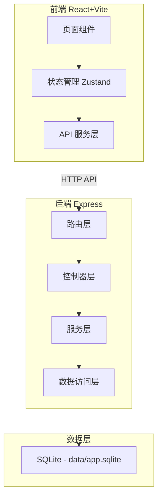
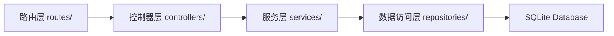
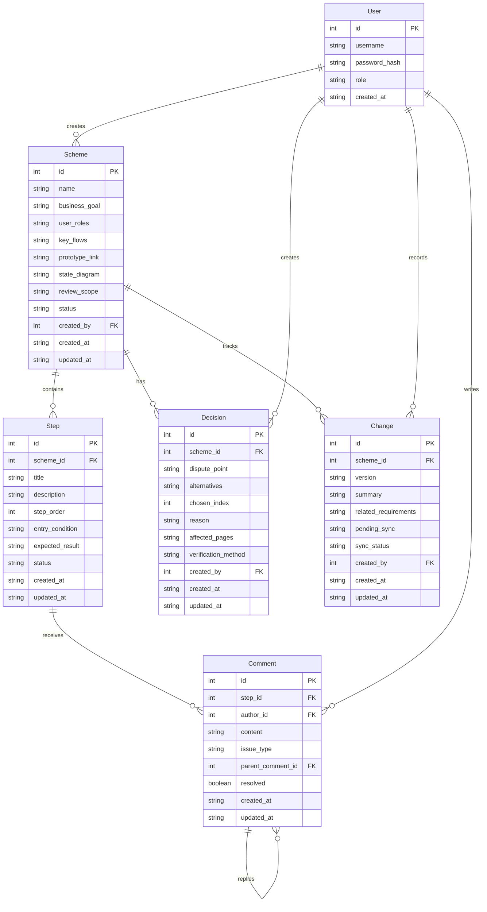

## 1. 架构设计



## 2. 技术说明

- 前端：React@18 + TypeScript + Tailwind CSS@3 + Vite + Zustand
- 初始化工具：vite-init
- 后端：Express@4 + TypeScript (ESM)
- 数据库：SQLite (better-sqlite3)，文件路径 data/app.sqlite
- 端口：FRONTEND_PORT=43475, BACKEND_PORT=53475，仅监听 127.0.0.1

## 3. 路由定义

| 路由 | 用途 |
|------|------|
| /login | 登录页 |
| / | 首页看板 |
| /schemes | 方案列表 |
| /schemes/:id | 方案详情（含流程评审） |
| /schemes/:id/decisions | 决策记录 |
| /schemes/:id/changes | 变更管理 |
| /retrospective | 复盘看板 |

## 4. API 定义

### 4.1 认证

```
POST   /api/auth/login          { username, password } → { token, user }
POST   /api/auth/register       { username, password, role } → { token, user }
GET    /api/auth/me             → { user }
```

### 4.2 方案档案

```
GET    /api/schemes             → Scheme[]
POST   /api/schemes             { name, businessGoal, userRoles, keyFlows[], prototypeLink, stateDiagram, reviewScope } → Scheme
GET    /api/schemes/:id         → Scheme
PUT    /api/schemes/:id         { name?, businessGoal?, userRoles?, keyFlows[], prototypeLink?, stateDiagram?, reviewScope?, status? } → Scheme
DELETE /api/schemes/:id         → { ok }
```

### 4.3 流程步骤

```
GET    /api/schemes/:id/steps          → Step[]
POST   /api/schemes/:id/steps          { title, description, order, entryCondition, expectedResult } → Step
PUT    /api/schemes/:id/steps/:stepId  { title?, description?, order?, entryCondition?, expectedResult?, status? } → Step
DELETE /api/schemes/:id/steps/:stepId  → { ok }
```

### 4.4 步骤评论

```
GET    /api/steps/:stepId/comments     → Comment[]
POST   /api/steps/:stepId/comments     { content, issueType?, parentCommentId? } → Comment
PUT    /api/comments/:commentId        { content?, issueType?, resolved? } → Comment
DELETE /api/comments/:commentId        → { ok }
```

### 4.5 决策记录

```
GET    /api/schemes/:id/decisions           → Decision[]
POST   /api/schemes/:id/decisions           { disputePoint, alternatives[], chosenIndex, reason, affectedPages[], verificationMethod } → Decision
PUT    /api/decisions/:decisionId           { disputePoint?, alternatives?, chosenIndex?, reason?, affectedPages?, verificationMethod? } → Decision
DELETE /api/decisions/:decisionId           → { ok }
```

### 4.6 变更管理

```
GET    /api/schemes/:id/changes            → Change[]
POST   /api/schemes/:id/changes            { version, summary, relatedRequirements[], pendingSync[] } → Change
PUT    /api/changes/:changeId              { summary?, relatedRequirements?, pendingSync?, syncStatus? } → Change
```

### 4.7 复盘看板

```
GET    /api/retrospective/issues           → { issueTypes: { type, count }[], topIssues: Comment[] }
GET    /api/retrospective/rounds           → { schemes: { name, roundCount, passRate }[] }
GET    /api/retrospective/risks            → Comment[]
GET    /api/retrospective/feedback         → { feedback: { scheme, content, author, createdAt }[] }
```

### 4.8 健康

```
GET    /api/health                         → { status: "ok", timestamp }
```

## 5. 服务端架构图



## 6. 数据模型

### 6.1 数据模型定义



### 6.2 数据定义语言

```sql
CREATE TABLE IF NOT EXISTS users (
  id INTEGER PRIMARY KEY AUTOINCREMENT,
  username TEXT NOT NULL UNIQUE,
  password_hash TEXT NOT NULL,
  role TEXT NOT NULL CHECK(role IN ('designer','pm','developer','researcher')),
  created_at TEXT NOT NULL DEFAULT (datetime('now'))
);

CREATE TABLE IF NOT EXISTS schemes (
  id INTEGER PRIMARY KEY AUTOINCREMENT,
  name TEXT NOT NULL,
  business_goal TEXT NOT NULL DEFAULT '',
  user_roles TEXT NOT NULL DEFAULT '[]',
  key_flows TEXT NOT NULL DEFAULT '[]',
  prototype_link TEXT NOT NULL DEFAULT '',
  state_diagram TEXT NOT NULL DEFAULT '',
  review_scope TEXT NOT NULL DEFAULT '',
  status TEXT NOT NULL DEFAULT 'draft' CHECK(status IN ('draft','in_review','approved','rejected','archived')),
  created_by INTEGER NOT NULL REFERENCES users(id),
  created_at TEXT NOT NULL DEFAULT (datetime('now')),
  updated_at TEXT NOT NULL DEFAULT (datetime('now'))
);

CREATE TABLE IF NOT EXISTS steps (
  id INTEGER PRIMARY KEY AUTOINCREMENT,
  scheme_id INTEGER NOT NULL REFERENCES schemes(id) ON DELETE CASCADE,
  title TEXT NOT NULL,
  description TEXT NOT NULL DEFAULT '',
  step_order INTEGER NOT NULL DEFAULT 0,
  entry_condition TEXT NOT NULL DEFAULT '',
  expected_result TEXT NOT NULL DEFAULT '',
  status TEXT NOT NULL DEFAULT 'pending' CHECK(status IN ('pending','reviewing','approved','issue')),
  created_at TEXT NOT NULL DEFAULT (datetime('now')),
  updated_at TEXT NOT NULL DEFAULT (datetime('now'))
);

CREATE TABLE IF NOT EXISTS comments (
  id INTEGER PRIMARY KEY AUTOINCREMENT,
  step_id INTEGER NOT NULL REFERENCES steps(id) ON DELETE CASCADE,
  author_id INTEGER NOT NULL REFERENCES users(id),
  content TEXT NOT NULL,
  issue_type TEXT CHECK(issue_type IN ('unclear_entry','missing_state','uncovered_exception','copy_risk','dev_cost','other')),
  parent_comment_id INTEGER REFERENCES comments(id) ON DELETE SET NULL,
  resolved INTEGER NOT NULL DEFAULT 0,
  created_at TEXT NOT NULL DEFAULT (datetime('now')),
  updated_at TEXT NOT NULL DEFAULT (datetime('now'))
);

CREATE TABLE IF NOT EXISTS decisions (
  id INTEGER PRIMARY KEY AUTOINCREMENT,
  scheme_id INTEGER NOT NULL REFERENCES schemes(id) ON DELETE CASCADE,
  dispute_point TEXT NOT NULL,
  alternatives TEXT NOT NULL DEFAULT '[]',
  chosen_index INTEGER NOT NULL DEFAULT 0,
  reason TEXT NOT NULL DEFAULT '',
  affected_pages TEXT NOT NULL DEFAULT '[]',
  verification_method TEXT NOT NULL DEFAULT '',
  created_by INTEGER NOT NULL REFERENCES users(id),
  created_at TEXT NOT NULL DEFAULT (datetime('now')),
  updated_at TEXT NOT NULL DEFAULT (datetime('now'))
);

CREATE TABLE IF NOT EXISTS changes (
  id INTEGER PRIMARY KEY AUTOINCREMENT,
  scheme_id INTEGER NOT NULL REFERENCES schemes(id) ON DELETE CASCADE,
  version TEXT NOT NULL,
  summary TEXT NOT NULL DEFAULT '',
  related_requirements TEXT NOT NULL DEFAULT '[]',
  pending_sync TEXT NOT NULL DEFAULT '[]',
  sync_status TEXT NOT NULL DEFAULT 'pending' CHECK(sync_status IN ('pending','syncing','synced')),
  created_by INTEGER NOT NULL REFERENCES users(id),
  created_at TEXT NOT NULL DEFAULT (datetime('now')),
  updated_at TEXT NOT NULL DEFAULT (datetime('now'))
);

CREATE INDEX IF NOT EXISTS idx_schemes_status ON schemes(status);
CREATE INDEX IF NOT EXISTS idx_schemes_created_by ON schemes(created_by);
CREATE INDEX IF NOT EXISTS idx_steps_scheme_id ON steps(scheme_id);
CREATE INDEX IF NOT EXISTS idx_comments_step_id ON comments(step_id);
CREATE INDEX IF NOT EXISTS idx_comments_author_id ON comments(author_id);
CREATE INDEX IF NOT EXISTS idx_decisions_scheme_id ON decisions(scheme_id);
CREATE INDEX IF NOT EXISTS idx_changes_scheme_id ON changes(scheme_id);
```
