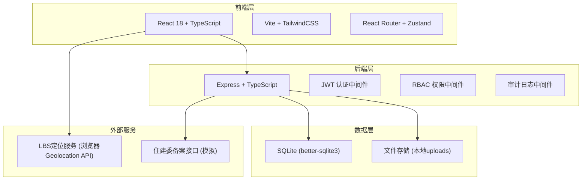
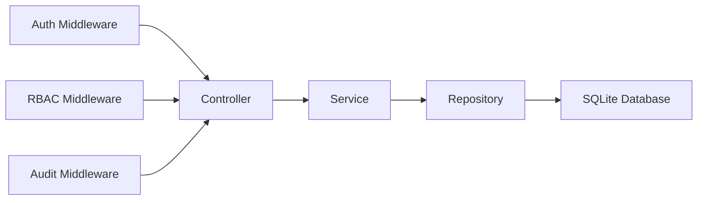
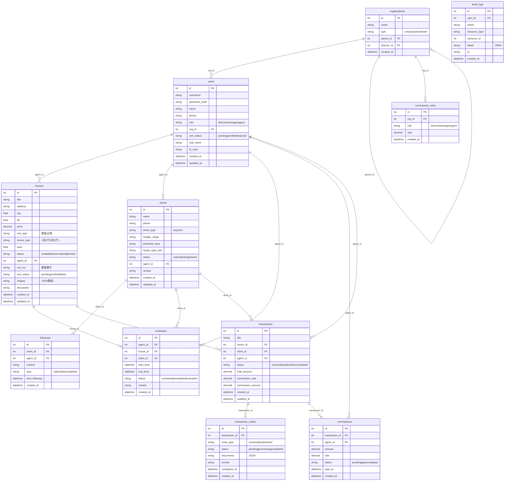

## 1. 架构设计



## 2. 技术说明

- 前端：React@18 + TypeScript + TailwindCSS@3 + Vite + Zustand + React Router
- 初始化工具：vite-init (react-express-ts 模板)
- 后端：Express@4 + TypeScript (ESM)
- 数据库：SQLite (better-sqlite3)，文件路径 data/app.sqlite
- 认证：JWT (jsonwebtoken)
- 密码：bcryptjs
- 文件上传：multer
- 图标：lucide-react

## 3. 路由定义

| 路由 | 用途 |
|------|------|
| /login | 登录页 |
| /register | 注册页 |
| / | 工作台首页 |
| /houses | 房源列表 |
| /houses/new | 新增房源 |
| /houses/:id | 房源详情 |
| /clients | 客源列表 |
| /clients/new | 新增客源 |
| /clients/:id | 客源详情 |
| /schedule | 带看日程 |
| /transactions | 交易看板 |
| /transactions/:id | 交易详情 |
| /commissions | 佣金管理 |
| /organization | 组织管理 |
| /audit | 审计日志 |
| /profile | 个人信息/实名认证 |

## 4. API定义

### 4.1 认证相关

| 方法 | 路径 | 说明 | 请求体 | 响应 |
|------|------|------|--------|------|
| POST | /api/auth/login | 登录 | {username, password} | {token, user} |
| POST | /api/auth/register | 注册 | {username, password, name, phone} | {id, username} |
| POST | /api/auth/certify | 实名认证 | {realName, idCard, idPhotoBase64} | {status} |
| GET | /api/auth/me | 当前用户 | - | {user, role, org} |

### 4.2 房源相关

| 方法 | 路径 | 说明 |
|------|------|------|
| GET | /api/houses | 房源列表（支持筛选分页） |
| POST | /api/houses | 新增房源 |
| GET | /api/houses/:id | 房源详情 |
| PUT | /api/houses/:id | 更新房源 |
| DELETE | /api/houses/:id | 删除房源 |
| POST | /api/houses/:id/verify | 住建委备案校验 |
| GET | /api/houses/nearby | 就近楼盘推送（LBS） |

### 4.3 客源相关

| 方法 | 路径 | 说明 |
|------|------|------|
| GET | /api/clients | 客源列表 |
| POST | /api/clients | 新增客源 |
| GET | /api/clients/:id | 客源详情 |
| PUT | /api/clients/:id | 更新客源 |
| DELETE | /api/clients/:id | 删除客源 |
| POST | /api/clients/:id/followup | 添加跟进记录 |

### 4.4 带看相关

| 方法 | 路径 | 说明 |
|------|------|------|
| GET | /api/schedules | 带看日程列表 |
| POST | /api/schedules | 新增带看 |
| PUT | /api/schedules/:id | 更新带看 |
| DELETE | /api/schedules/:id | 删除带看 |
| GET | /api/schedules/recommend | 智能推荐时段 |

### 4.5 交易相关

| 方法 | 路径 | 说明 |
|------|------|------|
| GET | /api/transactions | 交易列表（看板） |
| POST | /api/transactions | 新增交易 |
| GET | /api/transactions/:id | 交易详情 |
| PUT | /api/transactions/:id/status | 更新交易节点 |
| POST | /api/transactions/:id/documents | 上传交易文件 |

### 4.6 佣金相关

| 方法 | 路径 | 说明 |
|------|------|------|
| GET | /api/commissions | 佣金台账 |
| GET | /api/commissions/:id | 佣金详情 |
| POST | /api/commissions/settle | 结算佣金 |
| GET | /api/commissions/rules | 分账规则 |
| PUT | /api/commissions/rules | 更新分账规则 |

### 4.7 组织管理

| 方法 | 路径 | 说明 |
|------|------|------|
| GET | /api/orgs/tree | 组织架构树 |
| POST | /api/orgs | 创建组织节点 |
| PUT | /api/orgs/:id | 更新组织 |
| DELETE | /api/orgs/:id | 删除组织 |
| GET | /api/orgs/members | 成员列表 |
| POST | /api/orgs/members | 添加成员 |
| PUT | /api/orgs/members/:id/role | 变更角色 |

### 4.8 审计日志

| 方法 | 路径 | 说明 |
|------|------|------|
| GET | /api/audit/logs | 审计日志列表 |
| GET | /api/audit/logs/:id | 日志详情 |

### 4.9 系统

| 方法 | 路径 | 说明 |
|------|------|------|
| GET | /api/health | 健康检查 |
| POST | /api/upload | 文件上传 |

## 5. 服务端架构图



## 6. 数据模型

### 6.1 数据模型定义



### 6.2 数据定义语言

```sql
CREATE TABLE IF NOT EXISTS organizations (
    id INTEGER PRIMARY KEY AUTOINCREMENT,
    name TEXT NOT NULL,
    type TEXT NOT NULL CHECK(type IN ('company','store','team')),
    parent_id INTEGER REFERENCES organizations(id),
    director_id INTEGER,
    created_at DATETIME DEFAULT CURRENT_TIMESTAMP
);

CREATE TABLE IF NOT EXISTS users (
    id INTEGER PRIMARY KEY AUTOINCREMENT,
    username TEXT NOT NULL UNIQUE,
    password_hash TEXT NOT NULL,
    name TEXT NOT NULL,
    phone TEXT,
    role TEXT NOT NULL CHECK(role IN ('director','manager','agent')) DEFAULT 'agent',
    org_id INTEGER REFERENCES organizations(id),
    cert_status TEXT DEFAULT 'pending' CHECK(cert_status IN ('pending','certified','rejected')),
    real_name TEXT,
    id_card TEXT,
    avatar TEXT,
    created_at DATETIME DEFAULT CURRENT_TIMESTAMP,
    updated_at DATETIME DEFAULT CURRENT_TIMESTAMP
);

CREATE TABLE IF NOT EXISTS houses (
    id INTEGER PRIMARY KEY AUTOINCREMENT,
    title TEXT NOT NULL,
    address TEXT NOT NULL,
    lng REAL,
    lat REAL,
    price DECIMAL(12,2),
    unit_type TEXT CHECK(unit_type IN ('sell','rent')) DEFAULT 'sell',
    house_type TEXT,
    area REAL,
    floor_info TEXT,
    orientation TEXT,
    decoration TEXT,
    status TEXT DEFAULT 'available' CHECK(status IN ('available','reserved','sold','rented','offline')),
    agent_id INTEGER REFERENCES users(id),
    cert_no TEXT,
    cert_status TEXT DEFAULT 'pending' CHECK(cert_status IN ('pending','verified','failed')),
    images TEXT DEFAULT '[]',
    description TEXT,
    community TEXT,
    built_year INTEGER,
    created_at DATETIME DEFAULT CURRENT_TIMESTAMP,
    updated_at DATETIME DEFAULT CURRENT_TIMESTAMP
);

CREATE TABLE IF NOT EXISTS clients (
    id INTEGER PRIMARY KEY AUTOINCREMENT,
    name TEXT NOT NULL,
    phone TEXT NOT NULL,
    intent_type TEXT CHECK(intent_type IN ('buy','rent')) DEFAULT 'buy',
    budget_min DECIMAL(12,2),
    budget_max DECIMAL(12,2),
    preferred_area TEXT,
    house_type_pref TEXT,
    status TEXT DEFAULT 'active' CHECK(status IN ('active','dealing','closed')),
    agent_id INTEGER REFERENCES users(id),
    source TEXT,
    remark TEXT,
    created_at DATETIME DEFAULT CURRENT_TIMESTAMP,
    updated_at DATETIME DEFAULT CURRENT_TIMESTAMP
);

CREATE TABLE IF NOT EXISTS followups (
    id INTEGER PRIMARY KEY AUTOINCREMENT,
    client_id INTEGER NOT NULL REFERENCES clients(id),
    agent_id INTEGER NOT NULL REFERENCES users(id),
    content TEXT NOT NULL,
    type TEXT DEFAULT 'other' CHECK(type IN ('call','visit','wechat','other')),
    next_followup DATETIME,
    created_at DATETIME DEFAULT CURRENT_TIMESTAMP
);

CREATE TABLE IF NOT EXISTS schedules (
    id INTEGER PRIMARY KEY AUTOINCREMENT,
    agent_id INTEGER NOT NULL REFERENCES users(id),
    house_id INTEGER NOT NULL REFERENCES houses(id),
    client_id INTEGER NOT NULL REFERENCES clients(id),
    start_time DATETIME NOT NULL,
    end_time DATETIME NOT NULL,
    status TEXT DEFAULT 'scheduled' CHECK(status IN ('scheduled','completed','cancelled')),
    remark TEXT,
    created_at DATETIME DEFAULT CURRENT_TIMESTAMP
);

CREATE TABLE IF NOT EXISTS transactions (
    id INTEGER PRIMARY KEY AUTOINCREMENT,
    title TEXT NOT NULL,
    house_id INTEGER NOT NULL REFERENCES houses(id),
    client_id INTEGER NOT NULL REFERENCES clients(id),
    agent_id INTEGER NOT NULL REFERENCES users(id),
    status TEXT DEFAULT 'contract' CHECK(status IN ('contract','loan','transfer','completed')),
    total_amount DECIMAL(14,2),
    commission_rate DECIMAL(5,4) DEFAULT 0.0250,
    commission_amount DECIMAL(14,2),
    created_at DATETIME DEFAULT CURRENT_TIMESTAMP,
    updated_at DATETIME DEFAULT CURRENT_TIMESTAMP
);

CREATE TABLE IF NOT EXISTS transaction_nodes (
    id INTEGER PRIMARY KEY AUTOINCREMENT,
    transaction_id INTEGER NOT NULL REFERENCES transactions(id),
    node_type TEXT NOT NULL CHECK(node_type IN ('contract','loan','transfer')),
    status TEXT DEFAULT 'pending' CHECK(status IN ('pending','processing','completed')),
    documents TEXT DEFAULT '[]',
    remark TEXT,
    completed_at DATETIME,
    created_at DATETIME DEFAULT CURRENT_TIMESTAMP
);

CREATE TABLE IF NOT EXISTS commission_rules (
    id INTEGER PRIMARY KEY AUTOINCREMENT,
    org_id INTEGER NOT NULL REFERENCES organizations(id),
    role TEXT NOT NULL CHECK(role IN ('director','manager','agent')),
    rate DECIMAL(5,4) NOT NULL,
    created_at DATETIME DEFAULT CURRENT_TIMESTAMP
);

CREATE TABLE IF NOT EXISTS commissions (
    id INTEGER PRIMARY KEY AUTOINCREMENT,
    transaction_id INTEGER NOT NULL REFERENCES transactions(id),
    agent_id INTEGER NOT NULL REFERENCES users(id),
    amount DECIMAL(14,2) NOT NULL,
    rate DECIMAL(5,4) NOT NULL,
    status TEXT DEFAULT 'pending' CHECK(status IN ('pending','approved','paid')),
    paid_at DATETIME,
    created_at DATETIME DEFAULT CURRENT_TIMESTAMP
);

CREATE TABLE IF NOT EXISTS audit_logs (
    id INTEGER PRIMARY KEY AUTOINCREMENT,
    user_id INTEGER REFERENCES users(id),
    action TEXT NOT NULL,
    resource_type TEXT NOT NULL,
    resource_id INTEGER,
    detail TEXT DEFAULT '{}',
    ip TEXT,
    created_at DATETIME DEFAULT CURRENT_TIMESTAMP
);

CREATE INDEX idx_houses_agent ON houses(agent_id);
CREATE INDEX idx_houses_status ON houses(status);
CREATE INDEX idx_houses_lng_lat ON houses(lng, lat);
CREATE INDEX idx_clients_agent ON clients(agent_id);
CREATE INDEX idx_clients_status ON clients(status);
CREATE INDEX idx_schedules_agent ON schedules(agent_id);
CREATE INDEX idx_schedules_time ON schedules(start_time, end_time);
CREATE INDEX idx_transactions_agent ON transactions(agent_id);
CREATE INDEX idx_transactions_status ON transactions(status);
CREATE INDEX idx_commissions_agent ON commissions(agent_id);
CREATE INDEX idx_audit_user ON audit_logs(user_id);
CREATE INDEX idx_audit_action ON audit_logs(action);
CREATE INDEX idx_audit_created ON audit_logs(created_at);
```
