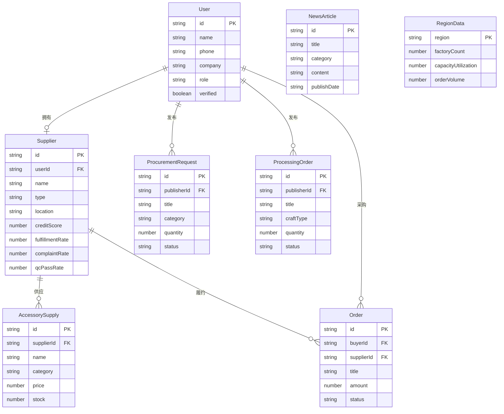

## 1. 架构设计

```mermaid
flowchart TB
    subgraph "前端层 Frontend"
        "React 18 + TypeScript"
        "React Router v6"
        "Tailwind CSS"
        "Zustand 状态管理"
        "Recharts 数据可视化"
    end
    subgraph "后端层 Backend"
        "Express 4 + TypeScript"
        "RESTful API"
        "Multer 文件上传"
    end
    subgraph "数据层 Data"
        "SQLite 数据库"
        "Mock 种子数据"
    end
    "前端层 Frontend" --> "后端层 Backend"
    "后端层 Backend" --> "数据层 Data"
```

## 2. 技术说明

- **前端**: React@18 + TailwindCSS@3 + Vite + Zustand
- **初始化工具**: vite-init
- **后端**: Express@4 + TypeScript (ESM)
- **数据库**: SQLite（better-sqlite3），开发阶段使用 Mock 种子数据
- **数据可视化**: Recharts（图表）、自定义SVG（产业地图热力图）
- **图标**: lucide-react

## 3. 路由定义

| 路由 | 用途 |
|------|------|
| `/` | 首页，平台数据总览与快捷入口 |
| `/market` | 供需大厅，采购找货/加工接单/辅料供应 |
| `/match` | 智能匹配引擎，多维度筛选与BOM比价 |
| `/map` | 产业地图，热力图与产能分析 |
| `/orders` | 订单中心，订单管理与物流跟踪 |
| `/supplier/:id` | 供应商详情，信用评分与在线验厂 |
| `/news` | 资讯与报告，行业资讯与季度报告 |

## 4. API 定义

### 4.1 采购需求 API

```typescript
interface ProcurementRequest {
  id: string;
  title: string;
  category: string;
  craftType: string[];
  quantity: number;
  unit: string;
  deliveryDate: string;
  budget: { min: number; max: number };
  location: string;
  description: string;
  status: "open" | "matched" | "closed";
  publisherId: string;
  createdAt: string;
}

// GET /api/procurements - 获取采购需求列表
// POST /api/procurements - 发布采购需求
// GET /api/procurements/:id - 获取采购需求详情
```

### 4.2 加工订单 API

```typescript
interface ProcessingOrder {
  id: string;
  title: string;
  craftType: string[];
  quantity: number;
  deadline: string;
  factoryType: string;
  location: string;
  budget: { min: number; max: number };
  status: "open" | "in_progress" | "completed";
  publisherId: string;
  createdAt: string;
}

// GET /api/processing-orders - 获取加工订单列表
// POST /api/processing-orders - 发布加工订单
```

### 4.3 辅料供应 API

```typescript
interface AccessorySupply {
  id: string;
  name: string;
  category: string;
  material: string;
  specs: string;
  price: number;
  unit: string;
  minOrder: number;
  stock: number;
  supplierId: string;
  location: string;
  images: string[];
}

// GET /api/accessories - 获取辅料列表
// POST /api/accessories - 发布辅料产品
```

### 4.4 供应商 API

```typescript
interface Supplier {
  id: string;
  name: string;
  type: "factory" | "accessory_supplier" | "designer";
  location: string;
  creditScore: number;
  fulfillmentRate: number;
  complaintRate: number;
  qcPassRate: number;
  crafts: string[];
  capacity: { current: number; max: number; available: number };
  certifications: string[];
  description: string;
  isOnline: boolean;
}

// GET /api/suppliers - 获取供应商列表
// GET /api/suppliers/:id - 获取供应商详情
// GET /api/suppliers/:id/credit - 获取信用评分详情
```

### 4.5 智能匹配 API

```typescript
interface MatchRequest {
  type: "procurement" | "processing" | "accessory";
  requirements: {
    location?: string;
    craftType?: string[];
    quantity?: number;
    deliveryDate?: string;
    budget?: { min: number; max: number };
  };
  weights: {
    location: number;
    capacity: number;
    craft: number;
    price: number;
  };
}

interface MatchResult {
  supplierId: string;
  score: number;
  dimensions: {
    locationScore: number;
    capacityScore: number;
    craftScore: number;
    priceScore: number;
  };
}

// POST /api/match - 智能匹配
// POST /api/match/bom - BOM清单比价匹配
```

### 4.6 订单 API

```typescript
interface Order {
  id: string;
  type: "procurement" | "processing";
  title: string;
  buyerId: string;
  supplierId: string;
  amount: number;
  depositAmount: number;
  depositStatus: "unpaid" | "paid" | "refunded";
  status: "pending" | "deposit_paid" | "in_production" | "quality_check" | "shipped" | "completed" | "disputed";
  logistics: LogisticsNode[];
  createdAt: string;
}

interface LogisticsNode {
  status: string;
  location: string;
  timestamp: string;
  description: string;
}

// GET /api/orders - 获取订单列表
// GET /api/orders/:id - 获取订单详情
// POST /api/orders - 创建订单
// PUT /api/orders/:id/status - 更新订单状态
```

### 4.7 产业地图 API

```typescript
interface RegionData {
  region: string;
  factoryCount: number;
  capacityUtilization: number;
  orderVolume: number;
  supplyDemandRatio: number;
  mainCrafts: string[];
  topSuppliers: string[];
}

// GET /api/map/regions - 获取各地区产业数据
// GET /api/map/heatmap - 获取热力图数据
```

### 4.8 资讯与报告 API

```typescript
interface NewsArticle {
  id: string;
  title: string;
  category: "industry" | "policy" | "report";
  summary: string;
  content: string;
  publishDate: string;
  source: string;
  tags: string[];
}

interface QuarterlyReport {
  id: string;
  quarter: string;
  year: number;
  summary: string;
  supplyDemandBalance: number;
  capacityTrend: { month: string; supply: number; demand: number }[];
  topRegions: string[];
  priceIndex: { category: string; current: number; change: number }[];
}

// GET /api/news - 获取资讯列表
// GET /api/news/:id - 获取资讯详情
// GET /api/reports - 获取季度报告列表
// GET /api/reports/latest - 获取最新季度报告
```

### 4.9 用户认证 API

```typescript
interface User {
  id: string;
  name: string;
  phone: string;
  company: string;
  role: "buyer" | "factory" | "supplier" | "designer" | "admin";
  verified: boolean;
  avatar: string;
}

// POST /api/auth/register - 用户注册
// POST /api/auth/login - 用户登录
// POST /api/auth/verify - 提交实名认证
// GET /api/auth/profile - 获取当前用户信息
```

## 5. 服务端架构图

```mermaid
flowchart LR
    "Controller 路由层" --> "Service 业务层"
    "Service 业务层" --> "Repository 数据层"
    "Repository 数据层" --> "SQLite 数据库"
```

## 6. 数据模型

### 6.1 数据模型定义



### 6.2 数据定义语言

```sql
CREATE TABLE users (
  id TEXT PRIMARY KEY,
  name TEXT NOT NULL,
  phone TEXT UNIQUE NOT NULL,
  company TEXT NOT NULL,
  role TEXT NOT NULL CHECK(role IN ('buyer', 'factory', 'supplier', 'designer', 'admin')),
  verified INTEGER DEFAULT 0,
  avatar TEXT DEFAULT '',
  password TEXT NOT NULL,
  created_at TEXT DEFAULT (datetime('now'))
);

CREATE TABLE suppliers (
  id TEXT PRIMARY KEY,
  user_id TEXT NOT NULL REFERENCES users(id),
  name TEXT NOT NULL,
  type TEXT NOT NULL CHECK(type IN ('factory', 'accessory_supplier', 'designer')),
  location TEXT NOT NULL,
  credit_score INTEGER DEFAULT 0,
  fulfillment_rate REAL DEFAULT 0,
  complaint_rate REAL DEFAULT 0,
  qc_pass_rate REAL DEFAULT 0,
  crafts TEXT DEFAULT '[]',
  capacity_current INTEGER DEFAULT 0,
  capacity_max INTEGER DEFAULT 0,
  certifications TEXT DEFAULT '[]',
  description TEXT DEFAULT '',
  is_online INTEGER DEFAULT 0,
  created_at TEXT DEFAULT (datetime('now'))
);

CREATE TABLE procurement_requests (
  id TEXT PRIMARY KEY,
  publisher_id TEXT NOT NULL REFERENCES users(id),
  title TEXT NOT NULL,
  category TEXT NOT NULL,
  craft_type TEXT DEFAULT '[]',
  quantity INTEGER NOT NULL,
  unit TEXT DEFAULT '件',
  delivery_date TEXT NOT NULL,
  budget_min REAL,
  budget_max REAL,
  location TEXT DEFAULT '',
  description TEXT DEFAULT '',
  status TEXT DEFAULT 'open' CHECK(status IN ('open', 'matched', 'closed')),
  created_at TEXT DEFAULT (datetime('now'))
);

CREATE TABLE processing_orders (
  id TEXT PRIMARY KEY,
  publisher_id TEXT NOT NULL REFERENCES users(id),
  title TEXT NOT NULL,
  craft_type TEXT DEFAULT '[]',
  quantity INTEGER NOT NULL,
  deadline TEXT NOT NULL,
  factory_type TEXT DEFAULT '',
  location TEXT DEFAULT '',
  budget_min REAL,
  budget_max REAL,
  status TEXT DEFAULT 'open' CHECK(status IN ('open', 'in_progress', 'completed')),
  created_at TEXT DEFAULT (datetime('now'))
);

CREATE TABLE accessory_supplies (
  id TEXT PRIMARY KEY,
  supplier_id TEXT NOT NULL REFERENCES suppliers(id),
  name TEXT NOT NULL,
  category TEXT NOT NULL,
  material TEXT DEFAULT '',
  specs TEXT DEFAULT '',
  price REAL NOT NULL,
  unit TEXT DEFAULT '个',
  min_order INTEGER DEFAULT 1,
  stock INTEGER DEFAULT 0,
  location TEXT DEFAULT '',
  images TEXT DEFAULT '[]',
  created_at TEXT DEFAULT (datetime('now'))
);

CREATE TABLE orders (
  id TEXT PRIMARY KEY,
  buyer_id TEXT NOT NULL REFERENCES users(id),
  supplier_id TEXT NOT NULL REFERENCES suppliers(id),
  title TEXT NOT NULL,
  type TEXT NOT NULL CHECK(type IN ('procurement', 'processing')),
  amount REAL NOT NULL,
  deposit_amount REAL DEFAULT 0,
  deposit_status TEXT DEFAULT 'unpaid' CHECK(deposit_status IN ('unpaid', 'paid', 'refunded')),
  status TEXT DEFAULT 'pending' CHECK(status IN ('pending', 'deposit_paid', 'in_production', 'quality_check', 'shipped', 'completed', 'disputed')),
  logistics TEXT DEFAULT '[]',
  created_at TEXT DEFAULT (datetime('now')),
  updated_at TEXT DEFAULT (datetime('now'))
);

CREATE TABLE news_articles (
  id TEXT PRIMARY KEY,
  title TEXT NOT NULL,
  category TEXT NOT NULL CHECK(category IN ('industry', 'policy', 'report')),
  summary TEXT DEFAULT '',
  content TEXT DEFAULT '',
  publish_date TEXT NOT NULL,
  source TEXT DEFAULT '',
  tags TEXT DEFAULT '[]',
  created_at TEXT DEFAULT (datetime('now'))
);

CREATE TABLE region_data (
  region TEXT PRIMARY KEY,
  factory_count INTEGER DEFAULT 0,
  capacity_utilization REAL DEFAULT 0,
  order_volume INTEGER DEFAULT 0,
  supply_demand_ratio REAL DEFAULT 1,
  main_crafts TEXT DEFAULT '[]',
  top_suppliers TEXT DEFAULT '[]'
);

CREATE INDEX idx_suppliers_user ON suppliers(user_id);
CREATE INDEX idx_procurement_publisher ON procurement_requests(publisher_id);
CREATE INDEX idx_processing_publisher ON processing_orders(publisher_id);
CREATE INDEX idx_accessory_supplier ON accessory_supplies(supplier_id);
CREATE INDEX idx_orders_buyer ON orders(buyer_id);
CREATE INDEX idx_orders_supplier ON orders(supplier_id);
CREATE INDEX idx_news_category ON news_articles(category);
```
