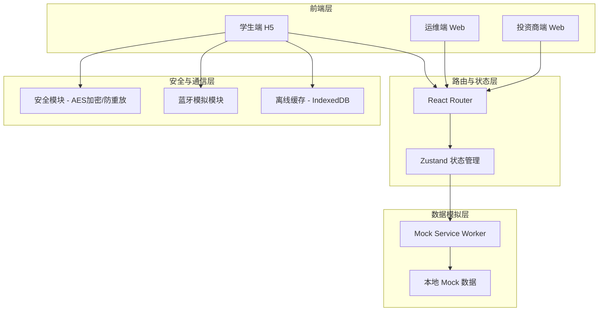
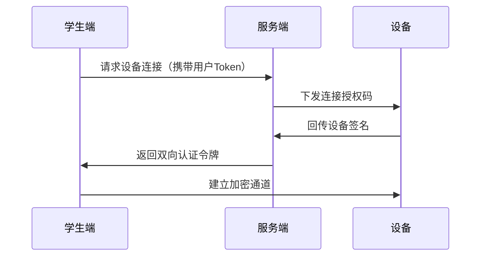
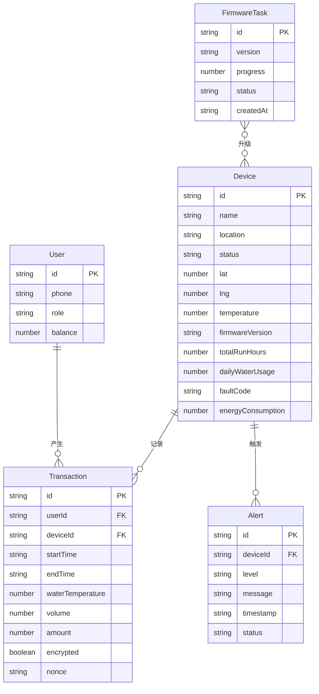

## 1. 架构设计



## 2. 技术说明

- **前端框架**：React@18 + TypeScript + Vite
- **样式方案**：TailwindCSS@3 + CSS Variables 主题系统
- **状态管理**：Zustand（轻量、类型安全）
- **路由**：React Router v6
- **图表库**：Recharts（投资商仪表盘图表）
- **地图**：React-Leaflet（设备集群地图，开源免费）
- **动画**：Framer Motion（页面切换与交互动画）
- **图标**：Lucide React（线性图标风格）
- **数据模拟**：Mock Service Worker + 静态 JSON 数据
- **后端**：无（纯前端模拟，所有数据通过 Mock 提供）
- **数据库**：无（前端使用 Zustand + localStorage 模拟持久化）

## 3. 路由定义

| 路由 | 用途 | 角色 |
|------|------|------|
| `/login` | 登录注册页面 | 公共 |
| `/student` | 学生首页-设备绑定 | 学生 |
| `/student/dispense` | 取水页面（实时计费） | 学生 |
| `/student/bills` | 电子账单列表 | 学生 |
| `/student/bills/:id` | 账单详情 | 学生 |
| `/student/recharge` | 余额充值页面 | 学生 |
| `/operator` | 运维设备监控列表 | 运维 |
| `/operator/device/:id` | 设备详情与远程管控 | 运维 |
| `/operator/alerts` | 告警中心 | 运维 |
| `/operator/firmware` | 固件管理与批量升级 | 运维 |
| `/investor` | 投资商总览仪表盘 | 投资商 |
| `/investor/map` | 设备集群地图 | 投资商 |
| `/investor/device/:id` | 单机运行分析 | 投资商 |
| `/investor/roi` | 项目级ROI仪表盘 | 投资商 |

## 4. API 定义（Mock 接口）

```typescript
interface Device {
  id: string
  name: string
  location: string
  status: "online" | "offline" | "fault"
  lat: number
  lng: number
  temperature: number
  firmwareVersion: string
  lastOnline: string
  totalRunHours: number
  dailyWaterUsage: number
  faultCode: string | null
  energyConsumption: number
}

interface Transaction {
  id: string
  userId: string
  deviceId: string
  startTime: string
  endTime: string
  waterTemperature: number
  volume: number
  amount: number
  encrypted: boolean
  nonce: string
}

interface User {
  id: string
  phone: string
  role: "student" | "operator" | "investor"
  balance: number
  boundDevices: string[]
}

interface Alert {
  id: string
  deviceId: string
  level: "warning" | "error" | "critical"
  message: string
  timestamp: string
  status: "pending" | "resolved"
}

interface FirmwareTask {
  id: string
  version: string
  targetDevices: string[]
  progress: number
  status: "pending" | "in_progress" | "completed" | "failed"
  createdAt: string
}

interface ROIData {
  projectId: string
  projectName: string
  dailyWaterVolume: number
  unitPrice: number
  dailyRevenue: number
  maintenanceCost: number
  dailyROI: number
  trend: { date: string; roi: number; revenue: number; cost: number }[]
}

interface ApiResponse<T> {
  code: number
  data: T
  message: string
  timestamp: number
}
```

## 5. 安全模块设计

### 5.1 设备密钥双向认证



### 5.2 交易流水AES加密

- 每笔交易生成唯一 nonce（防重放）
- 交易数据使用 AES-256-GCM 加密
- 前端模拟：生成加密标识和 nonce 展示

### 5.3 防重放攻击

- 每次请求携带时间戳 + 递增序列号
- 服务端校验时间窗口（5分钟）和序列号唯一性
- 前端模拟：请求头展示 X-Timestamp / X-Nonce

### 5.4 离线缓存与断网续传

- 使用 IndexedDB 存储离线期间的交易记录
- 网络恢复后自动批量上传
- UI 显示缓存状态标识

## 6. 数据模型

### 6.1 数据模型定义



### 6.2 Mock 数据结构

项目使用静态 JSON + Zustand store 提供 Mock 数据，包含：
- 20+ 台模拟设备（分布在不同校区楼宇）
- 100+ 条交易记录
- 15+ 条告警记录
- 3 个固件升级任务
- 30 天 ROI 趋势数据
