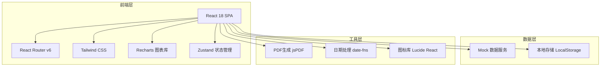
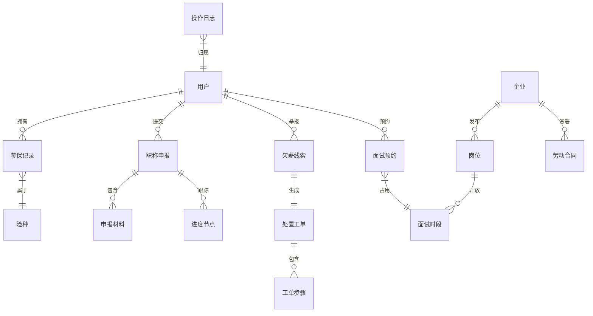

## 1. 架构设计



## 2. 技术说明

- **前端框架**：React@18 + TypeScript
- **样式方案**：Tailwind CSS@3 + CSS Variables 主题系统
- **构建工具**：Vite
- **路由**：React Router v6（HashRouter）
- **状态管理**：Zustand（轻量级状态管理）
- **图表库**：Recharts（社保趋势图、数据看板可视化）
- **PDF生成**：jsPDF + html2canvas（参保证明PDF防伪水印）
- **日期处理**：date-fns
- **图标库**：Lucide React
- **后端**：无（纯前端 Mock 数据）
- **数据库**：无（Mock 数据 + LocalStorage 持久化）

## 3. 路由定义

| 路由 | 用途 |
|------|------|
| `/` | 首页门户，服务导航与政策公告 |
| `/social-insurance` | 社保查询总览，五险参保状态面板 |
| `/social-insurance/detail/:type` | 参保明细，type为养老/医疗/失业/工伤/生育 |
| `/social-insurance/certificate` | 电子参保证明生成与预览 |
| `/employment` | 就业服务首页，岗位智能推荐列表 |
| `/employment/job/:id` | 岗位详情与面试预约 |
| `/employment/interview/:id` | 视频面试间 |
| `/talent` | 人才服务首页，申报入口 |
| `/talent/declare` | 职称申报表单与材料上传 |
| `/talent/progress/:id` | 申报进度节点跟踪 |
| `/talent/review/:id` | 专家评审在线打分 |
| `/labor` | 劳动维权首页，功能入口 |
| `/labor/contract` | 劳动合同电子签署 |
| `/labor/report` | 欠薪线索直报提交 |
| `/labor/track/:id` | 工单闭环跟踪 |
| `/admin/dashboard` | 数据治理看板 |
| `/admin/logs` | 操作日志查询 |
| `/admin/policy` | 政策文件智能检索 |

## 4. API 定义（Mock）

### 4.1 社保查询

```typescript
interface InsuranceDetail {
  type: "pension" | "medical" | "unemployment" | "injury" | "maternity"
  typeName: string
  status: "active" | "suspended" | "none"
  months: number
  baseAmount: number
  companyPay: number
  personalPay: number
  records: PaymentRecord[]
}

interface PaymentRecord {
  month: string
  baseAmount: number
  companyPay: number
  personalPay: number
  companyRatio: number
  personalRatio: number
}

interface CertificateInfo {
  certificateNo: string
  userName: string
  idCard: string
  insurances: InsuranceSummary[]
  generateTime: string
  watermarkData: string
}
```

### 4.2 就业服务

```typescript
interface Job {
  id: string
  title: string
  company: string
  companyLogo: string
  salary: string
  location: string
  industry: string
  type: string
  tags: string[]
  matchScore: number
  description: string
  requirements: string[]
  interviewSlots: InterviewSlot[]
}

interface InterviewSlot {
  date: string
  time: string
  available: boolean
}

interface InterviewSession {
  id: string
  jobId: string
  scheduledTime: string
  status: "pending" | "active" | "completed"
  participants: string[]
}
```

### 4.3 人才服务

```typescript
interface Declaration {
  id: string
  category: string
  currentTitle: string
  targetTitle: string
  status: "draft" | "submitted" | "initial_review" | "re_review" | "expert_review" | "public_notice" | "issued"
  submitTime: string
  materials: Material[]
  progress: ProgressNode[]
}

interface Material {
  id: string
  name: string
  type: "id_card" | "certificate" | "work_proof" | "education" | "other"
  url: string
  ocrResult?: Record<string, string>
  ocrStatus: "pending" | "success" | "failed"
}

interface ProgressNode {
  step: string
  status: "completed" | "current" | "pending"
  time?: string
  operator?: string
  remark?: string
}
```

### 4.4 劳动维权

```typescript
interface Contract {
  id: string
  templateName: string
  parties: ContractParty[]
  clauses: ContractClause[]
  signStatus: "unsigned" | "partial" | "signed"
  signedAt?: string
}

interface SalaryReport {
  id: string
  companyName: string
  companyId: string
  amount: number
  evidence: string[]
  anonymous: boolean
  status: "submitted" | "accepted" | "investigating" | "processing" | "resolved" | "closed"
  createTime: string
  workOrder: WorkOrder
}

interface WorkOrder {
  id: string
  reportId: string
  steps: WorkOrderStep[]
}

interface WorkOrderStep {
  step: string
  status: "completed" | "current" | "pending"
  time?: string
  handler?: string
  result?: string
}
```

## 5. 服务器架构图

不适用（纯前端项目，无后端服务）

## 6. 数据模型

### 6.1 数据模型定义



### 6.2 数据定义语言

本项目使用前端 Mock 数据，无需数据库 DDL。数据结构以 TypeScript 接口定义为准，Mock 数据存放在 `src/mocks/` 目录下，LocalStorage 用于持久化用户操作状态。
