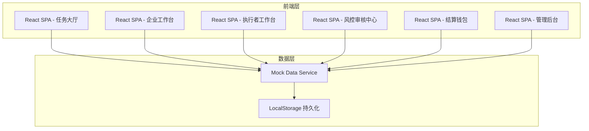
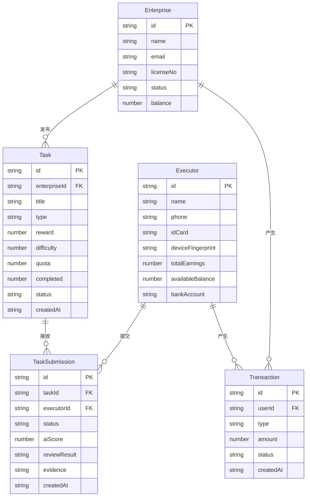

## 1. 架构设计



## 2. 技术说明

- **前端框架**：React@18 + TypeScript + Vite
- **样式方案**：TailwindCSS@3 + CSS Modules（关键动画）
- **图表可视化**：Recharts
- **路由**：React Router@6
- **状态管理**：Zustand
- **初始化工具**：Vite
- **后端**：无后端，使用 Mock 数据模拟
- **数据持久化**：LocalStorage 模拟

## 3. 路由定义

| 路由 | 用途 |
|------|------|
| `/` | 首页/任务大厅 |
| `/enterprise` | 企业工作台（任务模板库+发布+ROI） |
| `/executor` | 执行者工作台（任务列表+执行+进度） |
| `/executor/task/:id` | 单个任务执行详情页 |
| `/risk-control` | 风控审核中心（AI初筛+人工抽检+仲裁+异常监控） |
| `/wallet` | 结算钱包（收益+提现+流水） |
| `/admin` | 管理后台（全局监控+企业审核+系统配置） |

## 4. 数据模型

### 4.1 数据模型定义



### 4.2 核心类型定义

```typescript
type TaskType = "media" | "survey" | "experience"
type TaskStatus = "draft" | "active" | "paused" | "completed" | "closed"
type SubmissionStatus = "pending" | "ai_passed" | "ai_flagged" | "manual_passed" | "manual_rejected" | "disputed" | "arbitrated"
type TransactionType = "reward" | "withdrawal" | "tax" | "refund"
type UserRole = "enterprise" | "executor" | "admin"

interface Task {
  id: string
  enterpriseId: string
  enterpriseName: string
  title: string
  description: string
  type: TaskType
  reward: number
  originalReward: number
  difficulty: number
  completionRate: number
  quota: number
  completed: number
  status: TaskStatus
  targetDemographic: { ageRange: [number, number]; regions: string[] }
  createdAt: string
  deadline: string
}

interface TaskSubmission {
  id: string
  taskId: string
  executorId: string
  executorName: string
  type: TaskType
  status: SubmissionStatus
  aiScore: number
  aiFlags: string[]
  reviewNotes: string
  evidence: string
  submittedAt: string
  reviewedAt: string | null
}

interface RiskAlert {
  id: string
  type: "device_cluster" | "abnormal_rate" | "duplicate_submission" | "suspicious_behavior"
  severity: "low" | "medium" | "high" | "critical"
  description: string
  affectedEntities: string[]
  detectedAt: string
  resolved: boolean
}

interface PricingRule {
  baseReward: number
  difficultyMultiplier: number
  completionRateThreshold: number
  boostPercentage: number
  maxReward: number
}

interface Transaction {
  id: string
  userId: string
  userName: string
  type: TransactionType
  amount: number
  status: "pending" | "completed" | "failed"
  description: string
  createdAt: string
}
```
