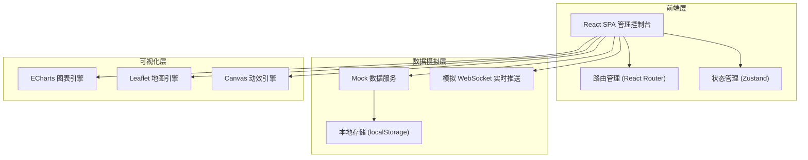
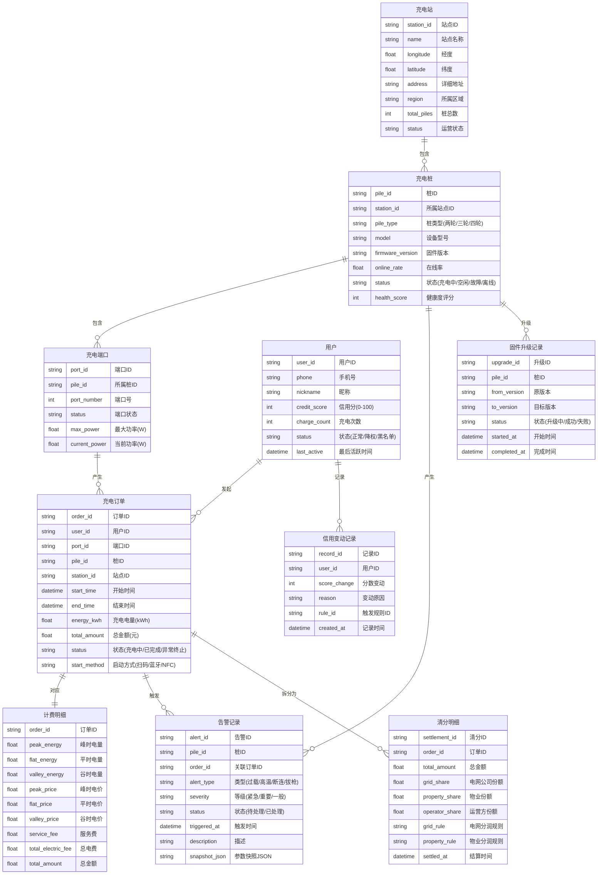

## 1. 架构设计

## 2. 技术说明

- **前端框架**：React@18 + TypeScript@5
- **样式方案**：Tailwind CSS@3 + CSS Variables 主题系统
- **构建工具**：Vite@5
- **路由**：React Router@6
- **状态管理**：Zustand@4
- **图表库**：ECharts@5（折线图/饼图/雷达图/热力图/条形图）
- **地图库**：Leaflet@1 + react-leaflet（GIS地图展示）
- **动画库**：Framer Motion@11（页面过渡/微交互）
- **图标库**：Lucide React
- **数据模拟**：Mock数据 + 模拟WebSocket实时推送
- **后端**：无（纯前端项目，所有数据本地模拟）
- **数据库**：无（使用localStorage持久化 + 内存数据）

## 3. 路由定义

| 路由 | 用途 | 权限 |
|------|------|------|
| `/` | 重定向至仪表盘 | 全部角色 |
| `/dashboard` | 运营仪表盘，核心指标总览 | 全部角色 |
| `/map` | 充电桩GIS地图管理 | 运营/运维/超管 |
| `/devices` | 设备管理中心，充电桩列表 | 运营/运维/超管 |
| `/devices/:id` | 充电桩详情，端口状态/远程控制 | 运营/运维/超管 |
| `/orders` | 订单与计费管理 | 运营/财务/超管 |
| `/billing` | 分时电价与计费规则配置 | 财务/超管 |
| `/alerts` | 安全与告警中心 | 运维/运营/超管 |
| `/safety` | 充电安全策略中心 | 运维/超管 |
| `/users` | 用户与信用管理 | 运营/超管 |
| `/settlement` | 结算与分润管理 | 财务/超管 |
| `/prediction` | 故障预测与设备健康度 | 运维/超管 |

## 4. 数据模型

### 4.1 数据模型定义

### 4.2 模拟数据策略

- 使用 `src/mock/` 目录存放模拟数据生成器
- 充电站数据：模拟5个站点，共30台充电桩，120个端口
- 用户数据：模拟50个用户，含不同信用等级
- 订单数据：模拟最近30天500+笔订单
- 告警数据：模拟最近7天100+条告警
- 实时数据：使用 `setInterval` 模拟WebSocket推送，每5秒更新充电桩状态与功率
