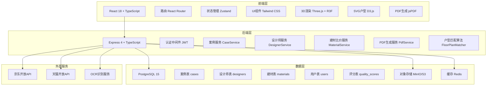
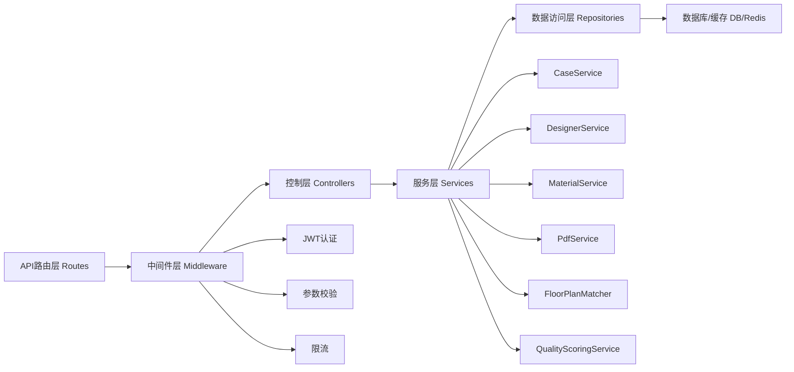
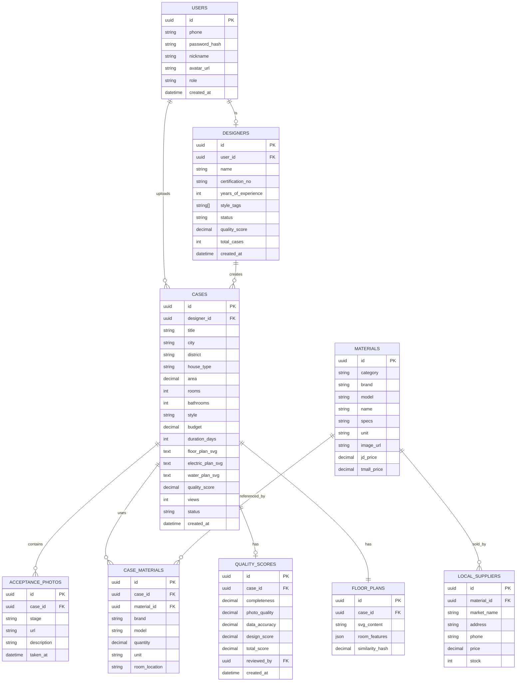

## 1. 架构设计



## 2. 技术描述

- **前端框架**：React 18 + TypeScript + Vite
- **路由**：React Router DOM v6
- **状态管理**：Zustand（轻量状态管理）
- **UI框架**：Tailwind CSS 3 + Lucide React Icons
- **3D渲染**：Three.js + @react-three/fiber + @react-three/drei + @react-three/postprocessing
- **SVG户型图**：D3.js 用于矢量户型图标注与交互
- **PDF生成**：jsPDF + html2canvas（前端），后端可选 Puppeteer
- **图表可视化**：Recharts
- **后端框架**：Express 4 + TypeScript（ESM模式）
- **数据库**：PostgreSQL 15（主存储）+ Redis（缓存/会话）
- **对象存储**：本地模拟S3兼容存储（用于案例图片、3D模型、PDF文件）
- **认证**：JWT Token + bcrypt密码加密
- **初始化工具**：vite-init（react-express-ts模板）

## 3. 路由定义

| 路由 | 页面 | 用途 |
|------|------|------|
| / | 首页 | 首页、搜索、推荐案例 |
| /cases | 案例列表 | 案例搜索、筛选、排序 |
| /cases/:id | 案例详情 | 案例完整信息展示 |
| /cases/:id/3d | 3D方案预览 | 3D户型导入与方案叠加 |
| /floorplan-match | 户型匹配 | 上传户型图匹配相似案例 |
| /purchase-list | 采购清单 | 建材比价、本地市场信息 |
| /pdf-delivery/:id | PDF交付 | 带水印设计稿预览下载 |
| /designer/register | 设计师入驻 | 设计师资质提交 |
| /designer/dashboard | 设计师后台 | 案例管理、评分看板 |
| /admin/login | 管理员登录 | 后台登录 |
| /admin/dashboard | 管理后台 | 设计师审核、质量评分 |
| /login | 用户登录 | 普通用户登录 |
| /register | 用户注册 | 普通用户注册 |

## 4. API定义

### 4.1 TypeScript类型定义

```typescript
// shared/types/index.ts

export interface User {
  id: string;
  phone: string;
  nickname: string;
  avatar?: string;
  role: 'user' | 'designer' | 'admin';
  createdAt: Date;
}

export interface Designer {
  id: string;
  userId: string;
  name: string;
  avatar: string;
  certificationNo: string;
  yearsOfExperience: number;
  styleTags: string[];
  status: 'pending' | 'approved' | 'rejected';
  qualityScore: number;
  totalCases: number;
  createdAt: Date;
}

export interface Case {
  id: string;
  designerId: string;
  title: string;
  city: string;
  district: string;
  houseType: string;
  area: number;
  rooms: number;
  bathrooms: number;
  style: string;
  budget: number;
  duration: number;
  floorPlanSvg: string;
  electricPlanSvg: string;
  waterPlanSvg: string;
  acceptancePhotos: AcceptancePhoto[];
  materials: CaseMaterial[];
  qualityScore: number;
  views: number;
  status: 'draft' | 'published' | 'rejected';
  createdAt: Date;
}

export interface AcceptancePhoto {
  id: string;
  stage: 'concealed' | 'mud-wood' | 'paint';
  url: string;
  description: string;
  takenAt: Date;
}

export interface CaseMaterial {
  id: string;
  materialId: string;
  brand: string;
  model: string;
  quantity: number;
  unit: string;
  roomLocation: string;
}

export interface Material {
  id: string;
  category: string;
  brand: string;
  model: string;
  name: string;
  specs: string;
  unit: string;
  jdPrice?: number;
  tmallPrice?: number;
  localSuppliers: LocalSupplier[];
  imageUrl: string;
}

export interface LocalSupplier {
  id: string;
  materialId: string;
  marketName: string;
  address: string;
  phone: string;
  price: number;
  stock: number;
}

export interface QualityScore {
  id: string;
  caseId: string;
  completeness: number;
  photoQuality: number;
  dataAccuracy: number;
  designScore: number;
  totalScore: number;
  reviewedBy?: string;
  createdAt: Date;
}

export interface PaginationParams {
  page: number;
  pageSize: number;
}

export interface CaseFilterParams extends PaginationParams {
  city?: string;
  houseType?: string;
  style?: string;
  minBudget?: number;
  maxBudget?: number;
  minArea?: number;
  maxArea?: number;
  rooms?: number;
  keyword?: string;
  sortBy?: 'similarity' | 'newest' | 'views' | 'score';
}
```

### 4.2 API接口定义

| 方法 | 路径 | 描述 | 请求体 | 响应体 |
|------|------|------|--------|--------|
| POST | /api/auth/login | 用户登录 | { phone, password } | { token, user } |
| POST | /api/auth/register | 用户注册 | { phone, password, nickname } | { token, user } |
| GET | /api/cases | 获取案例列表 | Query: CaseFilterParams | { data: Case[], total, page } |
| GET | /api/cases/:id | 获取案例详情 | - | Case |
| POST | /api/cases/:id/quality-score | 案例质量评分 | QualityScore | QualityScore |
| POST | /api/cases/floorplan-match | 户型匹配 | { svgContent, rooms, area } | { data: Case[], similarityScores } |
| GET | /api/materials | 建材列表 | Query: { category, keyword, page } | { data: Material[], total } |
| GET | /api/materials/:id/prices | 建材比价 | - | { jdPrice, tmallPrice, localSuppliers } |
| POST | /api/materials/ocr-recognize | OCR识别建材 | { imageUrl } | { brand, model, confidence } |
| POST | /api/pdf/generate | 生成PDF交付包 | { caseId, includeWatermark } | { pdfUrl } |
| GET | /api/designers/:id | 获取设计师信息 | - | Designer |
| POST | /api/designers/apply | 设计师入驻申请 | DesignerApplication | { status: 'pending' } |
| GET | /api/admin/designers/pending | 待审核设计师列表 | - | Designer[] |
| POST | /api/admin/designers/:id/approve | 审核通过设计师 | - | Designer |
| POST | /api/admin/designers/:id/reject | 审核拒绝设计师 | { reason } | Designer |

## 5. 服务器架构图



## 6. 数据模型

### 6.1 ER图



### 6.2 DDL语句

```sql
-- 用户表
CREATE TABLE users (
    id UUID PRIMARY KEY DEFAULT gen_random_uuid(),
    phone VARCHAR(20) UNIQUE NOT NULL,
    password_hash VARCHAR(255) NOT NULL,
    nickname VARCHAR(50) NOT NULL,
    avatar_url VARCHAR(500),
    role VARCHAR(20) NOT NULL DEFAULT 'user' CHECK (role IN ('user', 'designer', 'admin')),
    created_at TIMESTAMPTZ NOT NULL DEFAULT NOW()
);

CREATE INDEX idx_users_phone ON users(phone);

-- 设计师表
CREATE TABLE designers (
    id UUID PRIMARY KEY DEFAULT gen_random_uuid(),
    user_id UUID UNIQUE REFERENCES users(id) ON DELETE CASCADE,
    name VARCHAR(100) NOT NULL,
    certification_no VARCHAR(100),
    years_of_experience INT NOT NULL DEFAULT 0,
    style_tags TEXT[] NOT NULL DEFAULT '{}',
    status VARCHAR(20) NOT NULL DEFAULT 'pending' CHECK (status IN ('pending', 'approved', 'rejected')),
    quality_score DECIMAL(3,2) NOT NULL DEFAULT 0,
    total_cases INT NOT NULL DEFAULT 0,
    created_at TIMESTAMPTZ NOT NULL DEFAULT NOW()
);

CREATE INDEX idx_designers_status ON designers(status);
CREATE INDEX idx_designers_quality_score ON designers(quality_score DESC);

-- 案例表
CREATE TABLE cases (
    id UUID PRIMARY KEY DEFAULT gen_random_uuid(),
    designer_id UUID REFERENCES designers(id) ON DELETE SET NULL,
    title VARCHAR(200) NOT NULL,
    city VARCHAR(50) NOT NULL,
    district VARCHAR(50),
    house_type VARCHAR(50) NOT NULL,
    area DECIMAL(10,2) NOT NULL,
    rooms INT NOT NULL,
    bathrooms INT NOT NULL DEFAULT 1,
    style VARCHAR(50) NOT NULL,
    budget DECIMAL(12,2) NOT NULL,
    duration_days INT NOT NULL,
    floor_plan_svg TEXT NOT NULL,
    electric_plan_svg TEXT,
    water_plan_svg TEXT,
    quality_score DECIMAL(3,2) NOT NULL DEFAULT 0,
    views INT NOT NULL DEFAULT 0,
    status VARCHAR(20) NOT NULL DEFAULT 'draft' CHECK (status IN ('draft', 'published', 'rejected')),
    created_at TIMESTAMPTZ NOT NULL DEFAULT NOW()
);

CREATE INDEX idx_cases_city ON cases(city);
CREATE INDEX idx_cases_style ON cases(style);
CREATE INDEX idx_cases_budget ON cases(budget);
CREATE INDEX idx_cases_area ON cases(area);
CREATE INDEX idx_cases_quality_score ON cases(quality_score DESC);
CREATE INDEX idx_cases_status ON cases(status);

-- 验收节点照片表
CREATE TABLE acceptance_photos (
    id UUID PRIMARY KEY DEFAULT gen_random_uuid(),
    case_id UUID REFERENCES cases(id) ON DELETE CASCADE,
    stage VARCHAR(20) NOT NULL CHECK (stage IN ('concealed', 'mud-wood', 'paint')),
    url VARCHAR(500) NOT NULL,
    description TEXT,
    taken_at TIMESTAMPTZ NOT NULL,
    created_at TIMESTAMPTZ NOT NULL DEFAULT NOW()
);

CREATE INDEX idx_acceptance_photos_case_id ON acceptance_photos(case_id);

-- 建材表
CREATE TABLE materials (
    id UUID PRIMARY KEY DEFAULT gen_random_uuid(),
    category VARCHAR(50) NOT NULL,
    brand VARCHAR(100) NOT NULL,
    model VARCHAR(100) NOT NULL,
    name VARCHAR(200) NOT NULL,
    specs VARCHAR(200),
    unit VARCHAR(20) NOT NULL,
    image_url VARCHAR(500),
    jd_price DECIMAL(10,2),
    tmall_price DECIMAL(10,2),
    created_at TIMESTAMPTZ NOT NULL DEFAULT NOW(),
    UNIQUE(brand, model)
);

CREATE INDEX idx_materials_category ON materials(category);
CREATE INDEX idx_materials_brand ON materials(brand);

-- 案例建材关联表
CREATE TABLE case_materials (
    id UUID PRIMARY KEY DEFAULT gen_random_uuid(),
    case_id UUID REFERENCES cases(id) ON DELETE CASCADE,
    material_id UUID REFERENCES materials(id) ON DELETE SET NULL,
    brand VARCHAR(100) NOT NULL,
    model VARCHAR(100) NOT NULL,
    quantity DECIMAL(10,2) NOT NULL,
    unit VARCHAR(20) NOT NULL,
    room_location VARCHAR(100),
    created_at TIMESTAMPTZ NOT NULL DEFAULT NOW()
);

CREATE INDEX idx_case_materials_case_id ON case_materials(case_id);

-- 本地供应商表
CREATE TABLE local_suppliers (
    id UUID PRIMARY KEY DEFAULT gen_random_uuid(),
    material_id UUID REFERENCES materials(id) ON DELETE CASCADE,
    market_name VARCHAR(200) NOT NULL,
    address VARCHAR(500) NOT NULL,
    phone VARCHAR(20),
    price DECIMAL(10,2) NOT NULL,
    stock INT NOT NULL DEFAULT 0,
    city VARCHAR(50),
    created_at TIMESTAMPTZ NOT NULL DEFAULT NOW()
);

CREATE INDEX idx_local_suppliers_material_id ON local_suppliers(material_id);
CREATE INDEX idx_local_suppliers_city ON local_suppliers(city);

-- 质量评分表
CREATE TABLE quality_scores (
    id UUID PRIMARY KEY DEFAULT gen_random_uuid(),
    case_id UUID UNIQUE REFERENCES cases(id) ON DELETE CASCADE,
    completeness DECIMAL(3,2) NOT NULL DEFAULT 0,
    photo_quality DECIMAL(3,2) NOT NULL DEFAULT 0,
    data_accuracy DECIMAL(3,2) NOT NULL DEFAULT 0,
    design_score DECIMAL(3,2) NOT NULL DEFAULT 0,
    total_score DECIMAL(3,2) NOT NULL DEFAULT 0,
    reviewed_by UUID REFERENCES users(id) ON DELETE SET NULL,
    created_at TIMESTAMPTZ NOT NULL DEFAULT NOW()
);

-- 户型图表（用于相似度匹配）
CREATE TABLE floor_plans (
    id UUID PRIMARY KEY DEFAULT gen_random_uuid(),
    case_id UUID UNIQUE REFERENCES cases(id) ON DELETE CASCADE,
    svg_content TEXT NOT NULL,
    room_features JSONB NOT NULL,
    similarity_hash VARCHAR(64),
    created_at TIMESTAMPTZ NOT NULL DEFAULT NOW()
);

CREATE INDEX idx_floor_plans_similarity_hash ON floor_plans(similarity_hash);
```

### 6.3 初始数据

```sql
-- 插入管理员账号 (密码: admin123，bcrypt哈希)
INSERT INTO users (phone, password_hash, nickname, role) VALUES 
('13800000000', '$2b$10$N9qo8uLOickgx2ZMRZoMyeIjZAgcfl7p92ldGxad68LJZdL17lhWy', '平台管理员', 'admin');

-- 插入示例设计师数据
INSERT INTO users (phone, password_hash, nickname, role) VALUES 
('13800000001', '$2b$10$N9qo8uLOickgx2ZMRZoMyeIjZAgcfl7p92ldGxad68LJZdL17lhWy', '张明设计师', 'designer'),
('13800000002', '$2b$10$N9qo8uLOickgx2ZMRZoMyeIjZAgcfl7p92ldGxad68LJZdL17lhWy', '李华设计', 'designer');

INSERT INTO designers (user_id, name, certification_no, years_of_experience, style_tags, status, quality_score, total_cases) VALUES 
((SELECT id FROM users WHERE phone = '13800000001'), '张明', 'CERT2023001', 8, ARRAY['现代简约', '北欧风格'], 'approved', 4.8, 24),
((SELECT id FROM users WHERE phone = '13800000002'), '李华', 'CERT2023002', 5, ARRAY['新中式', '轻奢风格'], 'approved', 4.5, 15);
```
