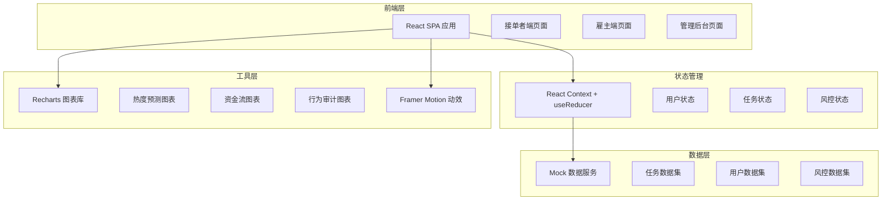
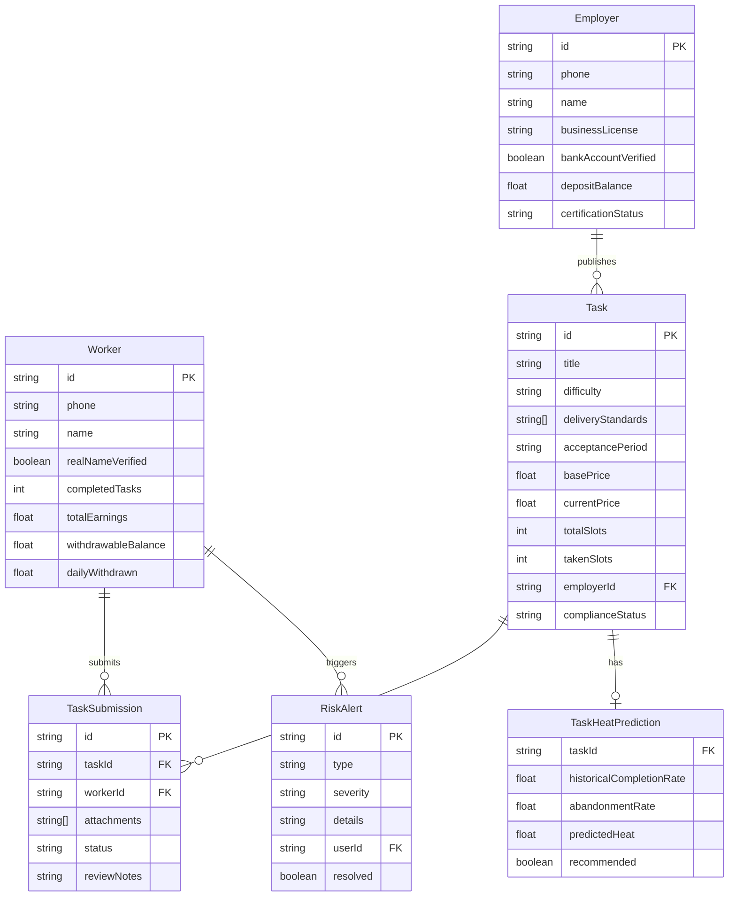

## 1. 架构设计



## 2. 技术说明

- **前端框架**：React@18 + TypeScript
- **样式方案**：Tailwind CSS@3 + CSS Variables（主题色管理）
- **构建工具**：Vite
- **初始化工具**：Vite Init（react-ts 模板）
- **后端服务**：无（纯前端 Mock 数据）
- **图表库**：Recharts（热度预测/资金流/行为审计可视化）
- **动效库**：Framer Motion（页面过渡、卡片动画、数字翻牌）
- **路由**：React Router@6
- **图标**：Lucide React

## 3. 路由定义

| 路由 | 用途 |
|------|------|
| `/` | 接单者首页（Hero、推荐任务、收益播报） |
| `/tasks` | 任务大厅（分级筛选、搜索、任务卡片列表） |
| `/tasks/:id` | 任务详情（交付标准、佣金阶梯、接单提交） |
| `/my-tasks` | 我的任务（状态筛选、任务跟踪） |
| `/profile` | 个人中心（收益仪表盘、提现、实名认证） |
| `/employer` | 雇主工作台（数据概览、任务发布、交付审核） |
| `/employer/certify` | 企业认证页面 |
| `/admin` | 管理后台首页（合规审核队列） |
| `/admin/risk` | 风控看板（行为审计+资金监控） |
| `/admin/prediction` | 热度预测看板（推荐池+趋势图） |

## 4. API 定义（Mock）

### 4.1 任务相关类型

```typescript
type DifficultyLevel = 'L1' | 'L2' | 'L3' | 'L4' | 'L5'

type AcceptancePeriod = '24h' | '72h' | '7d'

type TaskStatus = 'open' | 'in_progress' | 'pending_review' | 'completed' | 'rejected' | 'cancelled'

interface Task {
  id: string
  title: string
  description: string
  difficulty: DifficultyLevel
  deliveryStandards: string[]
  acceptancePeriod: AcceptancePeriod
  basePrice: number
  currentPrice: number
  totalSlots: number
  takenSlots: number
  categoryId: string
  employerId: string
  employerName: string
  status: TaskStatus
  createdAt: string
  deadline: string
  complianceStatus: 'pending' | 'approved' | 'rejected'
  complianceNotes?: string
}

interface TaskSubmission {
  id: string
  taskId: string
  workerId: string
  attachments: string[]
  status: 'submitted' | 'approved' | 'rejected'
  reviewNotes?: string
  submittedAt: string
  reviewedAt?: string
}
```

### 4.2 用户相关类型

```typescript
type UserRole = 'worker' | 'employer' | 'admin'

interface User {
  id: string
  phone: string
  name: string
  role: UserRole
  avatar?: string
  realNameVerified: boolean
  completedTasks: number
  earnings: number
  commissionLevel: number
}

interface Employer extends User {
  businessLicense: string
  bankAccountVerified: boolean
  depositBalance: number
  certificationStatus: 'pending' | 'approved' | 'rejected'
}

interface Worker extends User {
  idNumber?: string
  totalEarnings: number
  withdrawableBalance: number
  dailyWithdrawn: number
  deviceIds: string[]
}
```

### 4.3 风控相关类型

```typescript
interface RiskAlert {
  id: string
  type: 'device_duplicate' | 'withdrawal_exceed' | 'ip_anomaly' | 'compliance'
  severity: 'low' | 'medium' | 'high'
  details: string
  userId?: string
  createdAt: string
  resolved: boolean
}

interface TaskHeatPrediction {
  taskId: string
  taskTitle: string
  difficulty: DifficultyLevel
  historicalCompletionRate: number
  abandonmentRate: number
  predictedHeat: number
  recommended: boolean
  predictedTomorrowSlots: number
}
```

## 5. 数据模型

### 5.1 数据模型定义



### 5.2 Mock 数据结构

项目采用前端 Mock 数据方式，所有数据存储在 `src/data/` 目录下：

- `tasks.ts`：50+ 条模拟任务数据，覆盖 L1-L5 各难度
- `users.ts`：模拟接单者、雇主、管理员各若干
- `submissions.ts`：模拟交付记录
- `riskAlerts.ts`：模拟风控告警数据
- `heatPredictions.ts`：模拟热度预测数据
- `categories.ts`：任务分类定义

## 6. 项目目录结构

```
src/
├── components/
│   ├── common/          # 通用组件（Button, Card, Badge, Modal 等）
│   ├── worker/          # 接单者端组件
│   ├── employer/        # 雇主端组件
│   └── admin/           # 管理后台组件
├── pages/
│   ├── Home.tsx         # 接单者首页
│   ├── TaskHall.tsx     # 任务大厅
│   ├── TaskDetail.tsx   # 任务详情
│   ├── MyTasks.tsx      # 我的任务
│   ├── Profile.tsx      # 个人中心
│   ├── Employer.tsx     # 雇主工作台
│   ├── EmployerCertify.tsx
│   ├── Admin.tsx        # 管理后台
│   ├── AdminRisk.tsx    # 风控看板
│   └── AdminPrediction.tsx
├── data/                # Mock 数据
├── hooks/               # 自定义 Hooks
├── context/             # React Context
├── types/               # TypeScript 类型定义
├── utils/               # 工具函数
├── App.tsx
└── main.tsx
```
