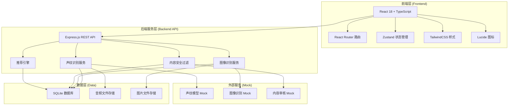
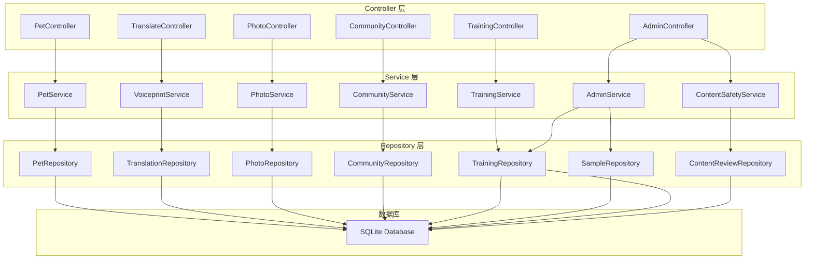
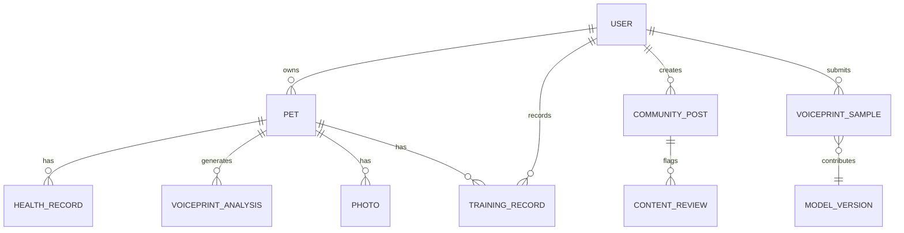

## 1. 架构设计



## 2. 技术描述

- **前端框架**：React@18 + TypeScript@5
- **构建工具**：Vite@5
- **样式方案**：TailwindCSS@3
- **状态管理**：Zustand@4
- **路由方案**：React Router Dom@6
- **图标库**：Lucide React
- **后端框架**：Express.js@4 + TypeScript
- **数据库**：SQLite（通过 better-sqlite3）
- **文件存储**：本地文件系统（public 目录）
- **数据交互**：前后端共享类型定义（shared 目录）

## 3. 路由定义

| 路由路径 | 页面组件 | 用途说明 |
|----------|----------|----------|
| `/` | Dashboard | 首页仪表盘 |
| `/translate` | Translate | 实时翻译模块 |
| `/album` | Album | 萌宠相册引擎 |
| `/album/editor/:id` | AlbumEditor | 照片 AI 编辑器 |
| `/community` | Community | 知识社区首页 |
| `/community/symptom-check` | SymptomCheck | 疾病症状自查树 |
| `/community/feed/:id` | FeedDetail | 内容详情页 |
| `/pets` | Pets | 宠物档案管理 |
| `/pets/:id` | PetDetail | 单个宠物详情 |
| `/training` | Training | 行为训练追踪 |
| `/admin/voiceprint` | AdminVoiceprint | 后台 - 声纹模型迭代中心 |
| `/admin/content-safety` | AdminContentSafety | 后台 - 内容安全审核 |
| `/admin/analytics` | AdminAnalytics | 后台 - 训练效果数据中心 |

## 4. API 定义

### 4.1 宠物档案 API

```typescript
// 宠物类型定义
interface Pet {
  id: string;
  name: string;
  species: 'dog' | 'cat';
  breed: string;
  age: number;
  gender: 'male' | 'female';
  personalityTags: string[];
  avatar: string;
  healthRecords: HealthRecord[];
  createdAt: string;
}

interface HealthRecord {
  id: string;
  type: 'vaccination' | 'checkup' | 'illness' | 'surgery';
  date: string;
  description: string;
}

// API 接口
GET    /api/pets              // 获取所有宠物
POST   /api/pets              // 创建宠物档案
GET    /api/pets/:id          // 获取单个宠物详情
PUT    /api/pets/:id          // 更新宠物档案
DELETE /api/pets/:id          // 删除宠物档案
```

### 4.2 声纹翻译 API

```typescript
interface VoiceprintAnalysis {
  id: string;
  petId: string;
  audioUrl: string;
  emotion: 'happy' | 'angry' | 'hungry' | 'anxious' | 'curious' | 'sleepy';
  emotionLabel: string;
  confidence: number;
  semanticText: string;
  voiceprintReport: {
    frequency: number;
    duration: number;
    intensity: number;
    pattern: string;
  };
  createdAt: string;
}

// API 接口
POST   /api/translate/analyze       // 上传音频并分析
GET    /api/translate/history       // 获取翻译历史
GET    /api/translate/:id           // 获取单次分析详情
POST   /api/translate/reverse       // 主人语音转拟声
```

### 4.3 相册 API

```typescript
interface Photo {
  id: string;
  petId: string;
  imageUrl: string;
  thumbnailUrl: string;
  autoTags: ('playing' | 'eating' | 'sleeping' | 'walking' | 'bathing')[];
  userTags: string[];
  filterApplied: string | null;
  bubbleTemplate: string | null;
  bubbleText: string | null;
  createdAt: string;
}

// API 接口
POST   /api/photos/upload           // 上传照片
GET    /api/photos                  // 获取照片列表（支持标签筛选）
GET    /api/photos/:id              // 获取照片详情
PUT    /api/photos/:id              // 更新照片标签/滤镜/气泡
DELETE /api/photos/:id              // 删除照片
```

### 4.4 社区 API

```typescript
interface CommunityPost {
  id: string;
  authorId: string;
  authorName: string;
  authorAvatar: string;
  isVetCertified: boolean;
  title: string;
  content: string;
  category: 'knowledge' | 'story' | 'question' | 'vet-article';
  tags: string[];
  likes: number;
  comments: number;
  createdAt: string;
}

interface SymptomNode {
  id: string;
  question: string;
  options: { label: string; nextNodeId: string | null }[];
  diagnosis?: {
    possibleConditions: string[];
    severity: 'mild' | 'moderate' | 'severe';
    suggestions: string[];
    recommendVisit: boolean;
  };
}

// API 接口
GET    /api/community/posts              // 获取社区内容列表
GET    /api/community/posts/:id          // 获取内容详情
GET    /api/community/symptom-tree       // 获取症状自查树
GET    /api/community/feeding-plan       // 获取个性化喂养方案
```

### 4.5 训练追踪 API

```typescript
interface TrainingRecord {
  id: string;
  petId: string;
  trainingType: string;
  date: string;
  duration: number;
  improvement: number;
  notes: string;
}

interface WeeklyReport {
  weekStart: string;
  weekEnd: string;
  totalSessions: number;
  totalDuration: number;
  averageImprovement: number;
  improvements: { category: string; score: number }[];
  suggestions: string[];
}

// API 接口
POST   /api/training/records        // 提交训练记录
GET    /api/training/records        // 获取训练记录列表
GET    /api/training/weekly-report  // 获取周报
```

### 4.6 后台管理 API

```typescript
interface VoiceprintSample {
  id: string;
  userId: string;
  audioUrl: string;
  petType: 'dog' | 'cat';
  status: 'pending' | 'auto-annotated' | 'reviewed' | 'rejected';
  autoAnnotation: string | null;
  finalAnnotation: string | null;
  submittedAt: string;
}

interface ModelVersion {
  id: string;
  version: string;
  accuracy: number;
  trainingSamples: number;
  status: 'training' | 'completed' | 'deployed';
  createdAt: string;
}

interface ContentReviewItem {
  id: string;
  contentType: 'text' | 'image' | 'post';
  content: string;
  status: 'pending' | 'approved' | 'rejected';
  flaggedReason: string[];
  submittedAt: string;
}

// API 接口
GET    /api/admin/samples              // 获取声纹样本列表
PUT    /api/admin/samples/:id/annotate // 审核/标注样本
GET    /api/admin/models               // 获取模型版本列表
POST   /api/admin/models/fine-tune     // 触发模型微调
GET    /api/admin/content-review       // 获取待审核内容
PUT    /api/admin/content-review/:id   // 审核内容
GET    /api/admin/analytics/training   // 获取训练效果数据
```

## 5. 服务端架构图



## 6. 数据模型

### 6.1 ER 图



### 6.2 DDL 语句

```sql
-- 用户表
CREATE TABLE users (
  id TEXT PRIMARY KEY,
  name TEXT NOT NULL,
  email TEXT UNIQUE,
  avatar TEXT,
  role TEXT NOT NULL DEFAULT 'user',
  created_at TEXT NOT NULL
);

-- 宠物表
CREATE TABLE pets (
  id TEXT PRIMARY KEY,
  user_id TEXT NOT NULL,
  name TEXT NOT NULL,
  species TEXT NOT NULL CHECK (species IN ('dog', 'cat')),
  breed TEXT,
  age INTEGER,
  gender TEXT CHECK (gender IN ('male', 'female')),
  personality_tags TEXT,
  avatar TEXT,
  created_at TEXT NOT NULL,
  FOREIGN KEY (user_id) REFERENCES users(id)
);

-- 健康记录表
CREATE TABLE health_records (
  id TEXT PRIMARY KEY,
  pet_id TEXT NOT NULL,
  type TEXT NOT NULL,
  date TEXT NOT NULL,
  description TEXT,
  FOREIGN KEY (pet_id) REFERENCES pets(id)
);

-- 声纹分析表
CREATE TABLE voiceprint_analyses (
  id TEXT PRIMARY KEY,
  pet_id TEXT NOT NULL,
  audio_url TEXT NOT NULL,
  emotion TEXT NOT NULL,
  emotion_label TEXT NOT NULL,
  confidence REAL NOT NULL,
  semantic_text TEXT NOT NULL,
  frequency REAL,
  duration REAL,
  intensity REAL,
  pattern TEXT,
  created_at TEXT NOT NULL,
  FOREIGN KEY (pet_id) REFERENCES pets(id)
);

-- 照片表
CREATE TABLE photos (
  id TEXT PRIMARY KEY,
  pet_id TEXT NOT NULL,
  image_url TEXT NOT NULL,
  thumbnail_url TEXT,
  auto_tags TEXT,
  user_tags TEXT,
  filter_applied TEXT,
  bubble_template TEXT,
  bubble_text TEXT,
  created_at TEXT NOT NULL,
  FOREIGN KEY (pet_id) REFERENCES pets(id)
);

-- 社区内容表
CREATE TABLE community_posts (
  id TEXT PRIMARY KEY,
  author_id TEXT NOT NULL,
  title TEXT NOT NULL,
  content TEXT NOT NULL,
  category TEXT NOT NULL,
  tags TEXT,
  is_vet_certified INTEGER NOT NULL DEFAULT 0,
  likes INTEGER NOT NULL DEFAULT 0,
  comments INTEGER NOT NULL DEFAULT 0,
  created_at TEXT NOT NULL,
  FOREIGN KEY (author_id) REFERENCES users(id)
);

-- 训练记录表
CREATE TABLE training_records (
  id TEXT PRIMARY KEY,
  pet_id TEXT NOT NULL,
  user_id TEXT NOT NULL,
  training_type TEXT NOT NULL,
  date TEXT NOT NULL,
  duration INTEGER NOT NULL,
  improvement INTEGER NOT NULL,
  notes TEXT,
  FOREIGN KEY (pet_id) REFERENCES pets(id),
  FOREIGN KEY (user_id) REFERENCES users(id)
);

-- 声纹样本表
CREATE TABLE voiceprint_samples (
  id TEXT PRIMARY KEY,
  user_id TEXT NOT NULL,
  audio_url TEXT NOT NULL,
  pet_type TEXT NOT NULL,
  status TEXT NOT NULL DEFAULT 'pending',
  auto_annotation TEXT,
  final_annotation TEXT,
  submitted_at TEXT NOT NULL,
  FOREIGN KEY (user_id) REFERENCES users(id)
);

-- 模型版本表
CREATE TABLE model_versions (
  id TEXT PRIMARY KEY,
  version TEXT NOT NULL,
  accuracy REAL NOT NULL,
  training_samples INTEGER NOT NULL,
  status TEXT NOT NULL,
  created_at TEXT NOT NULL
);

-- 内容审核表
CREATE TABLE content_reviews (
  id TEXT PRIMARY KEY,
  content_type TEXT NOT NULL,
  content TEXT NOT NULL,
  status TEXT NOT NULL DEFAULT 'pending',
  flagged_reason TEXT,
  submitted_at TEXT NOT NULL
);
```
