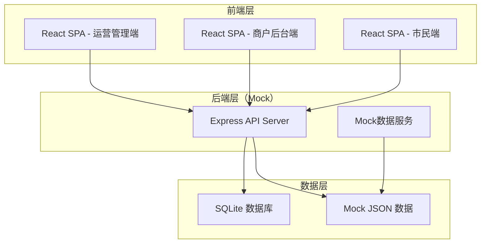
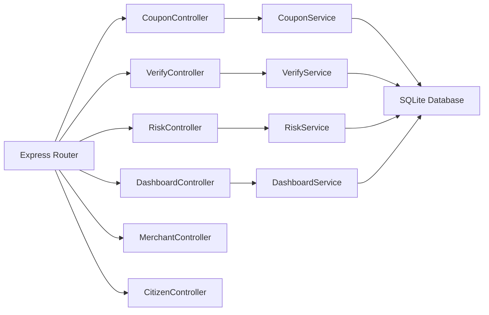
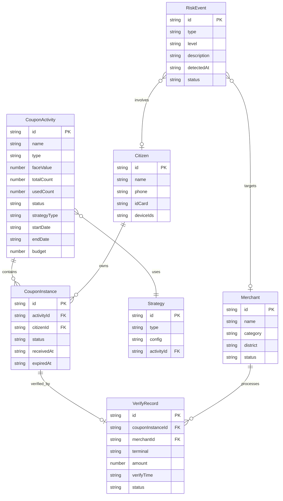

## 1. 架构设计



本项目采用纯前端+Mock数据的开发模式，聚焦于平台UI与交互的完整展示。后端使用Express提供Mock API，数据存储使用SQLite。

## 2. 技术说明

- **前端**：React@18 + TypeScript + TailwindCSS@3 + Vite
- **状态管理**：Zustand
- **路由**：React Router DOM v6
- **图表库**：Recharts
- **初始化工具**：vite-init（react-express-ts模板）
- **后端**：Express@4 + TypeScript（ESM格式）
- **数据库**：SQLite（better-sqlite3）
- **图标**：lucide-react

## 3. 路由定义

### 3.1 运营管理端路由

| 路由 | 用途 |
|------|------|
| `/` | 运营总览看板 |
| `/coupon/list` | 券活动列表 |
| `/coupon/create` | 创建券活动 |
| `/coupon/edit/:id` | 编辑券活动 |
| `/coupon/strategy` | 发放策略配置 |
| `/verify/overview` | 核销数据概览 |
| `/verify/records` | 核销流水列表 |
| `/verify/reconciliation` | 核销对账报表 |
| `/risk/overview` | 风控概览 |
| `/risk/device-monitor` | 设备多账户监控 |
| `/risk/hoarding-alert` | 黄牛囤券预警 |
| `/risk/path-analysis` | 异常核销路径图谱 |
| `/system/settlement` | 跨市结算通道配置 |
| `/system/subsidy` | 财政补贴拨付 |
| `/system/merchant-audit` | 商户资质审核 |

### 3.2 商户后台路由

| 路由 | 用途 |
|------|------|
| `/merchant` | 商户总览 |
| `/merchant/coupons` | 券活动管理 |
| `/merchant/verify` | 核销操作 |
| `/merchant/reconciliation` | 核销对账 |
| `/merchant/alert` | 核销率预警 |

### 3.3 市民端路由

| 路由 | 用途 |
|------|------|
| `/citizen` | 首页推荐 |
| `/citizen/explore` | 领券中心 |
| `/citizen/wallet` | 我的券包 |
| `/citizen/history` | 消费记录 |

## 4. API定义

### 4.1 券活动相关

```typescript
interface CouponActivity {
  id: string;
  name: string;
  type: "政务补贴" | "民生优惠" | "商业促销";
  faceValue: number;
  totalCount: number;
  usedCount: number;
  status: "draft" | "active" | "paused" | "expired";
  strategy: "人群包" | "地理围栏" | "满减触发";
  startDate: string;
  endDate: string;
  budget: number;
  budgetUsed: number;
}

interface CreateCouponRequest {
  name: string;
  type: CouponActivity["type"];
  faceValue: number;
  totalCount: number;
  strategy: CouponActivity["strategy"];
  strategyConfig: StrategyConfig;
  startDate: string;
  endDate: string;
  budget: number;
}

interface StrategyConfig {
  groupIds?: string[];
  geoFence?: { lat: number; lng: number; radius: number };
  thresholdAmount?: number;
}
```

### 4.2 核销记录相关

```typescript
interface VerifyRecord {
  id: string;
  couponId: string;
  couponName: string;
  citizenName: string;
  merchantName: string;
  terminal: "POS机具" | "小程序码" | "城市码";
  amount: number;
  verifyTime: string;
  status: "success" | "failed" | "reversed";
}
```

### 4.3 风控事件相关

```typescript
interface RiskEvent {
  id: string;
  type: "device_multi_account" | "hoarding" | "abnormal_path";
  level: "low" | "medium" | "high" | "critical";
  description: string;
  detectedAt: string;
  accounts: string[];
  status: "pending" | "processing" | "resolved";
}
```

### 4.4 运营看板相关

```typescript
interface DashboardMetrics {
  totalIssued: number;
  totalVerified: number;
  verifyRate: number;
  activeMerchants: number;
  totalBenefit: number;
  dailyTrend: { date: string; issued: number; verified: number }[];
  districtData: { name: string; value: number }[];
  categoryDistribution: { name: string; value: number }[];
}
```

## 5. 服务器架构图



## 6. 数据模型

### 6.1 数据模型定义



### 6.2 数据定义语言

```sql
CREATE TABLE coupon_activities (
  id TEXT PRIMARY KEY,
  name TEXT NOT NULL,
  type TEXT NOT NULL CHECK(type IN ('政务补贴', '民生优惠', '商业促销')),
  face_value REAL NOT NULL,
  total_count INTEGER NOT NULL,
  used_count INTEGER DEFAULT 0,
  status TEXT DEFAULT 'draft' CHECK(status IN ('draft', 'active', 'paused', 'expired')),
  strategy_type TEXT NOT NULL CHECK(strategy_type IN ('人群包', '地理围栏', '满减触发')),
  start_date TEXT NOT NULL,
  end_date TEXT NOT NULL,
  budget REAL NOT NULL,
  budget_used REAL DEFAULT 0,
  created_at TEXT DEFAULT (datetime('now'))
);

CREATE TABLE coupon_instances (
  id TEXT PRIMARY KEY,
  activity_id TEXT NOT NULL REFERENCES coupon_activities(id),
  citizen_id TEXT NOT NULL,
  status TEXT DEFAULT 'unused' CHECK(status IN ('unused', 'used', 'expired')),
  received_at TEXT DEFAULT (datetime('now')),
  expired_at TEXT,
  used_at TEXT
);

CREATE TABLE verify_records (
  id TEXT PRIMARY KEY,
  coupon_instance_id TEXT NOT NULL REFERENCES coupon_instances(id),
  merchant_id TEXT NOT NULL,
  terminal TEXT NOT NULL CHECK(terminal IN ('POS机具', '小程序码', '城市码')),
  amount REAL NOT NULL,
  verify_time TEXT DEFAULT (datetime('now')),
  status TEXT DEFAULT 'success' CHECK(status IN ('success', 'failed', 'reversed'))
);

CREATE TABLE citizens (
  id TEXT PRIMARY KEY,
  name TEXT NOT NULL,
  phone TEXT NOT NULL,
  id_card TEXT NOT NULL,
  device_ids TEXT DEFAULT '[]',
  consumption_level TEXT DEFAULT 'medium',
  frequent_districts TEXT DEFAULT '[]',
  preferred_categories TEXT DEFAULT '[]'
);

CREATE TABLE merchants (
  id TEXT PRIMARY KEY,
  name TEXT NOT NULL,
  category TEXT NOT NULL,
  district TEXT NOT NULL,
  status TEXT DEFAULT 'active' CHECK(status IN ('active', 'suspended', 'pending_audit')),
  verify_rate REAL DEFAULT 0
);

CREATE TABLE risk_events (
  id TEXT PRIMARY KEY,
  type TEXT NOT NULL CHECK(type IN ('device_multi_account', 'hoarding', 'abnormal_path')),
  level TEXT NOT NULL CHECK(level IN ('low', 'medium', 'high', 'critical')),
  description TEXT NOT NULL,
  detected_at TEXT DEFAULT (datetime('now')),
  related_accounts TEXT DEFAULT '[]',
  status TEXT DEFAULT 'pending' CHECK(status IN ('pending', 'processing', 'resolved'))
);

CREATE TABLE strategies (
  id TEXT PRIMARY KEY,
  type TEXT NOT NULL,
  config TEXT NOT NULL,
  activity_id TEXT NOT NULL REFERENCES coupon_activities(id)
);

CREATE INDEX idx_coupon_activities_status ON coupon_activities(status);
CREATE INDEX idx_coupon_instances_activity ON coupon_instances(activity_id);
CREATE INDEX idx_coupon_instances_citizen ON coupon_instances(citizen_id);
CREATE INDEX idx_verify_records_merchant ON verify_records(merchant_id);
CREATE INDEX idx_verify_records_time ON verify_records(verify_time);
CREATE INDEX idx_risk_events_type ON risk_events(type);
CREATE INDEX idx_risk_events_level ON risk_events(level);
```
