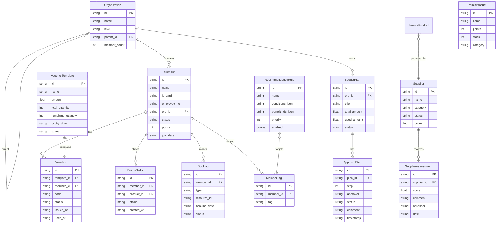

## 1. 架构设计

```mermaid
graph TB
    subgraph "前端层"
        "React SPA" --- "React Router"
        "React SPA" --- "Zustand 状态管理"
        "React SPA" --- "Tailwind CSS"
    end

    subgraph "后端层"
        "Express API" --- "路由控制器"
        "路由控制器" --- "业务服务层"
        "业务服务层" --- "数据访问层"
    end

    subgraph "数据层"
        "SQLite 数据库" --- "会员数据"
        "SQLite 数据库" --- "组织数据"
        "SQLite 数据库" --- "福利数据"
        "SQLite 数据库" --- "服务数据"
    end

    subgraph "外部服务（模拟）"
        "银联云闪付接口"
        "全国工会数据库同步接口"
    end

    "React SPA" -->|"HTTP/API"| "Express API"
    "数据访问层" -->|"SQL"| "SQLite 数据库"
    "业务服务层" -->|"HTTP"| "银联云闪付接口"
    "业务服务层" -->|"HTTP"| "全国工会数据库同步接口"
```

## 2. 技术说明

- 前端：React@18 + TailwindCSS@3 + Vite + TypeScript
- 初始化工具：vite-init
- 后端：Express@4 + TypeScript（ESM格式）
- 数据库：SQLite（开发阶段，通过 better-sqlite3 驱动）
- 状态管理：Zustand
- 图表库：recharts
- 图标：lucide-react

## 3. 路由定义

| 路由 | 用途 |
|------|------|
| / | 首页仪表盘，数据概览与快捷入口 |
| /organization | 组织管理，工会树形架构与会员审核 |
| /benefits | 福利中心，电子券、积分商城、预算管理 |
| /payment | 便捷支付，工会卡与支付记录 |
| /travel | 出行服务，贵宾厅预约与优先购票 |
| /life | 品质生活，体检团购与法律咨询 |
| /admin | 后台运营，供应商管理与数据分析 |
| /admin/approval | 审批工作流管理 |
| /admin/analytics | 数据分析看板 |
| /admin/recommend | 推荐算法配置 |
| /login | 登录页 |

## 4. API定义

### 4.1 认证相关

```typescript
interface LoginRequest {
  username: string;
  password: string;
}

interface LoginResponse {
  token: string;
  user: {
    id: string;
    name: string;
    role: "province_admin" | "city_admin" | "base_admin" | "member";
    orgId: string;
    orgName: string;
  };
}
```

### 4.2 组织管理

```typescript
interface OrgNode {
  id: string;
  name: string;
  level: "province" | "city" | "base";
  parentId: string | null;
  memberCount: number;
  children: OrgNode[];
}

interface MemberVerifyRequest {
  idCard: string;
  employeeNo: string;
  name: string;
  phone: string;
}

interface MemberVerifyResponse {
  success: boolean;
  matchedOrg?: string;
  message: string;
}

interface Member {
  id: string;
  name: string;
  idCard: string;
  employeeNo: string;
  orgId: string;
  orgName: string;
  status: "pending" | "active" | "rejected";
  joinDate: string;
  points: number;
  tags: string[];
}
```

### 4.3 福利中心

```typescript
interface VoucherTemplate {
  id: string;
  name: string;
  amount: number;
  totalQuantity: number;
  remainingQuantity: number;
  expiryDate: string;
  status: "draft" | "active" | "expired";
}

interface Voucher {
  id: string;
  templateId: string;
  code: string;
  memberId: string;
  status: "unused" | "used" | "expired";
  issuedAt: string;
  usedAt?: string;
}

interface PointsProduct {
  id: string;
  name: string;
  points: number;
  image: string;
  stock: number;
  category: string;
}

interface BudgetPlan {
  id: string;
  orgId: string;
  title: string;
  totalAmount: number;
  usedAmount: number;
  status: "pending" | "approved" | "rejected" | "executing" | "completed";
  approvalFlow: ApprovalStep[];
}

interface ApprovalStep {
  step: number;
  approver: string;
  approverName: string;
  status: "pending" | "approved" | "rejected";
  comment?: string;
  timestamp?: string;
}
```

### 4.4 出行与品质生活

```typescript
interface VipLoungeBooking {
  id: string;
  memberId: string;
  loungeId: string;
  loungeName: string;
  bookingDate: string;
  bookingTime: string;
  status: "pending" | "confirmed" | "cancelled" | "completed";
}

interface TrainTicketRequest {
  id: string;
  memberId: string;
  fromStation: string;
  toStation: string;
  travelDate: string;
  status: "pending" | "approved" | "rejected" | "purchased";
}

interface HealthCheckupPackage {
  id: string;
  providerName: string;
  name: string;
  originalPrice: number;
  groupPrice: number;
  items: string[];
  enrolledCount: number;
  maxCount: number;
}

interface LegalConsultBooking {
  id: string;
  memberId: string;
  lawyerId: string;
  lawyerName: string;
  bookingDate: string;
  bookingTime: string;
  status: "pending" | "confirmed" | "completed" | "cancelled";
}
```

### 4.5 供应商管理

```typescript
interface Supplier {
  id: string;
  name: string;
  category: string;
  status: "applying" | "approved" | "suspended" | "blacklisted";
  qualificationDocs: string[];
  score: number;
  assessmentHistory: SupplierAssessment[];
}

interface SupplierAssessment {
  id: string;
  supplierId: string;
  score: number;
  comment: string;
  assessor: string;
  date: string;
}
```

### 4.6 数据分析

```typescript
interface FunnelData {
  stage: string;
  count: number;
  rate: number;
}

interface MemberStats {
  totalMembers: number;
  activeMembers: number;
  newMembersThisMonth: number;
  benefitCoverageRate: number;
}

interface RecommendationRule {
  id: string;
  name: string;
  conditions: {
    tags: string[];
    ageRange?: [number, number];
    jobTitle?: string;
  };
  benefitIds: string[];
  priority: number;
  enabled: boolean;
}
```

## 5. 服务端架构图

```mermaid
graph LR
    subgraph "控制器层"
        "AuthController"
        "OrgController"
        "BenefitController"
        "ServiceController"
        "AdminController"
    end

    subgraph "服务层"
        "AuthService"
        "OrgService"
        "BenefitService"
        "TravelService"
        "LifeService"
        "SupplierService"
        "AnalyticsService"
        "RecommendService"
    end

    subgraph "数据层"
        "MemberRepo"
        "OrgRepo"
        "VoucherRepo"
        "PointsRepo"
        "BudgetRepo"
        "SupplierRepo"
        "BookingRepo"
    end

    "AuthController" --> "AuthService"
    "OrgController" --> "OrgService"
    "BenefitController" --> "BenefitService"
    "ServiceController" --> "TravelService"
    "ServiceController" --> "LifeService"
    "AdminController" --> "SupplierService"
    "AdminController" --> "AnalyticsService"
    "AdminController" --> "RecommendService"

    "AuthService" --> "MemberRepo"
    "OrgService" --> "OrgRepo"
    "OrgService" --> "MemberRepo"
    "BenefitService" --> "VoucherRepo"
    "BenefitService" --> "PointsRepo"
    "BenefitService" --> "BudgetRepo"
    "TravelService" --> "BookingRepo"
    "LifeService" --> "BookingRepo"
    "SupplierService" --> "SupplierRepo"
    "AnalyticsService" --> "MemberRepo"
    "AnalyticsService" --> "VoucherRepo"
```

## 6. 数据模型

### 6.1 数据模型定义



### 6.2 数据定义语言

```sql
CREATE TABLE organization (
    id TEXT PRIMARY KEY,
    name TEXT NOT NULL,
    level TEXT NOT NULL CHECK(level IN ('province', 'city', 'base')),
    parent_id TEXT,
    member_count INTEGER DEFAULT 0,
    created_at TEXT DEFAULT (datetime('now')),
    FOREIGN KEY (parent_id) REFERENCES organization(id)
);

CREATE TABLE member (
    id TEXT PRIMARY KEY,
    name TEXT NOT NULL,
    id_card TEXT NOT NULL UNIQUE,
    employee_no TEXT NOT NULL,
    org_id TEXT NOT NULL,
    status TEXT NOT NULL DEFAULT 'pending' CHECK(status IN ('pending', 'active', 'rejected')),
    points INTEGER DEFAULT 0,
    join_date TEXT,
    created_at TEXT DEFAULT (datetime('now')),
    FOREIGN KEY (org_id) REFERENCES organization(id)
);

CREATE TABLE member_tag (
    id TEXT PRIMARY KEY,
    member_id TEXT NOT NULL,
    tag TEXT NOT NULL,
    FOREIGN KEY (member_id) REFERENCES member(id)
);

CREATE TABLE voucher_template (
    id TEXT PRIMARY KEY,
    name TEXT NOT NULL,
    amount REAL NOT NULL,
    total_quantity INTEGER NOT NULL,
    remaining_quantity INTEGER NOT NULL,
    expiry_date TEXT NOT NULL,
    status TEXT NOT NULL DEFAULT 'draft' CHECK(status IN ('draft', 'active', 'expired')),
    org_id TEXT NOT NULL,
    created_at TEXT DEFAULT (datetime('now')),
    FOREIGN KEY (org_id) REFERENCES organization(id)
);

CREATE TABLE voucher (
    id TEXT PRIMARY KEY,
    template_id TEXT NOT NULL,
    member_id TEXT NOT NULL,
    code TEXT NOT NULL UNIQUE,
    status TEXT NOT NULL DEFAULT 'unused' CHECK(status IN ('unused', 'used', 'expired')),
    issued_at TEXT DEFAULT (datetime('now')),
    used_at TEXT,
    FOREIGN KEY (template_id) REFERENCES voucher_template(id),
    FOREIGN KEY (member_id) REFERENCES member(id)
);

CREATE TABLE budget_plan (
    id TEXT PRIMARY KEY,
    org_id TEXT NOT NULL,
    title TEXT NOT NULL,
    total_amount REAL NOT NULL,
    used_amount REAL DEFAULT 0,
    status TEXT NOT NULL DEFAULT 'pending' CHECK(status IN ('pending', 'approved', 'rejected', 'executing', 'completed')),
    created_at TEXT DEFAULT (datetime('now')),
    FOREIGN KEY (org_id) REFERENCES organization(id)
);

CREATE TABLE approval_step (
    id TEXT PRIMARY KEY,
    plan_id TEXT NOT NULL,
    step INTEGER NOT NULL,
    approver TEXT NOT NULL,
    approver_name TEXT NOT NULL,
    status TEXT NOT NULL DEFAULT 'pending' CHECK(status IN ('pending', 'approved', 'rejected')),
    comment TEXT,
    timestamp TEXT,
    FOREIGN KEY (plan_id) REFERENCES budget_plan(id)
);

CREATE TABLE points_product (
    id TEXT PRIMARY KEY,
    name TEXT NOT NULL,
    points INTEGER NOT NULL,
    stock INTEGER NOT NULL,
    category TEXT NOT NULL,
    image TEXT,
    description TEXT,
    created_at TEXT DEFAULT (datetime('now'))
);

CREATE TABLE points_order (
    id TEXT PRIMARY KEY,
    member_id TEXT NOT NULL,
    product_id TEXT NOT NULL,
    status TEXT NOT NULL DEFAULT 'pending' CHECK(status IN ('pending', 'shipped', 'completed', 'cancelled')),
    created_at TEXT DEFAULT (datetime('now')),
    FOREIGN KEY (member_id) REFERENCES member(id),
    FOREIGN KEY (product_id) REFERENCES points_product(id)
);

CREATE TABLE booking (
    id TEXT PRIMARY KEY,
    member_id TEXT NOT NULL,
    type TEXT NOT NULL CHECK(type IN ('vip_lounge', 'train_ticket', 'health_checkup', 'legal_consult')),
    resource_id TEXT NOT NULL,
    resource_name TEXT NOT NULL,
    booking_date TEXT NOT NULL,
    booking_time TEXT,
    status TEXT NOT NULL DEFAULT 'pending' CHECK(status IN ('pending', 'confirmed', 'completed', 'cancelled')),
    created_at TEXT DEFAULT (datetime('now')),
    FOREIGN KEY (member_id) REFERENCES member(id)
);

CREATE TABLE supplier (
    id TEXT PRIMARY KEY,
    name TEXT NOT NULL,
    category TEXT NOT NULL,
    status TEXT NOT NULL DEFAULT 'applying' CHECK(status IN ('applying', 'approved', 'suspended', 'blacklisted')),
    score REAL DEFAULT 0,
    contact TEXT,
    description TEXT,
    created_at TEXT DEFAULT (datetime('now'))
);

CREATE TABLE supplier_assessment (
    id TEXT PRIMARY KEY,
    supplier_id TEXT NOT NULL,
    score REAL NOT NULL,
    comment TEXT,
    assessor TEXT NOT NULL,
    date TEXT NOT NULL,
    FOREIGN KEY (supplier_id) REFERENCES supplier(id)
);

CREATE TABLE recommendation_rule (
    id TEXT PRIMARY KEY,
    name TEXT NOT NULL,
    conditions_json TEXT NOT NULL,
    benefit_ids_json TEXT NOT NULL,
    priority INTEGER DEFAULT 0,
    enabled INTEGER DEFAULT 1,
    created_at TEXT DEFAULT (datetime('now'))
);

CREATE INDEX idx_member_org ON member(org_id);
CREATE INDEX idx_member_status ON member(status);
CREATE INDEX idx_voucher_member ON voucher(member_id);
CREATE INDEX idx_voucher_template ON voucher(template_id);
CREATE INDEX idx_booking_member ON booking(member_id);
CREATE INDEX idx_booking_type ON booking(type);
CREATE INDEX idx_budget_org ON budget_plan(org_id);
CREATE INDEX idx_supplier_status ON supplier(status);
CREATE INDEX idx_member_tag_member ON member_tag(member_id);
```
