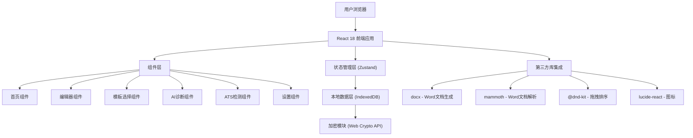
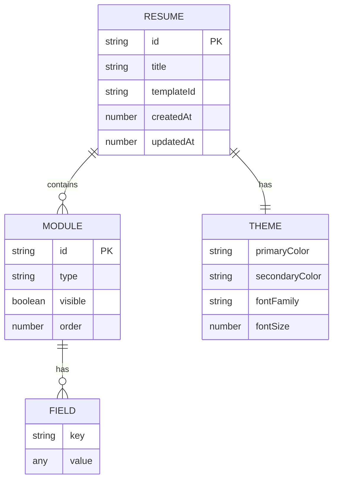

## 1. 架构设计



## 2. 技术说明
- 前端：React@18 + TypeScript@5 + Vite@5
- 样式：TailwindCSS@3 + CSS Variables 主题系统
- 状态管理：Zustand（轻量、简洁、支持持久化中间件）
- 路由：React Router v6
- 拖拽：@dnd-kit/core + @dnd-kit/sortable
- Word文档处理：docx（生成）+ mammoth（解析导入）
- 本地存储：IndexedDB（idb封装）+ Web Crypto API（AES-GCM加密）
- 图标：lucide-react
- AI功能：纯前端规则引擎模拟（关键词匹配、正则检测、模板化改写）

## 3. 路由定义
| 路由 | 用途 |
|------|------|
| / | 工作台首页，展示功能入口、模板推荐、最近简历 |
| /templates | 行业模板选择页 |
| /editor/:id | 简历编辑器，id为简历唯一标识 |
| /diagnosis/:id | AI简历诊断结果页 |
| /ats-check/:id | ATS兼容性检测报告页 |
| /settings | 设置页（隐私保护、数据管理） |

## 4. API定义
- 无后端服务，所有逻辑在前端完成
- 本地存储API：
```typescript
// 简历数据模型
interface Resume {
  id: string;
  title: string;
  templateId: string;
  theme: ResumeTheme;
  modules: ResumeModule[];
  createdAt: number;
  updatedAt: number;
}

interface ResumeModule {
  id: string;
  type: ModuleType; // basic | education | experience | project | skills | selfEvaluation | custom
  visible: boolean;
  order: number;
  fields: Record<string, any>;
}

interface ResumeTheme {
  primaryColor: string;
  secondaryColor: string;
  fontFamily: string;
  fontSize: number;
}

type ModuleType = 'basic' | 'education' | 'experience' | 'project' | 'skills' | 'selfEvaluation' | 'custom';
```

## 5. 数据模型

### 5.1 数据模型定义



### 5.2 IndexedDB 表结构
- **resumes** 表：存储所有简历（加密后），主键为 id，索引为 updatedAt
- **settings** 表：存储用户设置，包括隐私保护开关、加密密钥等

## 6. 核心模块实现策略

### 6.1 Word文档引擎
- 导出：使用 `docx` 库构建原生 .docx 文件，支持字体嵌入、表格、样式
- 导入：使用 `mammoth` 解析 .docx 内容并映射到简历数据模型
- 预览：通过CSS A4布局实时渲染，保持与Word导出一致

### 6.2 AI诊断规则引擎
- 空洞表述检测：匹配"负责"、"参与"、"协助"等弱动词，建议替换为强动作动词
- 时序矛盾检测：校验日期区间重叠、结束日期早于开始日期
- 技能关键词检测：基于岗位关键词库匹配缺失项
- 改写建议：基于模板库提供STAR法则改写模板

### 6.3 ATS检测
- 字体检测：检查是否使用系统安全字体（Arial/Calibri/Georgia/Times New Roman等）
- 表格检测：检测是否存在嵌套表格、合并单元格等ATS不友好结构
- 链接检测：检查超链接格式有效性
- 关键词密度：检测岗位相关关键词出现频率

### 6.4 隐私保护
- 使用 Web Crypto API 的 AES-GCM 算法加密所有本地数据
- 密钥由用户密码派生（PBKDF2），默认使用内置密钥（透明加密）
- 隐私模式下禁止所有外部网络请求（通过 Service Worker 拦截）
- 提供本地数据一键导出/清空功能
