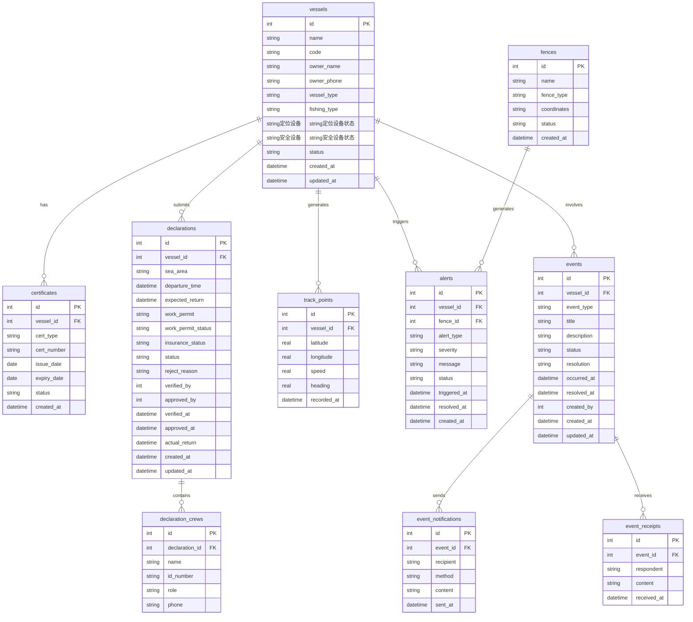

## 1. 架构设计

```mermaid
graph TB
    "浏览器" --> "Vite Dev Server :43439"
    "Vite Dev Server :43439" --> "Express API :53439"
    "Express API :53439" --> "SQLite data/fishing.db"
    "Express API :53439" --> "业务逻辑层"
    "业务逻辑层" --> "数据访问层"
    "数据访问层" --> "SQLite data/fishing.db"
```

## 2. 技术说明

- 前端：React 18 + Tailwind CSS 3 + Vite 6 + React Router 7 + Zustand 5
- 初始化工具：vite-init (react-express-ts 模板)
- 后端：Express 4 + TypeScript (tsx 运行)
- 数据库：SQLite (better-sqlite3)，文件路径 data/fishing.db
- 图表：recharts
- 日期：date-fns
- 无外部服务依赖

## 3. 路由定义

| 路由 | 用途 |
|------|------|
| / | 首页仪表盘 |
| /vessels | 渔船档案列表 |
| /vessels/new | 新增渔船 |
| /vessels/:id | 渔船详情 |
| /declarations | 出海申报列表 |
| /declarations/new | 新建出海申报 |
| /declarations/:id | 申报详情与审批 |
| /monitor | 实时监管 |
| /events | 事件列表 |
| /events/new | 新建事件 |
| /events/:id | 事件详情与处置 |
| /reports | 统计报表 |

## 4. API 定义

### 4.1 渔船档案 API

| 方法 | 路径 | 说明 |
|------|------|------|
| GET | /api/vessels | 获取渔船列表（支持分页、搜索） |
| GET | /api/vessels/:id | 获取渔船详情 |
| POST | /api/vessels | 新增渔船 |
| PUT | /api/vessels/:id | 更新渔船信息 |
| DELETE | /api/vessels/:id | 删除渔船 |
| GET | /api/vessels/:id/certificates | 获取渔船证书列表 |
| POST | /api/vessels/:id/certificates | 新增证书 |
| PUT | /api/certificates/:id | 更新证书 |

### 4.2 出海申报 API

| 方法 | 路径 | 说明 |
|------|------|------|
| GET | /api/declarations | 获取申报列表（支持状态筛选） |
| GET | /api/declarations/:id | 获取申报详情 |
| POST | /api/declarations | 新建出海申报 |
| PUT | /api/declarations/:id | 更新申报 |
| POST | /api/declarations/:id/verify | 核验申报（自动+人工） |
| POST | /api/declarations/:id/approve | 审批通过 |
| POST | /api/declarations/:id/reject | 审批驳回 |

### 4.3 实时监管 API

| 方法 | 路径 | 说明 |
|------|------|------|
| GET | /api/monitor/vessels | 获取在航渔船及最新位置 |
| GET | /api/monitor/vessels/:id/track | 获取渔船轨迹 |
| GET | /api/monitor/fences | 获取电子围栏列表 |
| POST | /api/monitor/fences | 新增电子围栏 |
| GET | /api/monitor/alerts | 获取告警列表 |
| PUT | /api/monitor/alerts/:id | 处理告警 |

### 4.4 事件处置 API

| 方法 | 路径 | 说明 |
|------|------|------|
| GET | /api/events | 获取事件列表（支持类型、状态筛选） |
| GET | /api/events/:id | 获取事件详情 |
| POST | /api/events | 新建事件 |
| PUT | /api/events/:id | 更新事件 |
| POST | /api/events/:id/notify | 发送通知 |
| POST | /api/events/:id/receipt | 接收回执 |
| POST | /api/events/:id/resolve | 记录处理结论 |

### 4.5 统计报表 API

| 方法 | 路径 | 说明 |
|------|------|------|
| GET | /api/reports/fleet | 船队统计 |
| GET | /api/reports/sea-area | 海域统计 |
| GET | /api/reports/voyages | 出海次数统计 |
| GET | /api/reports/violations | 违规类型统计 |
| GET | /api/reports/safety-risk | 安全风险统计 |
| GET | /api/reports/dashboard | 首页仪表盘数据 |

### 4.6 通用 API

| 方法 | 路径 | 说明 |
|------|------|------|
| GET | /api/health | 健康检查 |
| GET | /api/options/vessel-types | 作业类型选项 |
| GET | /api/options/sea-areas | 海域选项 |

## 5. 服务端架构图

```mermaid
graph LR
    "Controller" --> "Service"
    "Service" --> "Repository"
    "Repository" --> "SQLite"
```

- Controller：路由处理，参数校验，响应格式化
- Service：业务逻辑，跨表操作，状态流转
- Repository：SQL 执行，数据映射

## 6. 数据模型

### 6.1 ER 图



### 6.2 DDL

```sql
CREATE TABLE IF NOT EXISTS vessels (
    id INTEGER PRIMARY KEY AUTOINCREMENT,
    name TEXT NOT NULL,
    code TEXT NOT NULL UNIQUE,
    owner_name TEXT NOT NULL,
    owner_phone TEXT DEFAULT '',
    vessel_type TEXT NOT NULL,
    fishing_type TEXT NOT NULL,
    gps_device TEXT DEFAULT '',
    gps_status TEXT DEFAULT '正常',
    safety_device TEXT DEFAULT '',
    safety_status TEXT DEFAULT '正常',
    status TEXT DEFAULT '在港',
    created_at TEXT DEFAULT (datetime('now','localtime')),
    updated_at TEXT DEFAULT (datetime('now','localtime'))
);

CREATE TABLE IF NOT EXISTS certificates (
    id INTEGER PRIMARY KEY AUTOINCREMENT,
    vessel_id INTEGER NOT NULL,
    cert_type TEXT NOT NULL,
    cert_number TEXT NOT NULL,
    issue_date TEXT NOT NULL,
    expiry_date TEXT NOT NULL,
    status TEXT DEFAULT '有效',
    created_at TEXT DEFAULT (datetime('now','localtime')),
    FOREIGN KEY (vessel_id) REFERENCES vessels(id)
);

CREATE TABLE IF NOT EXISTS declarations (
    id INTEGER PRIMARY KEY AUTOINCREMENT,
    vessel_id INTEGER NOT NULL,
    sea_area TEXT NOT NULL,
    departure_time TEXT NOT NULL,
    expected_return TEXT NOT NULL,
    work_permit TEXT DEFAULT '',
    work_permit_status TEXT DEFAULT '有效',
    insurance_status TEXT DEFAULT '已投保',
    status TEXT DEFAULT '待核验',
    reject_reason TEXT DEFAULT '',
    verified_by TEXT DEFAULT '',
    approved_by TEXT DEFAULT '',
    verified_at TEXT,
    approved_at TEXT,
    actual_return TEXT,
    created_at TEXT DEFAULT (datetime('now','localtime')),
    updated_at TEXT DEFAULT (datetime('now','localtime')),
    FOREIGN KEY (vessel_id) REFERENCES vessels(id)
);

CREATE TABLE IF NOT EXISTS declaration_crews (
    id INTEGER PRIMARY KEY AUTOINCREMENT,
    declaration_id INTEGER NOT NULL,
    name TEXT NOT NULL,
    id_number TEXT NOT NULL,
    role TEXT NOT NULL,
    phone TEXT DEFAULT '',
    FOREIGN KEY (declaration_id) REFERENCES declarations(id)
);

CREATE TABLE IF NOT EXISTS track_points (
    id INTEGER PRIMARY KEY AUTOINCREMENT,
    vessel_id INTEGER NOT NULL,
    latitude REAL NOT NULL,
    longitude REAL NOT NULL,
    speed REAL DEFAULT 0,
    heading REAL DEFAULT 0,
    recorded_at TEXT DEFAULT (datetime('now','localtime')),
    FOREIGN KEY (vessel_id) REFERENCES vessels(id)
);

CREATE TABLE IF NOT EXISTS fences (
    id INTEGER PRIMARY KEY AUTOINCREMENT,
    name TEXT NOT NULL,
    fence_type TEXT NOT NULL,
    coordinates TEXT NOT NULL,
    status TEXT DEFAULT '启用',
    created_at TEXT DEFAULT (datetime('now','localtime'))
);

CREATE TABLE IF NOT EXISTS alerts (
    id INTEGER PRIMARY KEY AUTOINCREMENT,
    vessel_id INTEGER NOT NULL,
    fence_id INTEGER,
    alert_type TEXT NOT NULL,
    severity TEXT DEFAULT '警告',
    message TEXT NOT NULL,
    status TEXT DEFAULT '未处理',
    triggered_at TEXT DEFAULT (datetime('now','localtime')),
    resolved_at TEXT,
    created_at TEXT DEFAULT (datetime('now','localtime')),
    FOREIGN KEY (vessel_id) REFERENCES vessels(id),
    FOREIGN KEY (fence_id) REFERENCES fences(id)
);

CREATE TABLE IF NOT EXISTS events (
    id INTEGER PRIMARY KEY AUTOINCREMENT,
    vessel_id INTEGER NOT NULL,
    event_type TEXT NOT NULL,
    title TEXT NOT NULL,
    description TEXT DEFAULT '',
    status TEXT DEFAULT '待处置',
    resolution TEXT DEFAULT '',
    occurred_at TEXT DEFAULT (datetime('now','localtime')),
    resolved_at TEXT,
    created_by TEXT DEFAULT '',
    created_at TEXT DEFAULT (datetime('now','localtime')),
    updated_at TEXT DEFAULT (datetime('now','localtime')),
    FOREIGN KEY (vessel_id) REFERENCES vessels(id)
);

CREATE TABLE IF NOT EXISTS event_notifications (
    id INTEGER PRIMARY KEY AUTOINCREMENT,
    event_id INTEGER NOT NULL,
    recipient TEXT NOT NULL,
    method TEXT NOT NULL,
    content TEXT DEFAULT '',
    sent_at TEXT DEFAULT (datetime('now','localtime')),
    FOREIGN KEY (event_id) REFERENCES events(id)
);

CREATE TABLE IF NOT EXISTS event_receipts (
    id INTEGER PRIMARY KEY AUTOINCREMENT,
    event_id INTEGER NOT NULL,
    respondent TEXT NOT NULL,
    content TEXT DEFAULT '',
    received_at TEXT DEFAULT (datetime('now','localtime')),
    FOREIGN KEY (event_id) REFERENCES events(id)
);
```
