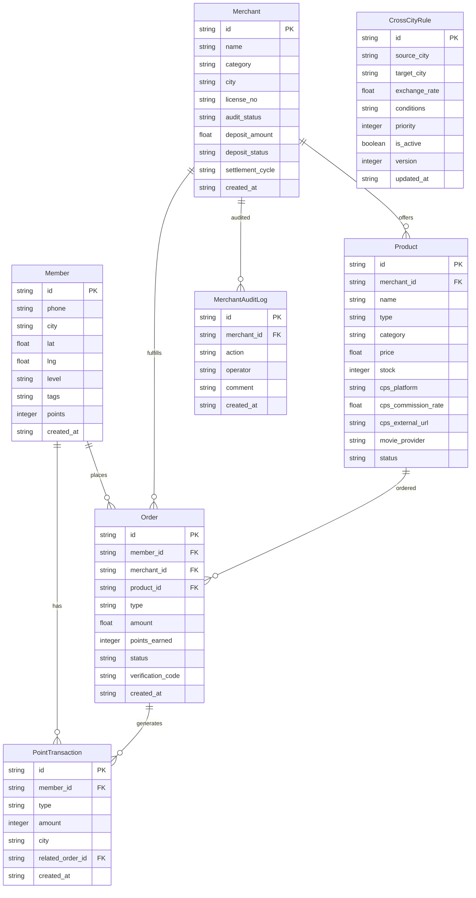

## 1. 架构设计

```mermaid
graph TB
    subgraph "前端层"
        "React SPA" --> "React Router"
        "React Router" --> "页面组件"
        "页面组件" --> "Zustand 状态管理"
        "页面组件" --> "ECharts 数据可视化"
    end

    subgraph "后端层"
        "Express API" --> "路由层"
        "路由层" --> "控制器层"
        "控制器层" --> "服务层"
        "服务层" --> "数据访问层"
    end

    subgraph "数据层"
        "SQLite 数据库" --> "会员表"
        "SQLite 数据库" --> "商户表"
        "SQLite 数据库" --> "商品/服务表"
        "SQLite 数据库" --> "积分表"
        "SQLite 数据库" --> "规则表"
        "SQLite 数据库" --> "订单表"
    end

    subgraph "外部服务"
        "猫眼/淘票票 API"
        "京东/天猫 CPS"
        "OCR 识别服务"
    end

    "前端层" -->|"HTTP/REST"| "后端层"
    "后端层" -->|"SQL"| "数据层"
    "后端层" -->|"API调用"| "外部服务"
```

## 2. 技术说明

- **前端**：React@18 + TailwindCSS@3 + Vite + Zustand + ECharts + React Router DOM
- **初始化工具**：vite-init
- **后端**：Express@4 + TypeScript (ESM)
- **数据库**：SQLite（better-sqlite3），内嵌式零配置，适合演示与快速部署
- **数据可视化**：ECharts（GMV趋势、复购率漏斗、核销率对比等图表）
- **图标库**：lucide-react

## 3. 路由定义

| 路由 | 用途 |
|------|------|
| `/` | 总览首页，展示全局数据概览与快捷入口 |
| `/members` | 会员中心，会员档案列表与搜索 |
| `/members/:id` | 会员详情，积分账户与权益卡包 |
| `/merchants` | 商户管理，商户列表与入驻审核 |
| `/merchants/:id` | 商户详情，资质信息与结算配置 |
| `/products` | 商品/服务管理，SKU与电商链接 |
| `/governance` | 联盟治理，规则引擎与审核工作台 |
| `/scenarios` | 消费场景，电影选座与线下核销 |
| `/dashboard` | 数据看板，三维数据可视化 |
| `/cross-city` | 跨城权益，积分互认与兑换比例 |

## 4. API 定义

### 4.1 会员模块

```typescript
interface Member {
  id: string
  phone: string
  city: string
  lbs: { lat: number; lng: number }
  level: 'bronze' | 'silver' | 'gold' | 'platinum'
  tags: string[]
  points: number
  crossCityPoints: Record<string, number>
  createdAt: string
  updatedAt: string
}

// GET /api/members?page=1&pageSize=20&city=chengdu&level=gold
// GET /api/members/:id
// POST /api/members
// PUT /api/members/:id
```

### 4.2 商户模块

```typescript
interface Merchant {
  id: string
  name: string
  category: 'catering' | 'retail' | 'entertainment' | 'lifestyle'
  city: string
  license: string
  licenseOcr: { name: string; no: string; validUntil: string; ocrConfidence: number }
  auditStatus: 'pending_ocr' | 'pending_review' | 'pending_deposit' | 'approved' | 'rejected'
  deposit: { amount: number; status: 'unpaid' | 'paid' | 'refunded'; paidAt?: string }
  settlementCycle: 'weekly' | 'biweekly' | 'monthly'
  createdAt: string
}
// GET /api/merchants?auditStatus=pending_review&city=yibin
// POST /api/merchants/:id/audit (审核操作)
// POST /api/merchants/:id/deposit (保证金操作)
```

### 4.3 商品/服务模块

```typescript
interface Product {
  id: string
  merchantId: string
  name: string
  type: 'local_sku' | 'cps_link' | 'movie_ticket'
  category: string
  price: number
  stock?: number
  cpsConfig?: { platform: 'jd' | 'tmall'; commissionRate: number; externalUrl: string }
  movieConfig?: { provider: 'maoyan' | 'taopiaopiao'; cinemaId: string }
  status: 'active' | 'inactive'
}
// GET /api/products?type=movie_ticket&city=chengdu
// POST /api/products
// PUT /api/products/:id
```

### 4.4 规则引擎模块

```typescript
interface CrossCityRule {
  id: string
  sourceCity: string
  targetCity: string
  exchangeRate: number
  conditions: {
    minLevel?: string
    maxDailyAmount?: number
    timeWindow?: { start: string; end: string }
  }
  priority: number
  isActive: boolean
  version: number
  updatedAt: string
}
// GET /api/rules?sourceCity=chengdu
// POST /api/rules
// PUT /api/rules/:id
// POST /api/rules/calculate (计算兑换结果)
```

### 4.5 数据看板模块

```typescript
interface DashboardData {
  city: string
  gmv: { total: number; trend: { date: string; value: number }[] }
  repurchaseRate: { value: number; trend: { date: string; value: number }[] }
  couponRedemptionRate: { value: number; trend: { date: string; value: number }[] }
  topMerchants: { id: string; name: string; revenue: number }[]
  memberGrowth: { date: string; count: number }[]
}
// GET /api/dashboard?city=chengdu&period=30d
// GET /api/dashboard/compare?cities=chengdu,yibin,mianyang
```

### 4.6 订单模块

```typescript
interface Order {
  id: string
  memberId: string
  merchantId: string
  productId: string
  type: 'local' | 'cps' | 'movie' | 'offline'
  amount: number
  pointsEarned: number
  status: 'pending' | 'paid' | 'verified' | 'refunded'
  verificationCode?: string
  createdAt: string
}
// GET /api/orders?memberId=xxx&type=movie
// POST /api/orders
// POST /api/orders/:id/verify (线下核销)
```

## 5. 服务器架构图

```mermaid
graph LR
    "Router" --> "MemberController"
    "Router" --> "MerchantController"
    "Router" --> "ProductController"
    "Router" --> "GovernanceController"
    "Router" --> "DashboardController"
    "Router" --> "OrderController"

    "MemberController" --> "MemberService"
    "MerchantController" --> "MerchantService"
    "ProductController" --> "ProductService"
    "GovernanceController" --> "RuleService"
    "DashboardController" --> "DashboardService"
    "OrderController" --> "OrderService"

    "MemberService" --> "Database"
    "MerchantService" --> "Database"
    "ProductService" --> "Database"
    "RuleService" --> "Database"
    "DashboardService" --> "Database"
    "OrderService" --> "Database"
```

## 6. 数据模型

### 6.1 数据模型定义



### 6.2 数据定义语言

```sql
CREATE TABLE members (
  id TEXT PRIMARY KEY,
  phone TEXT NOT NULL UNIQUE,
  city TEXT NOT NULL,
  lat REAL,
  lng REAL,
  level TEXT NOT NULL DEFAULT 'bronze' CHECK(level IN ('bronze','silver','gold','platinum')),
  tags TEXT DEFAULT '[]',
  points INTEGER DEFAULT 0,
  created_at TEXT DEFAULT (datetime('now')),
  updated_at TEXT DEFAULT (datetime('now'))
);

CREATE TABLE merchants (
  id TEXT PRIMARY KEY,
  name TEXT NOT NULL,
  category TEXT NOT NULL CHECK(category IN ('catering','retail','entertainment','lifestyle')),
  city TEXT NOT NULL,
  license_no TEXT NOT NULL,
  license_name TEXT,
  license_valid_until TEXT,
  ocr_confidence REAL,
  audit_status TEXT DEFAULT 'pending_ocr' CHECK(audit_status IN ('pending_ocr','pending_review','pending_deposit','approved','rejected')),
  deposit_amount REAL DEFAULT 0,
  deposit_status TEXT DEFAULT 'unpaid' CHECK(deposit_status IN ('unpaid','paid','refunded')),
  deposit_paid_at TEXT,
  settlement_cycle TEXT DEFAULT 'monthly' CHECK(settlement_cycle IN ('weekly','biweekly','monthly')),
  created_at TEXT DEFAULT (datetime('now')),
  updated_at TEXT DEFAULT (datetime('now'))
);

CREATE TABLE products (
  id TEXT PRIMARY KEY,
  merchant_id TEXT NOT NULL REFERENCES merchants(id),
  name TEXT NOT NULL,
  type TEXT NOT NULL CHECK(type IN ('local_sku','cps_link','movie_ticket')),
  category TEXT,
  price REAL NOT NULL,
  stock INTEGER,
  cps_platform TEXT CHECK(cps_platform IN ('jd','tmall')),
  cps_commission_rate REAL,
  cps_external_url TEXT,
  movie_provider TEXT CHECK(movie_provider IN ('maoyan','taopiaopiao')),
  movie_cinema_id TEXT,
  status TEXT DEFAULT 'active' CHECK(status IN ('active','inactive')),
  created_at TEXT DEFAULT (datetime('now'))
);

CREATE TABLE orders (
  id TEXT PRIMARY KEY,
  member_id TEXT NOT NULL REFERENCES members(id),
  merchant_id TEXT NOT NULL REFERENCES merchants(id),
  product_id TEXT NOT NULL REFERENCES products(id),
  type TEXT NOT NULL CHECK(type IN ('local','cps','movie','offline')),
  amount REAL NOT NULL,
  points_earned INTEGER DEFAULT 0,
  status TEXT DEFAULT 'pending' CHECK(status IN ('pending','paid','verified','refunded')),
  verification_code TEXT,
  created_at TEXT DEFAULT (datetime('now'))
);

CREATE TABLE cross_city_rules (
  id TEXT PRIMARY KEY,
  source_city TEXT NOT NULL,
  target_city TEXT NOT NULL,
  exchange_rate REAL NOT NULL DEFAULT 1.0,
  conditions TEXT DEFAULT '{}',
  priority INTEGER DEFAULT 0,
  is_active INTEGER DEFAULT 1,
  version INTEGER DEFAULT 1,
  updated_at TEXT DEFAULT (datetime('now'))
);

CREATE TABLE point_transactions (
  id TEXT PRIMARY KEY,
  member_id TEXT NOT NULL REFERENCES members(id),
  type TEXT NOT NULL CHECK(type IN ('earn','redeem','cross_city_earn','cross_city_redeem','adjust')),
  amount INTEGER NOT NULL,
  city TEXT NOT NULL,
  related_order_id TEXT REFERENCES orders(id),
  created_at TEXT DEFAULT (datetime('now'))
);

CREATE TABLE merchant_audit_logs (
  id TEXT PRIMARY KEY,
  merchant_id TEXT NOT NULL REFERENCES merchants(id),
  action TEXT NOT NULL,
  operator TEXT NOT NULL,
  comment TEXT,
  created_at TEXT DEFAULT (datetime('now'))
);

CREATE INDEX idx_members_city ON members(city);
CREATE INDEX idx_members_level ON members(level);
CREATE INDEX idx_merchants_city ON merchants(city);
CREATE INDEX idx_merchants_audit_status ON merchants(audit_status);
CREATE INDEX idx_products_merchant ON products(merchant_id);
CREATE INDEX idx_products_type ON products(type);
CREATE INDEX idx_orders_member ON orders(member_id);
CREATE INDEX idx_orders_merchant ON orders(merchant_id);
CREATE INDEX idx_orders_created ON orders(created_at);
CREATE INDEX idx_point_transactions_member ON point_transactions(member_id);
CREATE INDEX idx_cross_city_rules_source ON cross_city_rules(source_city);
CREATE INDEX idx_cross_city_rules_target ON cross_city_rules(target_city);
CREATE INDEX idx_audit_logs_merchant ON merchant_audit_logs(merchant_id);
```
