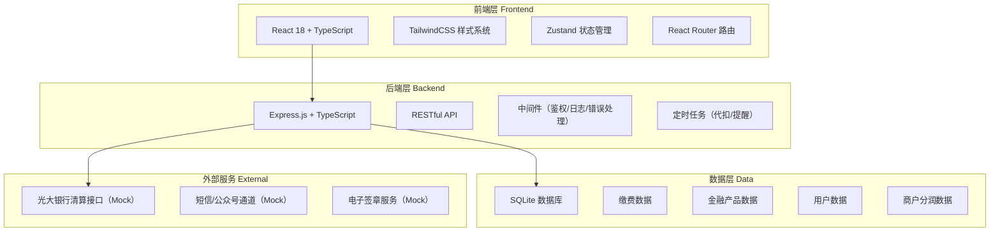
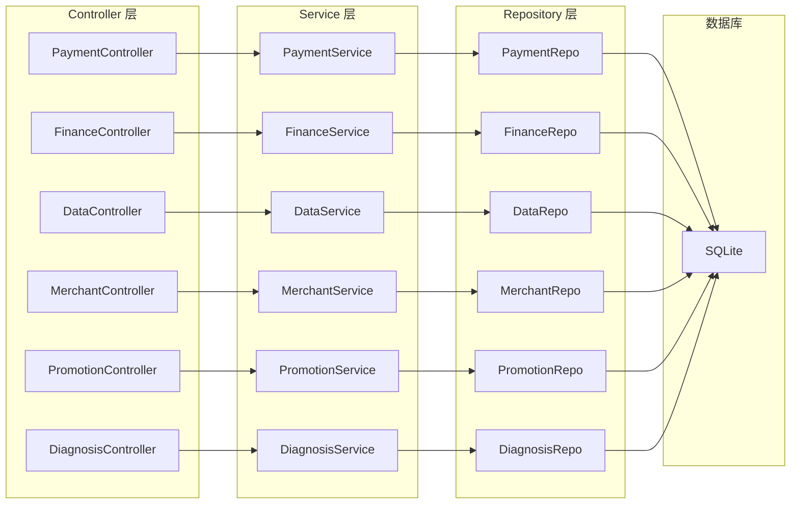
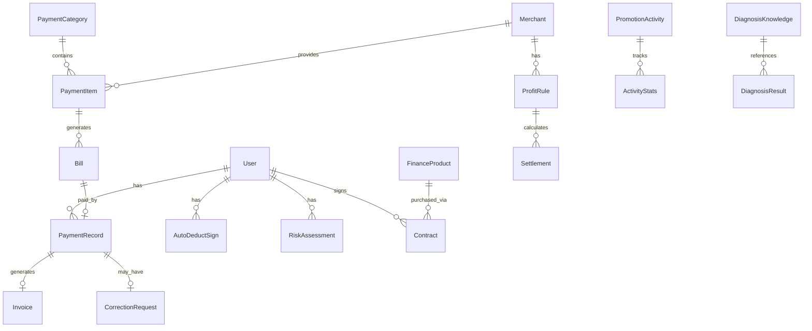

## 1. 架构设计



## 2. 技术说明

- 前端：React@18 + TailwindCSS@3 + Vite + Zustand
- 初始化工具：vite-init
- 后端：Express@4 + TypeScript（ESM）
- 数据库：SQLite（开发环境），Mock数据填充
- 图表库：recharts
- 图标库：lucide-react

## 3. 路由定义

| 路由 | 用途 |
|------|------|
| / | 平台首页 |
| /payment | 缴费中心 |
| /payment/auto-deduct | 代扣签约管理 |
| /payment/reminder | 缴费提醒配置 |
| /payment/invoice | 电子发票管理 |
| /payment/correction | 错缴冲正与仲裁 |
| /finance | 金融超市 |
| /finance/risk-assessment | 风险测评 |
| /finance/calculator | 额度试算 |
| /finance/contract | 合同签署 |
| /finance/fund-supervision | 资金监管 |
| /data-center | 数据资产中心 |
| /merchant | 商户分润结算 |
| /promotion | 优惠活动配置中心 |
| /diagnosis | 缴费失败诊断知识库 |

## 4. API定义

### 4.1 缴费核心API

| 方法 | 路径 | 说明 |
|------|------|------|
| GET | /api/payment/categories | 获取缴费品类列表 |
| GET | /api/payment/bills/:accountNo | 根据户号查询账单 |
| POST | /api/payment/pay | 提交缴费 |
| GET | /api/payment/records | 缴费记录查询 |
| POST | /api/payment/auto-deduct/sign | 代扣签约 |
| DELETE | /api/payment/auto-deduct/:id | 解除代扣签约 |
| GET | /api/payment/auto-deduct/list | 代扣签约列表 |
| GET | /api/payment/auto-deduct/records | 代扣扣款记录 |
| GET | /api/payment/reminder/config | 获取提醒配置 |
| PUT | /api/payment/reminder/config | 更新提醒配置 |
| GET | /api/payment/reminder/list | 提醒列表 |
| GET | /api/payment/invoice/list | 发票列表 |
| GET | /api/payment/invoice/:id | 发票详情 |
| POST | /api/payment/invoice/:id/download | 下载发票 |
| POST | /api/payment/correction/apply | 提交冲正申请 |
| GET | /api/payment/correction/list | 冲正申请列表 |
| POST | /api/payment/correction/:id/arbitrate | 差错仲裁 |

### 4.2 金融模块API

| 方法 | 路径 | 说明 |
|------|------|------|
| GET | /api/finance/products | 产品列表（含筛选） |
| GET | /api/finance/products/:id | 产品详情 |
| POST | /api/finance/risk-assessment | 提交风险测评 |
| GET | /api/finance/risk-assessment/result | 获取测评结果 |
| POST | /api/finance/calculator | 额度试算 |
| GET | /api/finance/contracts | 合同列表 |
| POST | /api/finance/contracts/:id/sign | 在线签署合同 |
| GET | /api/finance/fund/overview | 资金监管总览 |
| GET | /api/finance/fund/transactions | 交易流水 |

### 4.3 运营管理API

| 方法 | 路径 | 说明 |
|------|------|------|
| GET | /api/data/overview | 数据总览指标 |
| GET | /api/data/region | 地域维度分析 |
| GET | /api/data/trend | 时段趋势分析 |
| GET | /api/data/category | 品类聚合报表 |
| GET | /api/merchant/profit-rules | 分润规则列表 |
| POST | /api/merchant/profit-rules | 创建分润规则 |
| GET | /api/merchant/settlements | 结算列表 |
| POST | /api/merchant/settle | 发起清算 |
| GET | /api/promotion/activities | 活动列表 |
| POST | /api/promotion/activities | 创建活动 |
| PUT | /api/promotion/activities/:id | 更新活动 |
| GET | /api/promotion/activities/:id/stats | 活动效果统计 |
| POST | /api/diagnosis/analyze | 诊断失败原因 |
| GET | /api/diagnosis/knowledge | 知识库列表 |
| GET | /api/diagnosis/knowledge/:id | 知识条目详情 |

### 4.4 TypeScript类型定义

```typescript
interface PaymentCategory {
  id: string
  name: string
  icon: string
  count: number
}

interface Bill {
  accountNo: string
  category: string
  amount: number
  period: string
  dueDate: string
  status: 'unpaid' | 'paid' | 'overdue'
}

interface AutoDeductSign {
  id: string
  bankName: string
  accountNo: string
  category: string
  status: 'active' | 'paused' | 'cancelled'
  signDate: string
  nextDeductDate: string
}

interface Invoice {
  id: string
  paymentId: string
  amount: number
  category: string
  invoiceNo: string
  createdDate: string
  type: 'electronic' | 'vat'
}

interface CorrectionRequest {
  id: string
  paymentId: string
  reason: string
  status: 'pending' | 'auto_approved' | 'arbitrating' | 'refunded' | 'rejected'
  createDate: string
  correctInfo: Record<string, string>
}

interface FinanceProduct {
  id: string
  name: string
  type: 'wealth' | 'insurance' | 'loan'
  riskLevel: 'R1' | 'R2' | 'R3' | 'R4' | 'R5'
  annualRate: string
  term: string
  minAmount: number
  maxAmount: number
}

interface RiskAssessment {
  score: number
  level: 'conservative' | 'stable' | 'balanced' | 'aggressive' | 'radical'
  recommendedTypes: string[]
}

interface ProfitRule {
  id: string
  merchantName: string
  category: string
  ratio: number
  settlementCycle: 'daily' | 'weekly' | 'monthly'
}

interface PromotionActivity {
  id: string
  name: string
  type: 'discount' | 'redpacket' | 'lottery'
  status: 'draft' | 'active' | 'paused' | 'ended'
  rules: Record<string, unknown>
  startDate: string
  endDate: string
  stats: {
    participants: number
    redemption: number
    roi: number
  }
}

interface DiagnosisResult {
  orderId: string
  rootCause: string
  category: string
  suggestions: string[]
  relatedKnowledge: string[]
}
```

## 5. 服务端架构图



## 6. 数据模型

### 6.1 数据模型定义



### 6.2 数据定义语言

```sql
CREATE TABLE users (
  id TEXT PRIMARY KEY,
  phone TEXT UNIQUE NOT NULL,
  name TEXT,
  risk_level TEXT DEFAULT 'none',
  created_at DATETIME DEFAULT CURRENT_TIMESTAMP
);

CREATE TABLE payment_categories (
  id TEXT PRIMARY KEY,
  name TEXT NOT NULL,
  icon TEXT,
  sort_order INTEGER DEFAULT 0
);

CREATE TABLE payment_items (
  id TEXT PRIMARY KEY,
  category_id TEXT REFERENCES payment_categories(id),
  name TEXT NOT NULL,
  merchant_id TEXT REFERENCES merchants(id),
  region TEXT
);

CREATE TABLE bills (
  id TEXT PRIMARY KEY,
  item_id TEXT REFERENCES payment_items(id),
  user_id TEXT REFERENCES users(id),
  account_no TEXT NOT NULL,
  amount DECIMAL(12,2) NOT NULL,
  period TEXT,
  due_date DATE,
  status TEXT DEFAULT 'unpaid',
  created_at DATETIME DEFAULT CURRENT_TIMESTAMP
);

CREATE TABLE payment_records (
  id TEXT PRIMARY KEY,
  bill_id TEXT REFERENCES bills(id),
  user_id TEXT REFERENCES users(id),
  amount DECIMAL(12,2) NOT NULL,
  pay_method TEXT,
  status TEXT DEFAULT 'processing',
  paid_at DATETIME,
  created_at DATETIME DEFAULT CURRENT_TIMESTAMP
);

CREATE TABLE auto_deduct_signs (
  id TEXT PRIMARY KEY,
  user_id TEXT REFERENCES users(id),
  item_id TEXT REFERENCES payment_items(id),
  bank_name TEXT,
  bank_account TEXT,
  status TEXT DEFAULT 'active',
  sign_date DATE,
  next_deduct_date DATE,
  created_at DATETIME DEFAULT CURRENT_TIMESTAMP
);

CREATE TABLE invoices (
  id TEXT PRIMARY KEY,
  payment_id TEXT REFERENCES payment_records(id),
  user_id TEXT REFERENCES users(id),
  invoice_no TEXT UNIQUE,
  amount DECIMAL(12,2),
  type TEXT DEFAULT 'electronic',
  file_url TEXT,
  created_at DATETIME DEFAULT CURRENT_TIMESTAMP
);

CREATE TABLE correction_requests (
  id TEXT PRIMARY KEY,
  payment_id TEXT REFERENCES payment_records(id),
  user_id TEXT REFERENCES users(id),
  reason TEXT,
  correct_info TEXT,
  status TEXT DEFAULT 'pending',
  created_at DATETIME DEFAULT CURRENT_TIMESTAMP,
  resolved_at DATETIME
);

CREATE TABLE finance_products (
  id TEXT PRIMARY KEY,
  name TEXT NOT NULL,
  type TEXT NOT NULL,
  risk_level TEXT,
  annual_rate TEXT,
  term TEXT,
  min_amount DECIMAL(12,2),
  max_amount DECIMAL(12,2),
  description TEXT,
  status TEXT DEFAULT 'active'
);

CREATE TABLE risk_assessments (
  id TEXT PRIMARY KEY,
  user_id TEXT REFERENCES users(id),
  score INTEGER,
  level TEXT,
  answers TEXT,
  created_at DATETIME DEFAULT CURRENT_TIMESTAMP
);

CREATE TABLE contracts (
  id TEXT PRIMARY KEY,
  user_id TEXT REFERENCES users(id),
  product_id TEXT REFERENCES finance_products(id),
  amount DECIMAL(12,2),
  status TEXT DEFAULT 'pending',
  signed_at DATETIME,
  created_at DATETIME DEFAULT CURRENT_TIMESTAMP
);

CREATE TABLE fund_transactions (
  id TEXT PRIMARY KEY,
  user_id TEXT REFERENCES users(id),
  contract_id TEXT REFERENCES contracts(id),
  amount DECIMAL(12,2),
  type TEXT,
  status TEXT DEFAULT 'completed',
  created_at DATETIME DEFAULT CURRENT_TIMESTAMP
);

CREATE TABLE merchants (
  id TEXT PRIMARY KEY,
  name TEXT NOT NULL,
  category TEXT,
  bank_account TEXT,
  status TEXT DEFAULT 'active'
);

CREATE TABLE profit_rules (
  id TEXT PRIMARY KEY,
  merchant_id TEXT REFERENCES merchants(id),
  category TEXT,
  ratio DECIMAL(5,4),
  settlement_cycle TEXT DEFAULT 'monthly',
  created_at DATETIME DEFAULT CURRENT_TIMESTAMP
);

CREATE TABLE settlements (
  id TEXT PRIMARY KEY,
  merchant_id TEXT REFERENCES merchants(id),
  profit_rule_id TEXT REFERENCES profit_rules(id),
  amount DECIMAL(12,2),
  period TEXT,
  status TEXT DEFAULT 'pending',
  settled_at DATETIME,
  created_at DATETIME DEFAULT CURRENT_TIMESTAMP
);

CREATE TABLE promotion_activities (
  id TEXT PRIMARY KEY,
  name TEXT NOT NULL,
  type TEXT NOT NULL,
  status TEXT DEFAULT 'draft',
  rules TEXT,
  start_date DATE,
  end_date DATE,
  created_at DATETIME DEFAULT CURRENT_TIMESTAMP
);

CREATE TABLE activity_stats (
  id TEXT PRIMARY KEY,
  activity_id TEXT REFERENCES promotion_activities(id),
  participants INTEGER DEFAULT 0,
  redemption INTEGER DEFAULT 0,
  roi DECIMAL(5,2),
  recorded_at DATETIME DEFAULT CURRENT_TIMESTAMP
);

CREATE TABLE diagnosis_knowledge (
  id TEXT PRIMARY KEY,
  title TEXT NOT NULL,
  category TEXT,
  root_cause TEXT,
  solution TEXT,
  keywords TEXT,
  created_at DATETIME DEFAULT CURRENT_TIMESTAMP
);
```
