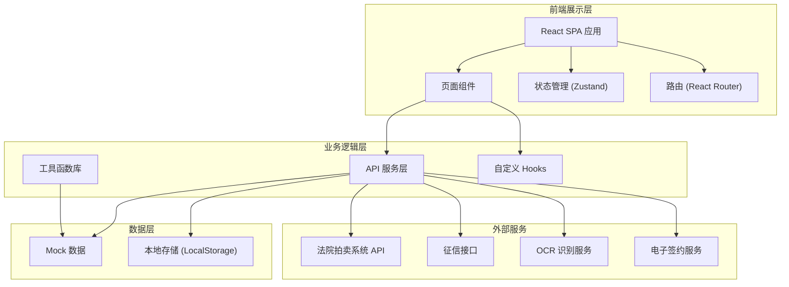
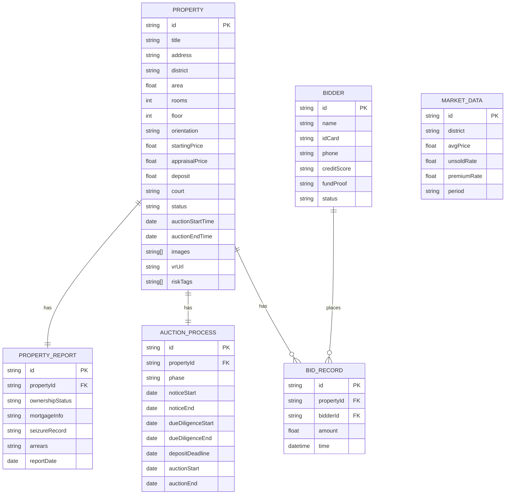

## 1. 架构设计



## 2. 技术描述

- **前端框架**：React@18 + TypeScript
- **构建工具**：Vite@5
- **样式方案**：TailwindCSS@3 + CSS Variables
- **路由管理**：React Router@6
- **状态管理**：Zustand
- **图表可视化**：Recharts
- **图标库**：Lucide React
- **动画库**：Framer Motion
- **模拟数据**：MSW + Mock 数据
- **代码规范**：ESLint + Prettier

## 3. 路由定义

| 路由 | 页面 | 说明 |
|------|------|------|
| / | 首页大厅 | 市场行情、精选标的、快速入口 |
| /list | 标的列表 | 房源筛选、列表展示 |
| /detail/:id | 标的详情 | 房源详情、VR、产权报告、税费计算 |
| /compare | 智能对比 | 多标的对比矩阵、评分系统 |
| /auction | 竞买中心 | 我的竞拍、保证金、资质审核 |
| /due-diligence | 尽调服务 | 尽调报告、文档库、电子签约 |

## 4. 数据模型

### 4.1 数据模型定义



### 4.2 核心数据类型定义

```typescript
// 标的房源
interface Property {
  id: string;
  title: string;
  address: string;
  district: string;
  area: number;
  rooms: number;
  floor: string;
  orientation: string;
  startingPrice: number;
  appraisalPrice: number;
  deposit: number;
  court: string;
  status: 'notice' | 'due-diligence' | 'deposit' | 'bidding' | 'ended' | 'sold';
  auctionStartTime: string;
  auctionEndTime: string;
  images: string[];
  vrUrl: string;
  riskTags: string[];
  buildingAge?: number;
  propertyType?: string;
  decoration?: string;
}

// 产权报告
interface PropertyReport {
  id: string;
  propertyId: string;
  ownershipStatus: 'clear' | 'mortgaged' | 'seized' | 'disputed';
  mortgageInfo: {
    hasMortgage: boolean;
    mortgageAmount: number;
    mortgagee: string;
  };
  seizureRecord: {
    hasSeizure: boolean;
    seizureCourt: string;
    seizureDate: string;
  };
  arrears: {
    propertyTax: number;
    utilityFee: number;
    propertyFee: number;
  };
  reportDate: string;
}

// 竞买人
interface Bidder {
  id: string;
  name: string;
  idCard: string;
  phone: string;
  creditScore: number;
  fundProofStatus: 'pending' | 'verified' | 'rejected';
  status: 'normal' | 'restricted' | 'blacklist';
}

// 拍卖进程
interface AuctionProcess {
  id: string;
  propertyId: string;
  currentPhase: 'notice' | 'due-diligence' | 'deposit' | 'bidding' | 'ended';
  noticeStart: string;
  noticeEnd: string;
  dueDiligenceStart: string;
  dueDiligenceEnd: string;
  depositDeadline: string;
  auctionStart: string;
  auctionEnd: string;
}

// 市场行情
interface MarketData {
  district: string;
  avgPrice: number;
  avgPriceChange: number;
  unsoldRate: number;
  premiumRate: number;
  transactionCount: number;
  period: string;
}

// 税费计算结果
interface TaxResult {
  deedTax: number;
  individualTax: number;
  valueAddedTax: number;
  stampTax: number;
  total: number;
}
```

## 5. 项目目录结构

```
src/
├── assets/          # 静态资源
├── components/    # 通用组件
│   ├── ui/          # UI 基础组件
│   └── layout/      # 布局组件
├── pages/           # 页面组件
│   ├── Home/
│   ├── PropertyList/
│   ├── PropertyDetail/
│   ├── Compare/
│   ├── AuctionCenter/
│   └── DueDiligence/
├── hooks/         # 自定义 Hooks
├── store/         # 状态管理
├── services/      # API 服务
├── mock/         # Mock 数据
├── types/        # TypeScript 类型
└── utils/        # 工具函数
```

## 6. 核心功能实现方案

### 6.1 智能选房对比矩阵
- 使用表格形式展示，支持横向滚动
- 固定首列（参数名）和首行（房源卡片）
- 差异参数高亮显示
- 支持最多3套标的同时对比

### 6.2 市场行情看板
- 使用 Recharts 绘制折线图、柱状图
- 支持按区域、时间维度筛选
- 数据卡片展示核心指标

### 6.3 风险提示引擎
- 基于风险标签的可视化展示
- 风险等级颜色编码
- 悬停展示详细风险说明

### 6.4 税费计算器
- 根据房源类型、面积、价格自动计算
- 支持自定义参数调整
- 明细展示各项税费

### 6.5 VR全景看房
- 图片轮播模拟 VR 效果
- 支持热点标注
- 户型图切换

### 6.6 拍卖进程时间线
- 垂直时间线展示各阶段
- 当前阶段高亮
- 倒计时显示
