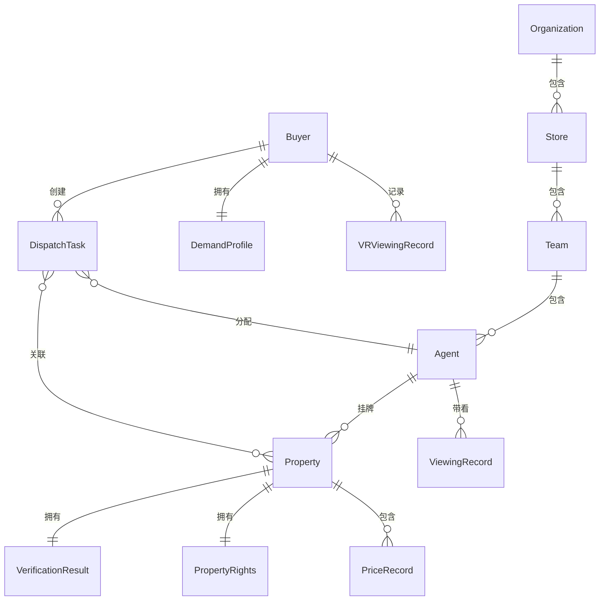

## 1. 架构设计

```mermaid
flowchart TB
    subgraph "前端层"
        "React 18 + TypeScript"
        "Tailwind CSS 3"
        "React Router 6"
        "Recharts 数据可视化"
        "Zustand 状态管理"
    end

    subgraph "数据层"
        "Mock API 服务"
        "本地 JSON 数据"
        "Zustand Store 持久化"
    end

    subgraph "核心业务模块"
        "房源管理模块"
        "AI验真引擎模块"
        "智能派单模块"
        "VR看房分析模块"
        "决策辅助模块"
        "经纪人管理模块"
        "组织架构模块"
    end

    "React 18 + TypeScript" --> "核心业务模块"
    "核心业务模块" --> "数据层"
    "Recharts 数据可视化" --> "核心业务模块"
    "Zustand 状态管理" --> "核心业务模块"
```

## 2. 技术说明

- **前端框架**：React@18 + TypeScript + Vite
- **样式方案**：Tailwind CSS@3 + CSS Modules（复杂组件样式隔离）
- **路由方案**：React Router@6（嵌套路由+路由守卫）
- **状态管理**：Zustand（轻量全局状态）+ React Query（服务端状态缓存）
- **数据可视化**：Recharts（图表）+ 自定义 Canvas（热力图）
- **初始化工具**：Vite
- **后端服务**：无后端，使用 Mock 数据模拟接口
- **数据库**：无数据库，使用本地 JSON 文件 + Zustand 持久化存储

## 3. 路由定义

| 路由 | 用途 |
|------|------|
| `/` | 首页仪表盘，展示核心数据概览和快捷入口 |
| `/properties` | 房源列表页，支持筛选和地图模式 |
| `/properties/:id` | 房源详情页，含VR全景、AI验真报告、价格分析 |
| `/agents` | 经纪人工作台，数字名片、带看任务、客户管理 |
| `/agents/:id` | 经纪人详情页，数字名片完整展示 |
| `/buyers` | 购房者中心，需求画像、VR看房记录、决策辅助 |
| `/buyers/mortgage` | 房贷组合模拟器 |
| `/buyers/tax` | 税费精算器 |
| `/vr-analytics` | VR看房交互分析看板 |
| `/dispatch` | 智能派单中心 |
| `/admin` | 管理后台首页 |
| `/admin/org` | 组织架构管理 |
| `/admin/performance` | 业绩穿透式看板 |

## 4. API定义

### 4.1 房源相关

```typescript
interface Property {
  id: string;
  title: string;
  address: string;
  district: string;
  price: number;
  unitPrice: number;
  area: number;
  rooms: number;
  halls: number;
  orientation: string;
  floor: string;
  buildYear: number;
  images: string[];
  vrEnabled: boolean;
  verification: VerificationResult;
  propertyRights: PropertyRights;
  priceHistory: PriceRecord[];
  agentId: string;
  createdAt: string;
  updatedAt: string;
}

interface VerificationResult {
  overallScore: number;
  priceCrossCheck: {
    score: number;
    sources: PriceSource[];
    deviation: number;
  };
  imageTampering: {
    score: number;
    flaggedImages: string[];
    issues: string[];
  };
  agentConsistency: {
    score: number;
    totalListings: number;
    inconsistentCount: number;
  };
  status: 'verified' | 'pending' | 'flagged';
}

interface PropertyRights {
  mortgageStatus: 'none' | 'active' | 'cleared';
  seizureStatus: 'none' | 'active';
  lastChecked: string;
  ownershipChain: OwnershipRecord[];
}

interface PriceRecord {
  date: string;
  price: number;
  type: 'listing' | 'transaction';
}

interface PriceSource {
  platform: string;
  price: number;
  lastUpdated: string;
}
```

### 4.2 经纪人相关

```typescript
interface Agent {
  id: string;
  name: string;
  avatar: string;
  phone: string;
  storeId: string;
  storeName: string;
  creditScore: number;
  specializations: string[];
  serviceAreas: string[];
  totalTransactions: number;
  viewingsCompleted: number;
  conversionFunnel: ConversionFunnel;
  recentViewings: ViewingRecord[];
  creditHistory: CreditRecord[];
}

interface ConversionFunnel {
  leads: number;
  viewings: number;
  intentions: number;
  transactions: number;
}

interface ViewingRecord {
  id: string;
  propertyId: string;
  propertyTitle: string;
  clientName: string;
  scheduledAt: string;
  status: 'pending' | 'confirmed' | 'completed' | 'cancelled';
}

interface CreditRecord {
  date: string;
  score: number;
  change: number;
  reason: string;
}
```

### 4.3 购房者相关

```typescript
interface Buyer {
  id: string;
  name: string;
  avatar: string;
  phone: string;
  demandProfile: DemandProfile;
  vrHistory: VRViewingRecord[];
  favorites: string[];
}

interface DemandProfile {
  budgetRange: [number, number];
  commuteCenter: string;
  commuteRadius: number;
  schoolPreference: string[];
  roomPreference: number[];
  areaRange: [number, number];
  preferredDistricts: string[];
}

interface VRViewingRecord {
  propertyId: string;
  propertyTitle: string;
  viewedAt: string;
  totalDuration: number;
  heatZones: HeatZone[];
  attentionPoints: AttentionPoint[];
}

interface HeatZone {
  zone: string;
  duration: number;
  percentage: number;
}

interface AttentionPoint {
  feature: string;
  duration: number;
  interactions: number;
}
```

### 4.4 智能派单相关

```typescript
interface DispatchTask {
  id: string;
  clientId: string;
  clientName: string;
  propertyIds: string[];
  intentStrength: 'high' | 'medium' | 'low';
  scheduledTime: string;
  status: 'unassigned' | 'assigned' | 'in_progress' | 'completed';
  assignedAgentId?: string;
  matchedAgents: AgentMatch[];
}

interface AgentMatch {
  agentId: string;
  agentName: string;
  distance: number;
  distanceScore: number;
  intentMatchScore: number;
  transactionRateScore: number;
  totalScore: number;
}
```

### 4.5 组织架构相关

```typescript
interface Organization {
  id: string;
  name: string;
  stores: Store[];
}

interface Store {
  id: string;
  name: string;
  address: string;
  teams: Team[];
  performance: PerformanceMetrics;
}

interface Team {
  id: string;
  name: string;
  members: Agent[];
  performance: PerformanceMetrics;
}

interface PerformanceMetrics {
  totalRevenue: number;
  transactionCount: number;
  averagePrice: number;
  viewingCount: number;
  conversionRate: number;
  monthOverMonth: number;
}
```

### 4.6 决策辅助相关

```typescript
interface PricePrediction {
  propertyId: string;
  currentPrice: number;
  predictions: PredictionPoint[];
  confidence: number;
  comparableListings: ComparableListing[];
}

interface PredictionPoint {
  month: string;
  predictedPrice: number;
  lowerBound: number;
  upperBound: number;
}

interface MortgageSimulation {
  propertyPrice: number;
  downPaymentRatio: number;
  loanAmount: number;
  loanYears: number;
  interestRate: number;
  monthlyPayment: number;
  totalInterest: number;
  totalPayment: number;
}

interface TaxCalculation {
  propertyPrice: number;
  deedTax: number;
  personalIncomeTax: number;
  valueAddedTax: number;
  stampDuty: number;
  registrationFee: number;
  totalTax: number;
  details: TaxDetail[];
}

interface TaxDetail {
  name: string;
  rate: number;
  base: number;
  amount: number;
  description: string;
}
```

## 5. 服务端架构图

无后端服务，使用前端 Mock 数据层。

## 6. 数据模型

### 6.1 数据模型定义



### 6.2 数据定义语言

使用 TypeScript 接口定义数据结构，配合本地 JSON Mock 数据文件：

- `src/mock/properties.json` - 房源数据（20条）
- `src/mock/agents.json` - 经纪人数据（15条）
- `src/mock/buyers.json` - 购房者数据（10条）
- `src/mock/organizations.json` - 组织架构数据
- `src/mock/dispatch-tasks.json` - 派单任务数据
- `src/mock/price-predictions.json` - 价格预测数据
