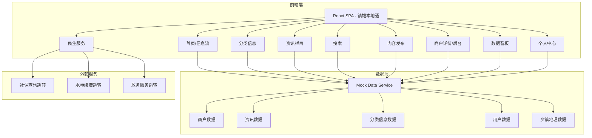
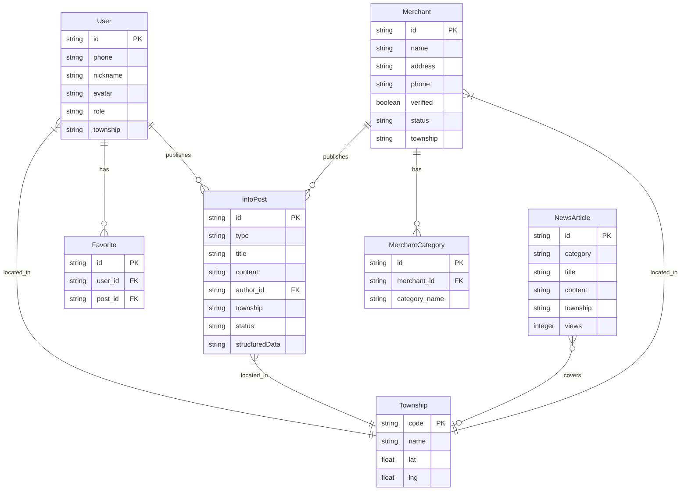

## 1. 架构设计



## 2. 技术说明

- 前端：React@18 + TailwindCSS@3 + Vite
- 初始化工具：Vite (npm create vite@latest)
- 后端：无（纯前端项目，使用 Mock 数据模拟接口）
- 数据库：无（使用本地 JSON Mock 数据）
- 状态管理：React Context + useReducer
- 路由：React Router v6
- 图表：Recharts（数据看板可视化）
- 地图：无需真实地图SDK，使用SVG绘制镇雄县乡镇示意图做热区展示
- 动画：Framer Motion
- 图标：Lucide React

## 3. 路由定义

| 路由 | 用途 |
|------|------|
| / | 首页，LBS信息流推荐+分类入口+便民服务 |
| /category | 分类信息页，招聘/房产/美食/交友板块 |
| /category/:type | 具体分类详情，如 /category/jobs |
| /news | 资讯栏目页，本地新闻/政策公告等 |
| /news/:id | 资讯文章详情 |
| /search | 搜索页，多维度搜索 |
| /publish | 内容发布页，UGC发布+结构化模板 |
| /merchant/:id | 商户详情页 |
| /merchant/dashboard | 商户管理后台 |
| /services | 民生服务页，社保/缴费/政务跳转 |
| /dashboard | 数据看板页 |
| /profile | 个人中心 |

## 4. API定义（Mock数据接口）

```typescript
interface Merchant {
  id: string;
  name: string;
  address: string;
  phone: string;
  category: string[];
  status: "open" | "closed";
  description: string;
  images: string[];
  location: { lat: number; lng: number };
  township: string;
  rating: number;
  verified: boolean;
}

interface InfoPost {
  id: string;
  type: "job" | "housing" | "food" | "dating";
  title: string;
  content: string;
  images: string[];
  author: string;
  createdAt: string;
  location: { lat: number; lng: number; township: string };
  tags: string[];
  status: "pending" | "approved" | "rejected";
  structuredData?: Record<string, string>;
}

interface NewsArticle {
  id: string;
  category: "local" | "policy" | "township" | "guide";
  title: string;
  summary: string;
  content: string;
  coverImage: string;
  author: string;
  publishedAt: string;
  views: number;
  township?: string;
}

interface User {
  id: string;
  phone: string;
  nickname: string;
  avatar: string;
  interestTags: string[];
  location: { township: string; community?: string };
  role: "user" | "merchant" | "admin";
  publishedPosts: string[];
  favorites: string[];
}

interface Township {
  name: string;
  code: string;
  center: { lat: number; lng: number };
  polygon: [number, number][];
}

interface DashboardStats {
  hotCategories: { name: string; count: number; trend: number }[];
  activeTownships: { name: string; activeUsers: number; postCount: number }[];
  updateFrequency: { date: string; jobs: number; housing: number; food: number; dating: number }[];
  totalPosts: number;
  totalMerchants: number;
  totalUsers: number;
}
```

## 5. 服务端架构图

不适用——本项目为纯前端项目，使用 Mock 数据，无后端服务。

## 6. 数据模型

### 6.1 数据模型定义



### 6.2 数据定义语言

本项目使用前端 Mock JSON 数据，不使用关系型数据库。数据存储于 `src/data/` 目录下的 JSON 文件中：

- `merchants.json` - 商户数据
- `posts.json` - 分类信息帖子数据
- `news.json` - 资讯文章数据
- `users.json` - 用户数据
- `townships.json` - 镇雄县乡镇地理数据（30个乡镇）
- `dashboard.json` - 数据看板统计数据
