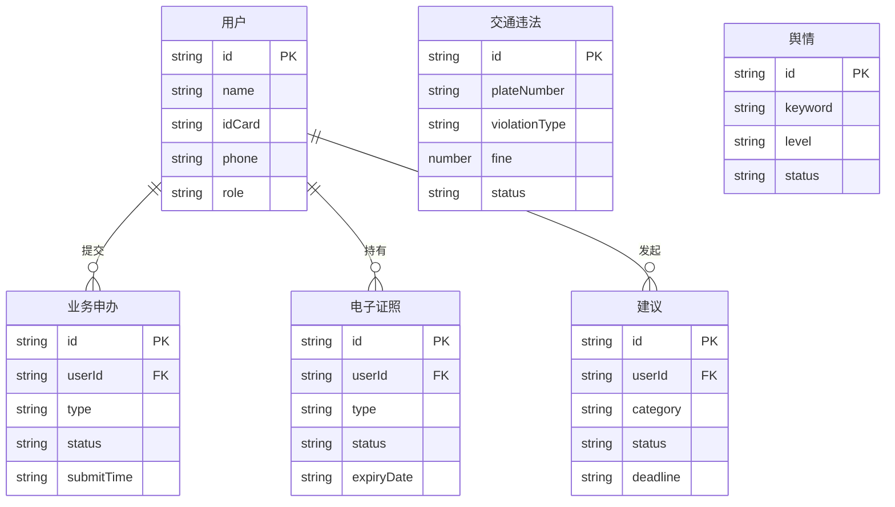

## 1. 架构设计

```mermaid
graph TB
    subgraph "前端层"
        "React SPA" --> "React Router"
        "React Router" --> "页面组件"
        "页面组件" --> "公共组件库"
        "页面组件" --> "Zustand 状态管理"
    end

    subgraph "数据层"
        "Zustand Store" --> "Mock 数据服务"
        "Mock 数据服务" --> "本地 JSON 数据"
    end

    subgraph "外部服务（模拟）"
        "省级政务大数据平台" --> "人口/车辆/违法数据"
        "公安知识库" --> "智能咨询API"
        "支付网关" --> "罚款缴纳"
    end
```

## 2. 技术说明

- **前端框架**：React@18 + TypeScript + Vite
- **样式方案**：Tailwind CSS@3（自定义政务主题色板）
- **路由方案**：React Router DOM v6
- **状态管理**：Zustand
- **图标库**：lucide-react
- **图表库**：recharts（舆情趋势、工作台仪表盘）
- **初始化工具**：vite-init（react-ts 模板）
- **后端服务**：无（纯前端，使用 Mock 数据模拟）
- **数据源**：本地 JSON Mock 数据，模拟所有业务数据

## 3. 路由定义

| 路由路径 | 用途 |
|----------|------|
| `/` | 首页，平台总览与五大业务域入口 |
| `/service` | 办事大厅，业务申办与进度查询 |
| `/certificate` | 电子证照中心，证照展示与扫码核验 |
| `/traffic` | 交管服务，违法查询/罚款缴纳/事故快处 |
| `/consult` | 智能咨询，AI问答与工单转人工 |
| `/suggestion` | 建言献策通道，建议提交与结果公示 |
| `/profile` | 个人中心，个人信息与业务记录 |
| `/admin` | 民警工作台，审核/跟踪/监控仪表盘 |

## 4. API定义（Mock）

### 4.1 业务申办

```typescript
interface ServiceApplication {
  id: string
  type: "household" | "no_criminal_record" | "residence_permit" | "entry_exit" | "other"
  typeName: string
  applicantName: string
  applicantIdCard: string
  status: "pending" | "processing" | "approved" | "rejected" | "completed"
  submitTime: string
  updateTime: string
  currentStep: number
  totalSteps: number
  materials: string[]
}

interface ServiceGuide {
  id: string
  name: string
  category: string
  description: string
  requiredMaterials: string[]
  processingTime: string
  fees: string
}
```

### 4.2 电子证照

```typescript
interface ECertificate {
  id: string
  type: "id_card" | "driver_license" | "passport"
  typeName: string
  holderName: string
  holderIdNumber: string
  issueDate: string
  expiryDate: string
  status: "valid" | "expired" | "revoked"
  qrCodeData: string
  frontImageUrl: string
  backImageUrl: string
}
```

### 4.3 交管服务

```typescript
interface TrafficViolation {
  id: string
  plateNumber: string
  violationType: string
  violationDate: string
  location: string
  fine: number
  points: number
  status: "unpaid" | "paid" | "appealing"
}

interface AccidentReport {
  id: string
  reporterName: string
  accidentDate: string
  location: string
  description: string
  videoUrls: string[]
  status: "submitted" | "processing" | "resolved"
}
```

### 4.4 智能咨询

```typescript
interface ChatMessage {
  id: string
  role: "user" | "assistant" | "system"
  content: string
  timestamp: string
}

interface ConsultWorkOrder {
  id: string
  userId: string
  question: string
  category: string
  status: "open" | "assigned" | "resolved"
  assignee: string
  createdAt: string
  resolvedAt?: string
}
```

### 4.5 建言献策

```typescript
interface Suggestion {
  id: string
  userId: string
  userName: string
  category: string
  tags: string[]
  content: string
  status: "submitted" | "assigned" | "processing" | "completed"
  deadline: string
  assignee: string
  response?: string
  isPublic: boolean
  createdAt: string
  completedAt?: string
}
```

### 4.6 舆情监控

```typescript
interface PublicOpinion {
  id: string
  keyword: string
  source: string
  content: string
  level: "low" | "medium" | "high" | "critical"
  status: "new" | "monitoring" | "responding" | "resolved"
  detectedAt: string
  response?: string
}
```

## 5. 服务端架构

不适用（纯前端项目，使用 Mock 数据）

## 6. 数据模型

### 6.1 数据模型定义



### 6.2 数据定义语言

使用本地 JSON Mock 数据，无需 DDL。
